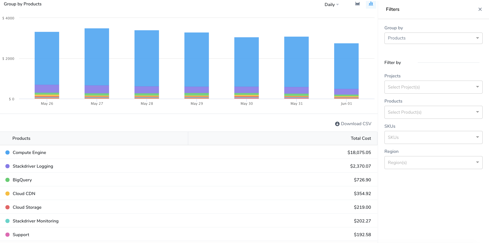
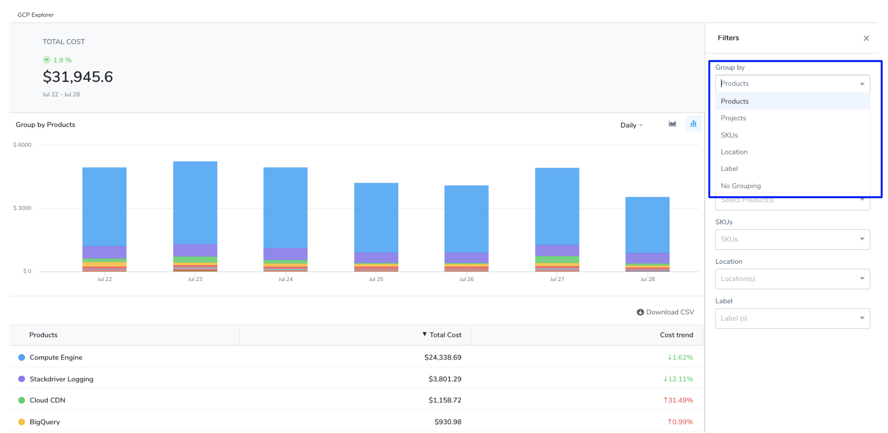
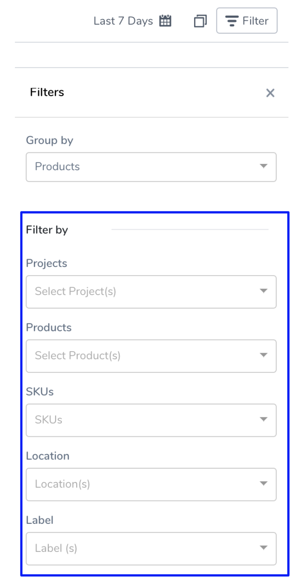
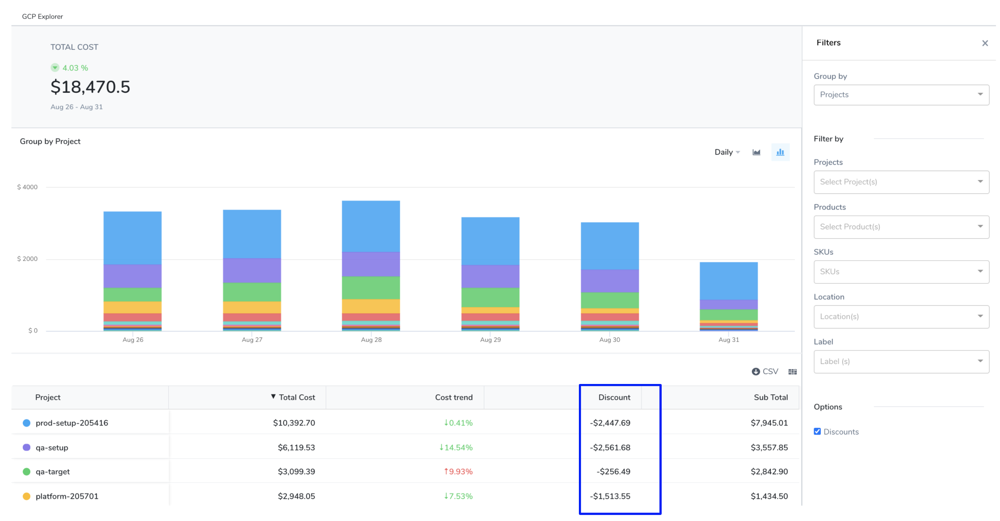
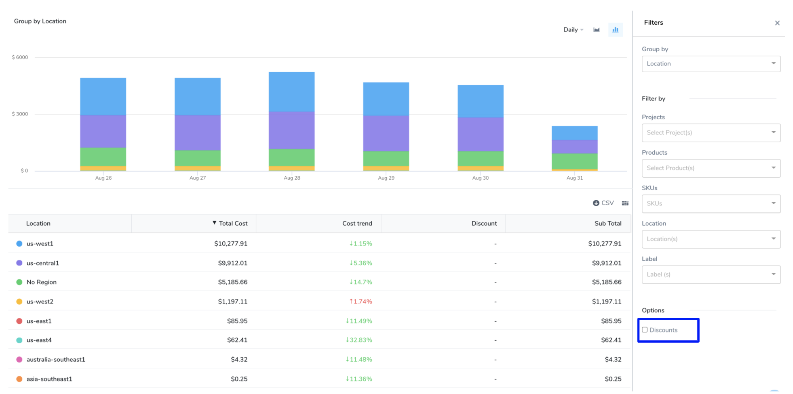

Harness Cloud Cost Management (CCM) allows you to view your Google Cloud Platform (GCP) costs, understand what is costing the most, and analyze cost trends. CE displays data for all your GCP products (such as Compute Engine, Cloud Storage, BigQuery, and so on), projects, SKUs, location, and labels and also provides details on:

* GCP cloud cost spending trends
* The GCP products costing the most in a selected time range. For example, how much Compute Engine cost last week
* Primary cost contributor, such as product, project, SKUs, or region
* GCP spending by region, such as us-west1 or us-east4

## Analyze GCP Cost

1. In **Cloud Cost Management**, click **Explorer**,and then click **GCP** in the top navigation. The GCP products are displayed.
   
     
2. View the cost of the resources that are important to you. Select a **date range**, **Group by**, and **Filter by** options. Based on your **Group by** and **Filter by** selection, the table, and chart display information. Hover over the chart to see the details. You can **Group by**:
* **Products**: Each of your active products with their cloud costs is displayed.
* **Projects**: Each of your Cloud projects with their cloud costs is displayed.
* **SKUs**: Each [SKU](https://cloud.google.com/skus) you are using.
* **Location**: Each Google Cloud service [location](https://cloud.google.com/docs/geography-and-regions) you are currently running services in.
* **Label**: Each [label](https://cloud.google.com/resource-manager/docs/creating-managing-labels) that you are using to organize your Google Cloud instances.
* **No Grouping**: The total GCP cloud cost.
  
    
3. To get further granular details, use **Filter by** options.

## Analyze Discounts

GCP provides certain discounts depending on your usage and commitment, such as:

* [Sustained use discounts](https://cloud.google.com/compute/docs/sustained-use-discounts) are automatic discounts for running specific Compute Engine resources a significant portion of the billing month.
* [Committed use discounts (CUDs)](https://cloud.google.com/docs/cuds) provide discounted prices in exchange for your commitment to use a minimum level of resources for a specified term. The discounts are flexible, cover a wide range of resources, and are ideal for workloads with predictable resource needs.

You can view the discounts for your GCP products, projects, SKUs, location, and labels. To analyze and understand the discounts, perform the following steps:

1. In **Cloud Cost Management**, click **Explorer**,and then click **GCP** in the top navigation. The GCP products are displayed.
   
     
2. Select a **date range**, **Group by**, and **Filter by** options. Based on your selection, **Discounts** are calculated and displayed.
   
     
3. Uncheck the **Discounts** checkbox to exclude discount detail from the table and the chart.
   
     
4. Uncheck the **Discounts** checkbox in the **Select Columns** to exclude the discounts detail from the table view only.
   
     

