Harness Cloud Cost Management (CCM) allows you to view your costs at a glance, understand what is costing the most, and analyze cost trends. CE displays the data for all your resources and also helps you get answers for:

* How is your cloud cost spend trending?
* Which cluster or Harness Application cost the most last month or week?
* What is the idle cost across clusters or Applications?
* What is your primary cost contributor, for example, Kubernetes or ECS cluster, namespace, node/instances, workload/task, or label?
* What are the forecasted future costs based on historical trends?
* What was the cost of resources by label?
* What is your primary cost contributor, for example, Harness Service (microservices), Environment (infrastructure), or Tags (components tagged using Harness Tags)?

:::note
The ECS clusters that you want to monitor must have a Harness Delegate associated with it. But, with [AWS accounts](/docs/first-gen/cloud-cost-management/setup-cost-visibility/enable-continuous-efficiency-for-aws.md) you can get the comprehensive view of the ECS clusters without having Harness Delegate associated.
:::

## Blog Post

The following blog post walks you through optimizing Kubernetes cluster costs:

[Optimizing Kubernetes Cluster Costs](/docs/first-gen/cloud-cost-management/ccm-recommendations/recommendations.md)

## Cloud Cost Calculation
The following sections explain the different types of cloud cost calculations:  

### Cluster Cloud Cost

* The cluster cloud cost is calculated based on the price list of the resources. For information on pricing, see the [GCP price list](https://cloud.google.com/pricing/list) and [AWS pricing](https://aws.amazon.com/pricing/).
* AWS and GCP costs are not trued-up for cluster resources. To view the applicable discounts:
	+ Setup your [AWS](/docs/first-gen/cloud-cost-management/setup-cost-visibility/enable-continuous-efficiency-for-aws.md) and [GCP](/docs/first-gen/cloud-cost-management/setup-cost-visibility/enable-cloud-efficiency-for-google-cloud-platform-gcp.md) cloud accounts.
	+ View and analyze them in [AWS](/docs/first-gen/cloud-cost-management/root-cost-analysis/analyze-cost-trends-for-aws.md) and [GCP](/docs/first-gen/cloud-cost-management/root-cost-analysis/analyze-cost-for-gcp.md) tabs.
* Currently, CPU and memory utilization are included in your cloud cost calculation. Storage and networking costs are not part of your cloud cost.
  
    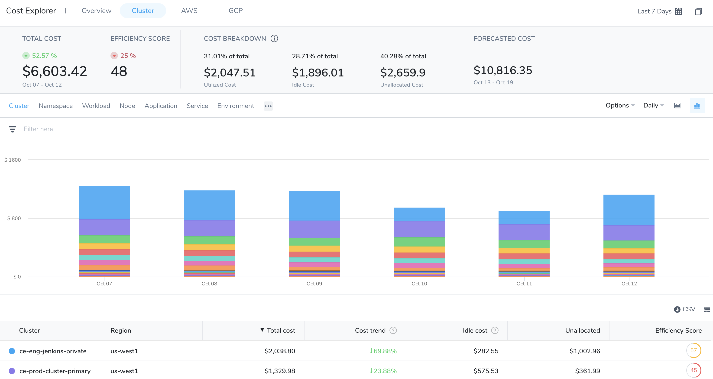

### AWS and GCP Cloud Cost

* Overall cloud cost for AWS and GCP is calculated based on the actual cost you pay for via the building API.
* To enable CE for AWS and GCP, see [Set Up Cost Visibility for AWS](/docs/first-gen/cloud-cost-management/setup-cost-visibility/enable-continuous-efficiency-for-aws.md) and [Set Up Cost Visibility for GCP](/docs/first-gen/cloud-cost-management/setup-cost-visibility/enable-cloud-efficiency-for-google-cloud-platform-gcp.md).
  
    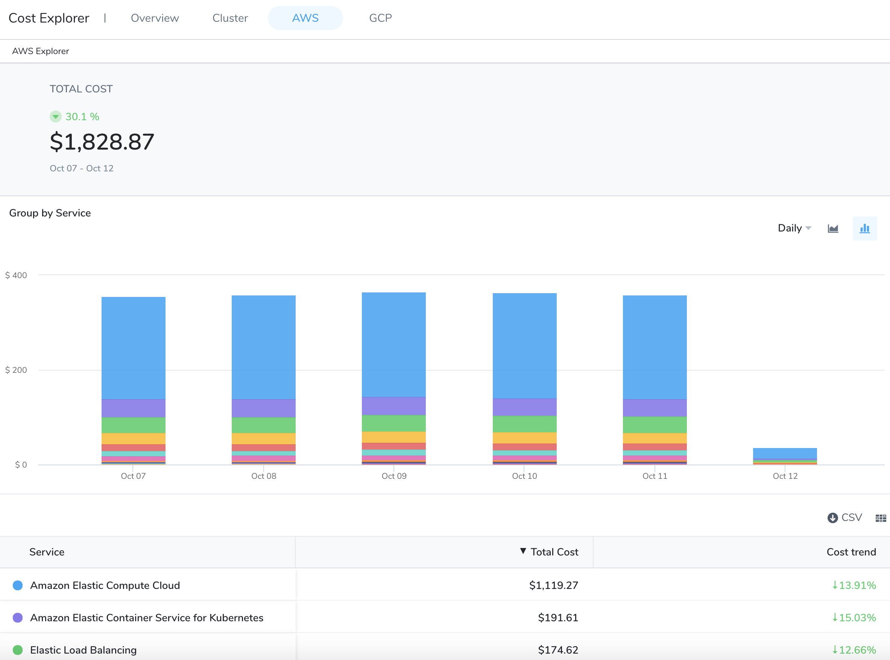

### Group By and Filter Options

You can customize your report views using the available grouping and filtering options. View the cost trends that are important to you by selecting a **date range**, **Group b****y**, and **Filter** options. Based on your selection, the table and chart displays the cost data. Hover over the chart to see the details. To get granular details of the clusters, you can **Group by**:

* **Cluster**: Total cost, Cost trend, Idle cost, and Unallocated cost for each cluster. A cluster refers to a collection of nodes that run workloads as containers in any cloud provider. Non-cluster refers to all other cloud-based services and products, such as storage, data transfer, network, and so on. The actual total cloud cost is the sum of the actual cluster and non-cluster costs.
* **Namespace**: The cost of each Kubernetes namespace in the cluster. This does not apply to ECS clusters.
* **Workload**: The cost of each Kubernetes workload or ECS service. You can see the workload type also. Workloads identified by Pod as Kubernetes pods or ECS tasks.
* **Node**: The cost of each Kubernetes node or ECS instance.
* **Application**: These are the sum of your Harness Application costs. The supported Group by filters are, Application, Service, Environment, Tag, and Cloud Provider.
* **Service**: Services represent your microservices and applications. These are your microservice costs.
* **Environment**: Environments organize and name the deployment infrastructures in your cloud platforms, such as Dev, QA, Stage, Production, etc. These are your cloud platform infrastructures costs, grouped by team, department, and so on.
* **Label**: Cost organized by the Kubernetes labels used in the workload manifests. This does not apply to ECS clusters.
* **Tags**: Harness Tags provide metadata for organizing, searching, and filtering Harness components. See [Manage Tags](../../firstgen-platform/account/tags/manage-tags.md). These are the costs of the components sharing the same tags.
* **Storage**: These are the cost of the persistent volumes present in your Kubernetes cluster. For more information, see [Persistent Volumes](https://kubernetes.io/docs/concepts/storage/persistent-volumes/).
* **ECS Service**: The cost of an ECS service that specifies the number of task definition instances running in an Amazon ECS cluster. For a detailed description of ECS services, see [Services](https://docs.aws.amazon.com/AmazonECS/latest/developerguide/ecs_services.html) from AWS.
* **Task**: This is the cost of an instance of a Task Definition.
* **Launch type**: The cost of an Amazon ECS launch type. An Amazon ECS launch type determines the type of infrastructure on which your tasks and services are hosted. There are two types:
	+ Fargate - Run containers without having to manage servers or clusters of Amazon EC2 instances.
	+ EC2 - Run containers on a cluster of Amazon EC2 instances that you manage.
* **Cloud Provider**: These are your cloud platform costs. Cloud Providers describe your public or private cloud or physical infrastructures, like AWS and Kubernetes. See [Add Cloud Providers](../../firstgen-platform/account/manage-connectors/cloud-providers.md).
  
    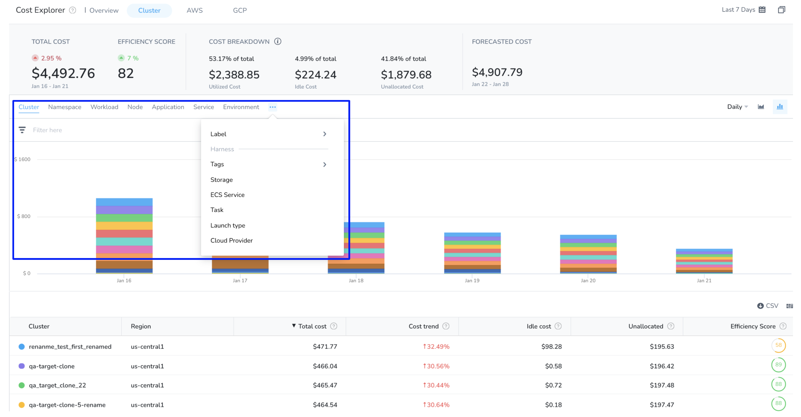

* The cluster dashboard can list data for up to 100 resources. If there are more than 100 resources in your environment for which you want to get the details, select the checkbox **Include Others**. The details of these resources are clubbed and displayed as one single entity. These clusters are generally very small that it would not be visually discernible.
  
    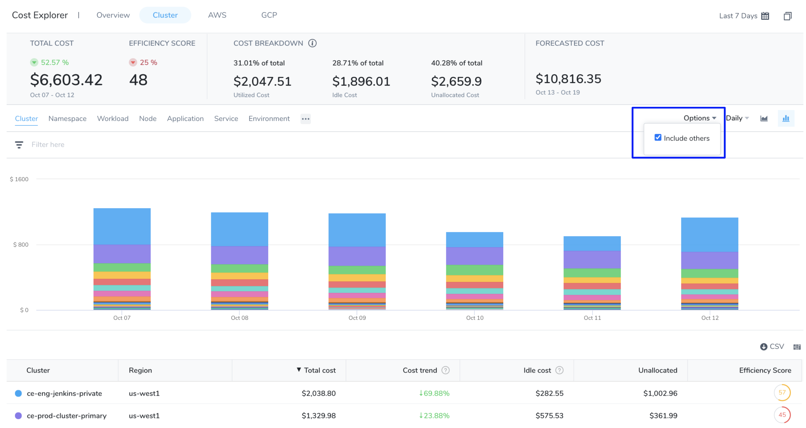

* When you **Group by** a specific label, some workloads without the selected label will not be included. The cost of these workloads is listed as **Label not present** in the table. Select **Include Label not present** checkbox to show the cost of these resources in the graph.
  
    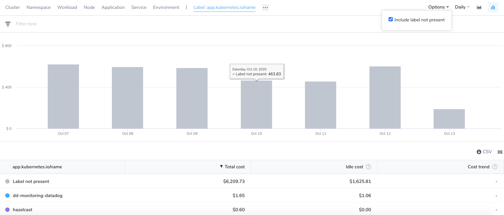
* To get details of the unallocated cost, select the checkbox **Unallocated cost**.
  
    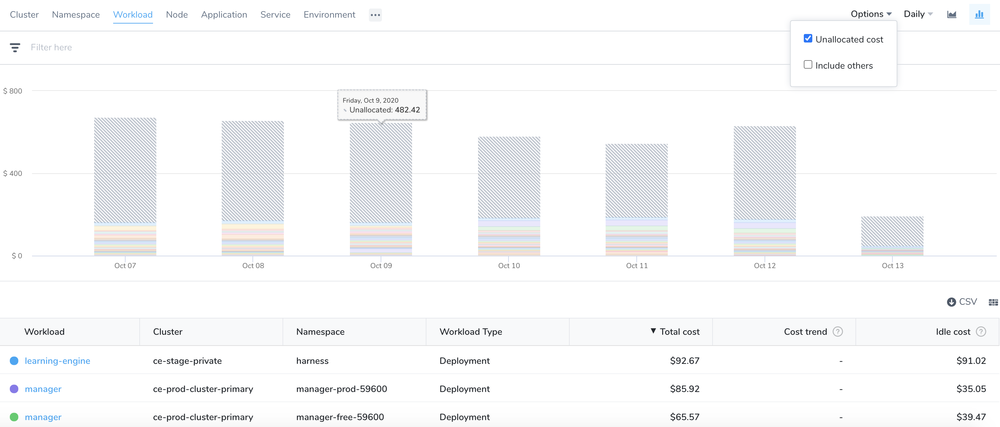

* **Search**: You can filter and customize your result using the search option.
	+ Enter the keywords in the search field.
	+ Use the checkbox to select multiple options.
 
   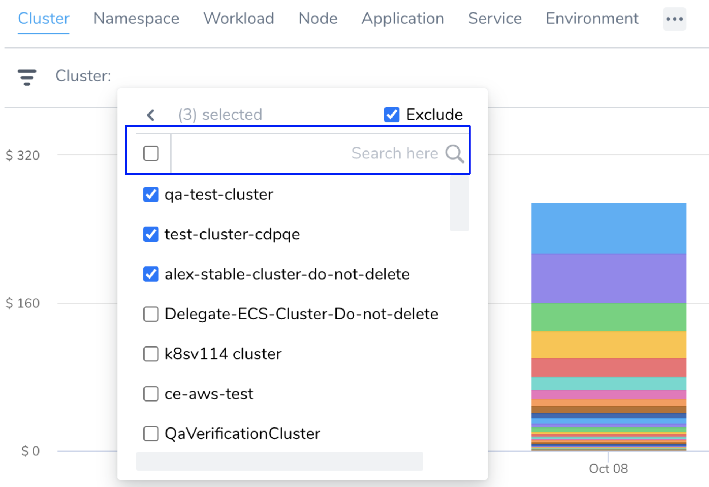
* **Exclude**: Allows to exclude the specific options.
* **Supported Group by** and **Filter Combination**: You can customize your cloud cost view by using different group by and filter combinations. The following options are supported by the group and filter settings:  

| **Group By** | **Filter** |
| --- | --- |
| Application, Service, Environment, Tag, Cloud Provider | Application, Service, Environment, and Cloud Provider |
| Workload and Namespace | Workload, Namespace, Node, Cluster, and Label |
| Node | Node and Cluster |
| ECS Service, Task, and LaunchType | ECS Service, Task, Launch Type, and Cluster |

If you select an unsupported combination, **invalid combination of group by and filters** error is thrown.

### Option 1: Analyze Cost Breakdown: Total, Idle, Utilized, and Unallocated Cost

The cost breakdown provides deep insights into your total, idle, utilized, and unallocated cloud costs. It helps you to understand your primary cost contributors. You can use this data to manage and optimize your cost and resources.

1. In **Cloud Cost Management**, click **Explorer** and click **Cluster**.  

  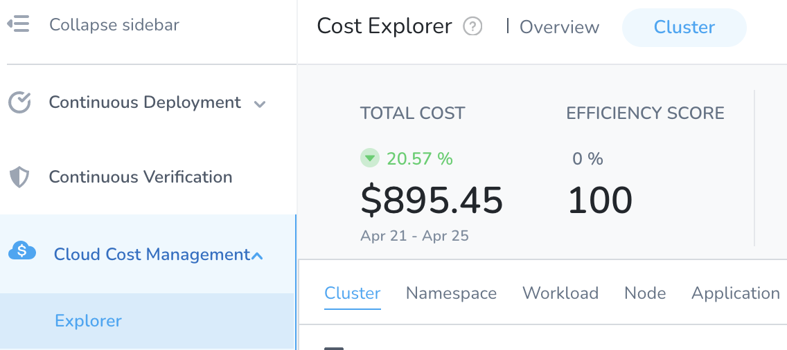
2. Select the **date range** for the costs you want to analyze.
   
     

3. Select the resources from the **Group by** list. You can further customize your selection by using **Filter** settings. Based on your selection, **t****otal**, **idle**, **utilized**, and the **unallocated** cost is calculated and displayed.
   
     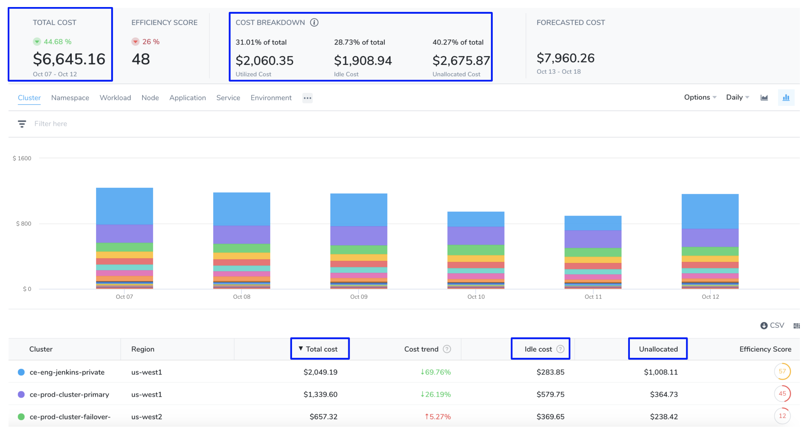

### Option 2: Analyze Forecasted Cost

Forecasted costs are predictions based on your historical cost data. The forecasted date is applicable only where historical data exists. If there is insufficient data to compute the forecast, the value is not displayed. The forecasted cost is predicted for the same future time period as your selected date range. For more information, see [Forecasted Cost](/docs/first-gen/cloud-cost-management/concepts-ccm/a-cost-explorer-walkthrough.md#forecasted-cost).

1. In **Cloud Cost Management**, click **Explorer** and click **Cluster**.
2. Select the **date range** for the costs you want to analyze.
   
     
3. Select the resources from the **Group by** list. You can further customize your selection by using **Filter** settings. Based on your selection, **Total** cost and **Forecasted** cost is calculated and displayed.
   
     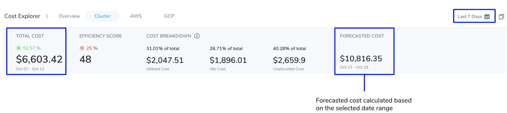

### Option 3: Analyze Cost Trends

A cost trend indicates the direction of your cloud cost is trending. The cost trend is calculated based on previous spending. It can be calculated only if the previous data is available. 

1. In **Cloud Cost Management**, click **Explorer** and click **Cluster**.
2. Select the **date range** for the costs you want to analyze.
   
     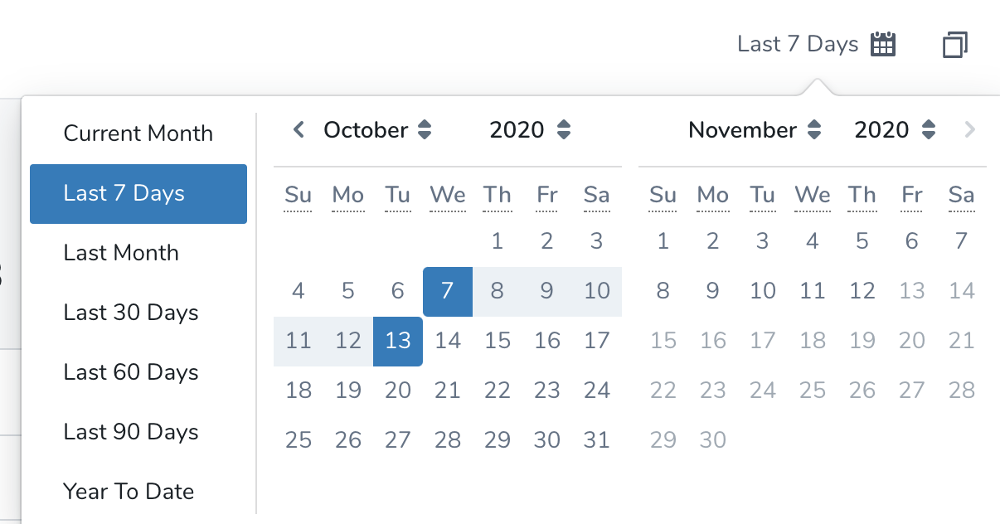
3. Select the resources from the **Group by** list. You can further customize your selection by using **Filter** settings. Based on your selection, **cost trend** is calculated and displayed.
   
     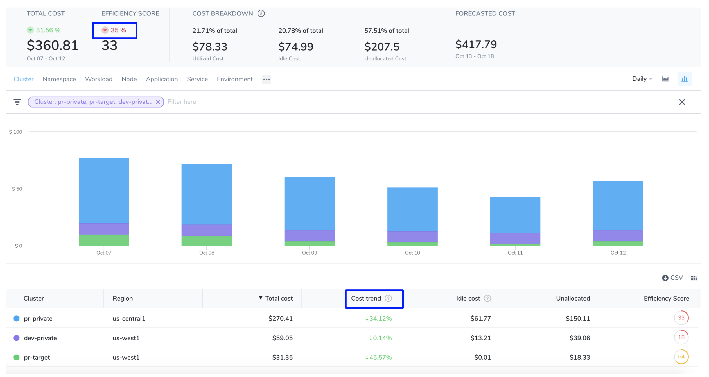

### Option 4: Analyze Efficiency Score

A measure of how cost-optimized your resource usage is across your clusters. It is derived from the total and idle (and or unallocated) spend of your resources. For more information, see [Efficiency Score](/docs/first-gen/cloud-cost-management/concepts-ccm/a-cost-explorer-walkthrough.md).

1. In **Cloud Cost Management**, click **Explorer** and click **Cluster**.
2. Select the **date range** for the costs you want to analyze.
   
     
3. Select the resources from the **Group by** list. You can further customize your selection by using **Filter** settings. Based on your selection, **efficiency score** is calculated and displayed.
   
     

