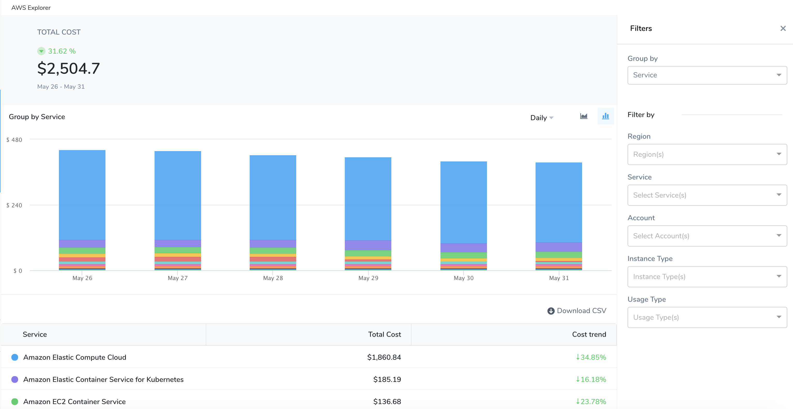
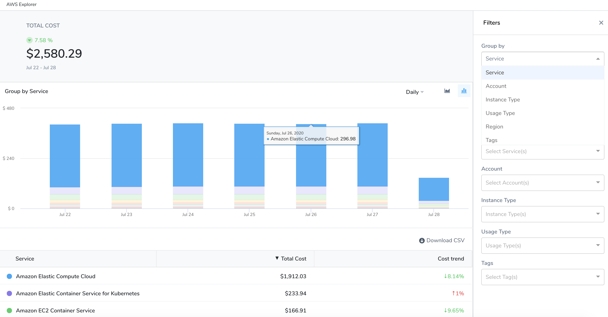
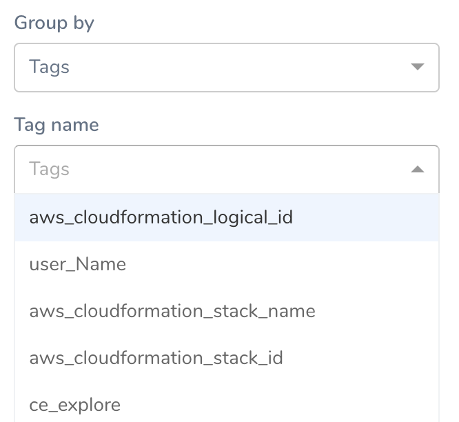
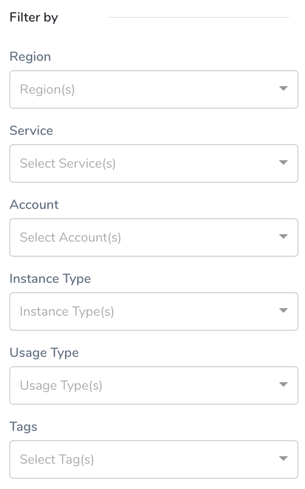
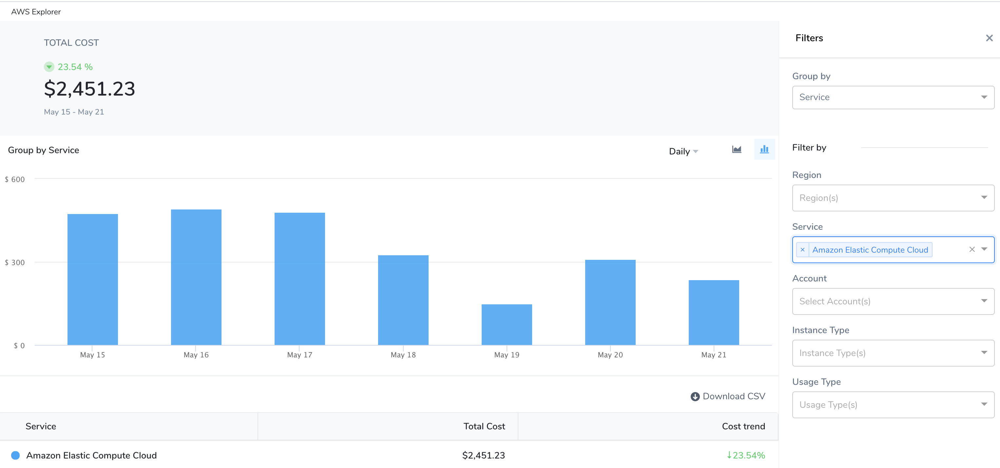

Harness Cloud Cost Management (CCM) allows you to view your AWS costs at a glance, understand what is costing the most, and analyze cost trends. CE displays the data for all your Amazon Web Services (ECS, EC2, and so on) and also helps you get details of:

* AWS cloud cost spending trend
* AWS service costing the most in the selected time range, for example, EC2 spent last month
* Primary cost contributor, for example, region, account, instance type, or usage type
* AWS spending by region, for example, US East or US West

## Step: Analyze AWS Cost

1. In **Cloud Cost Management**, click **Explorer**,and then click **AWS** in the top navigation. The AWS services are displayed.
   
   
2. View the cost of the resources that are important to you. Select a **date range**, **Group by**, and **Filter by** options. Based on your **Group by** and **Filter by** selection, the table, and chart display information. Hover over the chart to see the details.
   
     
	 
You can **Group by**:
* **Service**: Each of your active [AWS services](https://aws.amazon.com/) is displayed.
* **Account**: Each AWS account you are using to connect Harness to AWS via a Harness AWS Cloud Provider.
* **Instance Type**: Each [Amazon EC2 instance type](https://aws.amazon.com/ec2/instance-types/) you are using.
* **Usage Type**: Usage types are the units that each service uses to measure the usage of a specific type of resource. For example, the BoxUsage:t2.micro(Hrs) usage type filters by the running hours of Amazon EC2 t2.micro instances.
* **Region**: Each AWS region you are currently running services in.
* **Tags**: Each [tag](https://docs.aws.amazon.com/general/latest/gr/aws_tagging.html) that you assign to your AWS resources. You can select a **Tag name** to get further granular details of your tags.For tags to appear in the Harness AWS Explorer, you must activate the user-defined cost allocation tags in the AWS Billing and Cost Management console. For more information, see [Activating User-Defined Cost Allocation Tags](https://docs.aws.amazon.com/awsaccountbilling/latest/aboutv2/activating-tags.html).In CCM, the tag keys are updated as the following:
	+ For the user-defined tags, `user_` prefix is added.
	+ For the AWS system tags, `aws_` prefix is added.
	+ The characters that do not follow regex `[a-zA-Z0-9_]` are changed to `_`.
	+ The tags are case sensitive. If the tags are specified as `UserName` and `username`, then the number suffix `_<Number>`is added to the tag. For example, `UserName` and `username_1`.
  
    
	  
* **No Grouping**: The total AWS cloud cost.
   To get further granular details, use **Filter by** options.
   
   

The information is displayed as the following:

