Most cost reporting tools provide a high-level view of resource consumption that is useful for seeing the big picture. But these tools are not helpful when you want to see the low-level, root causes of your cloud costs.

Harness Cloud Cost Management (CCM) lets you drill down to see which clusters, namespaces, nodes, tasks, workloads, labels, storage, and Harness components are costing you the most money.

With CCM, you can find the low-level root causes of your cloud costs and reduce unnecessary consumption.

## Option 1: Root Cost Analysis for Clusters

The Cost Explorer provides deep insights into your total, idle, utilized, and unallocated cluster costs. You pick a cluster to analyze, and then drill down into its components to see where you're spending money.

Each of the cluster's components are exposed, along with its costs.

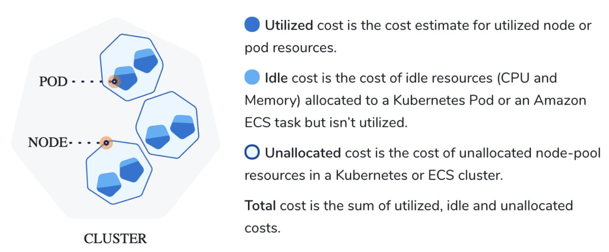

The following steps take you through the process.

1. In **Cloud Cost Management**, click **Explorer** and click **Cluster** in the top navigation.
   
     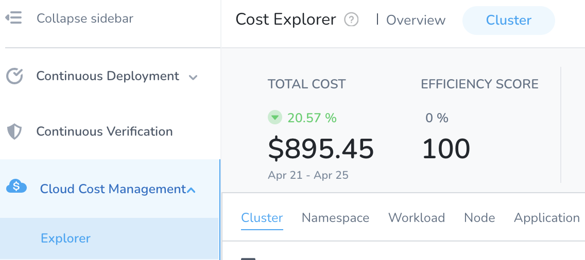
2. Select the **date range** for the costs you want to analyze.
   
     
3. In **Group by**, select **Cluster** to list all the clusters. Use the **Filter** settings to select a specific cluster. You can also use the search option to search from the available clusters.
	* **Clusters**: Total cost, Cost trend, Idle cost, Unallocated cost, and efficiency score for each cluster.
  
    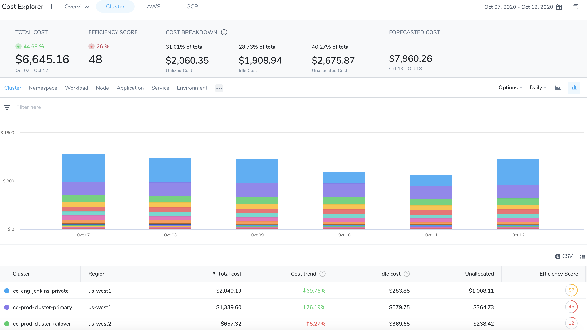
	
	To get further granular details of the cluster, use **Filter**. You can **Filter** by:
	* **Namespace**: The cost of each Kubernetes namespace in the cluster. This does not apply to ECS clusters.
	* **Workload**: The cost of each Kubernetes workload or ECS service. You can see the workload type also. Workloads identified by Pod as Kubernetes pods or ECS tasks.
	* **Label**: Cost organized by the Kubernetes labels used in the workload manifests. This does not apply to ECS clusters.
	* **Node**: The cost of each Kubernetes node or ECS instance.
	* **Storage**: The cost of your persistent volumes.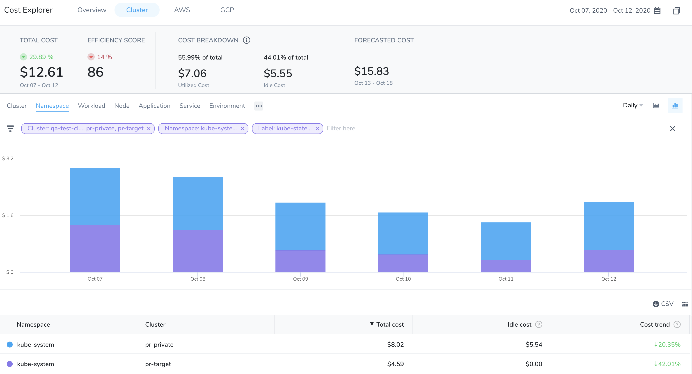

Use this data to optimize your cloud resource consumption and cluster spending.

## Option 2: Root Cost Analysis for Namespace

The cost of each Kubernetes namespace in the cluster.

1. In **Cloud Cost Management**, click **Explorer** and click **Cluster**.
2. Select the **date range** for the costs you want to analyze.
   
     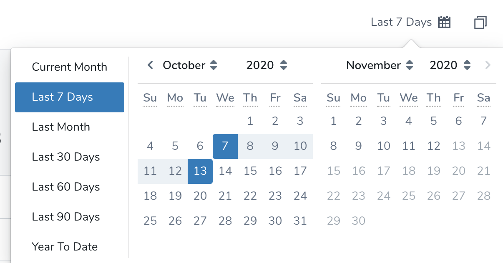
3. In **Group by**, select **Namespace** to list all the namespaces. Use the **Filter** settings to select a specific namespace. You can also use the search option to search from the available namespaces.
   
     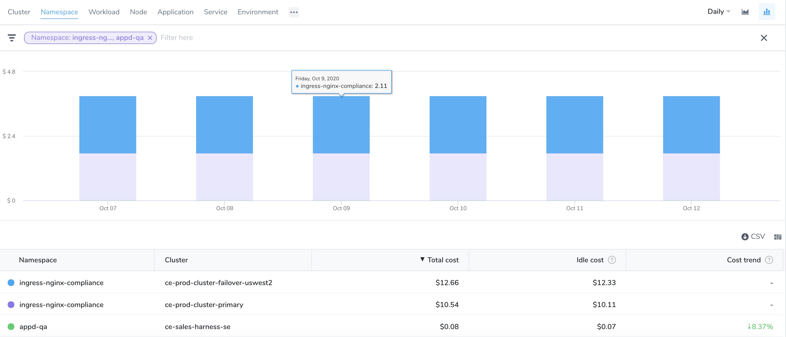

## Option 3: Root Cost Analysis for Workloads

The cost of each Kubernetes workload or ECS service. You can see the workload type also. Workloads identified by Pod as Kubernetes pods or ECS tasks.

1. In **Cloud Cost Management**, click **Explorer** and click **Cluster**.
2. Select the **date range** for the costs you want to analyze.
   
     

3. In **Group by**, select **Workload** to list all the workloads. Use the **Filter** settings to select a specific workload. You can also use the search option to search from the available workloads.
   
     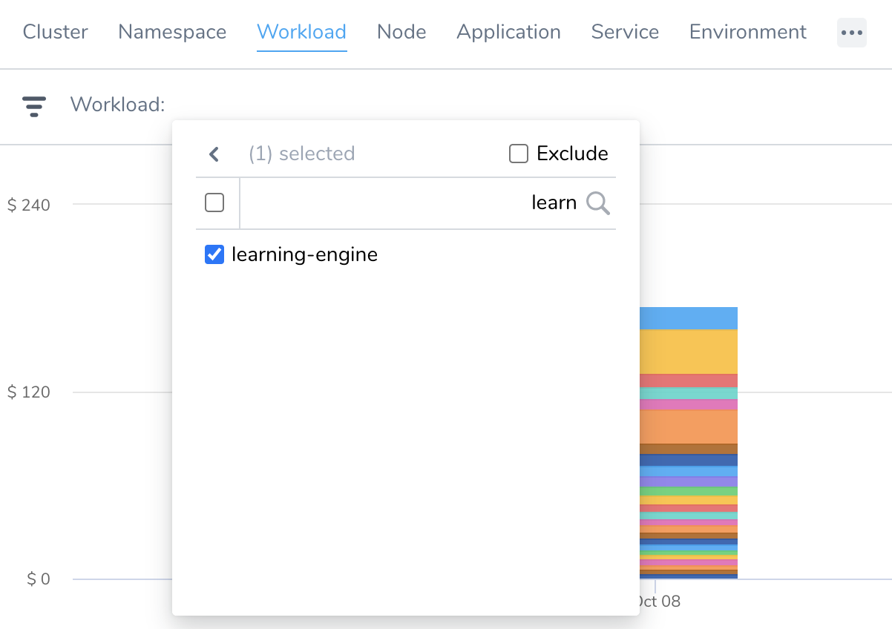
4. Click on the workload for which you want to the analyze the cost. The detailed information for the selected workload is displayed.
   
     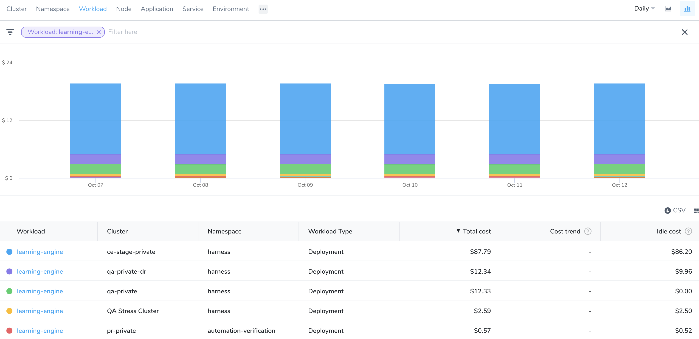
5. You can also analyze the cost event correlation for the workloads. Cost event correlation identifies the events that caused costs to change (increase or decrease). For example, new service deployments, autoscaling, etc. CE timestamps events and shows their corresponding YAML. You can even drill down to all the events on a particular day to know exactly what caused costs to change.  
  
6. To analyze the cost event correlation for the workloads, click on the workload for which you want to analyze the cost event correlation. 
  The detailed information for the selected workload is displayed under **Resources** and **Events** tabs.
  In **Resources**, the following information is displayed:
   * Details of the pods associated with the workload.
   * CPU and memory utilization of the workload.

  
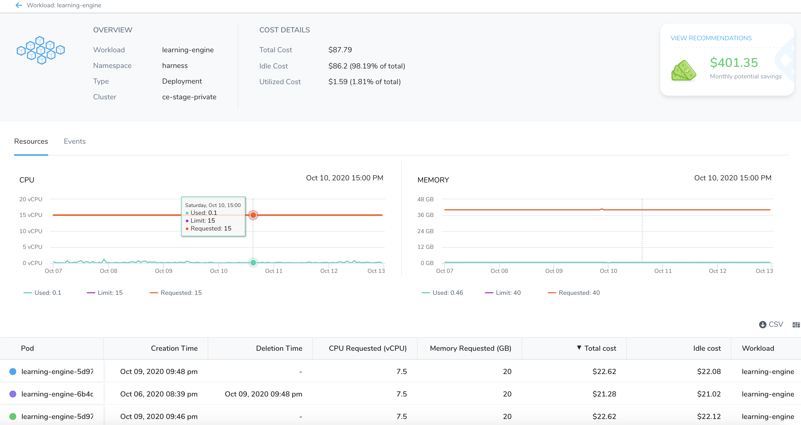
  
7. In **Events**, the following details are displayed:
* **Time**: Timestamp of the event.
* **Cost Impact**: Percentage of the cost change because of the event. It also shows the trend of cost change.
* **Source**: Source of the event.
* **Type**: Type of the event.
* **Details**: Details of the event.
  
    
	
	When you notice a surge in the price, click on the associated event for that day. It will list all the events that occurred on that day. The events are listed as **Notable** and **All**.
8. **Notable** lists the events that have an impact on the cost.
	1. Click the arrow. The YAML file is displayed. 
   
     
	2. View the YAML file to understand the exact differences that led to a change in the cost. 
    
	 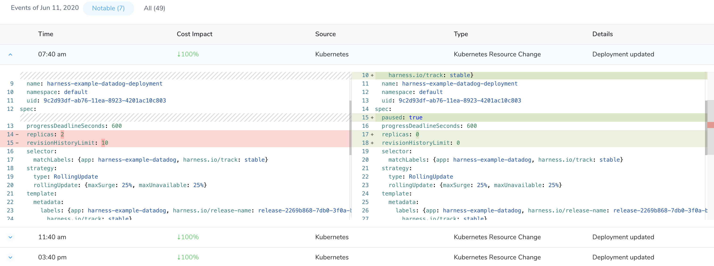
9. **All** lists all the events that occurred on the selected workload.
	1. Click the arrow. The YAML file is displayed. 
   
     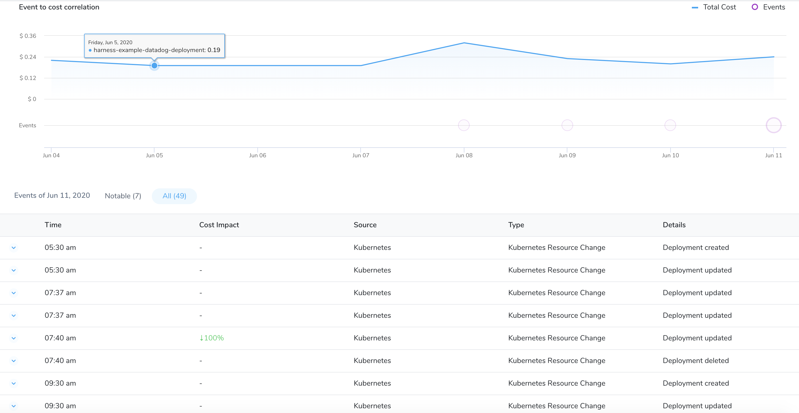
	2. View the YAML file to understand the differences that caused the event. 
   
     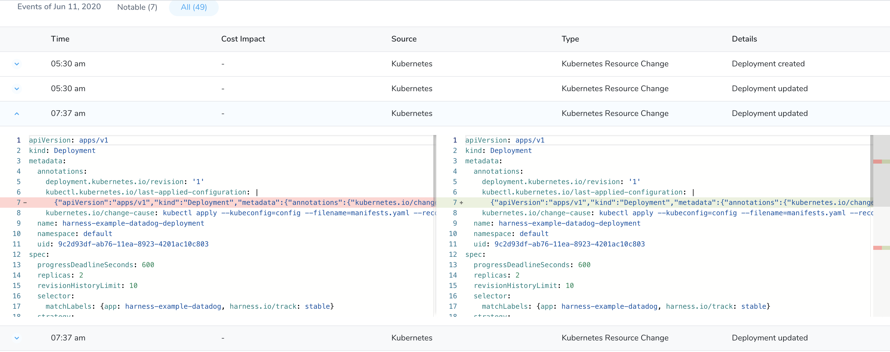

You can use this data to analyze your cloud cost.

## Option 4: Root Cost Analysis for Nodes

The cost details of a node provide:

* Deep insights into the total, idle, utilized, unallocated, and system costs of a node
* CPU and memory utilization for nodes and pods
* CPU and memory allocatable data
* Pod counts

You can use this data to manage and optimize your cost and resources. To analyze and understand the cost details of a node, perform the following steps:

1. In **Cloud Cost Management**, click **Explorer** and then click **Cluster**.
2. Select the **date range** for the costs you want to analyze.
   
     
3. In **Group by**, select **Node** to list all the nodes. Use the **Filter** settings to select a specific node. You can also use the search option to search from the available nodes.
4. Click on the node for which you want to the analyze the cost. The detailed information for the selected node is displayed.
   
     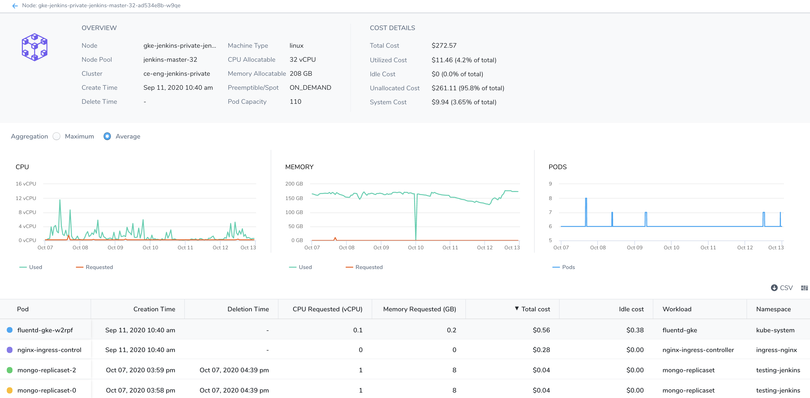
	* **Overview**: Provides the cluster and node details.
		+ **Allocatable**: On a Kubernetes node it is defined as the amount of compute resources that are available for pods. For more information, see [Node Allocatable](https://kubernetes.io/docs/tasks/administer-cluster/reserve-compute-resources/#node-allocatable).
		+ **Preemptible/Spot**: For details, see [GKS](https://cloud.google.com/kubernetes-engine/docs/how-to/preemptible-vms), [AKS](https://docs.microsoft.com/en-us/azure/aks/spot-node-pool), and [EKS](https://docs.aws.amazon.com/AWSEC2/latest/UserGuide/using-spot-instances.html).
	* **Cost Details**: Displays the cost details. For more information on the costs, see [Key Cost Concepts](/docs/first-gen/cloud-cost-management/concepts-ccm/b-cloud-cost-management-overview.md).
	* **Aggregation**: Displays the details of daily and hourly CPU usage, memory usage, and pod counts. You can toggle between the maximum and average utilization views.
	* **Table**: Displays the details of the associated pods with the node.
	* **Chart**: Displays CPU, memory, and pods count details.

:::note
If your Pod and Node are stopped for 30 and 180 days respectively, the following information is purged from the Node Explorer view:  
  
- Creation Time  
- Deletion Time  
- CPU Requested  
- Memory Requested  
- Workload  
- Namespace  
- Machine Type  
- Node Pool  
- Instance Category
:::
  
## Option 5: Root Cost Analysis for Harness Applications

The Cost Explorer provides deep insights into your total cloud costs and resources. It helps you to understand the primary cost contributors. You can use this data to manage and optimize your cost and resources.

To perform root cost analysis on Harness Applications and subordinate components, it's important to review how Harness organizes and models your projects using Applications. See [Harness Key Concepts](../../starthere-firstgen/harness-key-concepts.md) for an overview.

The follow graphic shows how Harness represents and organizes the components of your release process using its Application model:

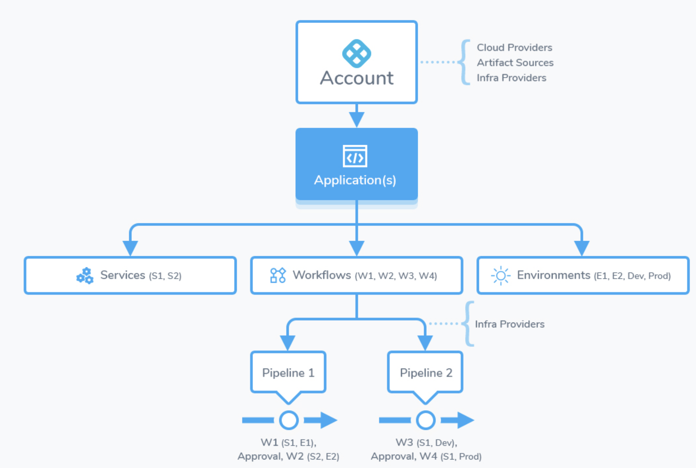

In CCM, you begin by selecting the Application you want to analyze:

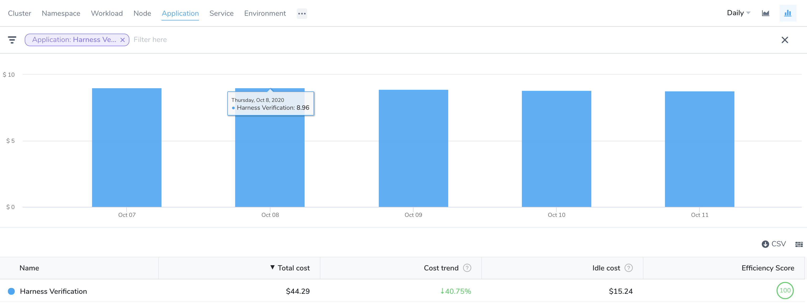

Once you're viewing the Application, you drill down to its subordinate entities using the Filter settings. You can filter by Application, Service, Environment, Tag, and Cloud Provider.

The following steps take you through the process.

1. In **Cloud Cost Management**, click **Explorer** and click **Cluster**.
2. Select the **date range** for the costs you want to analyze.
   
     

3. In **Group by**, select **Application** to list all the applications. Use the **Filter** settings to select a specific application. You can also use the search option to search from the available applications.
   

:::note
In order for an Application to appear, a Workflow in the Application must be deployed by Harness. For more information, see [Applications](../../starthere-firstgen/harness-key-concepts.md#applications).
:::
   

4. You can further customize your views using the **Group by** and **Filter** settings to get more granular details. You can **Group by**:
	* **Application**: These are the sum of your Harness Application costs.
	* **Cloud Providers**: These are your cloud platform costs. Cloud Providers describe your public or private cloud or physical infrastructures, like AWS and Kubernetes. See [Add Cloud Providers](../../firstgen-platform/account/manage-connectors/cloud-providers.md).
	* **Tags**: Harness Tags provide metadata for organizing, searching, and filtering Harness components. See [Manage Tags](../../firstgen-platform/account/tags/manage-tags.md). These are the costs of the components sharing the same tags.
	* **Service**: Services represent your microservices and applications. These are your microservice costs.
	* **Environments**: Environments organize and name the deployment infrastructures in your cloud platforms, such as Dev, QA, Stage, Production, etc. These are your cloud platform infrastructures costs, grouped by team, dept, and so on.
* 
*   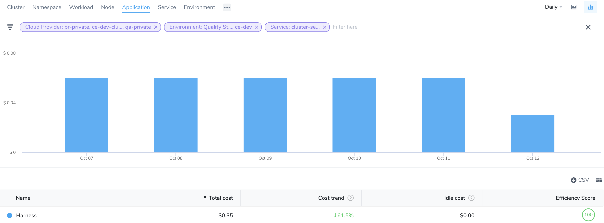

Use this data to optimize your resource consumption and cloud spend.

## Option 6: Root Cost Analysis for Service

Services represent your microservices and applications. These are your microservice costs.

1. In **Cloud Cost Management**, click **Explorer** and click **Cluster**.
2. Select the **date range** for the costs you want to analyze.
   
   
   
3. In **Group by**, select **Service** to list all the services. Use the **Filter** settings to select a specific service. You can also use the search option to search from the available services.
   
   
   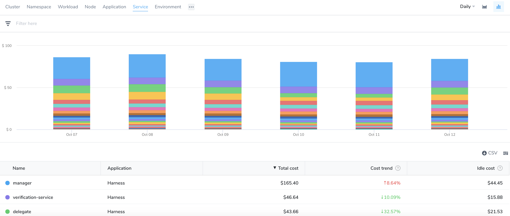

## Option 7: Root Cost Analysis for Environment

Environments organize and name the deployment infrastructures in your cloud platforms, such as Dev, QA, Stage, Production, etc. These are your cloud platform infrastructures costs, grouped by team, dept, and so on.

1. In **Cloud Cost Management**, click **Explorer** and click **Cluster**.
2. Select the **date range** for the costs you want to analyze.
   
     
3. In **Group by**, select **Environment** to list all the environments. Use the **Filter** settings to select a specific environment. You can also use the search option to search from the available environments.
   
     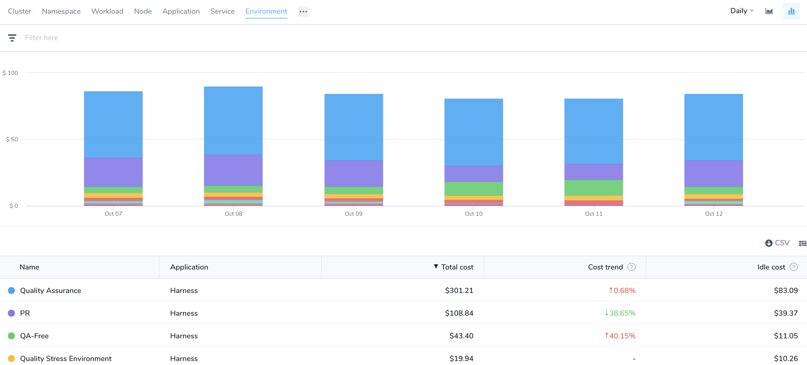

## Option 8: Root Cost Analysis for Storage

Storage represents the cost of the persistent volumes present in your Kubernetes cluster. Persistent volumes are used to manage durable storage in a cluster. For more information, see [Persistent Volumes](https://kubernetes.io/docs/concepts/storage/persistent-volumes/).

1. In **Cloud Cost Management**, click **Explorer** and click **Cluster**.
2. Select the **date range** for the costs you want to analyze.
   
     
3. In **Group by**, select **Storage** to list all the storage costs.
   
     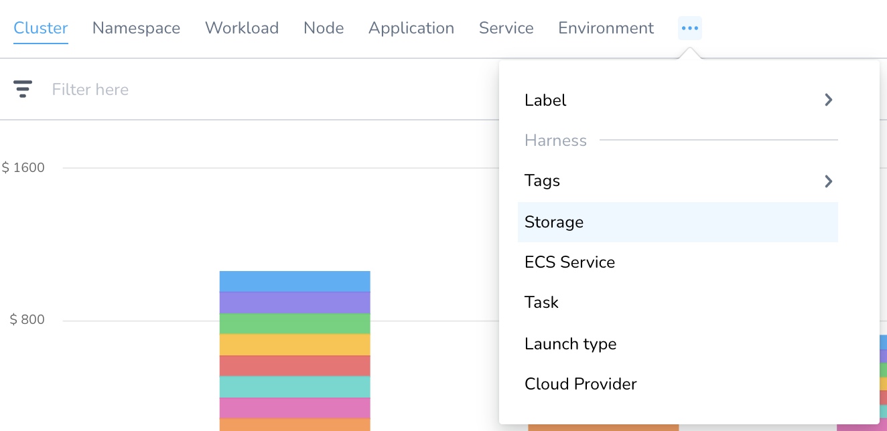
4. The storage costs are displayed:
	* **Name**: Name of the persistent volume (PV).
	* **Cluster**: Name of the Kubernetes cluster where the PV is present.
	* **Storage total cost**: The total cost of your PV.
	* **Storage idle cost**: The idle cost of your PV.
	* **Storage unallocated cost**: The unallocated cost of your PV.
	* **Capacity**: Generally, a persistent volume (PV) has a specific storage capacity. This is set by using the `capacity` attribute of the PV.
	* **Storage utilization value**: This is a measure of how well the available data storage space in your cluster is utilized.
	* **Cloud provider**: A cloud service provider, for example, AWS or GCP.
	* **Claim name**: Claim name is the name of a PV claim in the same namespace as the pod using this volume.
	* **Volume type**: Persistent volume types are implemented as plugins. For details on the supported Kubernetes plugins, see [Types of Persistent Volumes](https://kubernetes.io/docs/concepts/storage/persistent-volumes/#types-of-persistent-volumes).
	* **Claim namespace**: Namespace where the claim exists.
	* **Storage class**: A storage class provides a way for administrators to describe the classes of storage they offer. Different classes might map to quality-of-service levels, or to backup policies, or to arbitrary policies determined by the cluster administrators. For more information, see [Storage Classes](https://kubernetes.io/docs/concepts/storage/storage-classes/).
	* **Region**: The region where PV exists.
	* **Creation time**: The time at which the PV was created.
	* **Deletion time**: The time at which the PV was deleted.
  
    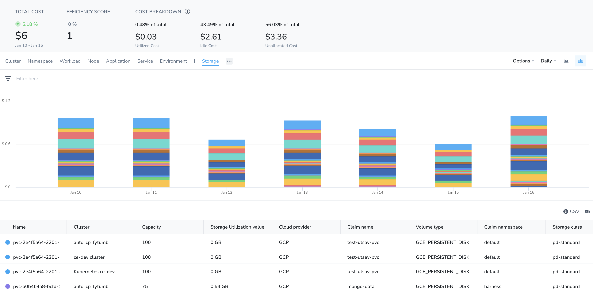

5. **Select All** in the column selector to display all the storage costs. You can uncheck the box for which you do not want to view the cost.
   
     

Use this data to optimize your resource consumption and cloud spend.

