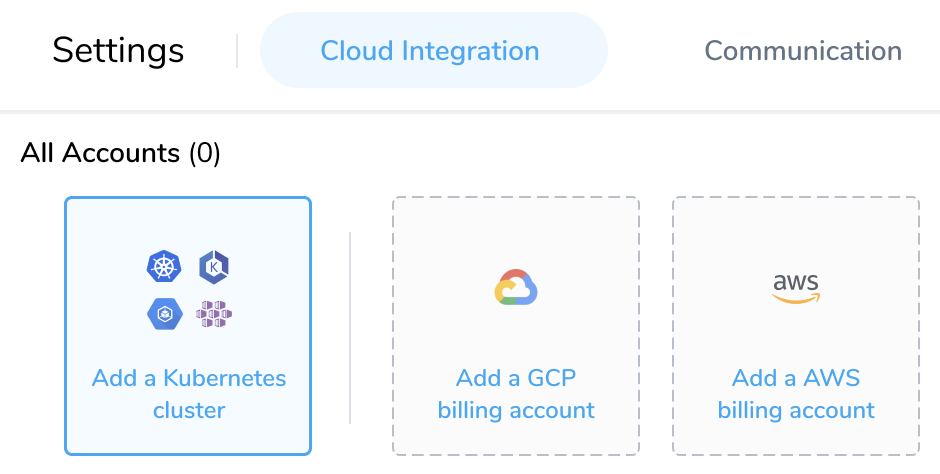
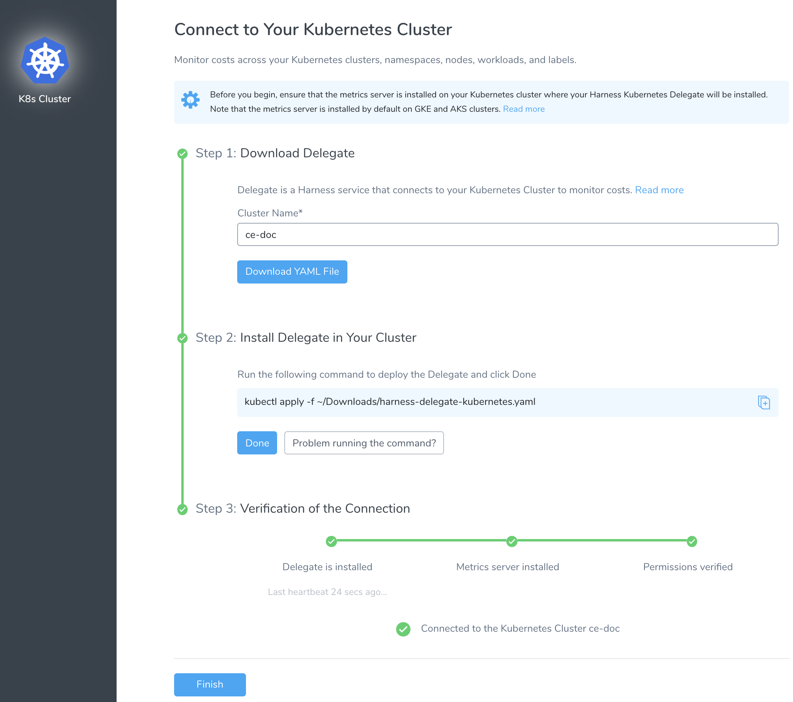
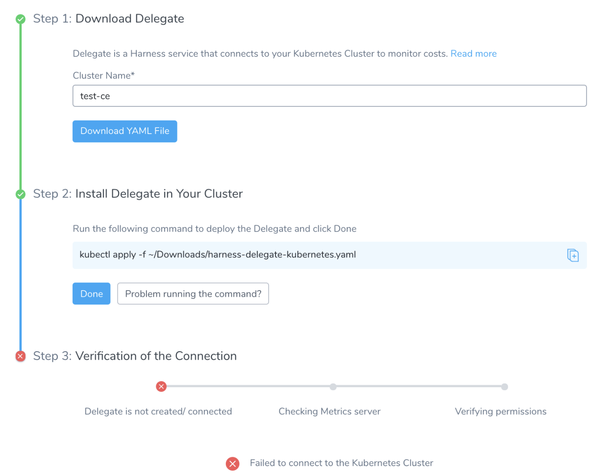

Harness Cloud Cost Management (CCM) monitors cloud costs of your Kubernetes clusters, namespaces, nodes, workloads, and labels. This topic describes how to connect your Kubernetes cluster to CCM.

If the Delegate is already running in the Kubernetes cluster that you want to monitor, see [Set Up Cost Visibility for Kubernetes Using an Existing Delegate](/docs/first-gen/cloud-cost-management/setup-cost-visibility/enable-continuous-efficiency-for-kubernetes.md).

## Prerequisites

* **System Requirements**: Ensure that you meet the following system requirements:
	+ ​Minimum 1 CPU.
	+ Minimum 8GB RAM — There is a cap of 4GB per Delegate, but when the Delegate is updating there might be two Delegates running. Hence, the minimum is 8GB.
	+ Ensure that you provide the minimum memory for the Delegate and enough memory for the host/node system. For example, an AWS EC2 instance type such as m5a.xlarge has 16GB of RAM, 8 for the Delegate, and 8 for the remaining operations.
	+ Minimum 6GB Disk space.
* **Metrics Server**: Metrics Server must be running on the Kubernetes cluster where your Harness Kubernetes Delegate is installed. For more information, see [Install Kubernetes Metrics Server](/docs/first-gen/cloud-cost-management/setup-cost-visibility/enable-continuous-efficiency-for-kubernetes.md).  
Metrics Server is installed by default on GKE and AKS clusters, however, you need to install it on the AWS EKS cluster.

### Step: Connect Your Kubernetes Cluster to CCM

:::note
Once you enable CCM, for the first cluster the data is available within a few minutes for viewing and analysis. However, you will not see the idle cost because of the lack of utilization data. CCM generates the last 30 days of the cost data based on the first events.  
From the second cluster onwards, it takes about 2–3 hours for the data to be available for viewing and analysis.

:::
  

1. In **Cloud Cost Management**, click **Settings**.
2. In **Cloud Integration**, select **Add a Kubernetes cluster**.
   
     
3. In **Download Delegate**, enter the name that will appear in CCM Explorer to identify this cluster.
   
     
4. Click **Download YAML file**.The YAML file has all the access defined to enable the Harness Kubernetes Delegate to monitor your cluster costs. It also has the Service account details to install and run the Harness Kubernetes Delegate with ClusterRole to access resource metrics.
5. In the Terminal you used to connect to the Kubernetes cluster, run the following command:  
  
`kubectl apply -f ~/Downloads/harness-delegate-kubernetes.yaml`  
Ensure that you are connected to the Kubernetes cluster.

6. Click **Done**.  
  
Once the Delegate is connected to your Kubernetes cluster, the status turns green.

  
7. Click **Finish**.  
  
The Kubernetes cluster is now listed under **Added Kubernetes Clusters**. Once CCM has data, the cluster is listed in **Cost Explorer**.

### Troubleshooting

1. If your Delegate is not created or connected, check if your cluster has enough resources (CPU and memory) to install the Delegate. You can use the following command to verify the resource capacity:  
	  
	`kubectl describe pod test-new-doc-kmpysm-0 -n harness-delegate`
	
	  
2. Check if the Delegate has all the required permissions. For more information, see [Provide CE Permissions to Harness Delegate](/docs/first-gen/cloud-cost-management/setup-cost-visibility/enable-ce-by-adding-a-delegate.md).
	
	
		
