Harness Cloud Cost Management (CCM) monitors the cloud costs of your GCP products, projects, SKUs, and location. As a first step, you connect Harness to your GCP account to get insights into your cloud infrastructure and GCP services, Compute Engine Cloud Storage, BigQuery, etc. CCM displays the data for your connected GCP services for further analysis.

## Before You Begin

* Review [Required permissions and roles](https://cloud.google.com/iam/docs/understanding-custom-roles#required_permissions_and_roles) to create an IAM role at the organization level
* Ensure that you have the following permissions to enable and configure the export of Google Cloud billing data to a BigQuery dataset:
	+ **Billing Account Administrator** role for the target Cloud Billing account
	+ [BigQuery User role for the Cloud project](https://cloud.google.com/bigquery/docs/dataset-access-controls) that contains the BigQuery dataset that will be used to store the Cloud Billing data
* The same connector cannot be used in FirstGen and NextGen. NextGen Connectors are recommended for the best experience of CCM capabilities and features. For information on creating a GCP connector in the NextGen see [Set Up Cloud Cost Management for GCP](../../../cloud-cost-management/get-started/onboarding-guide/set-up-cost-visibility-for-gcp.md).

After enabling CE, it takes about 24 hours for the data to be available for viewing and analysis.### Step 1: Connect to Google Cloud Platform (GCP) Account

Connect Harness to your GCP account to get insights into your cloud infrastructure and GCP services.

1. In **Cloud Cost Management**, click **Settings** and then click **Cloud Integration**.
2. In **Cloud** **Integration**, click **Add a GCP billing account**.
   
     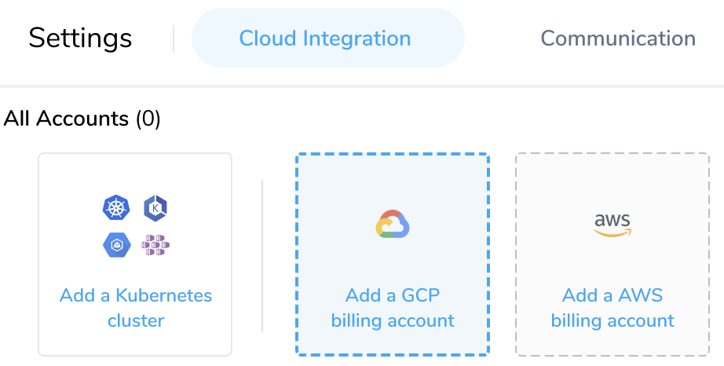
3. In **Connect to Google Cloud Platform (GCP) Account**, in **Account Name**, enter a name that describes this account.  

  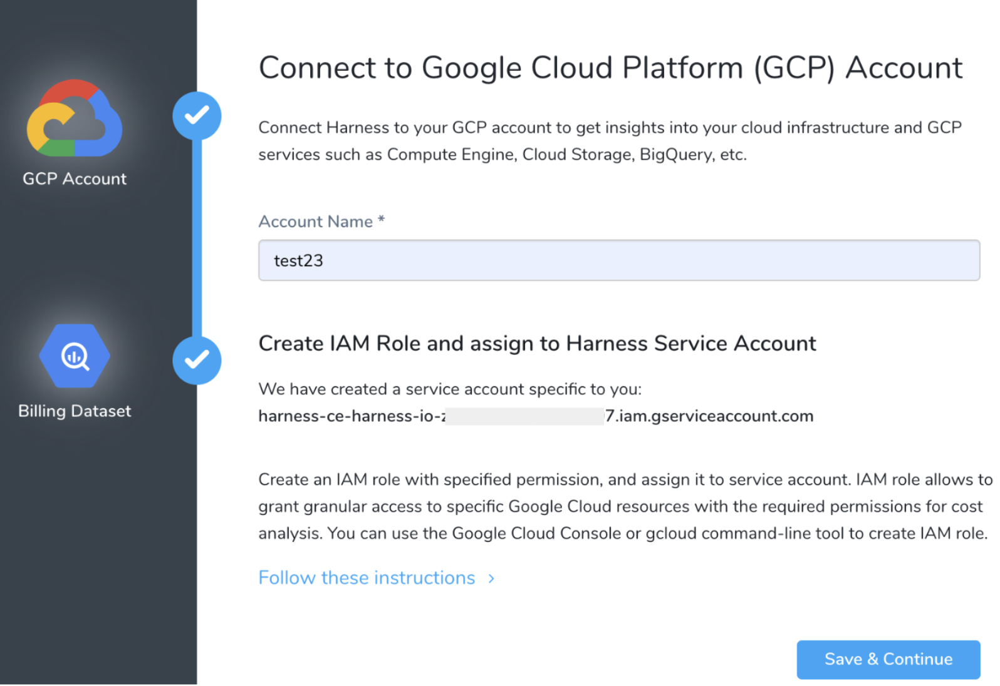
4. Create an IAM role and assign it to Harness Service Account.

#### Step: Create an IAM Role at the Organization Level

IAM role allows you to grant granular access to specific Google Cloud resources with the required permissions for cost analysis. To create the required IAM Role, perform the following steps:

1. Click **Follow these instructions** and then click **Open the Roles Page**.
   
     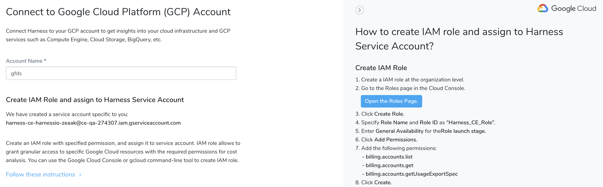
2. Log into your **GCP Account** via GCP console. Click **CREATE ROLE** to create an IAM role at the organization level.Ensure that you have the required permissions to create a role at the organization level. For more information, see [Understanding IAM custom roles](https://cloud.google.com/iam/docs/understanding-custom-roles).
   
     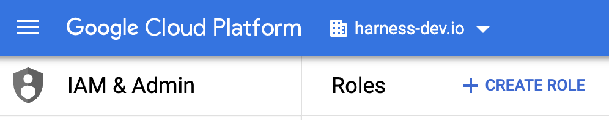
3. Enter **Harness\_CE\_Role** in **Title** and **ID**.
4. Select **General Availability** from the **Role launch stage** drop-down list.
5. Click **ADD PERMISSIONS**.
6. Filter the table by **Permission**.
7. Add the following permissions:
	* billing.accounts.list
	* billing.accounts.get
	* billing.accounts.getUsageExportSpec
  
    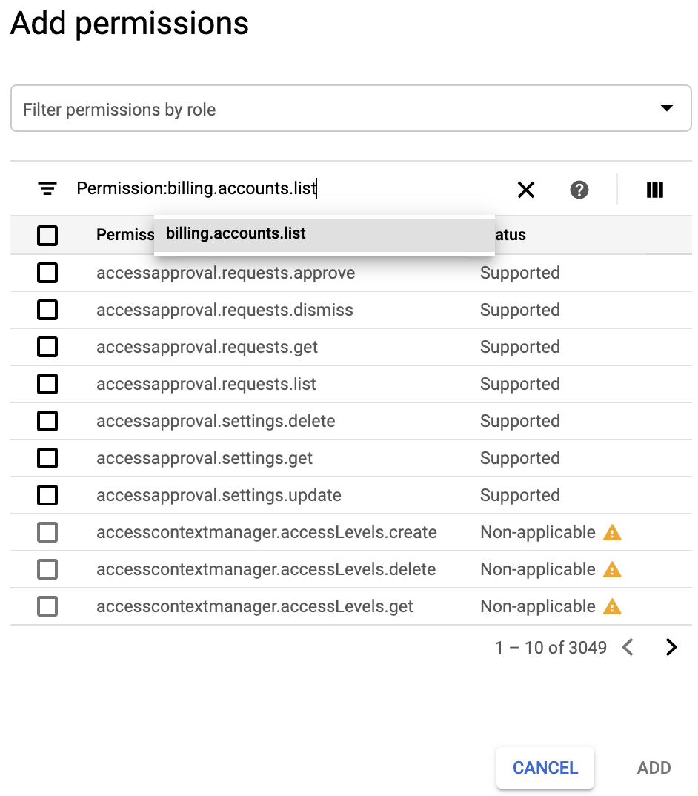
	 
	 When you are done, it will look something like this:
	
	  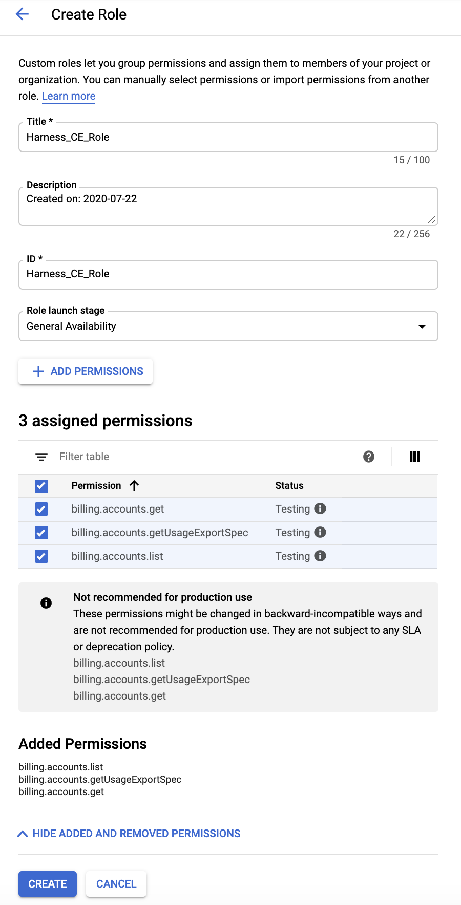
8. Click **CREATE**.

### Step: Assign Role

To assign the IAM role to Harness service account, perform the following steps:

1. Click **Follow these instructions** and then click **Open the IAM Page**.
   
     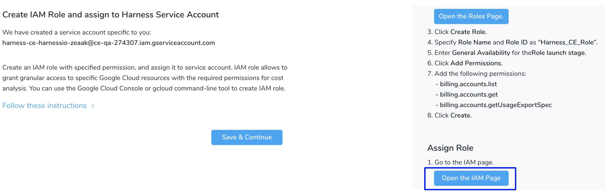
2. Log into your **GCP Account** via the GCP console.
   
     
3. Click **ADD**.
4. In **New members**, enter the Harness service account as a member.  
Copy the service account detail from Harness. The service account is generated dynamically for your account.
5. In **Role**, select **Harness\_CE\_Role** from the drop-down list.  
When you are done, it will look something like this:

  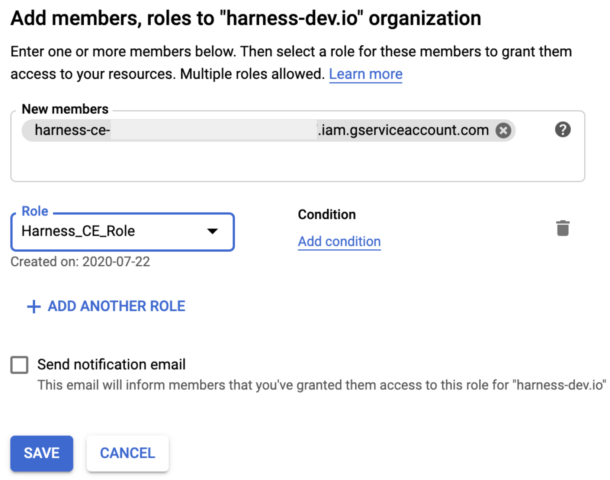
6. Click **SAVE**.
7. In Harness, click **Save & Continue**.

### Step 2: Enable Cloud Billing Export to the BigQuery Dataset and Grant Permission

Cloud Billing Export to BigQuery helps you export detailed Google Cloud billing data (such as usage and cost estimate data) to a BigQuery dataset that you specify. The export happens throughout the day automatically. Next, in CE, you can access your Cloud Billing data from BigQuery for detailed analysis.

To enable cloud billing export to the BigQuery dataset and grant permission, click **How to export a cloud billing report to the BigQuery dataset and grant permission?**

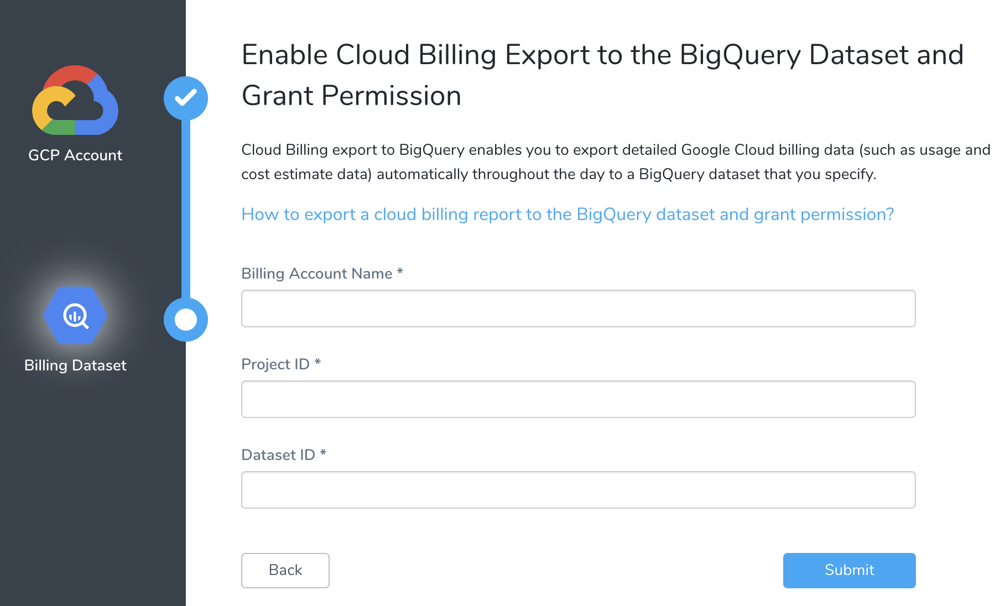

### Step: Enable Cloud Billing Export to the BigQuery Dataset

1. Log into the GCP console.
2. Export your billing report to BigQuery. For more information, see [Enable Cloud Billing data export to BigQuery](https://cloud.google.com/billing/docs/how-to/export-data-bigquery-setup#how-to-enable).
3. Gather the Billing Account Name, Project ID, and Dataset ID.

### Step: Grant Permission to BigQuery

1. Log into the GCP console and go to the BigQuery page.
2. Select your project in the left panel.
3. Select your dataset. For more information on creating a dataset, see [Creating datasets](https://cloud.google.com/bigquery/docs/datasets).
   
     
4. Click **SHARE DATASET**.
5. In **Dataset permissions**, in **Add members**, enter the Harness service account as a member.  
Copy the service account detail from Harness. The service account is generated dynamically for your account.
6. In **Select a** **role**, select **BigQuery Data Viewer**, and then click **Add**.
7. Click **Done**.  
When you are done, it will look something like this:  

  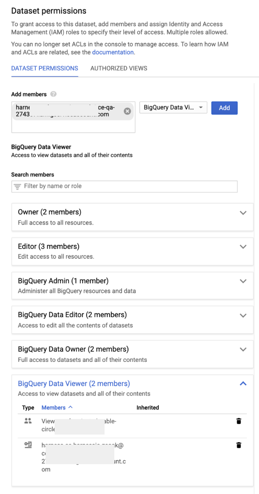

### Step: Enter the Details in Harness

1. In **Billing Account Name**, enter the name of the billing account that you want to manage.
2. In **Project ID**, enter the ID of the GCP project running the BigQuery dataset you want to use.
3. In **Dataset ID**, enter the dataset ID of your project. Datasets are listed by the project in the **Resources** pane.
4. Click **Back** to go to the **Connect to Google Cloud Platform (GCP) Account** tab to modify any settings.
   
     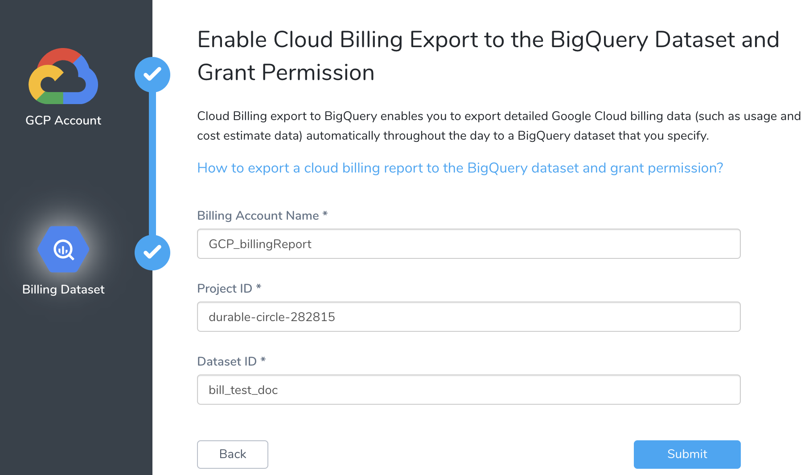
5. Click **Submit**. Details of the connected GCP account are displayed.
   
     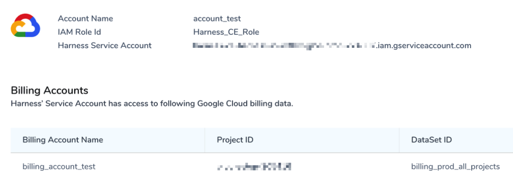

As noted earlier, after enabling CE, it takes about 24 hours for the data to be available for viewing and analysis in **Cost Explorer**.

### Troubleshooting

If you get an **Error Processing Data** error, check if the BigQuery table is created.
   
    
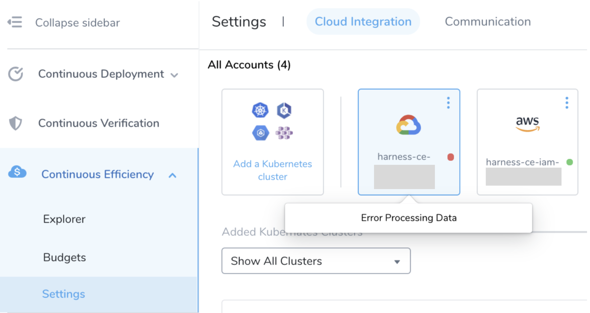

