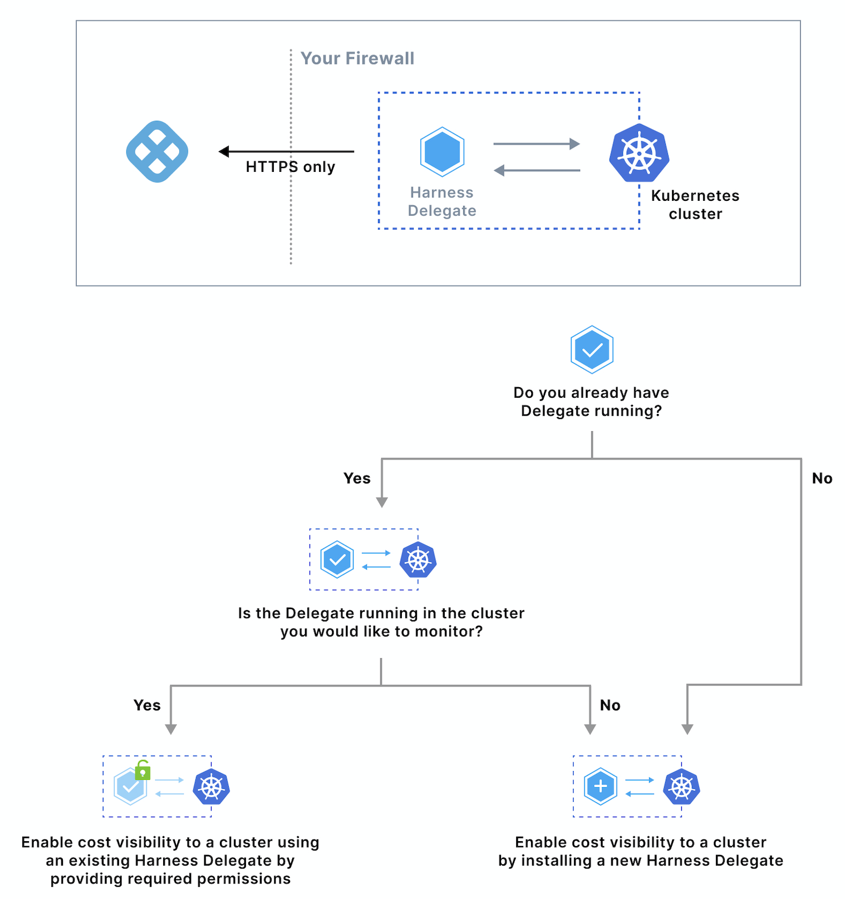
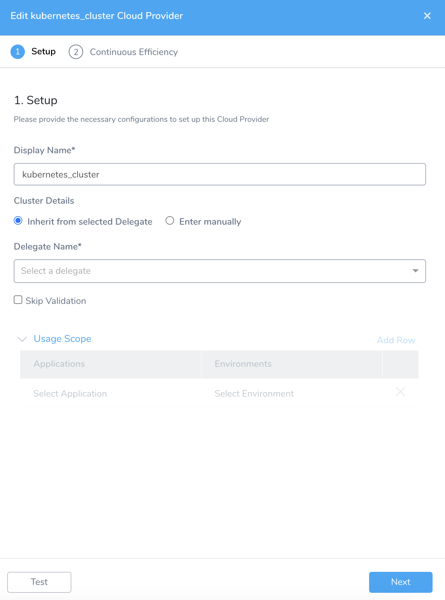
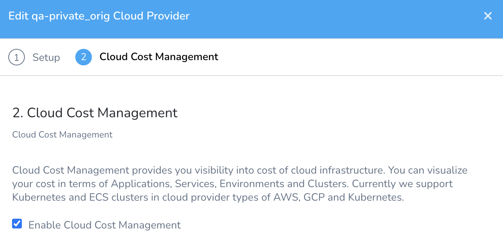
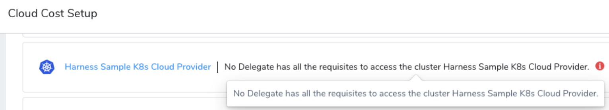
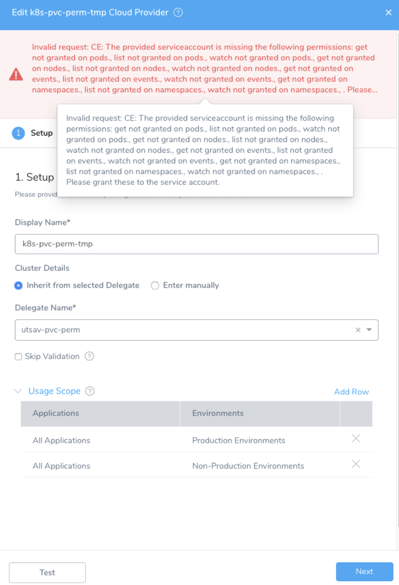

Harness Cloud Cost Management (CCM) monitors the cloud costs of your Kubernetes clusters, namespaces, nodes, workloads, and labels. This topic describes how to connect your Kubernetes to CCM using an existing Harness Delegate.


## Is Harness Delegate Running in Your Cluster?

Before connecting your Kubernetes cluster to Harness CCM, review the following:

* **Provide** **CCM Permissions to Harness Delegate**: If the Delegate is already running in the Kubernetes cluster that you want to monitor, the Service account you used to install and run the Harness Kubernetes Delegate is granted a special `ClusterRole` for accessing the resource metrics. For more information, see [Provide CCM Permissions to Harness Delegate](/docs/first-gen/cloud-cost-management/setup-cost-visibility/enable-continuous-efficiency-for-kubernetes.md#step-2-provide-ccm-permissions-to-harness-delegate).

* **Use Single Harness Delegate to Access Multiple Kubernetes Clusters**: You can use a single Harness Delegate to access multiple Kubernetes clusters. To do so, you need to enter specific credentials manually. For more information, see [Enter manually](https://harness.helpdocs.io/article/l68rujg6mp-add-kubernetes-cluster-cloud-provider#option_2_enter_manually).
  
    

## Prerequisites

* Each Kubernetes cluster you want to monitor must have a Harness Delegate and Cloud Provider associated with it. For more information, see [Install the Harness Kubernetes Delegate](https://harness.helpdocs.io/article/0hn6vdpeqz-install-kubernetes-delegate) and [Add Kubernetes Cluster Cloud Provider](https://harness.helpdocs.io/article/l68rujg6mp-add-kubernetes-cluster-cloud-provider).
* Before enabling CCM for Kubernetes, you must ensure the utilization data for pods and nodes is available. To do so, perform the following steps:

### Step 1: Install Kubernetes Metrics Server


:::note
Metrics Server must be running on the Kubernetes cluster where your Harness Kubernetes Delegate is installed.
:::

Metrics Server is installed by default on GKE and AKS clusters, however, you need to install it on the AWS EKS cluster.1. Metrics Server is a cluster-wide aggregator of resource usage data. It collects resource metrics from kubelets and exposes them in the Kubernetes API server through Metrics API. CCM polls the utilization data every minute on the Delegate. The metrics are aggregated for 20 minutes and then CCM keeps one data point per 20 minutes. For more information, see [Installing the Kubernetes Metrics Server](https://docs.aws.amazon.com/eks/latest/userguide/metrics-server.html) from AWS.  
  
To install metrics server on your EKS clusters, run the following command:  
  

```
kubectl apply -f https://github.com/kubernetes-sigs/metrics-server/releases/download/v0.3.6/components.yaml
```

### Step 2: Provide CCM Permissions to Harness Delegate

Bind the cluster-admin ClusterRole to a user account. Next, you will use this user account to create a ClusterRole and bind it to the Service account used by the Delegate.

1. Bind a user account to the user in cluster-admin ClusterRole. You will use this user account to create a ClusterRole and bind it to the Harness Kubernetes Delegate Service account later.  
  

```
kubectl create clusterrolebinding cluster-admin-binding \  
--clusterrole cluster-admin \  
--user <firstname.lastname@example.com>
```
2. Obtain the Service account name and namespace used by the Harness Kubernetes Delegate. By default, when you installed the Kubernetes Delegate, the following were used:  
  

```
name: default  
namespace: harness-delegate
```
  
If you have changed these, obtain the new name and namespace.
3. Download the [ce-default-k8s-cluster-role.yaml](https://raw.githubusercontent.com/harness/continuous-efficiency/master/config/ce-default-k8s-cluster-role.yaml) file from Harness.  
  
The `Subjects` section of the ClusterRoleBinding is configured with the default Delegate Service account name (`default`) and namespace (`harness-delegate`).  
  
If you have changed these defaults, update the ce-default-k8s-cluster-role.yaml file before running it.
4. Once you have downloaded the file, connect to your Kubernetes cluster and run the following command in your Kubernetes cluster:  
  

```
kubectl apply -f ce-default-k8s-cluster-role.yaml
```
5. Verify that you have all the required permissions for the Service account using the following commands:  

```
kubectl auth can-i watch pods   
--as=system:serviceaccount:<your-namespace>:<your-service-account>   
--all-namespaces  
kubectl auth can-i watch nodes   
--as=system:serviceaccount:<your-namespace>:<your-service-account>   
--all-namespaces
```
  

```
kubectl auth can-i get nodemetrics   
--as=system:serviceaccount:<your-namespace>:<your-service-account>   
--all-namespaces  
kubectl auth can-i get podmetrics   
--as=system:serviceaccount:<your-namespace>:<your-service-account>   
--all-namespaces
```
  
Here is an example showing the commands and output using the default Delegate Service account name and namespace:  
  

```
$ kubectl auth can-i watch pods --as=system:serviceaccount:harness-delegate:default --all-namespaces  
yes  
$ kubectl auth can-i watch nodes --as=system:serviceaccount:harness-delegate:default --all-namespaces                                                                      
yes  
$ kubectl auth can-i watch nodemetrics --as=system:serviceaccount:harness-delegate:default --all-namespaces                                                                
yes  
$ kubectl auth can-i watch podmetrics --as=system:serviceaccount:harness-delegate:default --all-namespaces   
yes
```

## Step: Enable Cloud Cost Management

To enable CCM in your cloud environment, you simply need to enable it on the Harness Kubernetes Cloud Provider that connects to your target cluster.


:::note
Once you enable CCM, for the first cluster the data is available within a few minutes for viewing and analysis. However, you will not see the idle cost because of the lack of utilization data. CCM generates the last 30 days of the cost data based on the first events.  
  
From the second cluster onwards, it takes about 2–3 hours for the data to be available for viewing and analysis.
:::


1. In **Cloud Cost Management**, click **Settings**.
2. Select the Kubernetes cluster for which you want to enable Cloud Cost Management.
3. In **Display Name**, enter the name that will appear in CCM Explorer to identify this cluster. Typically, this is the cluster name.
   
     
4. In **Cluster Details**, select:
* **Inherit from selected Delegate**: (Recommended) Select this option if the Kubernetes cluster is the same cluster where the Harness delegate was installed.

  **Delegate Name**: Select the Delegate.
	   
* **Enter manually**: In this option, the Cloud Provider uses the credentials that you enter manually. The Delegate uses these credentials to send deployment tasks to the cluster. The Delegate can be outside or within the target cluster.

  **Master Url**: The Kubernetes master node URL. The easiest method to obtain the master URL is using kubectl:  
`kubectl cluster-info`

	
:::note
Use this option, if you wish to use a single Delegate to access multiple Kubernetes clusters. To do so, you need to enter specific credentials manually. For more information, see [Enter manually](https://harness.helpdocs.io/article/l68rujg6mp-add-kubernetes-cluster-cloud-provider#option_2_enter_manually).
:::
		 
		  
5. Click **Next**.
6. Select the checkbox **Enable Cloud Cost Management** and click **Submit**.
   
     

The Kubernetes Cloud Provider is now listed under **Efficiency Enabled**. Once CCM has data, the cluster is listed in **Cost Explorer**. The cluster is identified by the **Display Name** you used in the Kubernetes Cloud Provider.


:::note
When you enable Kubernetes with CCM, Kubernetes utilization events are automatically collected via the Harness Delegate. This information is used to show you historical cost data for your resources. The cost is calculated based on the publicly available catalog price information.  
  
If a CCM AWS connector is created, then for the EKS clusters the pricing data is used from the CUR report instead of publicly available catalog price information.
:::

### Troubleshooting
1. If the Cloud Provider listed in Setup is listed with the following error message, you need to review the steps earlier in this topic.
```
No Delegate has all the requisites to access the cluster <cluster-name>.
```

  
2. If the Cloud Provider listed in Setup is listed with the following **Invalid request** error message, you need to download the [ce-default-k8s-cluster-role.yaml](https://raw.githubusercontent.com/harness/continuous-efficiency/master/config/ce-default-k8s-cluster-role.yaml) file from Harness again. The `Subjects` section of the ClusterRoleBinding is configured with the default Delegate Service account name (`default`) and namespace (`harness-delegate`). If you have changed these defaults, update the `ce-default-k8s-cluster-role.yaml` file before running it. See **Step 2: Provide CCM Permissions to Harness Delegate**.
   
     


