This guide outlines a typical configuration and execution of an AMI (Amazon Machine Image) Blue/Green deployment, in the following sections.

* [Before You Begin](#before_you_begin)
* [Overview](#overview)
* [Limitations](#limitations)
* [Blue/Green with Incremental Traffic Shift Summary](#blue_green_with_incremental_traffic_shift_summary)
* [Blue/Green with Instant Traffic Shift Summary](#blue_green_with_instant_traffic_shift_summary)
* [Prerequisites](#prerequisites)
* [AWS Setup (Example)](#aws_setup_example)
* [Define the Blue/Green Infrastructure](#define_the_blue_green_infrastructure)
* [Infrastructure Provisioners](#infrastructure_provisioners)
* [Blue/Green with Incremental Traffic Shift](#blue_green_with_incremental_traffic_shift)
* [Blue/Green with Instant Traffic Shift](#blue_green_with_instant_traffic_shift)
* [Rollbacks and Downsizing Old ASGs](#rollbacks_and_downsizing_old_as_gs)
* [Support for Scheduled Scaling](#support_for_scheduled_scaling)
* [Troubleshooting](#troubleshooting)

### Before You Begin

* [AMI Basic Deployment](ami-deployment.md)

### Overview

There are two Blue/Green deployment options for AMI, defined by the traffic-shifting strategy you want to use:

* **Incrementally Shift Traffic** — In this Workflow strategy, you specify a Production Listener and Rule with two Target Groups for the new ASG to use. Next you add multiple **Shift Traffic Weight** steps.  
Each Shift Traffic Weight step increments the percentage of traffic that shifts to the Target Group for the new ASG.  
Typically, you add Approval steps between each Shift Traffic Weight to verify that the traffic may be increased.
* **Instantly Shift Traffic** — In this Workflow strategy, you specify Production and Stage Listener Ports and Rules to use, and then a **Swap Production with Stage** step swaps all traffic from Stage to Production.

You specify the traffic shift strategy when you create the Harness Blue/Green Workflow for your AMI deployment. What steps are available in the Workflow depend on the strategy you select.

### Limitations

* If your base Auto Scaling Group is configured in AWS with [scaling policies](https://docs.aws.amazon.com/autoscaling/ec2/userguide/as-scale-based-on-demand.html#as-scaling-types), Harness will apply those policies in your Workflow's *final* **Upgrade AutoScaling Group** step.
	+ Harness does not support copying ASG scaling policies with **Metric Type** value **Application Load Balancer request count per target**.
* Harness specifically supports AWS *target* tracking scaling policies. For details, see AWS' [Dynamic Scaling for Amazon EC2 Auto Scaling](https://docs.aws.amazon.com/autoscaling/ec2/userguide/as-scale-based-on-demand.html#as-scaling-types) topic.

### Blue/Green with Incremental Traffic Shift Summary

This deployment method lets you add Workflow steps to incrementally shift traffic from the Target Group used by the previous ASG to the Target Group used by the new ASG you are deploying.

With this strategy, you are not shifting traffic from stage and production environments. You are shifting traffic incrementally for a production environment. In this way, it is similar to a Canary strategy.

However, in a Canary deployment, the percentage of traffic that goes to the new ASG is determined by the number of instances (for example, 25% of 4 instances) or the forwarding policy of the load balancer.

With this Incremental Traffic Shift strategy, you are controlling the  percentage of traffic sent to the new ASG. For example, 25% of all traffic.

In this topic, we will review the requirements, and then describe how the traffic shifting works.

Next, we will walk through building the Workflow for the deployment strategy.

### Blue/Green with Instant Traffic Shift Summary

In this strategy, you specify Production and Stage Listener Ports and Rules to use, and then a **Swap Production with Stage** step swaps **all** traffic from Stage to Production.

A Blue/Green deployment reliably deploys your AMI(s) by maintaining new and old versions of Auto Scale Groups (ASGs) that are built using these AMIs. The ASGs run behind an Application Load Balancer (ALB) using two listeners, Stage and Prod. These listeners forward respectively to two Target Groups (TGs), Stage and Prod, where the new and old ASGs are run. 

In the first stage of deployment, the new ASG—created using the new AMI you are deploying—is attached to the Stage Target Group:

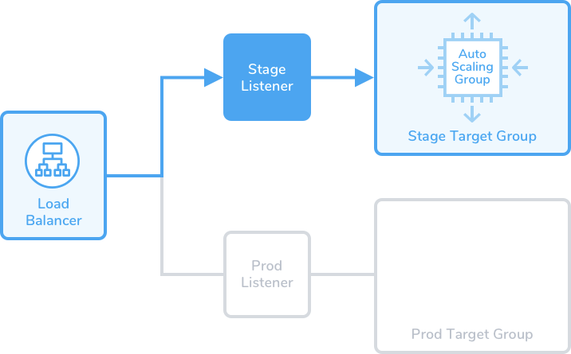


Blue/Green deployments are achieved by swapping routes between the Target Groups—always attaching the new ASG first to the Stage Target Group, and then to the Prod Target Group:


	
	
In Amazon Web Services, you configure a base Launch Configuration that Harness will use when it creates new Launch Configurations; a base Auto Scaling Group that uses the base Launch Configuration; and the Stage and Prod Target Groups. In Harness, you identify the Region, base Auto Scaling Group, and Stage and Prod Target Groups that you've configured in AWS.

This guide outlines the required setup in both AWS and Harness.

### Prerequisites

An AMI Blue/Green deployment requires you to set up the following resources up within AWS (example setup [below](#aws_setup_bg)):

* A working AMI that Harness will use to create the instances in the new ASGs that Harness creates.
* An AWS [Launch Configuration](https://docs.aws.amazon.com/autoscaling/ec2/userguide/LaunchConfiguration.html), whose security group allows inbound access to your Application Load Balancer's listener ports.
* An [Auto Scaling Group](https://docs.aws.amazon.com/autoscaling/ec2/userguide/create-asg.html) (ASG), which Harness uses as a template for the ASGs that Harness creates.
* A pair of [Target Groups](https://docs.aws.amazon.com/elasticloadbalancing/latest/application/load-balancer-target-groups.html)—typically staging (Stage) and production (Prod)—both with the **instance** target type.
* An [Application Load Balancer](https://docs.aws.amazon.com/elasticloadbalancing/latest/application/create-application-load-balancer.html) (ALB), with listeners for both your Target Groups' ports.

Within Harness, you'll need to set up the following resources (some of which you might have already created for an AMI [Basic deployment](ami-deployment.md#basic-deploy)):

* A Delegate [installed and running](ami-deployment.md#install-and-run-the-harness-delegate) in an AWS instance.
* An AWS [Cloud Provider](ami-deployment.md#cloud-provider) configured to assume the Delegate's IAM role for the connection to AWS.
* An AMI-based Service (which can be any Service you've already set up for an [AMI Basic deployment](ami-deployment.md#basic-deploy)).
* An Environment with an Infrastructure Definition that specifies your ASG and your Stage and Prod Target Groups.

You do not need to register instances for your Target Groups. Harness will perform that step during deployment.

#### Cloud Provider Requirements for Blue/Green Deployments

Ensure that the IAM role applied to the AWS access key user or Harness Delegate host has the policies described in [Policies Required: AWS AMI/ASG Deployments](https://docs.harness.io/article/wt1gnigme7-add-amazon-web-services-cloud-provider#policies_required_aws_ami_asg_deployments).

### AWS Setup (Example)

For the Workflows demonstrated in this topic, we set up the following AWS resources:

* [Launch Configuration and Launch Template Support](#launch_configuration_and_launch_template_support)
* [Launch Configuration](#launch_configuration)
* [Auto Scaling Group](#auto_scaling_group)
* [Target Groups](#target_groups)
* [Application Load Balancer (ALB)](#application_load_balancer_alb)

#### Launch Configuration and Launch Template Support

In Harness AMI deployments, the base ASG you select in your Infrastructure Definition (**Auto Scaling Groups** drop-down) is used to create the new ASG Harness deploys for the AMI's EC2 instances.

AWS ASGs use either a [launch configuration](https://docs.aws.amazon.com/autoscaling/ec2/userguide/LaunchConfiguration.html) or a [launch template](https://docs.aws.amazon.com/autoscaling/ec2/userguide/LaunchTemplates.html) as a configuration template for its EC2 instances. Both contain information such as instance type, key pair, security groups, and block device mapping for your instances. The difference is that launch templates support versioning. AWS recommends that you use launch templates instead of launch configurations to ensure that you can use the latest features of Amazon EC2.Here's how Harness uses the base ASG launch configuration or launch template when it creates the new ASG:

* **Launch configurations:** If your base ASG uses a launch configuration, Harness uses that launch configuration when creating the new ASG.

* **Launch templates:** If your base ASG uses a launch template (default, latest, or specific version), Harness use that launch template when creating the new ASG.  
  
Harness creates a new Launch Template *version* when it creates the new ASG. This applies to existing base ASGs and base ASGs provisioned via Terraform or CloudFormation.

For more information on launch templates, see [Creating a Launch Template for an Auto Scaling Group](https://docs.aws.amazon.com/autoscaling/ec2/userguide/create-launch-template.html) from AWS.

In this tutorial, we will use a launch configuration.

##### Launch Configuration

This defines a base Launch Configuration, from which Harness will create new Launch Configurations for new Auto Scaling Groups. This Launch Configuration's security group allows inbound HTTP traffic on port 80 (which we'll use for the Prod Target Group's instance listener).

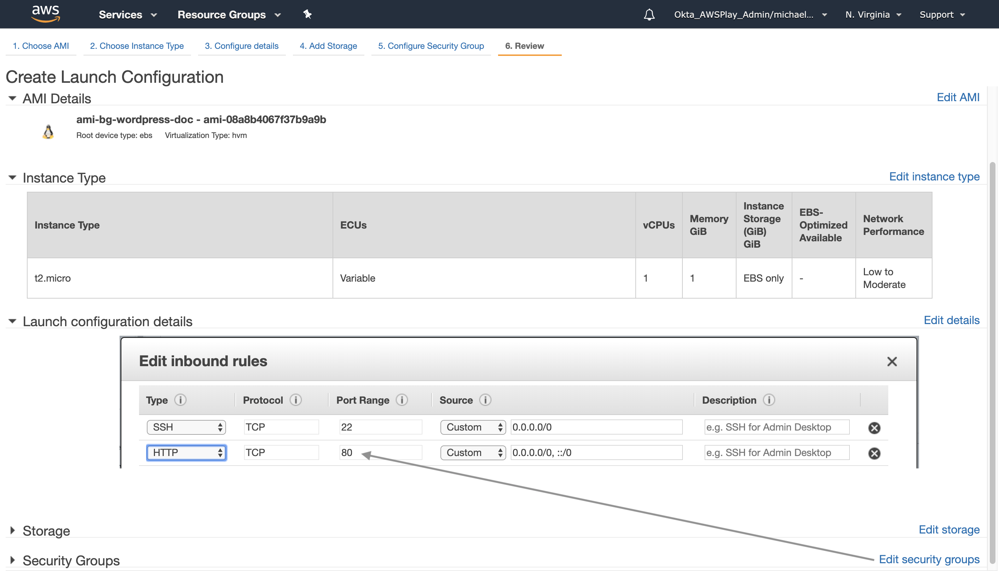

#### Auto Scaling Group

The Auto Scaling Group that you define in AWS must use the base [Launch Configuration](#launch_config_bg) created above or a launch template. When you later select this ASG in your Harness Infrastructure Definition, it becomes the base ASG from which Harness will create new ASGs to deploy new AMIs.

Our example specifies three subnets and modest scaling policies: one instance to start, then **Keep this group at its initial size**.

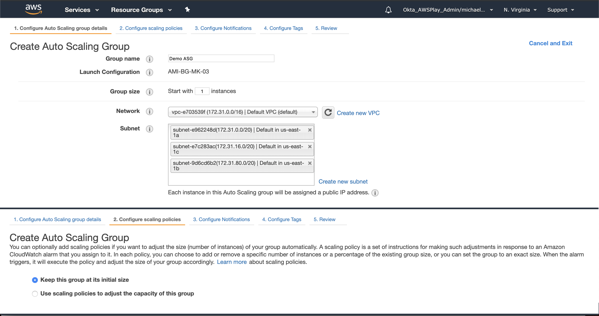

Note that if you choose to instead configure scaling policies for your base ASG, Harness will apply these scaling policies in your Workflow's final  [Upgrade AutoScaling Group step](#upgrade_asg_bg). (Harness will also oblige these policies in any rollback steps.)

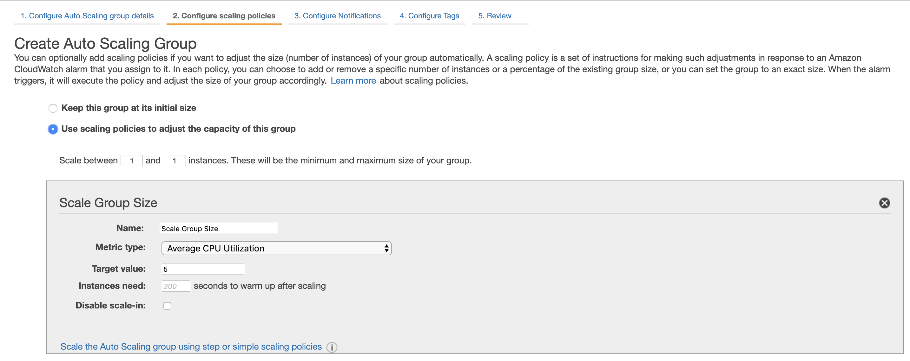

Harness specifically supports AWS *target* tracking scaling policies. For details, see AWS' [Dynamic Scaling for Amazon EC2 Auto Scaling](https://docs.aws.amazon.com/autoscaling/ec2/userguide/as-scale-based-on-demand.html#as-scaling-types) topic.

#### Target Groups

We have a pair of identically configured Target Groups. We've arbitrarily named one TG to indicate production, and the other to indicate staging. This naming convention is a convenience to help us select these TGs when we later assign them to a Harness Infrastructure Definition.

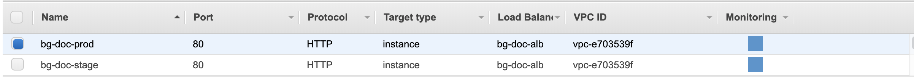

Both Target Groups are configured as **Target type: Instance**. They provide HTTP access for the load balancer on port 80, and specify the Default VPC.


#### Application Load Balancer (ALB)

The Application Load Balancer is configured with the same Default VPC, and the same subnets, used for the base ASG and the Target Groups.


It has two listeners, forwarding to the two Target Groups: one for production traffic, pointing to the Prod TG; and one for staging traffic, pointing to the Stage TG. In our example, the production Target Group's listener uses port 80, matching the access we configured for that TG.

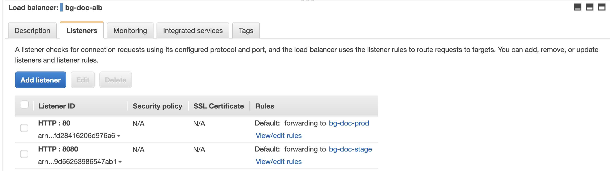

### Define the Blue/Green Infrastructure

1. Within your Harness Application, select an existing [Environment](ami-deployment.md#create-environment), or create a new one.
2. In the Environment's **Infrastructure Definition** section, click **Add Infrastructure Definition**.
3. In the resulting **Infrastructure Definition** dialog, enter a **Name** that will identify this Infrastructure Definition when you [add it to a Workflow](#workflow_bg).
4. In **Cloud Provider Type**, select **Amazon Web Services**.
5. In **Deployment Type**, select **Amazon Machine Image**. This expands the **Infrastructure Definition** dialog to look something like this:
   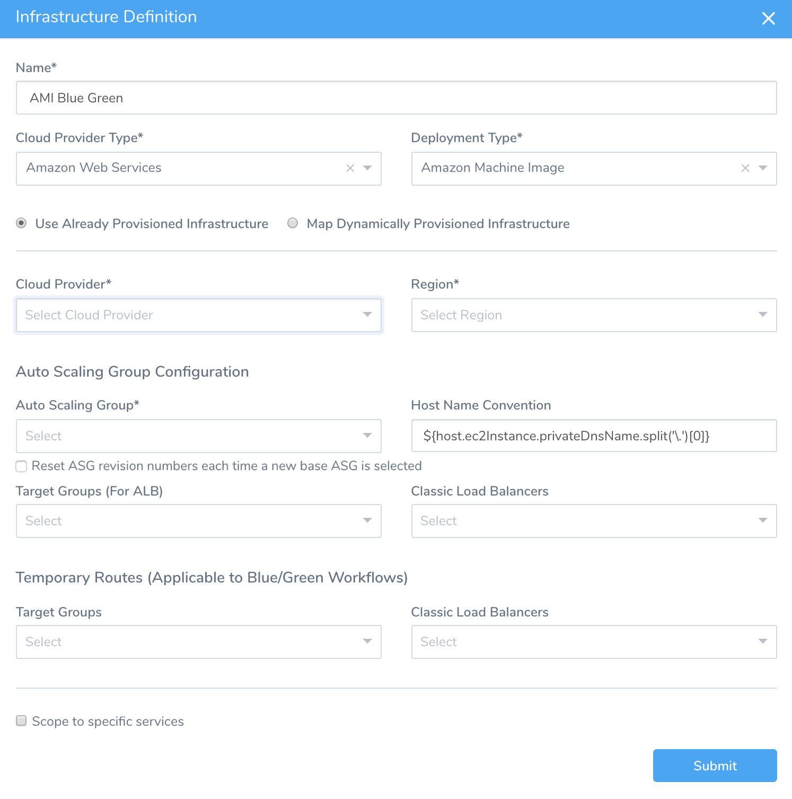
6. Select a **Cloud Provider** that references your Delegate by Tag, as [outlined earlier](ami-deployment.md#cloud-provider) for Basic deployment.
7. Select the **Region** and base **Auto Scaling Group** that you [configured in AWS](#asg_bg) for Blue/Green.
8. If you want this Infrastructure Definition to create a new ASG numbering series based on each new selection in the above **Auto Scaling Groups** drop-down, enable the check box labeled **Reset ASG revision numbers each time a new base ASG is selected**. For details on this option, see [Reset ASG Revision Numbers](#reset_asg_rev).
9. In the upper **Target Groups (for ALB)** field, select the Target Group that you [configured in AWS](#target_groups_bg) as your production group.
10. In the lower **Temporary Routes** > **Target Groups** field, select the Target Group that you configured in AWS as your staging group. (Harness uses this Target Group for initial deployment of your service. Upon successful deployment, it swaps this group's route with the production Target Group's route.)
11. Enable **Scope to Specific Services**, and use the adjacent drop-down to select the appropriate Harness Service. This can be any Service you've already set up for an [AMI Basic deployment](ami-deployment.md#basic-deploy).  
  
(This scoping will make this Infrastructure Definition available whenever a Workflow, or Phase, is set up for this Service.)  
  
When you are done, the dialog will look something like this:
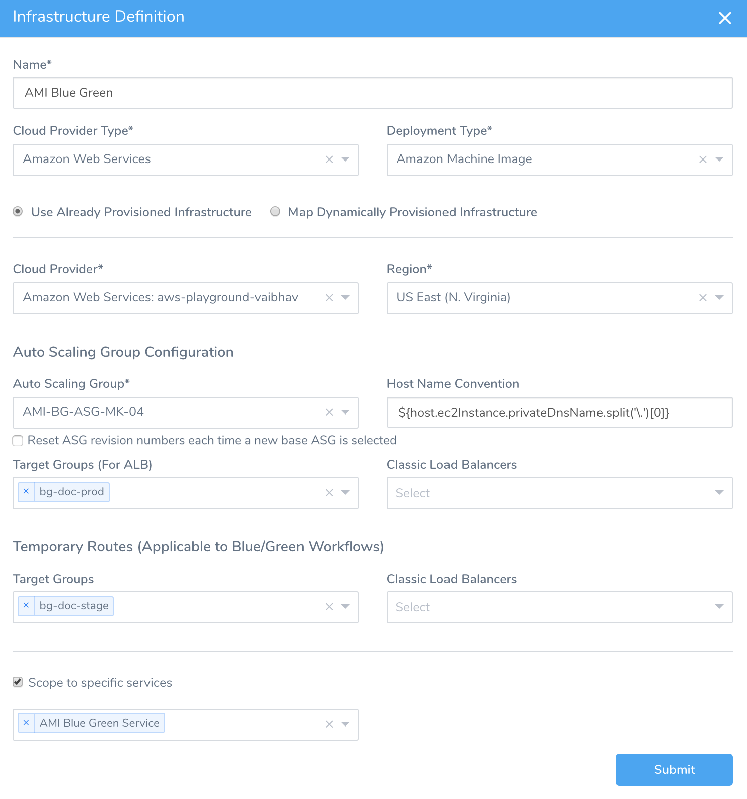


12. Click **SUBMIT** to add the new Infrastructure Definition to your Harness Environment.

You're now ready to create a Blue/Green deployment [Workflow](#workflow_bg).

#### Reset ASG Revision Numbers

Within an Infrastructure Definition, you can direct Harness to start a new ASG numbering series each time you select a new base ASG. You do so by enabling the check box labeled **Reset ASG revision numbers each time a new base ASG is selected**.

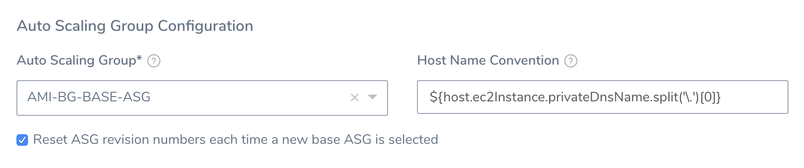

When you deploy, this option resets ASG numbering even for the same combination of AMI Service and Infrastructure Definition—if you select a new ASG. Each newly selected ASG might represent: 

* A separate brand.
* A separate franchisee.
* A separate level of your SaaS product offering, each with its own configuration, permissions, and pricing.

Deploying the new ASG with a new numbering series prevents existing, unrelated ASGs from being downscaled. You achieve this independence without having to create duplicate Infrastructure Definitions. Within Harness, each combination of a Service with a new base ASG creates a new  [Service Infrastructure Mapping](https://docs.harness.io/article/v3l3wqovbe-infrastructure-definitions#service_infrastructure_mapping).

If you select the **Use Already Provisioned Infrastructure** option along with the **Reset ASG revision numbers...** option, Harness will start a new ASG numbering series each time you manually select a new base ASG in the **Auto Scaling Group** drop-down.

If you instead select the **Map Dynamically Provisioned Infrastructure** option along with the **Reset ASG revision numbers...** option, Harness will automatically create a new numbering series based on the new value for the base ASG value that your  [Infrastructure Provisioner](#infrastructure_provisioners) outputs in a variable expression.

Once you **Submit** an Infrastructure Definition with this **Reset** check box enabled, the check box will be locked. You will not be able to disable this option later within the same Infrastructure Definition.

### Infrastructure Provisioners

Harness Terraform and CloudFormation Infrastructure Provisioners support Blue/Green deployments for AMI.

When you set up the Infrastructure Definition for your Blue/Green deployment, you simply select the option to dynamically provision, then select the Terraform or CloudFormation Infrastructure Provisioner you have set up in your Harness Application. Next, you map outputs from your provisioner template or script to the fields Harness requires.

In the following example, we show:

* Required outputs.
* The outputs used for the optional Target Group and Application Load Balancer.
* The stage Target Group and Application Load Balancer used for Blue/Green deployments.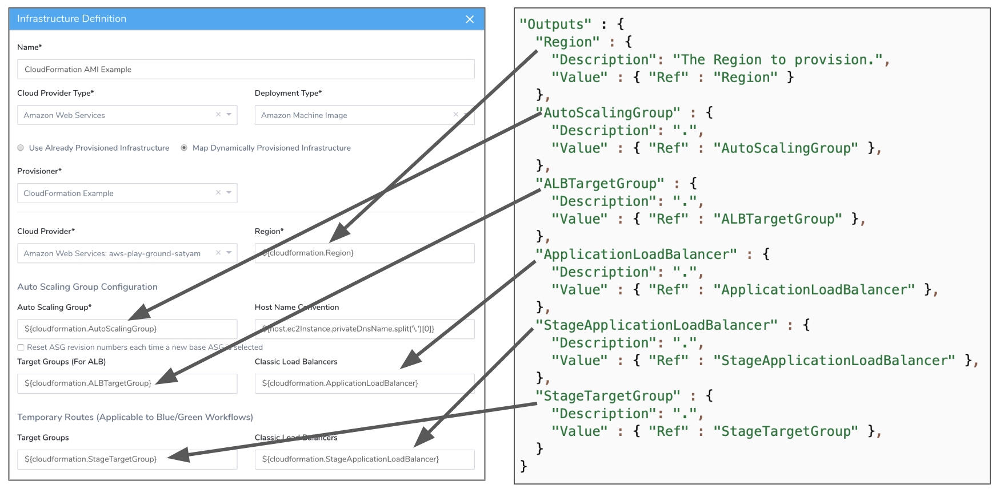

### Blue/Green with Incremental Traffic Shift

This section contains the steps for the deployment option described above in [Blue/Green with Incremental Traffic Shift Summary](#blue_green_with_incremental_traffic_shift_summary).

#### Harness Delegate, Service, and Infrastructure Definition Requirements

There are no specific Harness Delegate, Service, and Infrastructure Definition requirements beyond the standard setup described in [Prerequisites](#prerequisites).

#### AWS ELB Listener Requirements

You need the following AWS ELB setup:

* AWS Application Load Balancer configured with one  [Listener](https://docs.aws.amazon.com/elasticloadbalancing/latest/application/create-listener.html).
* The Listener must have a  [Rule](https://docs.aws.amazon.com/elasticloadbalancing/latest/application/listener-update-rules.html) redirecting to two  [Target Groups](https://docs.aws.amazon.com/elasticloadbalancing/latest/application/load-balancer-target-groups.html) (TGs).
* You will need registered target instances for the Target Groups.

Here is an example of an ALB Listeners rule redirecting to two TGs:


This example uses the default rule, but in most cases you will have several rules for redirecting traffic to your services. Typically, the default rule is used as the last rule to catch actions that the other rules do not.#### Target Group Weight Shifting

The ALB Listener has two TGs with the following weights:

* One TG has a weight of 100 (100%) — This TG is used for the **existing ASG** (pre-deployment).
* The other TG has a weight of 0 — This TG is used for the **new ASG** you are deploying.


When Harness first creates the new ASG it adjusts its instances to the TG with a weight of 0.

Later in the Workflow, you add **Shift Traffic Weight** step(s) to adjust the weight for this TG. For example, here is a **Shift Traffic Weight** step adjust the weight to 10%:

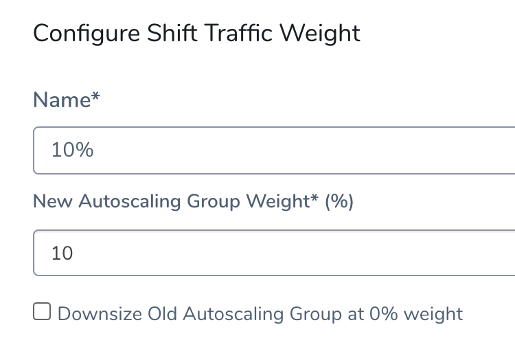

The weight for the **other** TG is automatically set to the remaining percentage. In this case, 90%.

You keep adding **Shift Traffic Weight** steps until the weight of the TG for the new ASG is 100.

You can manipulate traffic shifting using as many **Shift Traffic Weight** steps as you like.Typically, you add  [Approval](https://docs.harness.io/article/0ajz35u2hy-approvals) steps between each **Shift Traffic Weight** step to ensure that everything is running smoothly. For example, you can test the new feature(s) of your app before approving. This is a simple way to incorporate A/B testing into your Workflow.

Approval steps are very useful because they enable you to cancel a deployment and return to the pre-deployment traffic weighting with a single step.The Workflow looks something like the following. Here the names of the **Shift Traffic Weight** steps have been changed to describe the weights they are assigning (10%, 100%):

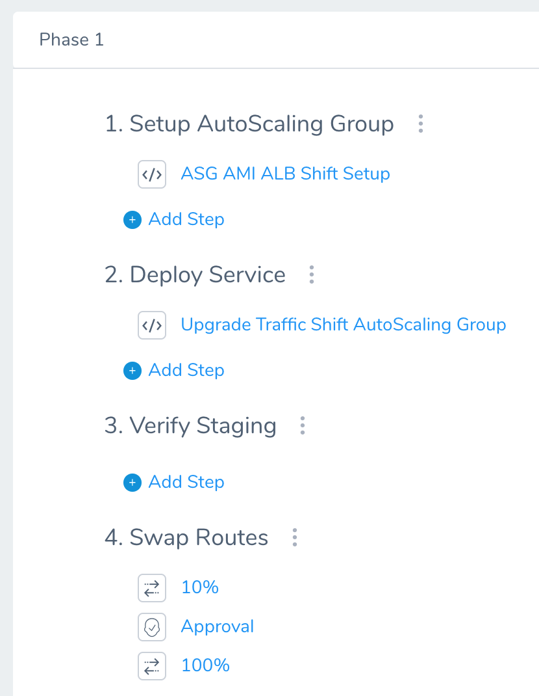

#### Create the Blue/Green Workflow

1. In the Harness Application containing the Service and Infrastructure Definition you want to use, click **Workflows**.
2. Click **Add Workflow**.
3. Enter a name for the Workflow.
4. In **Workflow Type**, select **Blue/Green Deployment**.
5. Select an **Environment** and **Service**, and the **Infrastructure Definition**.
6. In **Traffic Shift Strategy**, select **Incrementally Shift Traffic using ELB**.
7. Click **Submit**.

Harness creates the Workflow and automatically adds the steps for deployment.

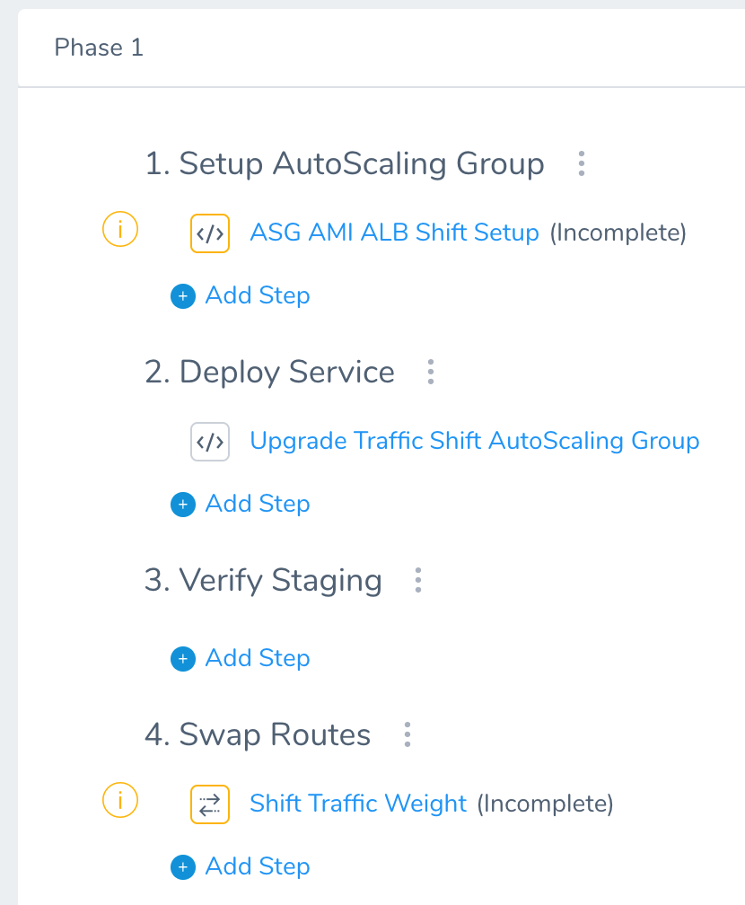

By default, only one **Shift Traffic Weight** step is added. Unless you want to shift the traffic in one step, you will likely add more **Shift Traffic Weight** steps to incrementally shift traffic.

Let's walk through each step.

#### ASG AMI ALB Shift Setup

This step creates the new ASG. In this step, you name the new ASG, specify how instances its uses, and then identity the production load balancer, listener, and Rule to use.

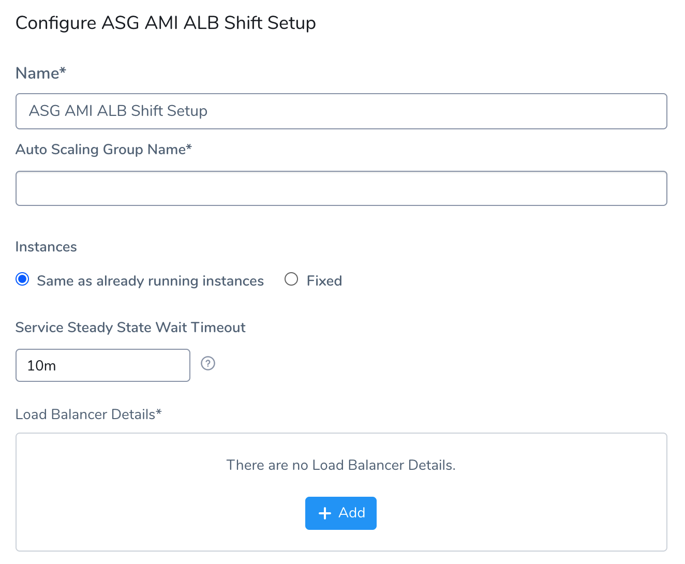

1. Once you have named and defined the number of instances for the ASG, in **Load Balancer Details**, click **Add**.
2. In **Elastic Load Balancer**, select the ELB to use for production traffic.
3. In **Production Listener ARN**, select the Listener to use. This is the listener containing the rule whose weights you will adjust.
4. In **Production Listener Rule ARN**, select the ARN for the rule to use. You can find the ARN by its number in the AWS console.
5. Click **Submit**.

Most of the settings support  [Workflow variable expressions](https://docs.harness.io/article/766iheu1bk-add-workflow-variables-new-template). You can use these to template this step and then allow its values to be specified at deployment runtime. You can even pass in the values using a Harness  [Trigger](https://docs.harness.io/article/revc37vl0f-passing-variable-into-workflows).When you deploy this Workflow, the output for the step will show the ASG creation and load balancer assignments.


```
Starting AWS AMI Setup  
Loading Target group data for Listener: [...] at port: [null] of Load Balancer: [null]  
Rule Arn: [...]  
Target group: [...] is Prod, and [...] is Stage  
Starting AWS AMI Setup  
Getting base auto scaling group  
Getting base launch configuration  
Getting all Harness managed autoscaling groups  
Getting last deployed autoscaling group with non zero capacity  
# Downsizing older ASGs to 0  
# Not changing Most Recent Active ASG: TrafficShiftASG__1  
Using workflow input min: [1], max: [1] and desired: [1]  
Creating new launch configuration [TrafficShiftASG__2]  
Creating new AutoScalingGroup [TrafficShiftASG__2]  
Extracting scaling policy JSONs from: [asgAmi-SG]  
Found scaling policy: [...]  
Extracting scaling policy JSONs from: [TrafficShiftASG__1]  
Found scaling policy: [...]  
Completed AWS AMI Setup with new autoScalingGroupName [TrafficShiftASG__2]
```
You can see how it identifies both of the TGs for production and stage:


```
Target group: [...] is Prod, and [...] is Stage
```
You selected the rule to use and Harness automatically selected the TG with a weight of 0 for production and the TG with a weight of 100 for stage.

Later, in the **Shift Traffic Weight** step(s), these weights are what you will be adjusting.

#### Upgrade Traffic Shift AutoScaling Group

This step simply deploys the new ASG you created. It brings the new ASG to steady state with the number of instances you selected in the previous ASG ALB Shift Setup step.

There is nothing to configure in this step.

#### Shift Traffic Weight

This is the step where you shift traffic from the TG for the previous ASG to the new ASG you are deploying.

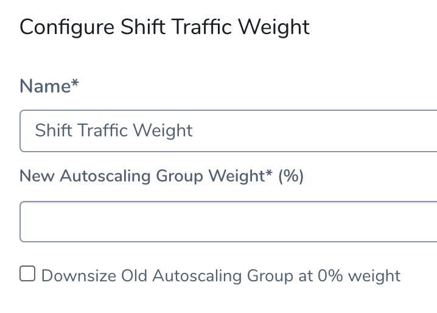

1. In **Name**, it can helpful to name the step after the traffic shift percentage it will apply, such as **10%**. You might also choose to name it according to its position, like **Shift Step 1**.
2. In **New Autoscaling Group Weight**, enter the percentage of traffic you want shifted from the previous ASG to the new ASG you are deploying.

Most of the settings support  [Workflow variable expressions](https://docs.harness.io/article/766iheu1bk-add-workflow-variables-new-template). You can use these to template this step and then allow its values to be specified at deployment runtime. You can even pass in the values using a Harness  [Trigger](https://docs.harness.io/article/revc37vl0f-passing-variable-into-workflows).Here is an example of what this step looks like when it shifts traffic 10% during deployment.


```
Starting to switch routes in AMI ASG traffic shift deploy  
Starting traffic shift between routes  
New AutoScaling Group service will get: [10] weight. TargetGroup: [asg-tg2]  
Old AutoScaling Group service will get: [90] weight. TargetGroup: [asg-tg1]  
Editing rule: [arn:aws:elasticloadbalancing:us-east-1:xxxxxx:listener-rule/app/asgAmiALB/ddf9ee159b1343f6/2a5c03e91e78600f/c005cf6f58c140b3]  
Traffic shift route updated successfully
```
You can see that the New AutoScaling Group is receiving 10% of traffic and the Old AutoScaling Group is receiving 90%.

Next, you will likely want to follow the Shift Traffic Weight step with an  [Approval step](https://docs.harness.io/article/0ajz35u2hy-approvals). This way you can test the new ASG before shifting more traffic to it.

Add more **Shift Traffic Weight** and **Approval** steps until you shift traffic to 100.


Now your Workflow is ready for deployment.

When you deploy, the final **Shift Traffic Weight** step will look something like this:


#### Downsize Old ASG at 0% weight

The **Downsize Old ASG at 0% weight** setting should only be selected for the **Shift Traffic Weight** step that shifts traffic to **100%** in its **New ASG Weight** setting.

When this setting is enabled, the old ASG is downsized.

#### Shift Traffic Weight Rollback

In the Workflow **Rollback Steps**, Harness adds a **Shift Traffic Weight Rollback** step automatically. If rollback occurs, Harness rolls back to the pre-deployment ASG and TG assignments.

If no Spotinst service setup is found, Harness skips rollback.

In many cases, Harness users place an Approval step in Rollback Steps also:

### Blue/Green with Instant Traffic Shift

This section contains the steps for the deployment option described above in  [Blue/Green with Instant Traffic Shift Summary](#blue_green_with_instant_traffic_shift_summary).

By default, Harness AMI Blue/Green Workflows have five steps:

1. [Setup AutoScaling Group](#setup_asg_bg): Specify how many instances to launch, their resizing order, and their steady state timeout.
2. [Deploy Service](#upgrade_asg_bg): Specify the number or percentage of instances to deploy within the ASG you've configured in [Setup AutoScaling Group](#setup_asg_bg).
3. Verify Staging: Optionally, specify Verification Providers or Collaboration Providers.
4. [Swap Routes](#swap_routes_bg): Re-route requests to the newest stable version of your ASG.
5. Wrap Up: Optionally, specify post-deployment commands, notifications, or integrations.

Harness pre-configures the **Setup**, **Deploy**, and **Swap Routes** steps. Below, we outline those steps' defaults and options, with examples of the deployment logs' contents at each step.

The **Verify Staging** and **Wrap Up** steps are placeholders, to which you can add integrations and commands. For details on adding **Verify Staging** integrations, see [Continuous Verification](https://docs.harness.io/article/myw4h9u05l-verification-providers-list).

#### Create the Blue/Green Workflow

1. In your Application, click **Workflows** > **Add Workflow**. The **Workflow** dialog appears.
2. Enter a **Name**, and (optionally) enter a **Description** of this Workflow's purpose.
3. In **Workflow Type**, select **Blue/Green Deployment**.
4. Select the **Environment** and **Service that** you created for your AMI deployment.
5. Select the **Infrastructure Definition** you [configured earlier](#svc_infra_bg) for AMI Blue/Green deployment. The dialog will now look something like this:
   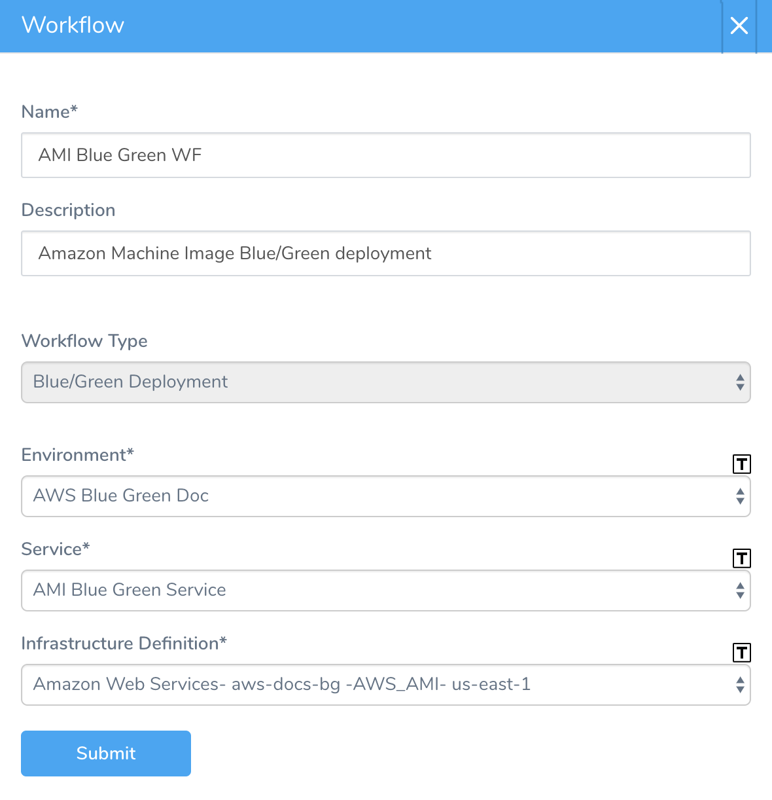


6. Click **SUBMIT**. The new Blue/Green Workflow for AMI is preconfigured.

Next, we will examine options for configuring the Blue/Green deployment's **Setup**, **Deploy**, and **Swap Routes** steps.

#### Step 1: Setup AutoScaling Group

In Step 1, select **AWS AutoScaling Group Setup** to open a dialog where you can fine-tune the new Auto Scaling Group (ASG) that Harness creates for the AMI Service you are deploying:

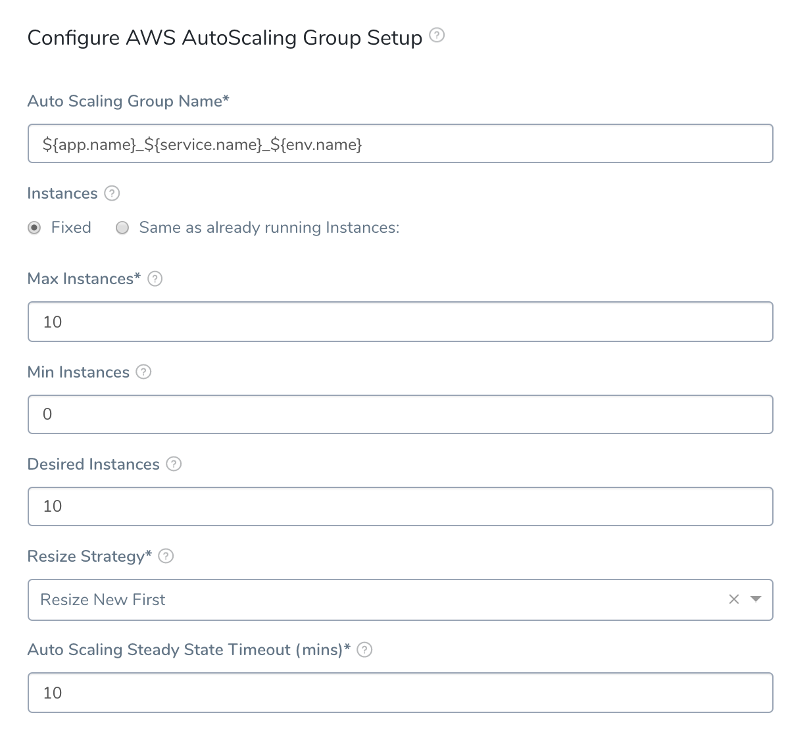

The **Instances** settings support [Harness variable expressions](https://docs.harness.io/article/9dvxcegm90-variables), such as [Workflow variable expressions](https://docs.harness.io/article/766iheu1bk-add-workflow-variables-new-template).For most settings here, see the corresponding [AMI Basic Workflow instructions](ami-deployment.md#basic-setup-asg). However:

Harness recommends setting the **Auto Scaling Steady State Timeout (mins)** field to at least **20** minutes, as shown above. This is a safe interval to prevent failed deployments while the [Swap Routes](#swap_routes_bg) step's Blue/Green switchover completes.

##### Setup AutoScaling Group in Deployment

Let's look at an example where the AWS AutoScaling Group Setup—configured as shown above—is deployed. Here is the step in the Harness Deployments page:

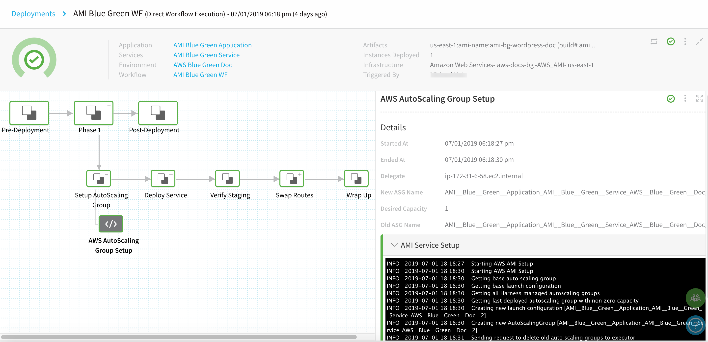

Here's partial output, showing a successful setup:


```
Starting AWS AMI Setup  
Starting AWS AMI Setup  
Getting base auto scaling group  
Getting base launch configuration  
Getting all Harness managed autoscaling groups  
Getting last deployed autoscaling group with non zero capacity  
Creating new launch configuration [AMI__Blue__Green__Application_AMI__Blue__Green__Service_AWS__Blue__Green__Doc__2]  
Creating new AutoScalingGroup [AMI__Blue__Green__Application_AMI__Blue__Green__Service_AWS__Blue__Green__Doc__2]  
Sending request to delete old auto scaling groups to executor  
Completed AWS AMI Setup with new autoScalingGroupName [AMI__Blue__Green__Application_AMI__Blue__Green__Service_AWS__Blue__Green__Doc__2]
```
#### Step 2: Deploy Service

In Step 2, select **Upgrade AutoScaling Group** to open a dialog where you can define how many instances to deploy in the Auto Scaling Group, as either a count or a percentage.

For general information on customizing this dialog's settings, and on how they correspond to AWS parameters, see the corresponding [AMI Basic Workflow section](ami-deployment.md#upgrade-asg). This deployment example uses percentage scaling, with a desired target of 100%.

If your base Auto Scaling Group is configured in AWS with [scaling policies](#scaling_policies), Harness will apply those policies in your Workflow's final **Upgrade AutoScaling Group** step.

##### Deploy Service Step in Deployment

At this point, Harness deploys the new ASG—containing the instances created using your new AMI—to the Stage Target Group:


Using the **Upgrade AutoScaling Group** configuration shown above, here is the **Deploy Service** step in the Harness Deployments page:

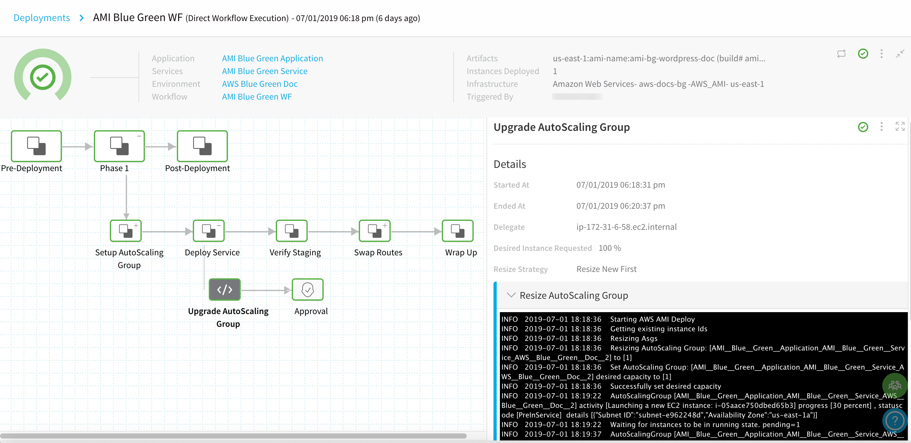

Here is partial output, showing the new Auto Scaling Group successfully resized and at steady state:


```
Starting AWS AMI Deploy  
Getting existing instance Ids  
Resizing Asgs  
Resizing AutoScaling Group: [AMI__Blue__Green__Application_AMI__Blue__Green__Service_AWS__Blue__Green__Doc__2] to [1]  
Set AutoScaling Group: [AMI__Blue__Green__Application_AMI__Blue__Green__Service_AWS__Blue__Green__Doc__2] desired capacity to [1]  
Successfully set desired capacity  
AutoScalingGroup [AMI__Blue__Green__Application_AMI__Blue__Green__Service_AWS__Blue__Green__Doc__2] activity [Launching a new EC2 instance: i-05aace750dbed65b3] progress [30 percent] , statuscode [PreInService]  details [{"Subnet ID":"subnet-e962248d","Availability Zone":"us-east-1a"}]  
Waiting for instances to be in running state. pending=1  
AutoScalingGroup [AMI__Blue__Green__Application_AMI__Blue__Green__Service_AWS__Blue__Green__Doc__2] activity [Launching a new EC2 instance: i-05aace750dbed65b3] progress [30 percent] , statuscode [PreInService]  details [{"Subnet ID":"subnet-e962248d","Availability Zone":"us-east-1a"}]  
AutoScaling group reached steady state  
Setting min capacity of Asg[AMI__Blue__Green__Application_AMI__Blue__Green__Service_AWS__Blue__Green__Doc__2] to [1]
```
Next, the staging Target Group is attached to the new ASG, and its target instances are registered:


```
Waiting for Target Group: [arn:aws:elasticloadbalancing:us-east-1:XXXXXXXXXXXX:targetgroup/bg-doc-stage/8e281748dd2c6344] to have all instances of Asg: [AMI__Blue__Green__Application_AMI__Blue__Green__Service_AWS__Blue__Green__Doc__2]  
[0] out of [1] targets registered and in healthy state  
[...]  
AutoScaling Group resize operation completed with status:[SUCCESS]  
[1] out of [1] targets registered and in healthy state  
All targets registered for Asg: [AMI__Blue__Green__Application_AMI__Blue__Green__Service_AWS__Blue__Green__Doc__2]
```
##### Approval Sub-Step

This example shows an (optional) Approval added to Step 2. It requests manual approval, following successful registration of the staging group, and prior to the Blue/Green (staging/production) switchover in the next step.


#### Step 4: Swap Routes

This is the heart of a Blue/Green deployment. Here, Harness directs the Application Load Balancer to:

* Detach your staging Target Group from the new ASG.
* Attach your production Target Group to the new ASG, to handle incoming requests.
* Detach your production Target group from the old ASG.

When this step is complete, the new ASG—containing the instances created using your new AMI—are deployed to the production TG:


In Step 4, open the **Switch Auto Scaling Group Route** dialog if you want to toggle the **Downsize Old Auto Scaling Group** setting. When enabled, this check box directs AWS to free up resources from the old ASG once the new ASG registers its targets and reaches steady state.

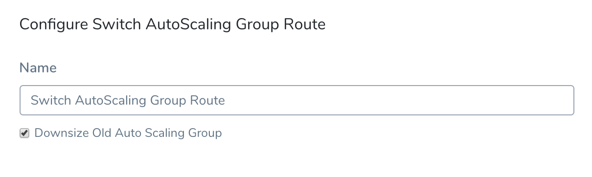

##### Switch Auto Scaling Group Route Step in Deployment

Using the configuration shown above, here is the **Switch Auto Scaling Group Route** step in the Harness Deployments page:

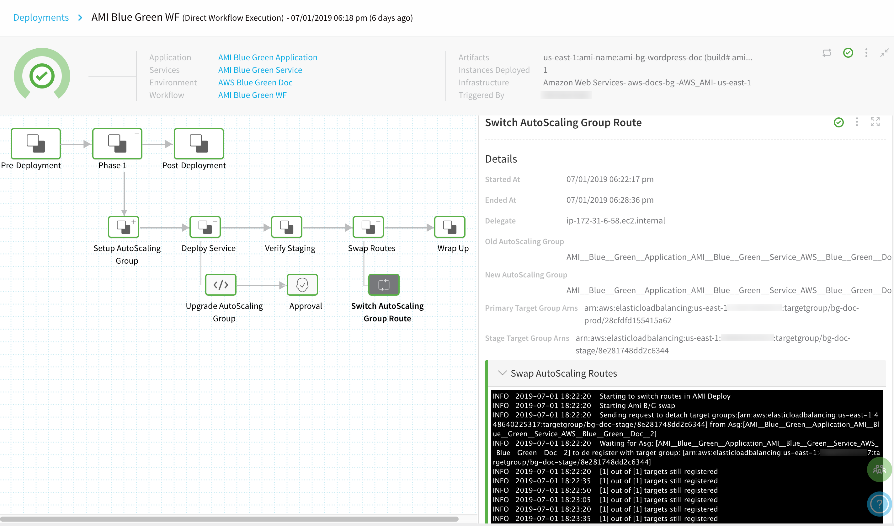

Here's partial output, showing successful swapping of the two Target Groups' routes. First, the staging Target Group is detached from new ASG 2:


```
Starting to switch routes in AMI Deploy  
Starting Ami B/G swap  
Sending request to detach target groups:[arn:aws:elasticloadbalancing:us-east-1:XXXXXXXXXXXX:targetgroup/bg-doc-stage/8e281748dd2c6344] from Asg:[AMI__Blue__Green__Application_AMI__Blue__Green__Service_AWS__Blue__Green__Doc__2]  
Waiting for Asg: [AMI__Blue__Green__Application_AMI__Blue__Green__Service_AWS__Blue__Green__Doc__2] to de register with target group: [arn:aws:elasticloadbalancing:us-east-1:XXXXXXXXXXXX:targetgroup/bg-doc-stage/8e281748dd2c6344]  
[1] out of [1] targets still registered  
[...]  
All targets de-registered for Asg: [AMI__Blue__Green__Application_AMI__Blue__Green__Service_AWS__Blue__Green__Doc__2]
```
Next, the production Target Group is attached to ASG 2. Then, its targets are verified healthy and registered. This new ASG now handles incoming requests:


```
Sending request to attach target groups:[arn:aws:elasticloadbalancing:us-east-1:XXXXXXXXXXXX:targetgroup/bg-doc-prod/28cfdfd155415a62] to Asg:[AMI__Blue__Green__Application_AMI__Blue__Green__Service_AWS__Blue__Green__Doc__2]  
Waiting for Target Group: [arn:aws:elasticloadbalancing:us-east-1:XXXXXXXXXXXX:targetgroup/bg-doc-prod/28cfdfd155415a62] to have all instances of Asg: [AMI__Blue__Green__Application_AMI__Blue__Green__Service_AWS__Blue__Green__Doc__2]  
[1] out of [1] targets registered and in healthy state  
All targets registered for Asg: [AMI__Blue__Green__Application_AMI__Blue__Green__Service_AWS__Blue__Green__Doc__2]
```
Next, the production group is detached from ASG 1:


```
Sending request to detach target groups:[arn:aws:elasticloadbalancing:us-east-1:XXXXXXXXXXXX:targetgroup/bg-doc-prod/28cfdfd155415a62] from Asg:[AMI__Blue__Green__Application_AMI__Blue__Green__Service_AWS__Blue__Green__Doc__1]  
Waiting for Asg: [AMI__Blue__Green__Application_AMI__Blue__Green__Service_AWS__Blue__Green__Doc__1] to deregister with target group: [arn:aws:elasticloadbalancing:us-east-1:XXXXXXXXXXXX:targetgroup/bg-doc-prod/28cfdfd155415a62]  
All targets de-registered for Asg: [AMI__Blue__Green__Application_AMI__Blue__Green__Service_AWS__Blue__Green__Doc__1]
```
Finally, the old ASG is downsized to 0 instances. Had the Workflow's [Step 4 (Swap Routes)](#swap_routes_bg) *not* specified **Downsize Old Auto Scaling Group,** these resources would not be explicitly freed up:


```
Downscaling autoScaling Group [AMI__Blue__Green__Application_AMI__Blue__Green__Service_AWS__Blue__Green__Doc__1]  
Set AutoScaling Group: [AMI__Blue__Green__Application_AMI__Blue__Green__Service_AWS__Blue__Green__Doc__1] desired capacity to [0]  
Successfully set desired capacity  
AutoScalingGroup [AMI__Blue__Green__Application_AMI__Blue__Green__Service_AWS__Blue__Green__Doc__1] activity [Terminating EC2 instance: i-01dc003477e21fcb6] progress [100 percent] , statuscode [Successful]  details [{"Subnet ID":"subnet-e962248d","Availability Zone":"us-east-1a"}]  
AutoScalingGroup [AMI__Blue__Green__Application_AMI__Blue__Green__Service_AWS__Blue__Green__Doc__1] activity [Launching a new EC2 instance: i-01dc003477e21fcb6] progress [100 percent] , statuscode [Successful]  details [{"Subnet ID":"subnet-e962248d","Availability Zone":"us-east-1a"}]  
AutoScaling group reached steady state  
Completed switch routes
```
#### Blue/Green Workflow Deployment

As with the [AMI Basic deployment](ami-deployment.md#deployment-basic), once your setup is complete, you can click the Workflow's **Deploy** button to start the Blue/Green deployment.


In the resulting **Start New Deployment** dialog, select the AMI to deploy, and click **SUBMIT**.

The Workflow deploys. The Deployments page displays details about the deployed instances.

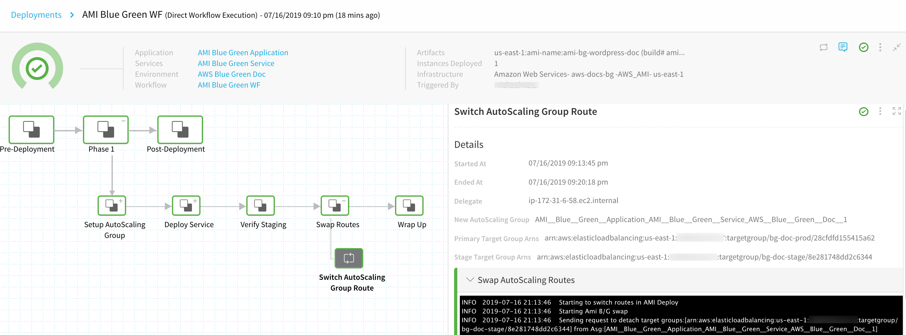

To verify the completed deployment, log into your AWS Console and locate the newly deployed instance(s).

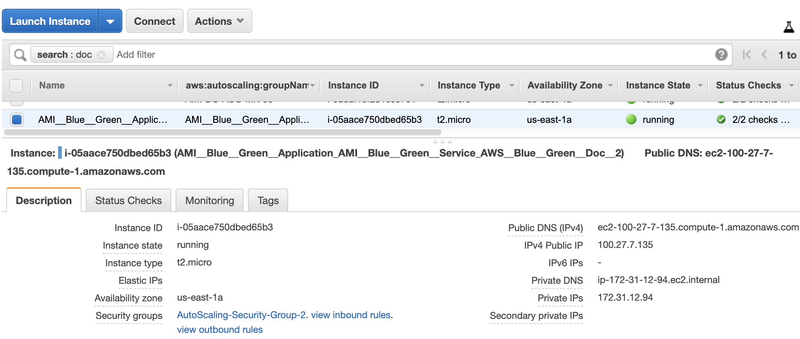

### Rollbacks and Downsizing Old ASGs

For details on how previous ASGs are downsized and what happens during rollback, see [How Does Harness Downsize Old ASGs?](../../concepts-cd/deployment-types/aws-ami-deployments-overview.md#how-does-harness-downsize-old-as-gs)

### Support for Scheduled Scaling

Currently, this feature is behind the Feature Flag `AMI_ASG_CONFIG_COPY`.The Base ASG you provide to Harness for creating the new ASG can use [AWS Scheduled Scaling](https://docs.aws.amazon.com/autoscaling/ec2/userguide/schedule_time.html) (scheduled scaling with scheduled actions).

There are a few important considerations:

* When configuring the base ASG, the `ScheduledActions` process must be suspended so that it won’t scale the base ASG. Once Harness creates the new ASG from the base, Harness will enable the `ScheduledActions` process in the new ASG (if the base ASG had it). See [Suspending and resuming a process for an Auto Scaling group](https://docs.aws.amazon.com/autoscaling/ec2/userguide/as-suspend-resume-processes.html) from AWS.
* Harness currently supports only the UTC timezone format in scheduled actions. Time values in scheduled actions in the base ASG need to be configured in UTC.

### Troubleshooting

The following errors might occur when you run an AMI Blue/Green deployment in Harness.

#### Valid Blue/Green Deployment Failed and Rolled Back in Harness

This can occur when Harness' steady state timeout setting is too restrictive, compared to the time AWS requires to swap your Target Groups' routes.

To resolve the rollbacks: In your Blue/Green Workflow's [Step 1](#setup_asg_bg) (**Setup AutoScaling Group**), try raising the **Auto Scaling Steady State Timeout (mins)** setting to at least match the switchover interval you observe in the AWS Console.

#### Rollbacks and Old ASGs

When a rollback occurs, Harness detects if there were multiple versions running before the deployment began. If there were, Harness will rollback to that state.

Harness supports multiple versions of the ASG running at the same time. When Harness deploys a new version, it upscales a new ASG and downscales the oldest ASG first, and so on.

For example, if there were multiple ASGs of the series having active instances before deployment, Harness will rollback to the previous state of all the ASGs with active instances.

### Next Steps

* Add monitoring to your AMI deployment and running instances: see [Continuous Verification](https://docs.harness.io/article/myw4h9u05l-verification-providers-list) and [24/7 Service Guard Overview](https://docs.harness.io/article/dajt54pyxd-24-7-service-guard-overview).
* [AMI Canary Deployment](ami-canary.md).

