This guide will walk you through configuring and executing an AMI (Amazon Machine Image) Canary deployment in Harness. You will create a multi-phase Workflow that progressively deploy your new instances to a new Auto Scaling Group incrementally.


### Before You Begin

* [AWS AMI Quickstart](https://docs.harness.io/article/wfk9o0tsjb-aws-ami-deployments)
* [AMI Basic Deployment](ami-deployment.md)


### Overview

A Harness AMI Canary Workflow provides a framework for progressively deploying and verifying your Amazon Machine Image (AMI) instances via Auto Scaling Groups. As shown in our [example Workflow](#workflow) below, you'll typically build out this framework to create a structure like the following:

1. A Canary phase, containing steps that define your Auto Scaling Group (ASG), deploy a percentage or partial count of the ASG's instances, and verify this partial deployment.
2. (Optionally:) Further Canary phases that expand the partial deployment, with further verification.
3. A Primary phase that deploys your image to the full count of instances defined in your ASG.


### Prerequisites

Before creating an AMI Canary Workflow, you'll need to set up the same AWS and Harness resources that Harness requires for an [AMI Basic deployment](ami-deployment.md). If you've already set up those resources, you can proceed to define your Canary [Workflow](#workflow_bg).

Otherwise, please use the following links to the [AMI Basic deployment prerequisites](ami-deployment.md#prerequisites). Within AWS, you'll need:

* A working AMI that Harness will use to create your instances.
* A base [Auto Scaling Group](https://docs.aws.amazon.com/autoscaling/ec2/userguide/create-asg.html) (ASG) that Harness will use as a template for the Auto Scaling Group it will create and deploy. For information on launch configuration and launch template support, see [Launch Configuration and Launch Template Support](ami-deployment.md#launch-configuration-and-launch-template-support).
* An AWS instance or ECS cluster in which to install the Harness Delegate(s).
* IAM role for the Harness Cloud Provider connection to AWS. Typically, you will set up the Harness Cloud Provider to assume the roles used by the installed Harness Delegate, whether that's an ECS or a Shell Script Delegate. The required policies for an ECS connection are listed in [ECS (Existing Cluster)](https://docs.harness.io/article/whwnovprrb-infrastructure-providers#ecs_existing_cluster).

Within Harness, you'll need the following resources:

* A Delegate [installed and running](ami-deployment.md#delegate) in an AWS instance or ECS cluster.
* An AWS [Cloud Provider](ami-deployment.md#cloud-provider) that is configured either to provide account credentials, or to assume the Delegate's IAM role for the connection to AWS.
* A Harness [Application](ami-deployment.md#application).
* An AMI-based [Service](ami-deployment.md#service).
* An [Environment](ami-deployment.md#environment) with an Infrastructure Definition that specifies your base ASG.

Harness specifically supports AWS *target* tracking scaling policies. For details, see AWS' [Dynamic Scaling for Amazon EC2 Auto Scaling](https://docs.aws.amazon.com/autoscaling/ec2/userguide/as-scale-based-on-demand.html#as-scaling-types) topic.

### Limitations

* If your base Auto Scaling Group is configured in AWS with [scaling policies](https://docs.aws.amazon.com/autoscaling/ec2/userguide/as-scale-based-on-demand.html#as-scaling-types), Harness will apply those policies in your Workflow's *final* **Upgrade AutoScaling Group** step.
	+ Harness does not support copying ASG scaling policies with **Metric Type** value **Application Load Balancer request count per target**.
* Harness specifically supports AWS *target* tracking scaling policies. For details, see AWS' [Dynamic Scaling for Amazon EC2 Auto Scaling](https://docs.aws.amazon.com/autoscaling/ec2/userguide/as-scale-based-on-demand.html#as-scaling-types) topic.


### Create a Canary Workflow

To set up a Canary Workflow:

1. In your Application, click **Workflows** > **Add Workflow**. The **Workflow** dialog appears.
2. Enter a **Name**, and (optionally) enter a **Description** of this Workflow's purpose.
3. In **Workflow Type**, select **Canary Deployment**.
4. Select the **Environment** that you [configured earlier](ami-deployment.md#environment). (This Environment defines your base ASG.)  
  
The dialog will now look something like this:
5. Click **SUBMIT**. You've now created your new Canary Workflow.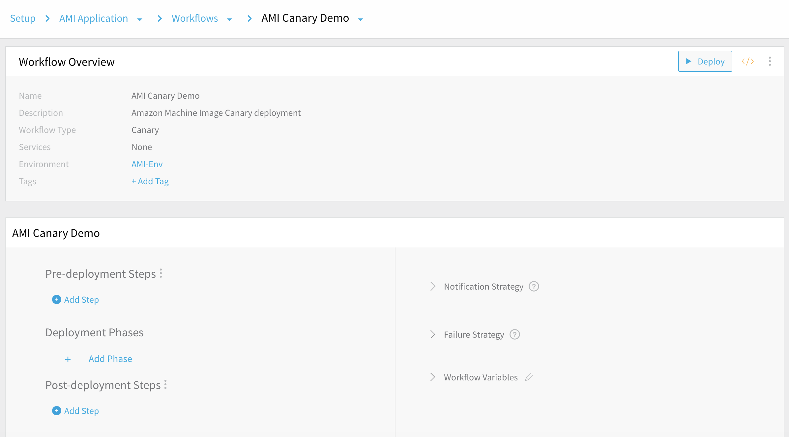


#### Default Structure

As you can see, a Harness AMI Canary Workflow's default structure is very simple:


|  |  |
| --- | --- |
|  | An empty placeholder for Deployment Phases is surrounded by two empty placeholders, for Pre- and Post-deployment Steps. |
|  | The Workflow also contains a default Notification Strategy and Failure Strategy.You can edit each of these Strategies, and add further Strategies. |


#### Example Structure

In this guide's remaining sections, we will expand only the Workflow's **Deployment Phases**—adding multiple phases, each deploying a portion of the instance count specified in the first phase. We will demonstrate how to build the following structure:

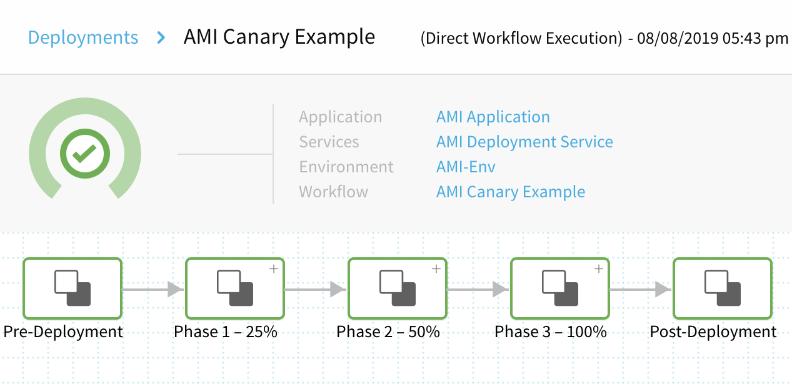

Here are the phases and steps we'll build:

1. [Phase 1: Canary](#phase_1)
   * [Set Up AutoScaling Group](#setup_asg): Specify how many EC2 instances to launch in the ASG that Harness deploys at the end of the Workflow. This step also specifies their resizing order and their steady state timeout.
   * [Deploy Service](#upgrade_asg_1): Specify the percentage of instances to deploy in this phase. When you add additional phases, each phase automatically includes a Deploy Service step, which you must configure with the count or percentage of instances you want deployed in that phase.
   * [Verify Service](#verify_service_1): This example uses CloudWatch verification. (You can add any [Verification Provider](https://docs.harness.io/article/myw4h9u05l-verification-providers-list) that Harness supports.)
   * [Rollback Steps](#rollback_1): Roll back the ASG if deployment fails. (Rollback steps are automatically added here, and to each of the remaining phases. This guide covers them only in this first phase.)
2. [Phase 2: Canary](#phase_2)
   * [Deploy Service](#upgrade_asg_2): Upgrade the ASG to a higher percentage of instances.
   * [Verify Service](#verify_service_2): This example uses a second round of CloudWatch tests.
3. [Phase 3: Primary](#phase_3)
   * [Deploy Service](#upgrade_asg_3): Upgrade the ASG to its full target capacity.

Ready to deploy? Let's examine the configuration and execution of each of the Workflow's three phases.


### Phase 1: Canary

This example Workflow's first phase defines your Auto Scaling Group, upgrades it to a 25% Canary deployment, and evaluates this partial deployment using (in this example) [CloudWatch](https://docs.harness.io/article/q6ti811nck-cloud-watch-verification-overview) verification.

To add a Canary Phase:
 
1. In **Deployment Phases**, click **Add Phase**. The **Workflow Phase** dialog appears.
   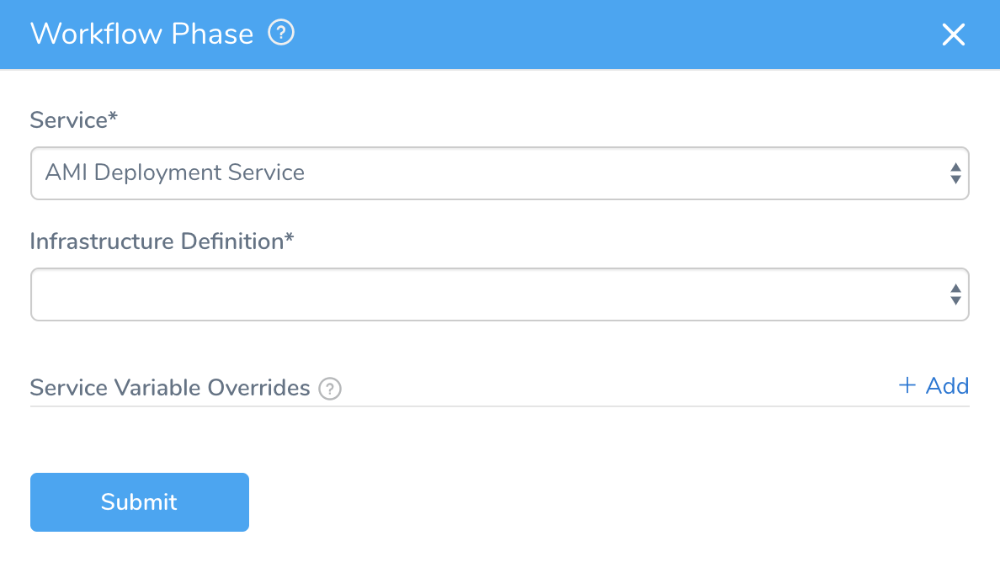
2. In **Service**, select the Service you previously [set up](ami-deployment.md#service) for this AMI.
3. Select the Infrastructure Definition that specifies your base Auto Scaling Group
4. In **Service Variable Overrides**, you can add values to overwrite any variables in the Service you selected. Click **Add**, then enter the **Name** of the variable to override, and the override **Value**. (For details, see [Workflow Phases](https://docs.harness.io/article/m220i1tnia-workflow-configuration#workflow_phases).)
5. Click **SUBMIT**. The new Phase is created.

   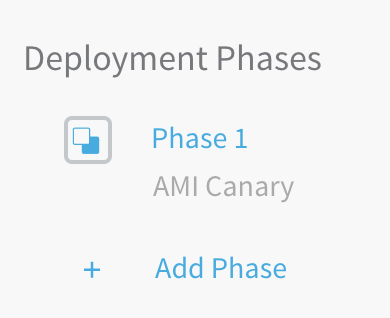
	 
6. Click **Phase 1** to define this Phase's Steps.  
  
On the resulting page, we'll fill in the predefined structure for Steps 1 and 2, and add a Verification provider in Step 3.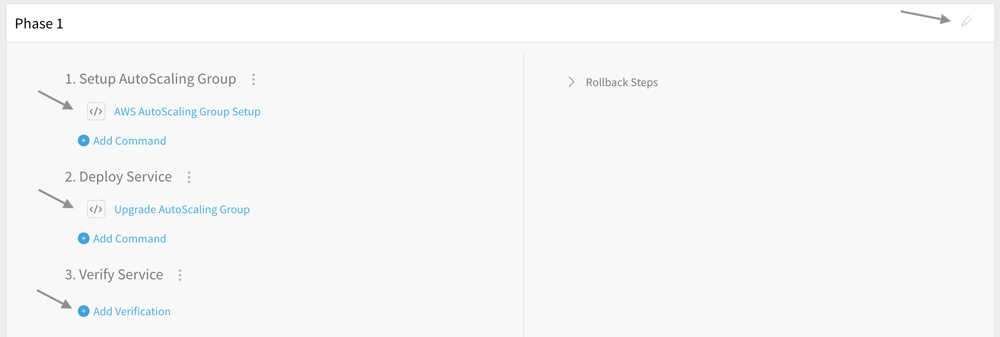

You can give each Phase a descriptive name by clicking the pencil icon at the top right.


#### Step 1: Setup AutoScaling Group

In Step 1, select **AWS AutoScaling Group Setup** to open a dialog where you define major settings of the Auto Scaling Groups (ASGs) that Harness will create to deploy your AMI instances:


The **Instances** settings support [Harness variable expressions](https://docs.harness.io/article/9dvxcegm90-variables), such as [Workflow variable expressions](https://docs.harness.io/article/766iheu1bk-add-workflow-variables-new-template).For details about this dialog's fields, see the corresponding [AMI Basic Workflow instructions](ami-deployment.md#basic-setup-asg). For this Workflow, we've selected **Fixed Instances**, and have set **Max Instances** to **10** and **Desired Instances** to **4**.

All Canary counts or percentages specified later in the Workflow are based on the **Desired Instances** setting. So, when we later deploy **25%** in this phase's [Upgrade Autoscaling Group](#upgrade_asg_1) step, that will be 25% of this **Desired Instances** setting.
##### Setup AutoScaling Group in Deployment

Let's look at an example of deploying the AWS AutoScaling Group Setup we configured above. Here's the step in the Harness Deployments page:

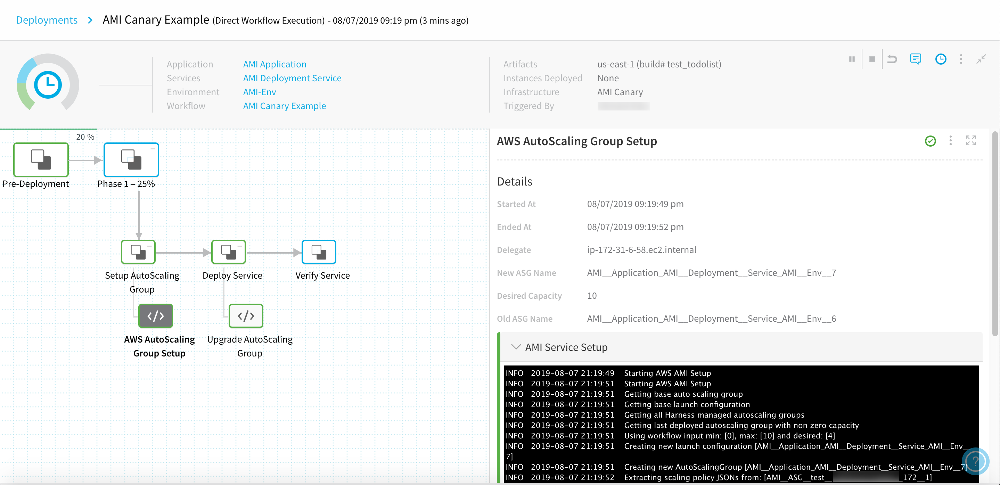

Here's partial output, showing a successful setup:


```
Starting AWS AMI Setup  
Getting base auto scaling group  
Getting base launch configuration  
Getting all Harness managed autoscaling groups  
Getting last deployed autoscaling group with non zero capacity  
Using workflow input min: [0], max: [10] and desired: [4]  
Creating new launch configuration [AMI__Application_AMI__Deployment__Service_AMI__Env__7]  
Creating new AutoScalingGroup [AMI__Application_AMI__Deployment__Service_AMI__Env__7]  
Extracting scaling policy JSONs from: [AMI__ASG__test__XXXXXXXXXXXXX__172__1]  
No policies found  
Extracting scaling policy JSONs from: [AMI__Application_AMI__Deployment__Service_AMI__Env__6]  
No policies found  
...  
Sending request to delete old auto scaling groups to executor  
Completed AWS AMI Setup with new autoScalingGroupName [AMI__Application_AMI__Deployment__Service_AMI__Env__7]
```
The new ASG is set up, but no instances are deployed yet. Instances will be deployed in this phase's [following](#upgrade_asg_1) **Upgrade AutoScaling Group** step, and in future phases' similar steps.

If your base Auto Scaling Group is configured in AWS with [scaling policies](https://docs.aws.amazon.com/autoscaling/ec2/userguide/as-scale-based-on-demand.html#as-scaling-types), Harness will apply those policies in your Workflow's *final* **Upgrade AutoScaling Group** step.
#### Step 2: Deploy Service

In Step 2, select **Upgrade AutoScaling Group** to open a dialog where you can define how many (by **Count** or **Percent**) of the ASG's instances to deploy:

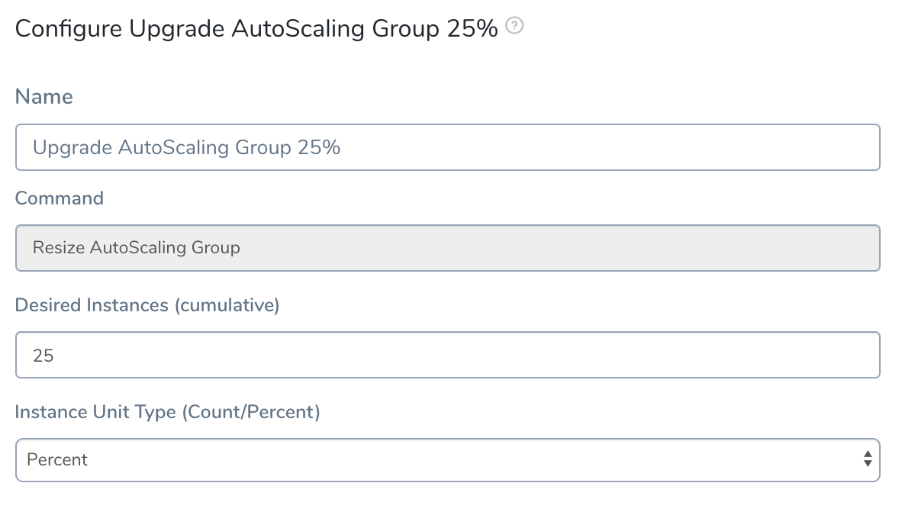

In this example, we've selected **Percent** units, and **25** percent of the **Desired Instances** we set in the [previous step](#setup_asg)'s **AWS AutoScaling Group Setup**.

For general information on customizing this dialog's settings, and on how they correspond to AWS parameters, see the corresponding [AMI Basic Workflow section](ami-deployment.md#upgrade-asg).
##### Deploy Service Step in Deployment

Using the **Upgrade AutoScaling Group** configuration shown above, here is the **Deploy Service** step in the Harness Deployments page:

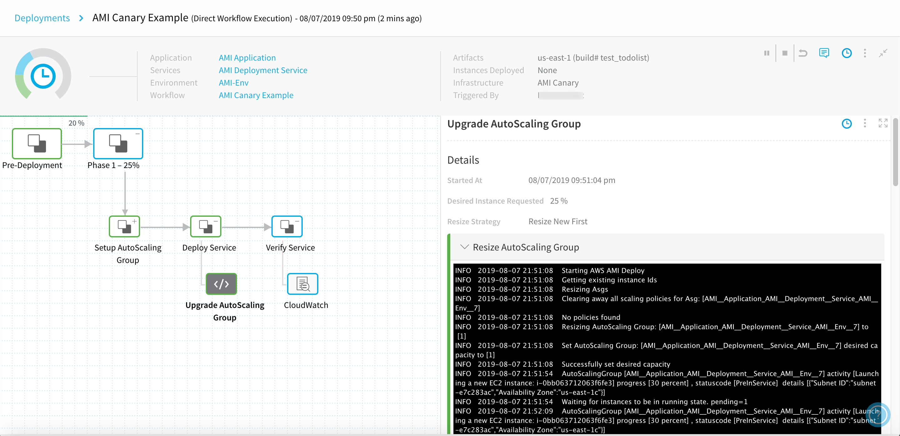

Here is partial output, showing the new Auto Scaling Group successfully resized and at steady state. We requested **25 Percent** of **4 Desired Instances**, and indeed, the log shows that AWS has set the `desired capacity to [1]`:


```
Starting AWS AMI Deploy  
Getting existing instance Ids  
Resizing Asgs  
Clearing away all scaling policies for Asg: [AMI__Application_AMI__Deployment__Service_AMI__Env__7]  
No policies found  
Resizing AutoScaling Group: [AMI__Application_AMI__Deployment__Service_AMI__Env__7] to [1]  
Set AutoScaling Group: [AMI__Application_AMI__Deployment__Service_AMI__Env__7] desired capacity to [1]  
Successfully set desired capacity  
AutoScalingGroup [AMI__Application_AMI__Deployment__Service_AMI__Env__7] activity [Launching a new EC2 instance: i-0bb063712063f6fe3] progress [30 percent] , statuscode [PreInService]  details [{"Subnet ID":"subnet-e7c283ac","Availability Zone":"us-east-1c"}]  
Waiting for instances to be in running state. pending=1  
...  
AutoScaling group reached steady state  
...  
AutoScaling Group resize operation completed with status:[SUCCESS]
```
Any **percent** references that appear in such AWS log data refer *only* to percentages of pending AWS tasks. They're unrelated to the Canary percentage targets we've set in any Harness **Upgrade AutoScaling Group** steps.
#### Step 3: Verify Service

In Step 3, select **Add Verification** to open a dialog where you can add Harness [Continuous Verification](https://docs.harness.io/article/myw4h9u05l-verification-providers-list) monitoring for your Canary phase.

In this example, we've selected [CloudWatch](https://docs.harness.io/article/q6ti811nck-cloud-watch-verification-overview) verification, with monitoring for a single EC2 metric:

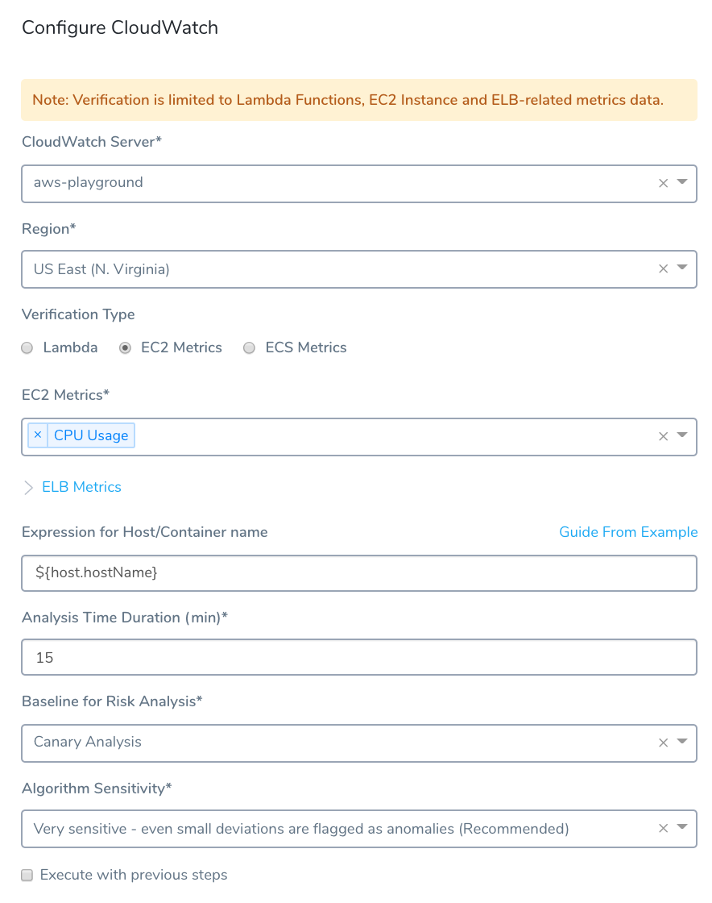

Within a Canary Workflow, Canary phases are the ideal places to add verification steps, using the [Canary Analysis strategy](https://docs.harness.io/article/0avzb5255b-cv-strategies-and-best-practices#canary_analysis). It's pointless to defer verification until the Primary (final) phase—because if the Canary phases are verified, you can assume that the Primary phase will proceed successfully.
##### Verify Service Step in Deployment

Using the configuration shown above, here is the **Verify Service** step in the Harness Deployments page:

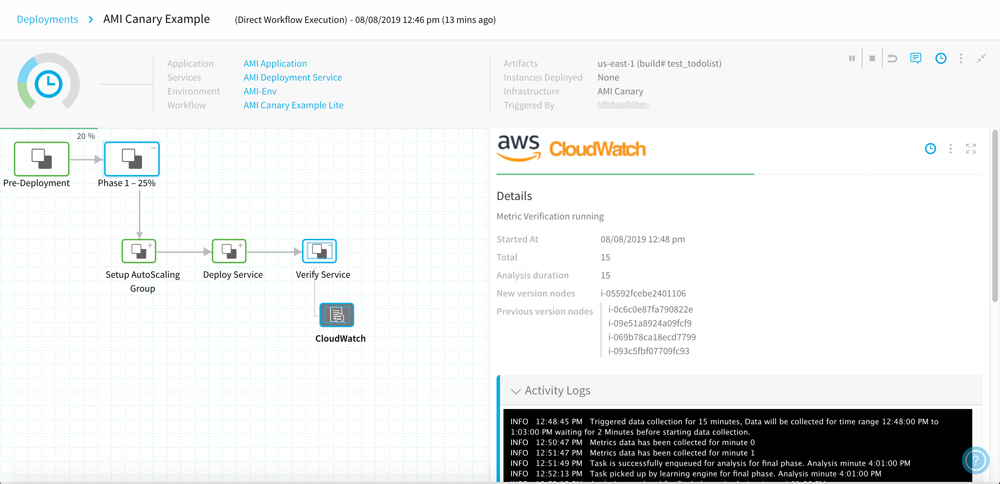
The **Details** panel shows the selected verification provider's analysis, with logging over the **Analysis Time (duration)** we specified:


```
Triggered data collection for 15 minutes, Data will be collected for time range 5:46:00 PM to 6:01:00 PM waiting for 2 Minutes before starting data collection.  
Metrics data has been collected for minute 0  
Metrics data has been collected for minute 1  
Task is successfully enqueued for analysis for final phase. Analysis minute 4:01:00 PM  
Metrics data has been collected for minute 2  
Task picked up by learning engine for final phase. Analysis minute 4:01:00 PM  
Analysis completed for final phase. Analysis minute 4:01:00 PM  
...
```

#### Rollback Steps

By default, each AMI Canary phase includes a **Rollback Steps** section, containing a **Rollback AutoScaling Group** step.

For details about this step's **Rollback all phases at once** option, see the corresponding [AMI Basic Deployment](ami-deployment.md#rollback-steps) section:

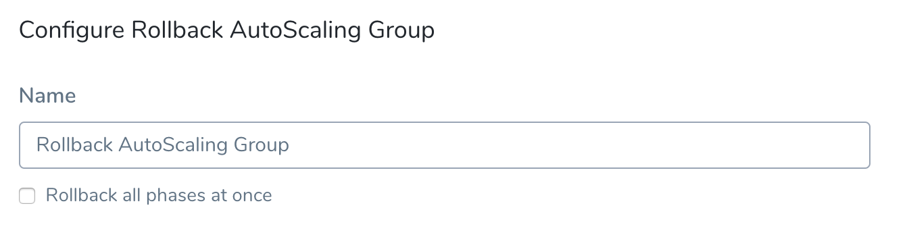

The Rollback step's default presence here is unlike the default for other Harness Canary Workflows, such as [Kubernetes Canary](https://docs.harness.io/article/wkvsglxmzy-kubernetes-canary-workflows). If an AMI Canary phase fails to deploy, its Rollback step will roll back the whole Workflow to its state prior to this deployment. This will delete its newly created instances, conserving AWS resources and costs.

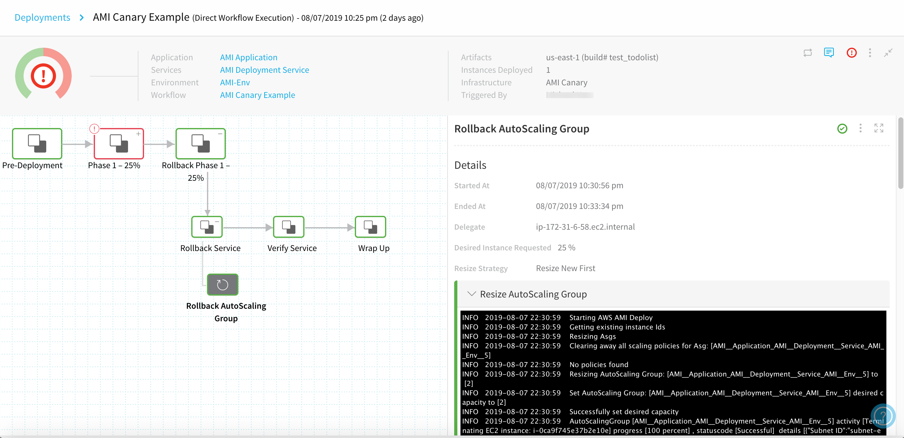

Here is partial output, showing the shutdown and deletion of this failed phase's ASG:


```
Asg: [AMI__Application_AMI__Deployment__Service_AMI__Env__8] being deleted after shutting down to 0 instances  
  
AutoScalingGroup [AMI__Application_AMI__Deployment__Service_AMI__Env__8] activity [Terminating EC2 instance: i-0cf3ecb7b561eafb4] progress [100 percent] , statuscode [Successful]  details [{"Subnet ID":"subnet-e962248d","Availability Zone":"us-east-1a"}]  
...  
AutoScaling Group resize operation completed with status:[SUCCESS]
```
#### Rollbacks and Downsizing Old ASGs

For details on how previous ASGs are downsized and what happens during rollback, see [How Does Harness Downsize Old ASGs?](../../concepts-cd/deployment-types/aws-ami-deployments-overview.md#how-does-harness-downsize-old-as-gs)


### Phase 2: Canary

In this example Workflow, we'll add a second Canary phase. Here, we'll define a second **Upgrade AutoScaling Group** step, and add a second **Verify Service** step. To add the second phase:

1. In **Deployment Phases**, again click **Add Phase**.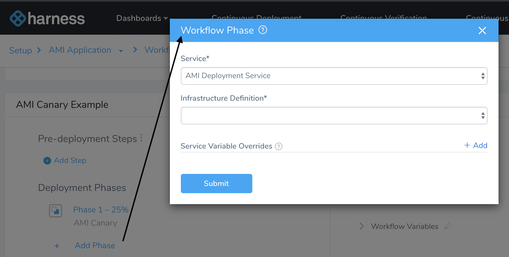
2. In the resulting **Workflow Phase** dialog, select the same **Service**, **Infrastructure Definition**, and any **Service Variable Overrides** that you selected in [Phase 1](#phase_1).
3. Click **Submit** to create the new Phase.


#### Step 1: Deploy Service

Since we already [set up the ASG](#setup_asg) in Phase 1, this new phase's Step 1 defaults directly to **Upgrade AutoScaling Group**.

Click the **Upgrade AutoScaling Group** link to open this dialog, where we're again using **Percent** scaling, but doubling the percentage to **50****Percent** of the ASG's **Desired Instances** before clicking **SUBMIT**:

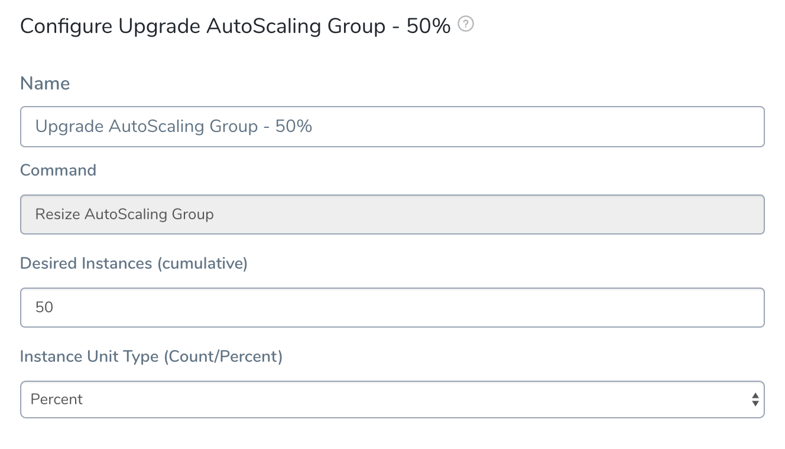

To review: This means we're requesting 50 percent of the **4** Desired Instances that we specified in Phase 1's [Setup AutoScaling Group](#setup_asg) step.


##### Deploy Service Step in Deployment

Using the **Upgrade AutoScaling Group** configuration shown above, here is the **Deploy Service** step in the Harness Deployments page:

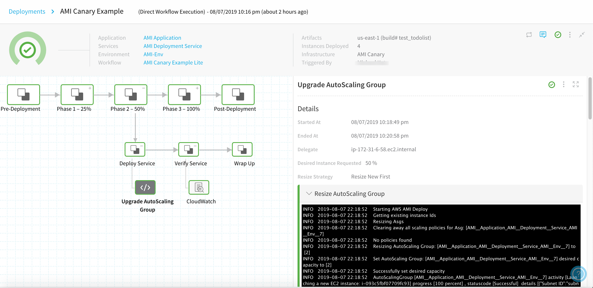

Here is partial output, showing the Auto Scaling Group successfully resized and at steady state. The upgrade of the `desired capacity to [2]` corresponds to our request for **50 Percent** of **4 Desired Instances**:


```
Starting AWS AMI Deploy  
Getting existing instance Ids  
Resizing Asgs  
Clearing away all scaling policies for Asg: [AMI__Application_AMI__Deployment__Service_AMI__Env__7]  
No policies found  
Resizing AutoScaling Group: [AMI__Application_AMI__Deployment__Service_AMI__Env__7] to [2]  
Set AutoScaling Group: [AMI__Application_AMI__Deployment__Service_AMI__Env__7] desired capacity to [2]  
Successfully set desired capacity  
AutoScalingGroup [AMI__Application_AMI__Deployment__Service_AMI__Env__7] activity [Launching a new EC2 instance: i-093c5fbf07709fc93] progress [100 percent] , statuscode [Successful]  details [{"Subnet ID":"subnet-e962248d","Availability Zone":"us-east-1a"}]  
AutoScalingGroup [AMI__Application_AMI__Deployment__Service_AMI__Env__7] activity [Launching a new EC2 instance: i-0c6c0e87fa790822e] progress [30 percent] , statuscode [PreInService]  details [{"Subnet ID":"subnet-5c0fe853","Availability Zone":"us-east-1f"}]  
Waiting for instances to be in running state. running=1,pending=1  
...  
AutoScaling group reached steady state  
...  
AutoScaling Group resize operation completed with status:[SUCCESS]
```

#### Step 2: Verify Service

In this example Workflow, we've defined Phase 2's **Verify Service** step identically to [Phase 1's Step 3](#verify_service_1). (See specific instructions there.) This specifies a second round of CloudWatch monitoring.

In Workflows that you build, you could select other Harness [Continuous Verification](https://docs.harness.io/article/myw4h9u05l-verification-providers-list) providers for monitoring, or you could choose to omit verification in this Canary phase.


##### Verify Service Step in Deployment

Using the configuration shown above, here is the **Verify Service** step in the Harness Deployments page:

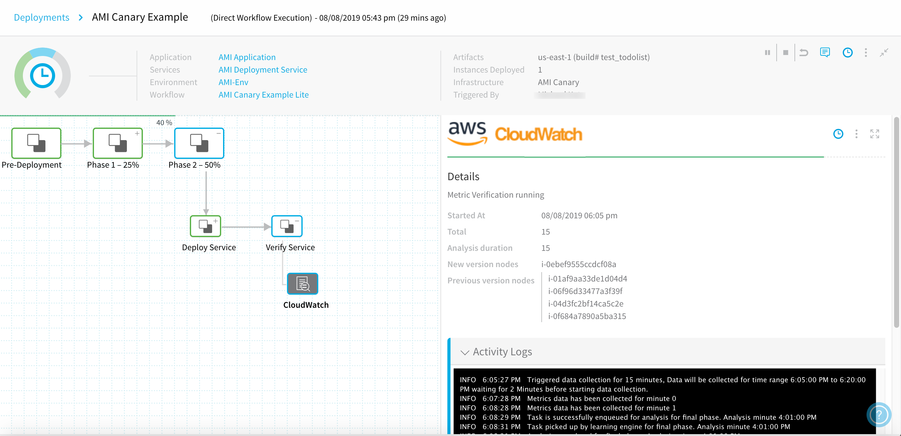

If the 50% deployment is as healthy as the 25% deployment, the **Details** panel's output should resemble the display in [Phase 1's Verification step](#verify_step_1_log).


### Phase 3: Primary

If prior Canary phases succeed, the Workflow's final phase runs the actual deployment—creating an Auto Scaling Group with the full number of instances you specified in the [AWS AutoScaling Group Setup](#setup_asg) step.

To add this final phase:

1. In **Deployment Phases**, below your two existing Phases, again click **Add Phase**.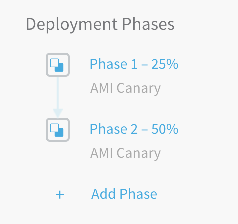
2. In the resulting **Workflow Phase** dialog, select the same **Service**, **Infrastructure Definition**, and any **Service Variable Overrides** that you selected in [Phase 1](#phase_1).
3. Click **SUBMIT** to create the new Phase.  
  
The resulting **Phase 3** page provides structure only for an **Upgrade AutoScaling Group** step, and that's the only step we'll define.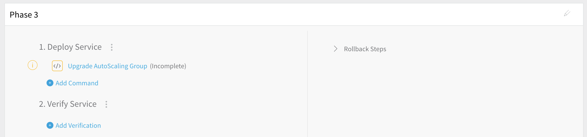


#### Step 1: Deploy Service

To define this phase's scaling:

1. In Step 1, select **Upgrade AutoScaling Group**.
2. In the resulting dialog, again select **Percent** scaling, and set the **Desired Instances** to **100** percent of the ASG's Desired Instances**:**
3. Click **SUBMIT** to complete this Workflow's three-phase configuration.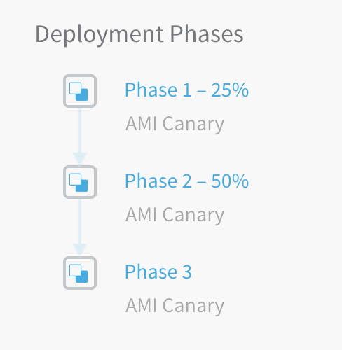


##### Deploy Service Step in Deployment

Using the **Upgrade AutoScaling Group** configuration shown above, here is this final **Deploy Service** step in the Harness Deployments page:

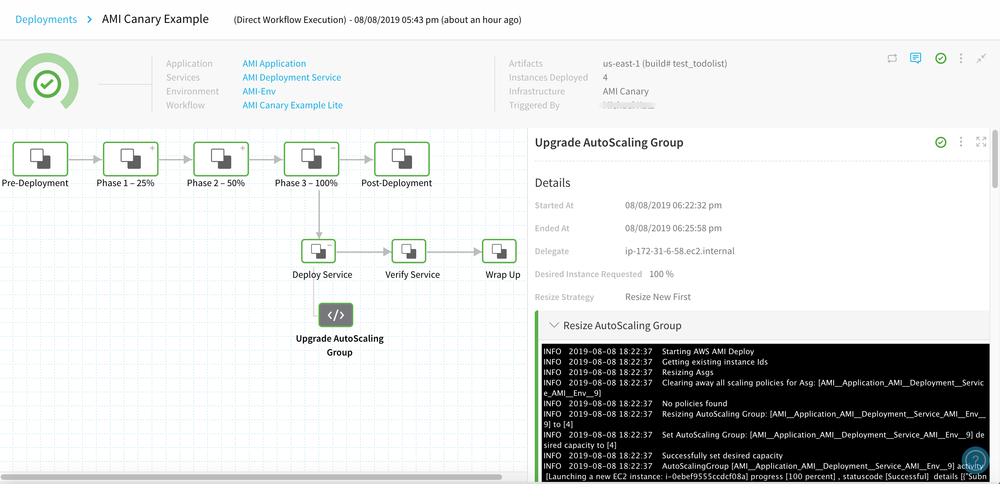

Here is partial output, showing the Auto Scaling Group fully increasing its `desired capacity to [4]`. Note that AWS retains the two instances that it created in prior phases:


```
Resizing AutoScaling Group: [AMI__Application_AMI__Deployment__Service_AMI__Env__7] to [4]  
Set AutoScaling Group: [AMI__Application_AMI__Deployment__Service_AMI__Env__7] desired capacity to [4]  
Successfully set desired capacity  
AutoScalingGroup [AMI__Application_AMI__Deployment__Service_AMI__Env__7] activity [Launching a new EC2 instance: i-0c6c0e87fa790822e] progress [100 percent] , statuscode [Successful]  details [{"Subnet ID":"subnet-5c0fe853","Availability Zone":"us-east-1f"}]  
AutoScalingGroup [AMI__Application_AMI__Deployment__Service_AMI__Env__7] activity [Launching a new EC2 instance: i-093c5fbf07709fc93] progress [100 percent] , statuscode [Successful]  details [{"Subnet ID":"subnet-e962248d","Availability Zone":"us-east-1a"}]  

```
Remember that each `percent` entry in these logs indicates AWS' percentage completion of its pending tasks—not to the scaling percentages that we've specified per Phase.Next, AWS adds two more instances, and scales them up, eventually reaching steady state:


```
AutoScalingGroup [AMI__Application_AMI__Deployment__Service_AMI__Env__7] activity [Launching a new EC2 instance: i-069b78ca18ecd7799] progress [30 percent] , statuscode [PreInService]  details [{"Subnet ID":"subnet-09229d54","Availability Zone":"us-east-1d"}]  
AutoScalingGroup [AMI__Application_AMI__Deployment__Service_AMI__Env__7] activity [Launching a new EC2 instance: i-09e51a8924a09fcf9] progress [30 percent] , statuscode [PreInService]  details [{"Subnet ID":"subnet-ed0a96d2","Availability Zone":"us-east-1e"}]  
Waiting for instances to be in running state. running=2,pending=2  
AutoScalingGroup [AMI__Application_AMI__Deployment__Service_AMI__Env__7] activity [Launching a new EC2 instance: i-069b78ca18ecd7799] progress [30 percent] , statuscode [PreInService]  details [{"Subnet ID":"subnet-09229d54","Availability Zone":"us-east-1d"}]  
AutoScalingGroup [AMI__Application_AMI__Deployment__Service_AMI__Env__7] activity [Launching a new EC2 instance: i-09e51a8924a09fcf9] progress [30 percent] , statuscode [PreInService]  details [{"Subnet ID":"subnet-ed0a96d2","Availability Zone":"us-east-1e"}]  
AutoScaling group reached steady state  
...  
AutoScaling Group resize operation completed with status:[SUCCESS]
```
And here...our AMI is fully deployed.


### Deploy the Workflow

As with the [AMI Basic deployment](ami-deployment.md#deployment-basic), once your setup is complete, you can click the Workflow's **Deploy** button to start the Canary deployment.


In the resulting **Start New Deployment** dialog, select the AMI to deploy, and click **SUBMIT**.

The Workflow deploys. The Deployments page displays details about the deployed instances.


To verify the completed deployment, log into your AWS Console and locate the newly deployed instance(s).

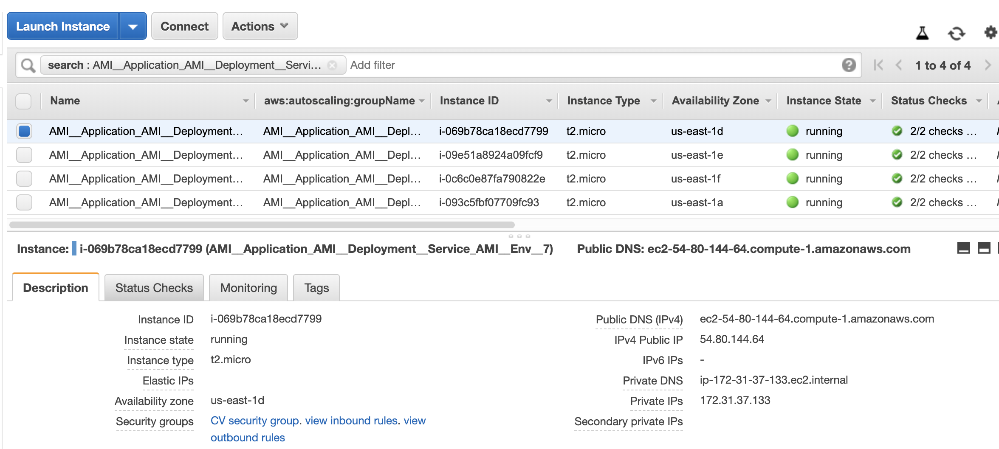

### Support for Scheduled Scaling

Currently, this feature is behind the Feature Flag `AMI_ASG_CONFIG_COPY`.The Base ASG you provide to Harness for creating the new ASG can use [AWS Scheduled Scaling](https://docs.aws.amazon.com/autoscaling/ec2/userguide/schedule_time.html) (scheduled scaling with scheduled actions).

There are a few important considerations:

* When configuring the base ASG, the `ScheduledActions` process must be suspended so that it won’t scale the base ASG. Once Harness creates the new ASG from the base, Harness will enable the `ScheduledActions` process in the new ASG (if the base ASG had it). See [Suspending and resuming a process for an Auto Scaling group](https://docs.aws.amazon.com/autoscaling/ec2/userguide/as-suspend-resume-processes.html) from AWS.
* Harness currently supports only the UTC timezone format in scheduled actions. Time values in scheduled actions in the base ASG need to be configured in UTC.

