This guide explains how to use existing Amazon Machine Images (AMIs) and AWS Auto Scaling Groups (ASGs) to deploy new ASGs and instances to Amazon Elastic Compute Cloud (EC2) via Harness.


### Deployment Overview

For a general overview of how Harness works, see [Harness Key Concepts](https://docs.harness.io/article/4o7oqwih6h-harness-key-concepts).

This guide will cover the following major steps:

1. Install and run a Harness (Shell Script or ECS) Delegate.
2. Add an AWS Cloud Provider.
3. Create a Harness Application.
4. Create a Harness Service using the **Amazon Machine Image** artifact type.
5. Create an Environment and Infrastructure Definition.
6. Create a Harness Workflow for a basic deployment.
7. Deploy the Workflow.


### Before You Begin

For a Basic deployment, you'll need:

* A working AMI that Harness will use to create your instances.
* A working Auto Scaling Group (ASG), as a template for the Auto Scaling Group that Harness will create.
* An AWS Instance in which to install a Harness Delegate (covered in the next section).
* IAM Role for the Harness Cloud Provider connection to AWS. The required policy is **AmazonEC2FullAccess** and it is listed in [AWS EC2](https://docs.harness.io/article/whwnovprrb-infrastructure-providers#aws_ec2).

If the User Data you define in Harness or your launch configurations is going to perform actions that require permissions beyond those covered by **AmazonEC2FullAccess**, ensure that the IAM role assigned to the Harness Delegate(s) has the required roles and policies.We will walk you through setting up a Harness Delegate, connections to your AWS account (using the Harness AWS Cloud Provider), Harness Services, Infrastructure Definition, and Workflows.


### Limitations

* If your base Auto Scaling Group is configured in AWS with [scaling policies](https://docs.aws.amazon.com/autoscaling/ec2/userguide/as-scale-based-on-demand.html#as-scaling-types), Harness will apply those policies in your Workflow's *final* **Upgrade AutoScaling Group** step.
	+ Harness does not support copying ASG scaling policies with **Metric Type** value **Application Load Balancer request count per target**.
* Harness specifically supports AWS *target* tracking scaling policies. For details, see AWS' [Dynamic Scaling for Amazon EC2 Auto Scaling](https://docs.aws.amazon.com/autoscaling/ec2/userguide/as-scale-based-on-demand.html#as-scaling-types) topic.

### Install and Run the Harness Delegate

In your AWS instance, install and run either a Harness Shell Script Delegate (the simplest option) or a Harness ECS Delegate. For basic installation steps, see [Delegate Installation and Management](https://docs.harness.io/article/h9tkwmkrm7-delegate-installation#ecs_delegate). For simplicity, Harness further recommends:

* Run the Delegate in the same subnet as your Auto Scaling Group, using the same security group and the same key pair.
* Once the Delegate shows up in Harness Manager's **Delegates** page, assign it a [Selector](https://docs.harness.io/article/h9tkwmkrm7-delegate-installation#delegate_tags) (for example, **AMI-Delegate**). You will use this Delegate Selector when you set up the AWS Cloud Provider to assume the IAM role used by the Delegate.


### AWS Cloud Provider Setup

Add an AWS Cloud Provider as follows:

1. In Harness Manager, click **Setup**.
2. Click **Cloud Providers**. The **Cloud Providers** page appears.
3. Click **Add Cloud Provider**. The **Cloud Provider** dialog appears. (You will override some default entries shown below.)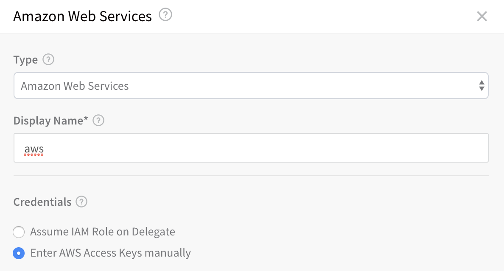
4. In **Type**, select **Amazon Web Services**.
5. In **Display Name**, enter a name for the Cloud Provider, such as **aws-ami-example**.
6. Enable the **Assume IAM Role on Delegate** option.
7. In **Delegate Selector**, enter the Selector that you gave your Delegate in Harness Manager's **Delegates** page.
8. Click **TEST** to ensure that your credentials work.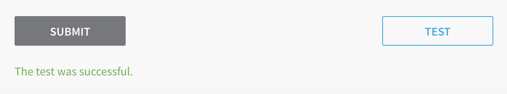
9. Click **SUBMIT**. The Cloud Provider is added, with a Selector matching your Delegate.


### Harness Application Setup

The following procedure creates a Harness Application for your AMI deployments.

An Application in Harness represents a logical group of one or more entities, including Services, Environments, Workflows, Pipelines, Triggers, and Infrastructure Provisioners. Applications organize all of the entities and configurations in Harness CI/CD. For more about Applications, see [Harness Key Concepts](https://docs.harness.io/article/4o7oqwih6h-harness-key-concepts).

To create a new Application:

1. In Harness Manager, click **Setup**.
2. In the **Applications** section, click **Add Application**. The **Application** dialog appears.
3. Give your Application a name, such as **AMI Application**.
4. Optionally, add a **Description** of this Application's purpose.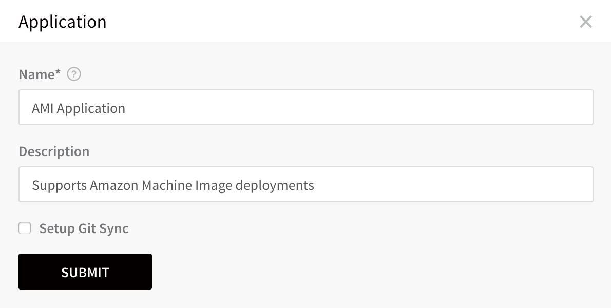
5. Click **SUBMIT**. The new Application is added to the **Applications** list.
6. Click your new Application's name. The Application's list of entities appears, initially empty.

In the following sections, we will define this Application's Service, Environment, and Infrastructure Definition. We'll then define and execute deployment Workflows.


### AMI Service Setup

Different types of Harness Services are available for different deployment platforms. The AMI type includes AMI-specific settings. To add an AMI Service:

1. In your new Application, click **Services**. The **Services** page appears.
2. In the **Services** page, click **Add Service**. The **Add** **Service** dialog appears—initially empty.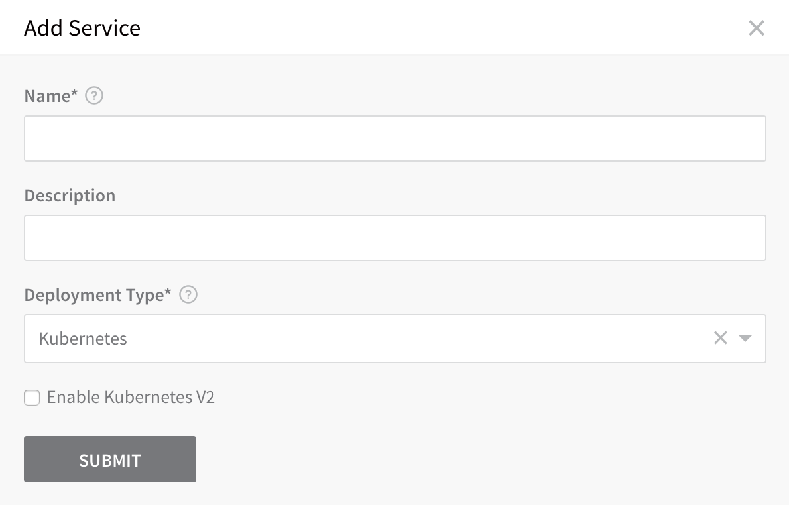
3. In **Name**, enter a name for your Service, such as **AMI Deployment Service**.
4. In **Description**, (optionally) enter a description for your service.
5. In **Deployment Type**, select **Amazon Machine Image**. Your dialog will now look something like this: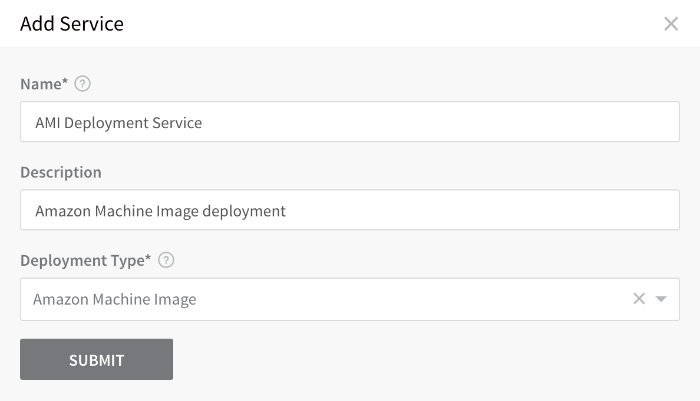
6. Click **SUBMIT**. The new Service is displayed.

Next, we will set up the Artifact Source, User Data, and Configuration options.


#### Add Artifact Sources

A Service's Artifact Source is the AMI you want to use to create instances. In this guide, we specify our Artifact Source for deployment by AWS Region and (optionally) Tags and AmiResource Filters. To add an Artifact Source to this Service:

1. From the **Service Overview** section, click **Add Artifact Source**, then click **Amazon AMI**.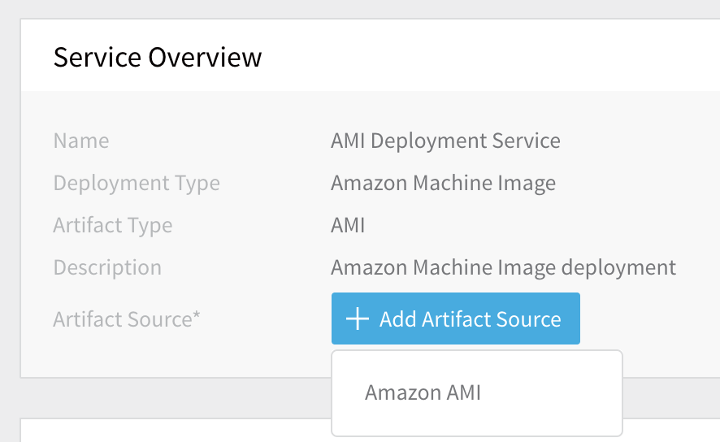

1. In the resulting Artifact Source dialog, select the **Cloud Provider** you set up earlier under [AWS Cloud Provider Setup](#cloud_provider).
2. Select the AWS **Region** where your AMI is located.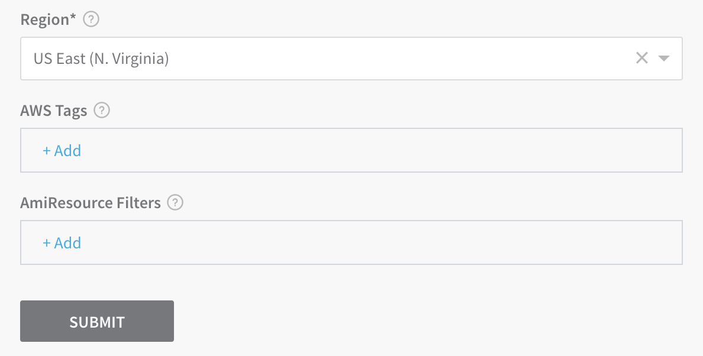
3. Add any **AWS Tags** that you are using to identify your AMI. (For details on these key/value pairs, see Amazon's [Tagging Your Amazon EC2 Resources](https://docs.aws.amazon.com/AWSEC2/latest/UserGuide/Using_Tags.html) topic.)
4. Optionally, in the **AmiResource Filters** field, add AMI filters to locate the AMI resource. These are key/value pairs that identify the AMI ID.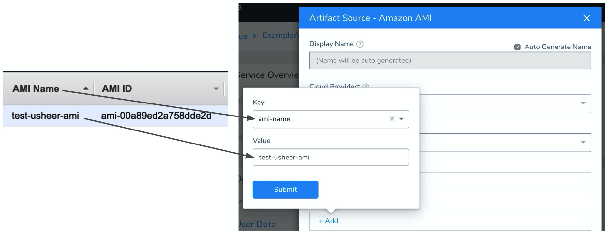
5. Click **SUBMIT** to add the Artifact Source.

You can see the results of your Artifact Source settings clicking **Artifact History**.

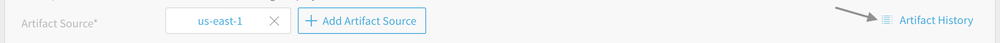
#### Deployment Specification (User Data)

In the Service's **Deployment Specification** section, you can select the **User Data** link to enter configuration scripts and directives that your AWS instance will run upon launch.

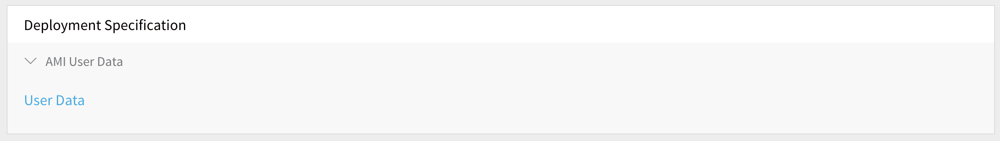

The resulting **User Data** container corresponds to the AWS Launch Instance wizard's **Advanced Details** > **User data** container.


##### What Can I Add in User Data?

You can enter the same shell scripts and cloud-init directives that AWS will accept through its own UI. For details about scripting requirements, formatting, and options, see Amazon's EC2 [User Data and Shell Scripts](https://docs.aws.amazon.com/AWSEC2/latest/UserGuide/user-data.html#user-data-shell-scripts) documentation. When Harness creates a new instance, it will apply your defined User Data.

##### Permissions for Your User Data

If your User Data is going to perform actions that require permissions beyond those covered by **AmazonEC2FullAccess**, ensure that the IAM role assigned to the Harness Delegate(s) has the required roles and policies.


#### Configuration Variables

**Config Variables** is supported for the AMI Service, but **Config Files** is not supported.In the Service's **Configuration** section, you can add Service-level variables and files. For details about the options here, see Harness' [Configuration Variables and Files](https://docs.harness.io/article/eb3kfl8uls-service-configuration#configuration_variables_and_files) topic.

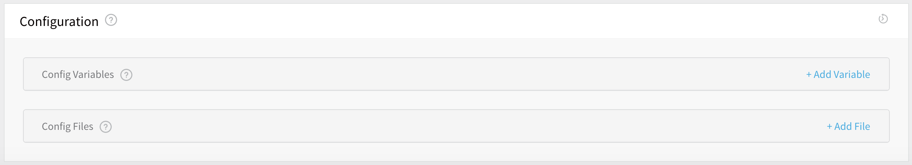

#### Referencing Config Variables in User Data

You can define variables in the Service's **Config Variables** section and reference them in [User Data](#user_data) scripts. Type the prefix: `${serviceVariable.` to prompt Harness to automatically display existing variables. Here is an example:

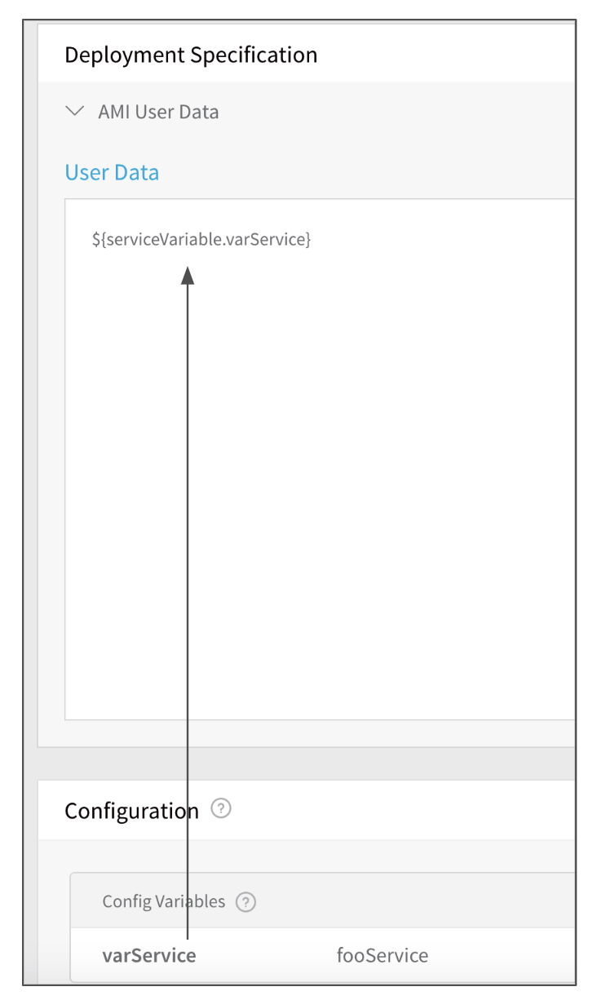
### Environment and Infrastructure Definition

Once you've defined your Application's Service, you define Environments where your Service can be deployed. In an Environment's Infrastructure Definition settings, you specify:

* A Harness Service—for AMI, a Service with an AMI artifact you configured.
* A deployment type, such as Basic or Blue/Green.
* An AWS Cloud Provider, such as the **aws-ami-example** provider that you added in [AWS Cloud Provider Setup](#cloud_provider).

An Environment represents one of your deployment infrastructures—such as Dev, QA, or Production. You can deploy one or many Services to each Environment.


#### Create a New Harness Environment

The following procedure creates an Environment for the AMI Service you've configured.

1. In your Harness Application, click **Environments**. The **Environments** page appears.
2. Click **Add Environment**. The **Environment** dialog appears.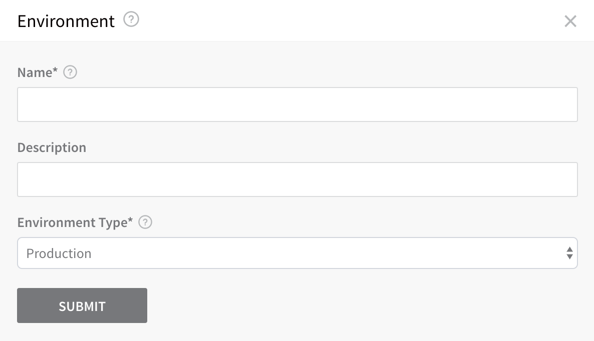
3. In **Name**, enter a name that describes the deployment Environment—for example, **AMI-Env**.
4. Optionally, enter a **Description**.
5. In **Environment Type**, select **Non-Production**.
6. Click **SUBMIT**. In the resulting Environment Details page, you'll define your new Environment's contents.


#### Add an Infrastructure Definition

An [Infrastructure Definition](https://docs.harness.io/article/n39w05njjv-environment-configuration#add_an_infrastructure_definition) specifies a target infrastructure for deployments. When you create a Harness Workflow, you will pick the Infrastructure Definition you want to use as the target deployment environment.

For AMI deployments, you build your Infrastructure Definition using an AWS Auto Scaling Group. To add the Infrastructure Definition:

1. In your Environment's **Infrastructure Definition** section, click **Add Infrastructure Definition**. The **Infrastructure Definition** dialog appears.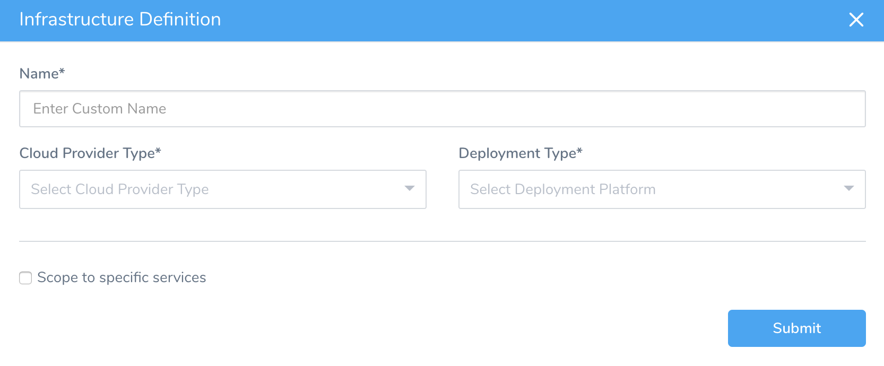
2. In **Name**, enter the name that will identify this Infrastructure Definition when you [add it to a Workflow](#basic_workflow_and_deployment).
3. In **Cloud Provider Type**, select **Amazon Web Services**.
4. In **Deployment Type**, select **Amazon Machine Image**. This expands the **Infrastructure Definition** dialog to look something like this: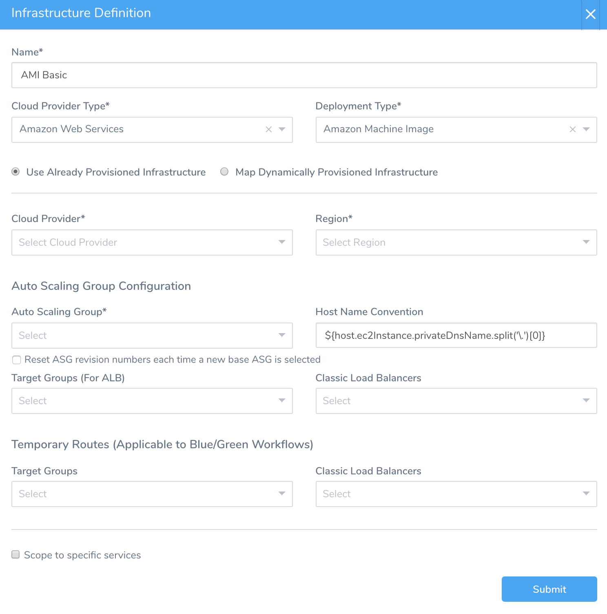
5. For this example, accept the default **Use Already Provisioned Infrastructure** option.
:::note 
(If you have configured an [Infrastructure Provisioner](https://docs.harness.io/article/o22jx8amxb-add-an-infra-provisioner) in Harness, you can use that configuration by instead selecting the **Map** **Dynamically Provisioned Infrastructure** option. For details, see our AMI [CloudFormation](ami-blue-green.md#infrastructure-provisioners) and [Terraform](../../terraform-category/terrform-provisioner.md#ami-and-auto-scaling-group-2) examples.)
:::
6. In **Cloud Provider**, select the Cloud Provider you added earlier in [AWS Cloud Provider Setup](#cloud_provider).
7. Select the **Region** where your Auto Scaling Group (ASG) is located.
:::note
After you select your **Cloud Provider** and **Region**, the dialog's remaining drop-down lists take a few seconds to populate.
:::
8. In the **Auto Scaling Groups** drop-down, select an existing ASG in your EC2 setup that Harness will clone as it creates a new ASG to use for the deployment.  
We typically call the ASG you select the *base ASG*. It is not used in the deployment. It is simply cloned in order for Harness to create a new ASG. Harness will use the existing ASG as a template, but it will not resize it all.  
The newly created ASG will have unique name, Min and Max instances, and Desired Capacity.
9. **Reset ASG revision numbers each time a new base ASG is selected:** If you want to create a new ASG numbering series when you select a new base ASG in **Auto Scaling Groups**, select **Reset ASG revision numbers each time a new base ASG is selected**. For details on this option, see [Reset ASG Revision Numbers](#reset_asg_rev).
10. If you want to use Application Load Balancers, use **Target Groups (for ALB)** to select one or more [Target Groups](https://docs.aws.amazon.com/elasticloadbalancing/latest/application/load-balancer-target-groups.html) that will route requests to the ASG you will deploy.
11. If you want to use Classic Load Balancers, use **Classic Load Balancers** to select one or more [Classic Load Balancers](https://docs.aws.amazon.com/autoscaling/ec2/userguide/attach-load-balancer-asg.html) for the ASG you will deploy.
12. Enable **Scope to Specific Services**, and use the adjacent drop-down to select the Harness Service you created in [AMI Service Setup](#service).  
  
   (This scoping will make this Infrastructure Definition available whenever a Workflow, or Phase, is set up for this Service. You can also select additional Services in this field—and you can do that later, by editing the Infrastructure Definition to match newly added Services.)  
  
   When you are done, the dialog's **Configuration** section will look something like this:
	 
	 

13. Click **Submit**. The new Infrastructure Definition is added to your Harness Environment.

:::note 
Harness will register the ASGs it creates with whatever Target Groups and Classic Load Balancers you enter. If you delete the ASG that you've specified here, Workflows using this Infrastructure Definition will fail to deploy.
:::

This is the last required step to set up the deployment Environment in Harness. With both the Service and Environment set up, you can now proceed to [creating a deployment Workflow](#basic_deploy).

:::note 
Harness specifically supports AWS *target* tracking scaling policies. For details, see AWS' [Dynamic Scaling for Amazon EC2 Auto Scaling](https://docs.aws.amazon.com/autoscaling/ec2/userguide/as-scale-based-on-demand.html#as-scaling-types) topic.
:::

#### Reset ASG Revision Numbers

Harness enables you to use ASGs to uniquely identify and track independent releases. Each ASG might represent: 

* A separate brand.
* A separate franchisee.
* A separate level of your SaaS product offering, each with its own configuration, permissions, and pricing.

You achieve this independence without having to create duplicate Services or Infrastructure Definitions, by instead selecting different base ASGs when a Workflow is executed.

For example, let's say you have a Freemium and Pro version of a microservice, and you want each deployed using a separate base ASG, because each base ASG manages resources in a way targeted to each microservice.

To support this scenario, you have a single Harness Service for the microservice, a single Infrastructure Definition, and two Workflows, one for Freemium and one for Pro.

When the Freemium Workflow deploys, you want it to select the base ASG that manages resources for the Freemium microservice. Likewise for the Pro Workflow.

To accomplish this, each Workflow uses an Infrastructure Provisioner to supply the right base ASG name to the Infrastructure Definition:

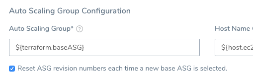

For Infrastructure Provisioner details, see our AMI [CloudFormation](ami-blue-green.md#infrastructure-provisioners) and [Terraform](../../terraform-category/terrform-provisioner.md#ami-and-auto-scaling-group-2) examples.Since you are using the same Infrastructure Definition with multiple base ASGs, you will likely want to reset the revision numbers applied to the new ASGs that are created each time a new base ASG is used. Otherwise, the revision numbers will be applied to all new ASGs, in sequence.

You direct Harness to start a new ASG numbering series each time you select a new base ASG by enabling **Reset ASG revision numbers each time a new base ASG is selected**.

Deploying the new ASG with a new numbering series prevents existing, unrelated ASGs from being downscaled. Within Harness, each combination of a Service with a new base ASG creates a new [Service Infrastructure Mapping](https://docs.harness.io/article/v3l3wqovbe-infrastructure-definitions#service_infrastructure_mapping).

If you select the **Map Dynamically Provisioned Infrastructure** option along with the **Reset ASG revision numbers...** option, Harness will automatically create a new numbering series based on the new value for the base ASG that your [Infrastructure Provisioner](ami-blue-green.md#infrastructure-provisioners) outputs in a variable expression. This is the most common option.

Once you **Submit** an Infrastructure Definition, the check box is locked. You will not be able to enable or disable this option later within the same Infrastructure Definition.In addition, the new ASGs you create from different base ASGs should have unique names. You can achieve this by using the Infrastructure Provisioner output expression in the **AWS Auto Scaling Group Setup** Workflow step:

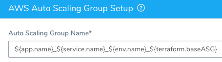

If you select the **Use Already Provisioned Infrastructure** option along with the **Reset ASG revision numbers...** option, Harness will start a new ASG numbering series each time you manually select a new base ASG in the **Auto Scaling Group** drop-down.


#### Launch Configuration and Launch Template Support

In Harness AMI deployments, the base ASG you select in your Infrastructure Definition (**Auto Scaling Groups** drop-down) is used to create the new ASG Harness deploys for the AMI's EC2 instances.

AWS ASGs use either a [launch configuration](https://docs.aws.amazon.com/autoscaling/ec2/userguide/LaunchConfiguration.html) or a [launch template](https://docs.aws.amazon.com/autoscaling/ec2/userguide/LaunchTemplates.html) as a configuration template for its EC2 instances. Both contain information such as instance type, key pair, security groups, and block device mapping for your instances. The difference is that launch templates support versioning. AWS recommends that you use launch templates instead of launch configurations to ensure that you can use the latest features of Amazon EC2.Here's how Harness uses the base ASG launch configuration or launch template when it creates the new ASG:

* **Launch configurations:** If your base ASG uses a launch configuration, Harness uses that launch configuration when creating the new ASG.

* **Launch templates:** If your base ASG uses a launch template (default, latest, or specific version), Harness uses that launch template when creating the new ASG.  
  
Harness creates a new Launch Template *version* when it creates the new ASG. This applies to existing base ASGs and base ASGs provisioned via Terraform or CloudFormation.

**Use the Latest Version:** If you want Harness to use the latest version of your Launch Template, ensure that you select **Latest** in the **Version** when you created the launch template.For more information on launch templates, see [Creating a Launch Template for an Auto Scaling Group](https://docs.aws.amazon.com/autoscaling/ec2/userguide/create-launch-template.html) from AWS.

#### Override Service Settings

Optionally, your Environment can override Config Variables and Config Files set in [Services](#service) that use the Environment. This enables you to maintain each Service's stored settings, but change them when using the Service with this Environment.

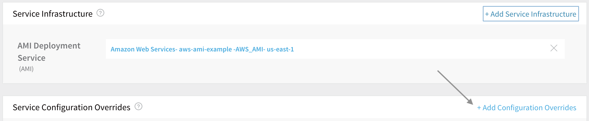

As an example, you might use a single Service across separate Environments for QA versus Production, and vary Service path variables depending on the Environment. For details, see [Override a Service Configuration](https://docs.harness.io/article/n39w05njjv-environment-configuration#override_a_service_configuration).

You can also overwrite Service variables at the Phase level of a multiple-Phase Workflow, such as Canary.
### Basic Workflow and Deployment

This section walks you through creating an AMI Basic Workflow in Harness. By default, Harness AMI Basic Workflows have four deployment steps:

1. [Setup AutoScaling Group](#basic_setup_asg): Specify how many instances to launch, their resizing order, and their steady state timeout.
2. [Deploy Service](#upgrade_asg): Specify the number or percentage of instances to deploy, within the ASG you've set up.
3. Verify Service: Optionally, specify Verification Providers or Collaboration Providers.
4. Wrap Up: Optionally, specify post-deployment commands, notifications, or integrations.

Harness preconfigures only the first two steps. Below, we outline those steps' defaults and options, with examples of the deployment logs' contents at each step.

The remaining two steps are placeholders, to which you can add integrations and commands. For details on adding **Verify Service** integrations, see [Continuous Verification](https://docs.harness.io/article/myw4h9u05l-verification-providers-list).

Your Workflows can use Harness' built-in `${artifact.metadata.tag}` variable to refer to tagged AMIs. For example, if an AMI has an AWS tag named `harness`, you can refer to that AMI within Harness as `${artifact.metadata.harness}`. For details about this convention, see [Variables and Expressions in Harness](https://docs.harness.io/article/9dvxcegm90-variables#variables_list). This can be useful in [triggering Workflows and Pipelines](https://docs.harness.io/article/xerirloz9a-add-a-trigger-2#add_a_trigger).
#### Create a Basic Workflow

To create a Basic Workflow for AMI deployment, do the following:

1. In your Application, click **Workflows**.
2. Click **Add Workflow**. The **Workflow** dialog appears.  
  
If you are using Infrastructure Definitions, the **Workflow** dialog will look like this:
3. In **Name**, enter a name for your Workflow, such as **AMI Basic Workflow**.
4. Optionally, add a **Description** of this Workflow's purpose.
5. In **Workflow Type**, select **Basic Deployment**.
6. Select the **Environment** you created for your AMI Basic deployment.
7. Select the **Service** you created for your AMI Basic deployment.
8. Select the Infrastructure Definition you created for your AMI Basic deployment.  
   The dialog will now look something like this:
	 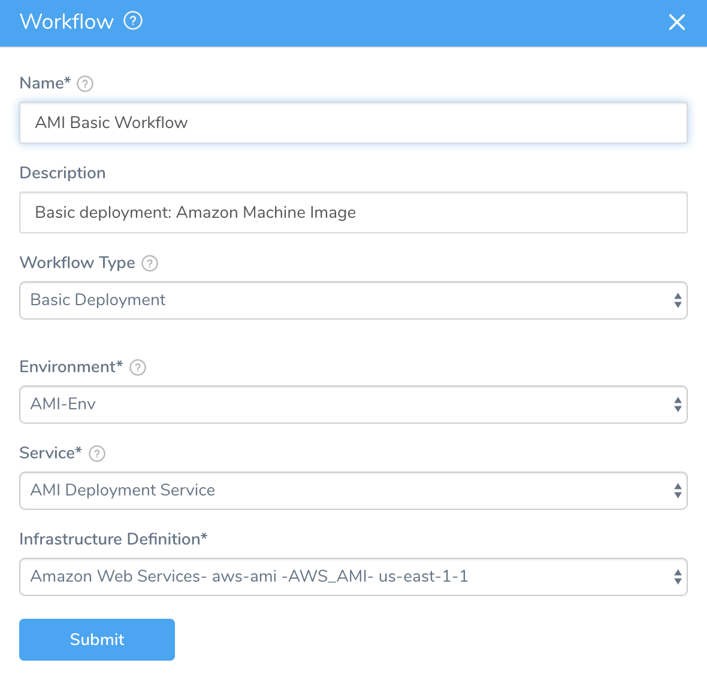
9. Click **Submit**. The new Basic Workflow for AMI is preconfigured.
   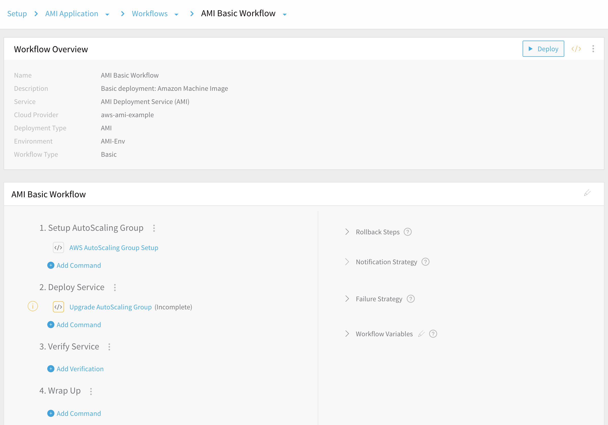

Next, we will examine options for configuring the Basic deployment's first two steps.


#### Step 1: Setup AutoScaling Group

In Step 1, select **AWS AutoScaling Group Setup** to open a dialog where you can fine-tune the Auto Scaling Group (ASG) that Harness creates for the AMI Service you are deploying.


Many of the ASG's settings are mirrored from the ASG selected in the Workflow's Infrastructure Definition. (This ASG is also called the *base Auto Scaling Group.*) However, this setup dialog enables you to provide the remaining settings, using the following options:


|  |  |
| --- | --- |
| **Field** | **Description** |
| **Auto Scaling Group Name** | Either enter a name for the ASG that Harness will create (e.g., `MyApp_MyAmiService_MyEnv.`), or accept the name that Harness automatically generates. Entering a custom name will make your ASG easier to identify when you add it to an Infrastructure Definition. |
| **Instances** | Select **Fixed** to enforce a Max, Min, and Desired number of instances.Select **Same as already running Max Instances** to use scaling settings on the last ASG deployed by this Harness Workflow.If this is the first deployment and you select **Same as already running Max Instances**, Harness uses a default of Min 0, Desired 6, and Max 10. Harness does not use the Min, Max, and Desired settings of the base ASG. |
| **Max Instances** | This field is displayed only if you have selected **Fixed** Instances above—in which case, an entry is required. Enter the maximum number of instances that the ASG collection should have at any time. This number corresponds to the AWS ASG's **Max** setting, and also constrains the **Desired Capacity**. |
| **Min Instances** | Optionally, enter the minimum number of instances that the ASG should have at any time. This number corresponds to the AWS ASG's **Min** setting, and can be `0`. (Field is displayed only if you have selected **Fixed** Instances above.) |
| **Desired Instances** | Optionally, set the target number of instances for the ASG to maintain. This number corresponds to the AWS ASG's **Desired Capacity** setting. (Field is displayed only if you have selected **Fixed** Instances above.) |
| **Resize Strategy** | Select whether to resize new ASGs upward first, or to resize old ASGs downward first. The typical production selection is **Resize New First**, to maintain the highest availability. The **Downsize Old First** option constrains usage and costs, especially during testing. |
| **Auto Scaling Steady State Timeout (mins)** | Enter how long Harness should wait for ASGs to register and reach steady state. This setting (which is internal to Harness) also defines the interval that Harness will wait before downsizing old ASGs and deregistering them from the Target Group(s). |

The **Instances** settings support [Harness variable expressions](https://docs.harness.io/article/9dvxcegm90-variables), such as [Workflow variable expressions](https://docs.harness.io/article/766iheu1bk-add-workflow-variables-new-template).Certain settings in this dialog correspond to AWS Console options, as shown here:

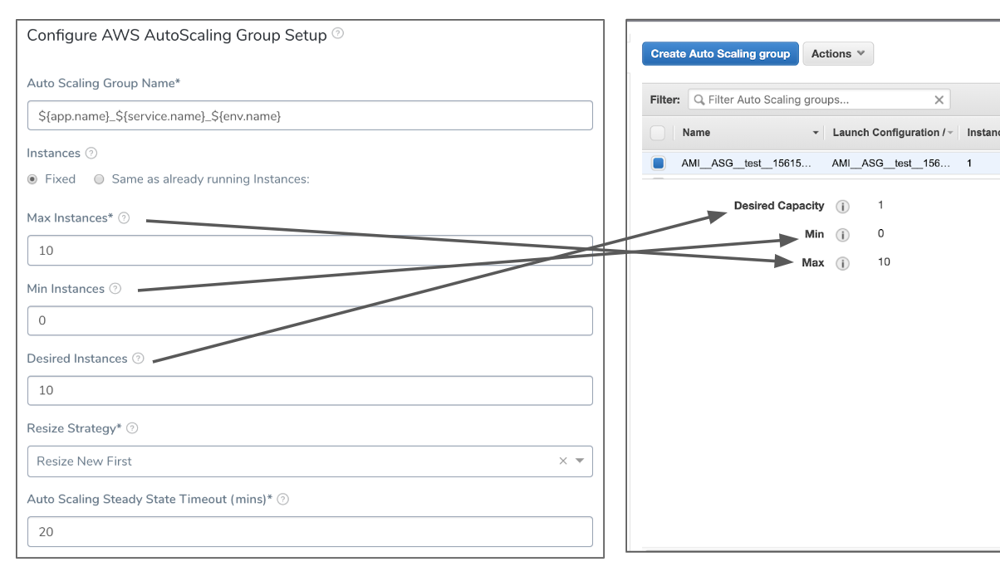
##### Setup AutoScaling Group in Deployment

Let's look at an example where the AWS AutoScaling Group Setup—configured as shown above—is deployed. Here is the step in the Harness Deployments page:


Here's the output, showing a successful setup:


```
INFO   2019-06-04T19:03:16.561+0000   Starting AWS AMI Setup  
INFO   2019-06-04T19:03:18.121+0000   Starting AWS AMI Setup  
Getting base auto scaling group  
Getting base launch configuration  
Getting all Harness managed autoscaling groups  
Getting last deployed autoscaling group with non zero capacity  
Creating new launch configuration [Harness__Verification_AMI__Service__test__Quality__Assurance__Setup_Virginia__799]  
INFO   2019-06-04T19:03:19.926+0000   Creating new AutoScalingGroup [Harness__Verification_AMI__Service__test__Quality__Assurance__Setup_Virginia__799]  
Sending request to delete old auto scaling groups to executor  
Completed AWS AMI Setup with new autoScalingGroupName [Harness__Verification_AMI__Service__test__Quality__Assurance__Setup_Virginia__799]  
AutoScalingGroup [Harness__Verification_AMI__Service__test__Quality__Assurance__Setup_Virginia__795] activity [Terminating EC2 instance: i-0d4ad1a03aee7f6dc] progress [100 percent] , statuscode [Successful]  details [{"Subnet ID":"subnet-3669906a","Availability Zone":"us-east-1a"}]  
AutoScalingGroup [Harness__Verification_AMI__Service__test__Quality__Assurance__Setup_Virginia__795] activity [Launching a new EC2 instance: i-0d4ad1a03aee7f6dc] progress [100 percent] , statuscode [Successful]  details [{"Subnet ID":"subnet-3669906a","Availability Zone":"us-east-1a"}]
```

#### Step 2: Deploy Service

In Step 2, select **Upgrade AutoScaling Group** to define how many instances to deploy in the Auto Scaling Group, as either a count or a percentage.

Every new AMI/ASG deployment creates a new ASG. The instances in ASGs used by previous deployments are downsized to a max count of 3. Additional instances are detached.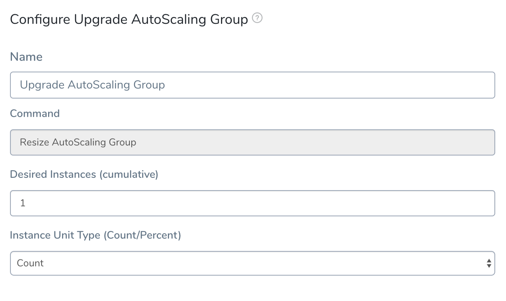

This dialog provides the following options:


|  |  |
| --- | --- |
| **Field** | **Description** |
| **Desired Instances (cumulative)** | Set the number of Amazon EC2 instances that the Auto Scaling Group will attempt to deploy and maintain. This field corresponds to the ASG's **Desired Capacity** setting, and interacts with the adjacent **Instance Unit Type** field:* Where **Instance Unit Type** is set to **Count**, enter the actual number of instances.
* Where **Instance Unit Type** is set to **Percent**, enter a percentage of the available capacity.

Either way, your setting here cannot exceed your **Max Instance** capacity setting—which is a count—in the Workflow's preceding [Setup AutoScaling Group](#asg_setup_step) step. |
| **Instance Unit Type (Count/Percent)** | Set the unit of measure, as either **Count** or **Percent**. |

This diagram illustrates the relationship among Upgrade settings:

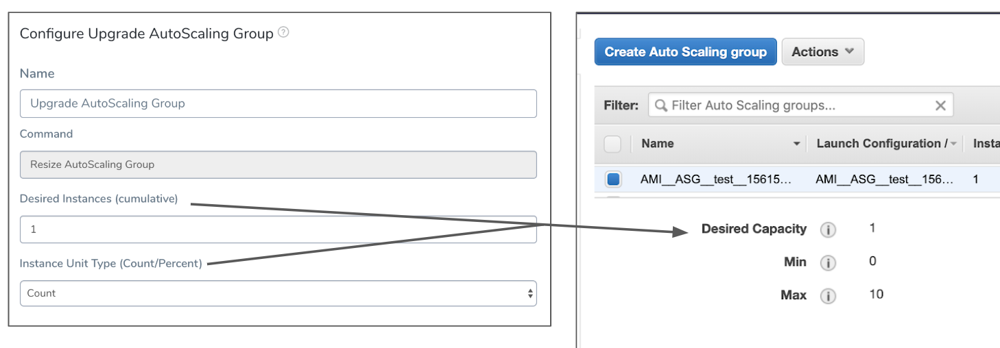

##### Deploy Service Step in Deployment

Using the **Upgrade AutoScaling Group** configuration shown above—requesting a modest **Desired Instances** count of **1**—here is the **Deploy Service** step in the Harness Deployments page:

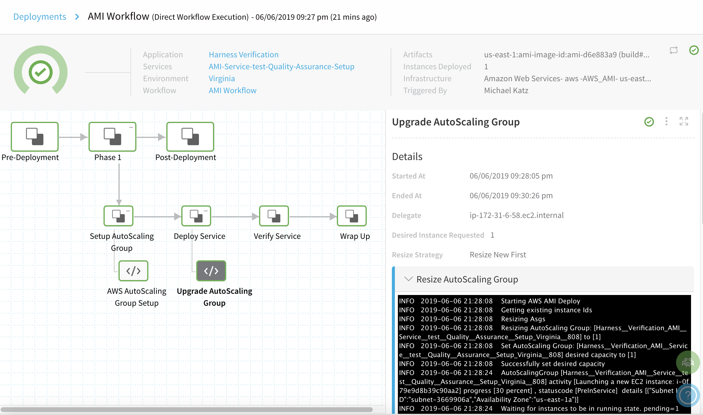

Here is partial output, showing a successful resizing and deployment:


```
INFO   2019-06-04T19:03:23.916+0000   Starting AWS AMI Deploy  
Getting existing instance Ids  
Resizing Asgs  
Resizing AutoScaling Group: [Harness__Verification_AMI__Service__test__Quality__Assurance__Setup_Virginia__799] to [1]  
Set AutoScaling Group: [Harness__Verification_AMI__Service__test__Quality__Assurance__Setup_Virginia__799] desired capacity to [1]  
Successfully set desired capacity  
INFO   2019-06-04T19:03:55.916+0000   AutoScalingGroup [Harness__Verification_AMI__Service__test__Quality__Assurance__Setup_Virginia__799] activity [Launching a new EC2 instance: i-0dca2187fac9b6e0f] progress [30 percent] , statuscode [PreInService]  details [{"Subnet ID":"subnet-3669906a","Availability Zone":"us-east-1a"}]  
Waiting for instances to be in running state. pending=1  
INFO   2019-06-04T19:04:10.530+0000   AutoScalingGroup [Harness__Verification_AMI__Service__test__Quality__Assurance__Setup_Virginia__799] activity [Launching a new EC2 instance: i-0dca2187fac9b6e0f] progress [30 percent] , statuscode [PreInService]  details [{"Subnet ID":"subnet-3669906a","Availability Zone":"us-east-1a"}]  
AutoScaling group reached steady state  
Setting min capacity of Asg[Harness__Verification_AMI__Service__test__Quality__Assurance__Setup_Virginia__799] to [1]  
[...]  
AutoScaling group reached steady state  
INFO   2019-06-04T19:06:13.937+0000   AutoScaling Group resize operation completed with status:[SUCCESS]
```

#### Basic Workflow Deployment

Now that the setup is complete, you can click **Deploy** in the Workflow to deploy the artifact to your Auto Scaling Group.


Next, select the AMI you want to deploy. (Harness populates this list from the Artifact Source settings in the AMI Service you created.) Then click **SUBMIT**.

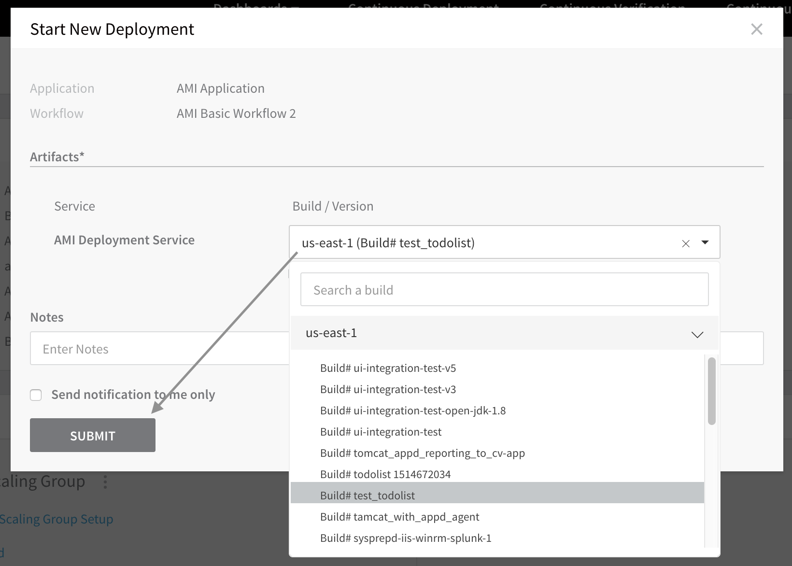

The Workflow deploys. Note that the Deployments page displays details about the deployed instances.

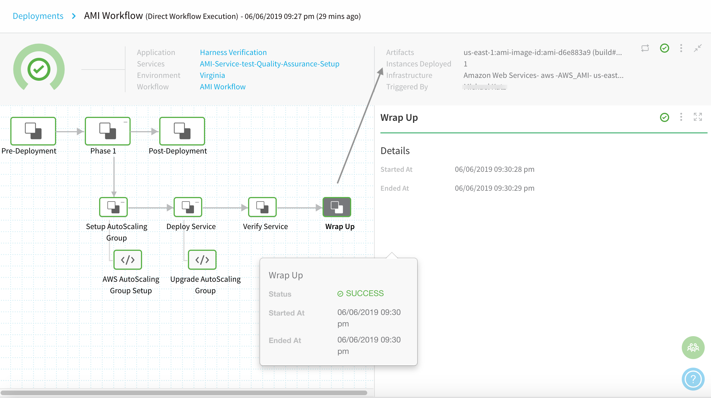

To verify the completed deployment, log into your AWS Console and locate the newly deployed instance(s).

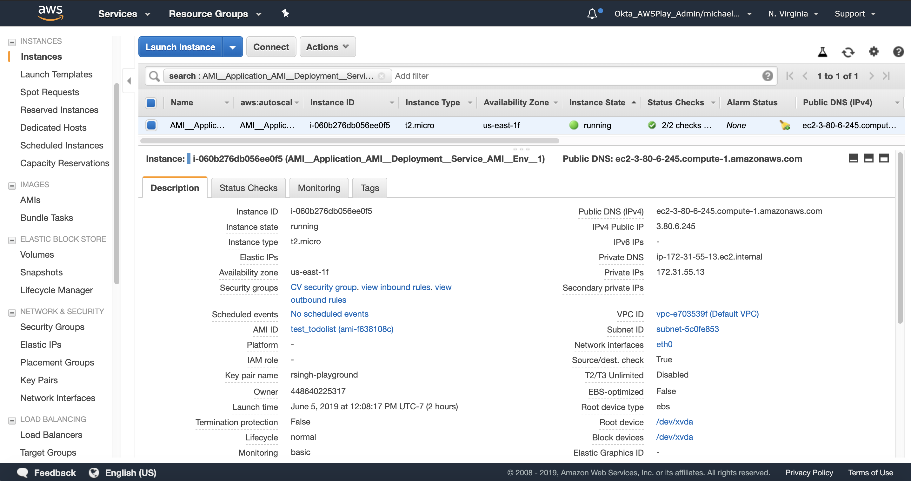
### Rollback Steps

When you create an AMI Workflow, its **Rollback Steps** section automatically includes a **Rollback Service** step. This step will execute when Harness needs to roll back your deployment and restore the previous working version.

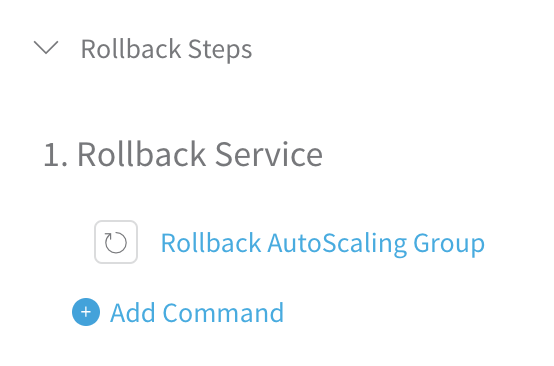

The configuration options available here depend on the deployment type. For general information about Rollback options, see [Workflows](https://docs.harness.io/article/m220i1tnia-workflow-configuration#rollback_steps).


#### Multi-Service Rollback

In an AMI Multi-Service Workflow's **Rollback Service** step, click **Rollback AutoScaling Group** to open the dialog shown below:

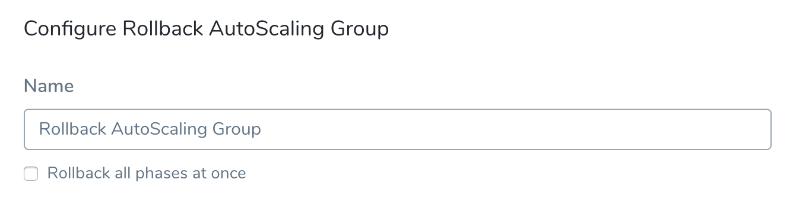

Enable the single option here, **Rollback all phases at once**, if you want to simultaneously roll back all of the AMI Workflow's Phases, up to the Phase where deployment failed.

For example, if a Workflow's Phase 2 fails to deploy, both Phase 2 and Phase 1 will be rolled back simultaneously. (Harness will ignore any Phase 1 rollback strategy settings.)

If this check box is not enabled, Harness will roll back Phase 2 and then Phase 1, according to each phase's rollback strategy.

#### Rollbacks and Downsizing Old ASGs

For details on how previous ASGs are downsized and what happens during rollback, see [How Does Harness Downsize Old ASGs?](../../concepts-cd/deployment-types/aws-ami-deployments-overview.md#how-does-harness-downsize-old-as-gs)

### Support for Scheduled Scaling

Currently, this feature is behind the Feature Flag `AMI_ASG_CONFIG_COPY`.The Base ASG you provide to Harness for creating the new ASG can use [AWS Scheduled Scaling](https://docs.aws.amazon.com/autoscaling/ec2/userguide/schedule_time.html) (scheduled scaling with scheduled actions).

There are a few important considerations:

* When configuring the base ASG, the `ScheduledActions` process must be suspended so that it won’t scale the base ASG. Once Harness creates the new ASG from the base, Harness will enable the `ScheduledActions` process in the new ASG (if the base ASG had it). See [Suspending and resuming a process for an Auto Scaling group](https://docs.aws.amazon.com/autoscaling/ec2/userguide/as-suspend-resume-processes.html) from AWS.
* Harness currently supports only the UTC timezone format in scheduled actions. Time values in scheduled actions in the base ASG need to be configured in UTC.


### Troubleshooting

The following errors might occur when setting up and deploying AMIs in Harness.

#### Auto Scaling Group Not Showing Up

When you [configure](#add_a_service_infrastructure) an **Infrastructure Definition**, the **Infrastructure Definition** dialog's **Auto Scale Group** drop-down will initially be empty. This is expected behavior. Simply allow a few seconds for the drop-down to populate.

#### Couldn't Find Reference AutoScalingGroup

If a Workflow's [Setup AutoScaling Group](#asg_setup_step) step fails with a message of the following form, this indicates that at least one **Infrastructure Definition** in the Workflow's Environment is configured with an ASG that is not currently available on AWS:

`Couldn't find reference AutoScalingGroup: [ECS\_\_QA\_\_Application\_AMI\_QA\_\_245] in region: [us‑east-1]`

To correct this:

1. In Harness Manager, navigate to your Application's **Environments** details page.
2. Open each Infrastructure Definition used by the Workflow that failed, and navigate to the dialog's lower configuration section. Ensure that the **Auto Scaling Groups** field points to an ASG to which you currently have access in the AWS Console.
3. If this does not allow your deployment to proceed, you might also need to toggle the **Host Name Convention** field's entry between the `publicDnsName` and `privateDnsName` primitives. (This depends on whether the Launch Configuration that created your ASG template was configured to create a public DNS name.) For details, see AWS' [IP Addressing in a VPC](https://docs.aws.amazon.com/autoscaling/ec2/userguide/asg-in-vpc.html#as-vpc-ipaddress) topic.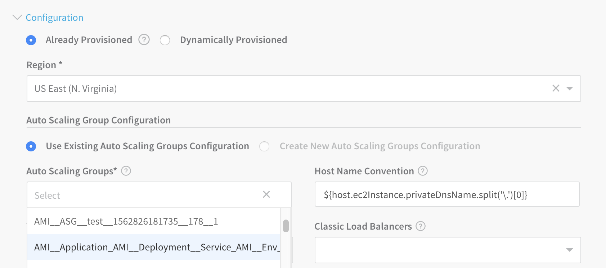

Harness Manager will prevent you from simply removing a misconfigured Infrastructure Definition, if it's referenced by any of your Application's Workflows. So in some cases, you might find it easiest to create a new Infrastructure Definition, reconfigure your Workflow to use that new infrastructure, and then delete the broken Infrastructure Definition(s).
### Next Steps

* See [Continuous Verification](https://docs.harness.io/article/myw4h9u05l-verification-providers-list) and [24/7 Service Guard Overview](https://docs.harness.io/article/dajt54pyxd-24-7-service-guard-overview) to add Verification Providers to your AMI deployment and running services.
* [AMI Blue/Green Deployment](ami-blue-green.md).
* [AMI Canary Deployment](ami-canary.md).

