This guide outlines how to configure and execute AMI (Amazon Machine Image) deployments—using Blue/Green and Canary strategies—via the Spotinst Elastigroup management platform. 

Currently, Harness integrates with Spotinst only for deployments to AWS (Amazon Web Services) via Elastigroups.

## Before You Begin

* [AMI Basic Deployment](ami-deployment.md)
* [AMI Blue/Green Deployment](ami-blue-green.md)
* [AMI Canary Deployment](ami-canary.md)


## Overview

Harness can integrate AMI deployments with Spotinst's [Elastigroup](https://spotinst.com/products/elastigroup/) cloud-cost optimization platform. Elastigroup predicts the availability of AWS' discounted excess capacity (Spot Instances), and automatically reserves new capacity to maintain your applications' availability at reduced cost.

This guide outlines how to set up and orchestrate your AWS, Spotinst, and Harness resources for AMI Blue/Green or Canary deployments. Here is an example of a completed Blue/Green deployment on the Harness Deployments page:

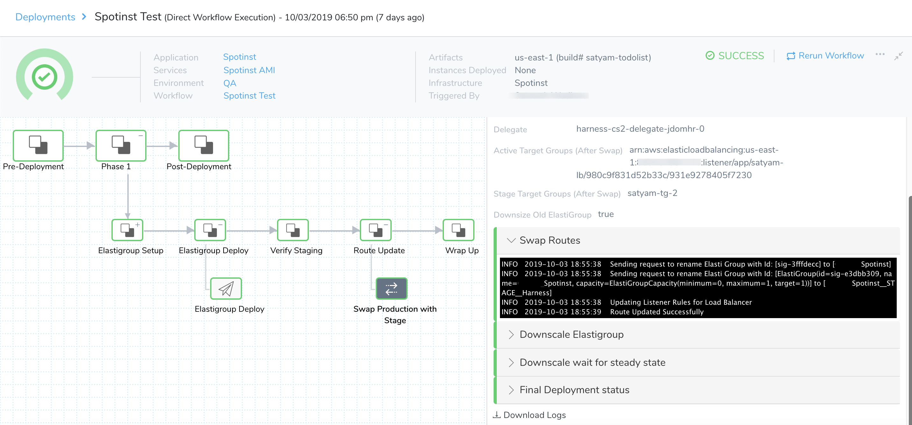

The deployed instances in your corresponding Elastigroup will appear in the Spotinst Console:

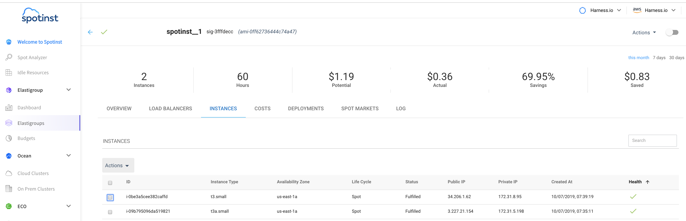


## Prerequisites: AWS, Spotinst, and Harness Resources

Before creating your Harness [Infrastructure Definition](#infrastructure_definition) and [Blue/Green](#blue_green) or [Canary Workflows](#canary), you will need to set up the following resources.

Several of these resources are also prerequisites for Harness AMI [Basic](ami-deployment.md), [Blue/Green](ami-blue-green.md), or [Canary](ami-canary.md) deployments that do not rely on Elastigroups. To minimize duplication, we link out to the corresponding deployment guides for some details.
### AWS Prerequisites

For an AMI Canary deployment, you must set up the following resources up within Amazon Web Services:

* A working AMI that Harness will use to create your instances.
* At least one [Application Load Balancer](https://docs.aws.amazon.com/en_pv/elasticloadbalancing/latest/application/introduction.html) (ALB) or [Classic Load Balancer](https://docs.aws.amazon.com/en_pv/elasticloadbalancing/latest/classic/introduction.html). (See the [Spotinst documentation](https://docs.spot.io/elastigroup/tools-integrations/aws-load-balancers-elb-alb) for Load Balancer support.)

An AMI Blue/Green deployment has these further requirements:

* A pair of [Target Groups](https://docs.aws.amazon.com/elasticloadbalancing/latest/application/load-balancer-target-groups.html)—typically staging (Stage) and production (Prod)—both with the **instance** target type.
* A Load Balancer with listeners for both your Target Groups' ports.


### Spotinst Prerequisites

Within Spotinst, you must configure at least one Elastigroup cluster that matches your AWS configuration's AMI, VPC (virtual private cloud), Load Balancer(s), security groups, availability zones, and allowed instance types.


For details, see [Spotinst tutorials](https://docs.spot.io/elastigroup/tutorials/).


### Harness Prerequisites

Within Harness, you'll need to set up the following resources. (Some of these are covered in detail in Harness' [AMI Basic Deployment](ami-deployment.md#basic-deploy) Guide. Spotinst-specific setup is covered in the sections below.)

* A Delegate [installed and running](ami-deployment.md#install-and-run-the-harness-delegate) in an AWS instance or ECS Cluster.
* An AWS Cloud Provider, preferably configured to assume the Delegate’s IAM role for the connection to AWS. (See [Set Up Cloud Providers](#cloud_providers) below.)
* A [Spotinst Cloud Provider](#spotinst_cloud_provider), which connects to your Spotinst account using your credentials on that account.
* A Harness Application,
* An AMI-based [Service](#service).
* An Environment with an [Infrastructure Definition](https://docs.harness.io/article/v3l3wqovbe-infrastructure-definitions) that specifies your Load Balancer(s).  
  
For Blue/Green Deployments, the Infrastructure Definition will also specify Stage and Prod Target Groups. You import this configuration from your Elastigroup, as outlined below in [Define the Infrastructure](#infrastructure_definition).At deploy time, Harness will override much of the above base configuration with the instance and capacity targets that you specify in your Workflow.


#### Harness Service

Set up your Harness Service as we document for a Harness AMI Basic Deployment in [AMI Service Setup](ami-deployment.md#ami-service-setup).

After you create your Service, you have the option of using the [User Data](ami-deployment.md#deployment-specification-user-data) link to enter configuration scripts and directives that your AWS instance will run upon launch.

You can also specify [Config Variables](https://docs.harness.io/article/eb3kfl8uls-service-configuration#config_variables), and then reference them in your [Infrastructure Definitions](#infrastructure_definition).


## Set Up Cloud Providers

Although most Harness deployments rely on a single Cloud Provider, Elastigroup deployments require both a Spotinst Cloud Provider and an AWS Cloud Provider. (You will need to reference both when you create your [Infrastructure Definition](#infrastructure_definition).)


### AWS Cloud Provider

Follow the instructions in [AWS Cloud Provider Setup](ami-deployment.md#aws-cloud-provider-setup) to create a Cloud Provider that references the Delegate you created to manage your AWS credentials. In this example, select the **Assume IAM Role on Delegate** option, and reference your Delegate via **Delegate Tag**.

The Delegate must be in the same AWS VPC and subnet that you plan to use for your AWS resources.Once filled in, the AWS Cloud Provider dialog will look something like this:

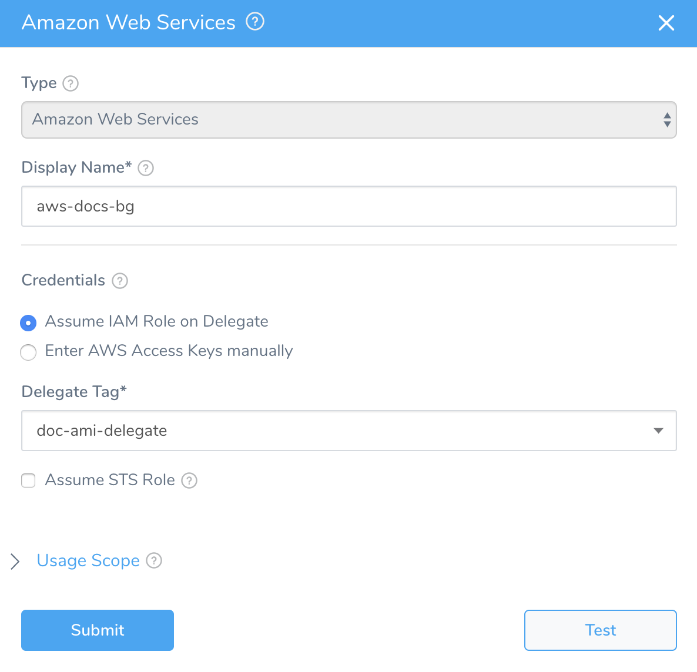


### Spotinst Cloud Provider

To set up the Spotinst Cloud Provider, follow the steps in [Spotinst Cloud Provider](https://docs.harness.io/article/whwnovprrb-cloud-providers).

Keep the Spotinst Console open to [copy its configuration](#add_elastigroup_config) into your Harness Infrastructure Definition.


### Define the Infrastructure

The [Infrastructure Definition](https://docs.harness.io/article/v3l3wqovbe-infrastructure-definitions) is where you specify the target infrastructure for your deployments. You'll configure your Infrastructure Definition for Elastigroup in this section (working in both Harness Manager and the Spotinst Console). You'll then select this Infrastructure Definition as your target deployment environment when you later create a [Blue/Green](#blue_green) or [Canary](#canary) Workflow.


### Add the Infrastructure Definition

1. Within your Harness Application, select an existing **Environment**, or create a new one.
2. In the Environment's **Infrastructure Definition** section, click **Add Infrastructure Definition**.
3. In the resulting **Infrastructure Definition** dialog, enter a **Name** to identify this Infrastructure Definition when you add it to a Workflow.
4. In **Cloud Provider Type**, select **Amazon Web Services**.
5. In **Deployment Type**, select **Amazon Machine Image**. This expands the **Infrastructure Definition** dialog's top section to look something like this: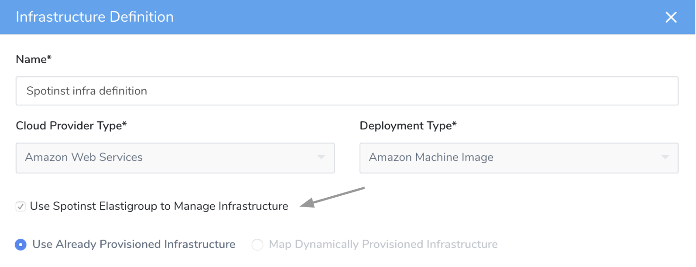
6. Select the check box labeled **Use Spotinst Elastigroup to Manage Infrastructure**.
7. For this example, accept the default **Use** **Already Provisioned Infrastucture** option.  
If you have configured an [Infrastructure Provisioner](https://docs.harness.io/article/o22jx8amxb-add-an-infra-provisioner) in Harness, you can use that configuration by instead selecting the **Dynamically Provisioned** option. For details, see our AMI Blue/Green Deployment Guide's [Infrastructure Provisioners](#infrastructure_provisioners), and our AMI [CloudFormation](ami-blue-green.md#infrastructure-provisioners) and [Terraform](../../terraform-category/terrform-provisioner.md#ami-and-auto-scaling-group) examples.
8. Select the **AWS** **Cloud Provider** that you [created earlier](#aws_cloud_provider).
9. Select the **Spotinst** **Cloud Provider** that you [created earlier](#spotinst_cloud_provider).
10. Select the **Region** that you configured earlier in [AWS](#aws_prereq) and [Spotinst](#spotinst_prereq). The dialog's center section will now look something like this: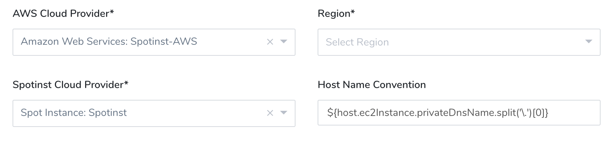

Next, you'll complete the Infrastructure Definition by copying your Elastigroup configuration from Spotinst and pasting it into this dialog.


### Add Elastigroup Configuration

To populate the **Elastigroup Configuration** field with your configuration JSON from Spotinst:

1. In the Spotinst Console, click the [Elastigroups tab](https://console.spotinst.com/#/aws/ec2/elastigroup/list).
2. Click the Elastigroup you configured earlier in [Spotinst Prerequisites](#spotinst_prerequisites).
3. From the top-right **Actions** menu, select **View Configuration**.
   
4. In the resulting **Configuration** modal, select all the JSON and copy it to your clipboard.
   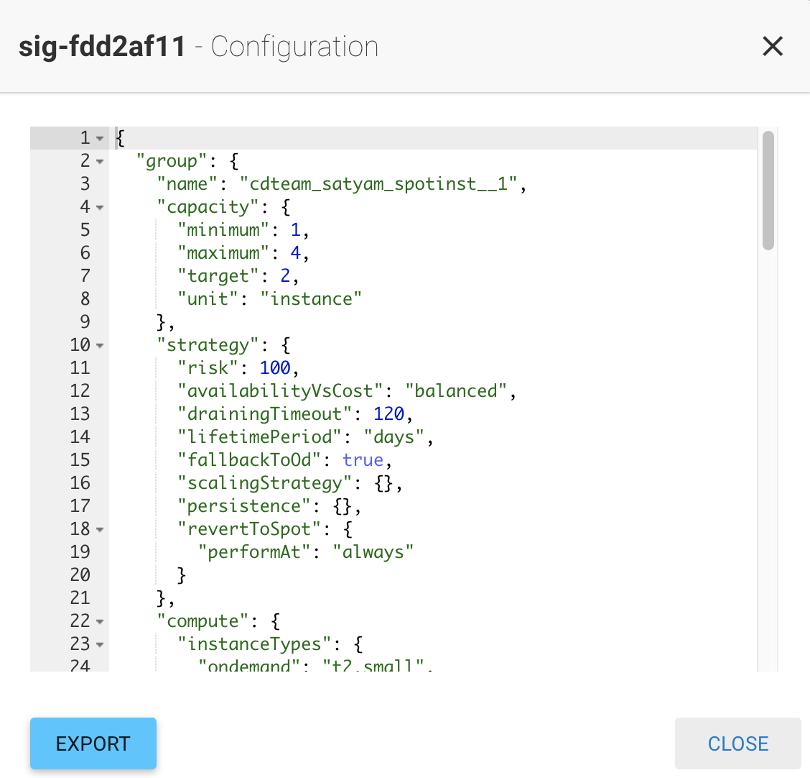
   If you prefer, click **EXPORT** to save the JSON to a file.
5. Back in Harness' Infrastructure Definition dialog, paste the JSON into the **Elastigroup Configuration** field. This will make your Elastigroup infrastructure available to Harness deployments.
6. Select **Scope to Specific Services**, and—in the adjacent drop-down—select the AMI [Service](#service) that you created earlier and will deploy to this infrastructure. (This scoping ensures that this Infrastructure Definition will be available whenever a Workflow, or Pipeline Phase, is set up for this Service.)
  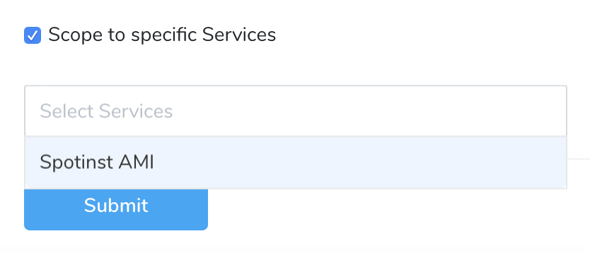
  The **Infrastructure Definition** dialog's lower section will now look something like this:
  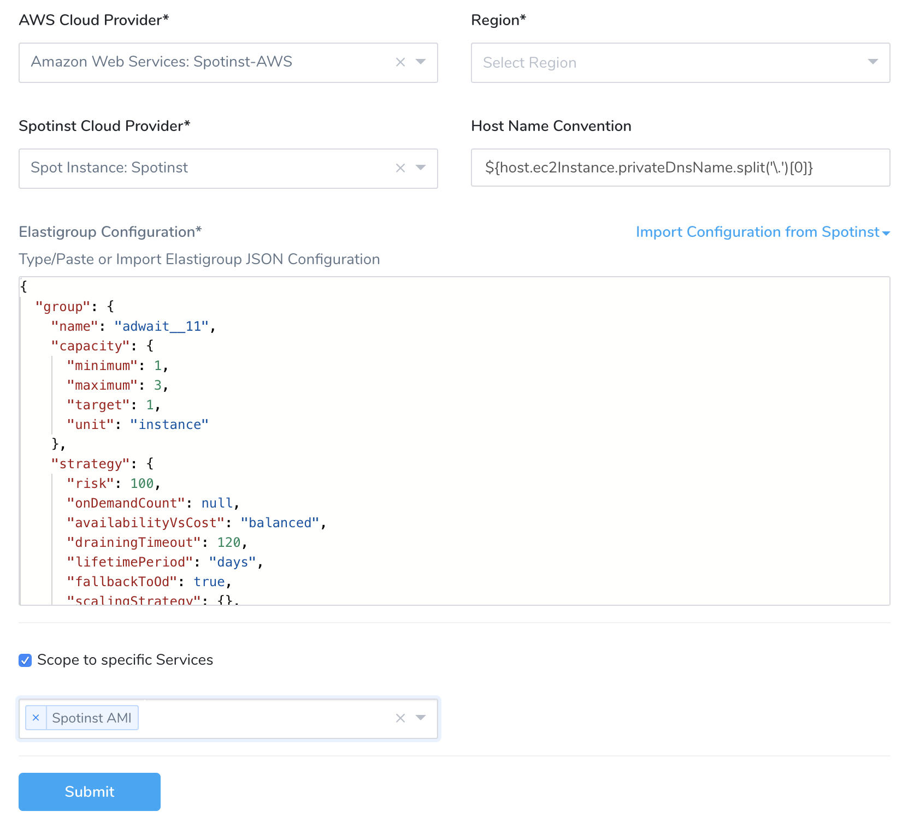
7. Click **Submit** to add the new Infrastructure Definition to your Harness Environment.

You can now proceed to create a [Blue/Green](#blue_green) or [Canary](#canary) Workflow. The next few sections cover additional Infrastructure Definition details and options.

### Elastigroup Configuration Overrides

When you deploy your Workflows, Harness will override much of the Elastigroup Configuration JSON that you imported. Harness will replace the configured `imageId` element with the actual AMI artifact you choose to deploy in the Workflow.

In Blue/Green deployments, Harness will also override the `loadBalancers` element, substituting the Load Balancers that you specify in the Workflow. Even if the `loadBalancers` element were absent from the **Elastigroup Configuration** field, you could still deploy a properly configured Workflow using this Infrastructure Definition.


### Service Variables in Elastigroup Configuration

You also have the option to use Harness variables within your Infrastructure Definition's **Elastigroup Configuration** field.

Infrastructure Definitions do not currently support auto-fill for expressions. So you must manually type Service variables into the JSON, in this format: `${serviceVariable.<var_name>`}Create the variables in your [Service](#service)’s **Config Variables** section.

Then insert them in the **Elastigroup Configuration** JSON using the format above. For further details, see [Add Service Config Variables](https://docs.harness.io/article/q78p7rpx9u-add-service-level-config-variables).


## Basic Workflow and Deployment

Assuming that you've set up all [prerequisites](#prerequisites), the following sections outline how to create a Basic Workflow and deploy your AMI. To avoid duplication, they focus on Elastigroup-specific configuration and deployment. For background and details, please refer to the following [AMI Basic Deployment Guide](ami-deployment.md#basic-deploy) sections:

* [Basic Workflow and Deployment](ami-deployment.md#basic-deploy)
* [Rollback Steps](ami-deployment.md#rollback-steps)

Elastigroups perform the functions that Auto Scaling Groups perform in standard AMI deployments.By default, Harness AMI Basic Workflows have four deployment steps:

1. [Elastigroup Setup](#basic_setup_asg): Specify how many instances to launch, and their steady state timeout.
2. [Elastigroup Deploy](#upgrade_asg): Specify how many instances to deploy, as a number or percentage of the Elastigroup parameters you've set up.
3. **Verify Staging**: Optionally, specify Verification Providers or Collaboration Providers.
4. **Wrap Up**: Optionally, specify post-deployment commands, notifications, or integrations.

Harness preconfigures only the first two steps. Below, we outline those steps' defaults and options, with examples of the deployment logs' contents at each step.

The remaining two steps are placeholders, to which you can add integrations and commands. For details on adding **Verify Staging** integrations, see [Continuous Verification](https://docs.harness.io/article/myw4h9u05l-verification-providers-list).

Your Workflows can use Harness' built-in `${artifact.metadata.tag}` variable to refer to tagged AMIs. For example, if an AMI has an AWS tag named `harness`, you can refer to that AMI within Harness as `${artifact.metadata.harness}`. For details about this convention, see [Variables and Expressions in Harness](https://docs.harness.io/article/9dvxcegm90-variables#variables_list). This can be useful in [triggering Workflows and Pipelines](https://docs.harness.io/article/xerirloz9a-add-a-trigger-2#add_a_trigger).

### Create a Basic Workflow

To create a Basic Workflow for AMI Elastigroup deployment:

1. In your Application, click **Workflows**.
2. Click **Add Workflow**. The **Workflow** dialog appears.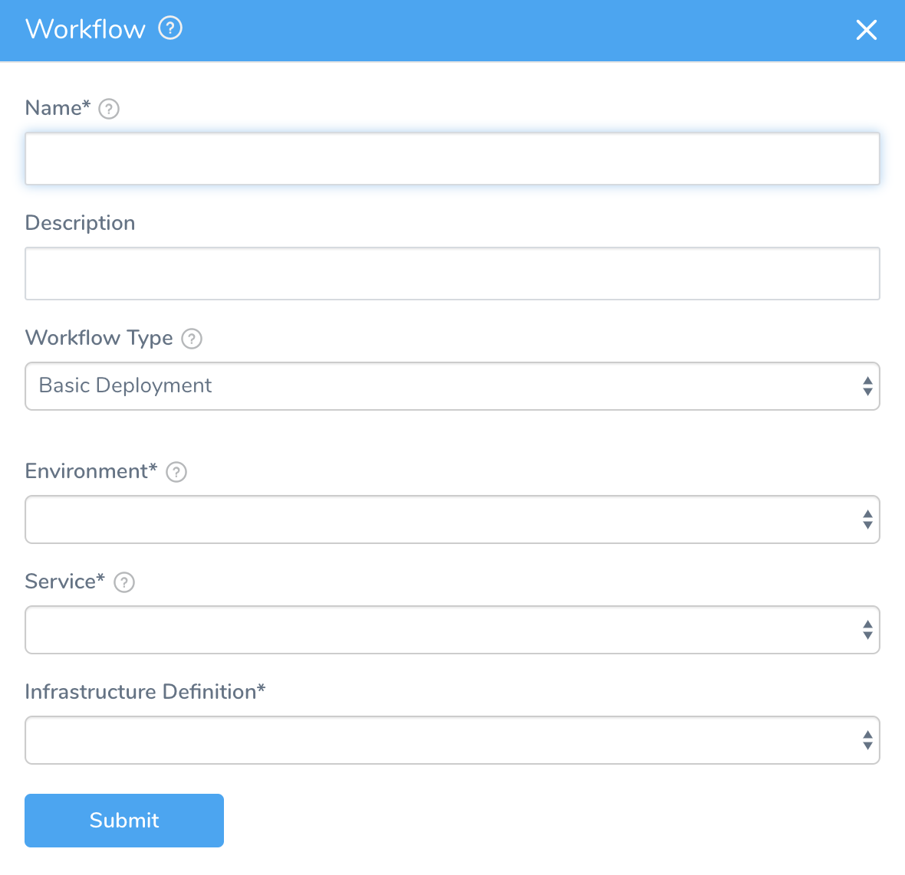
3. In **Name**, enter a name for your Workflow, such as **Elastigroup Basic**.
4. Optionally, add a **Description** of this Workflow's purpose.
5. In **Workflow Type**, select **Basic Deployment**.
6. Select the **Environment** and [Service](#service) **that** you created for your AMI Elastigroup deployments.
7. Select the **Infrastructure Definition** that you [configured earlier](#add_infra_def) for AMI Elastigroup deployments. The dialog will now look something like this:
8. Click **Submit**. The new Basic Workflow is preconfigured.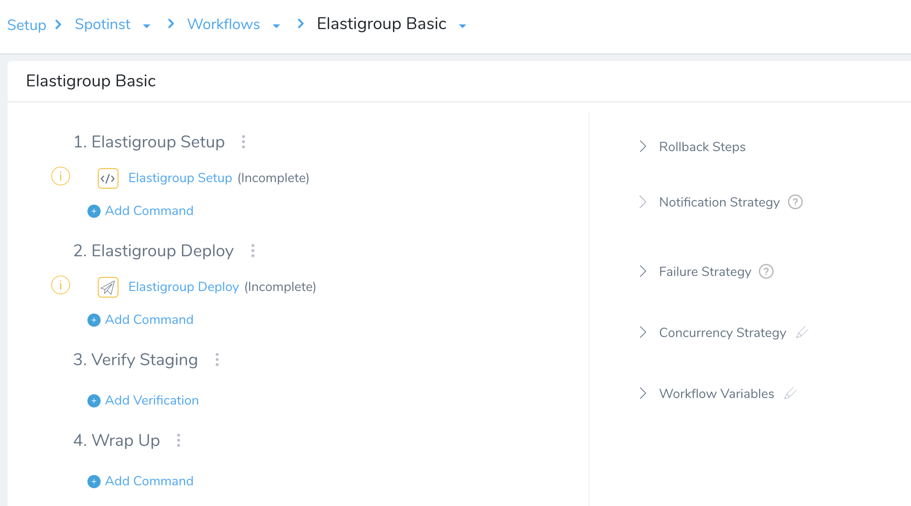

Next, we will examine options for configuring the Basic deployment's first two steps.


### Step 1: Elastigroup Setup

In Step 1, select **Elastigroup Setup** to open a dialog where you can configure the Elastigroup that Harness will create for the AMI you are deploying.

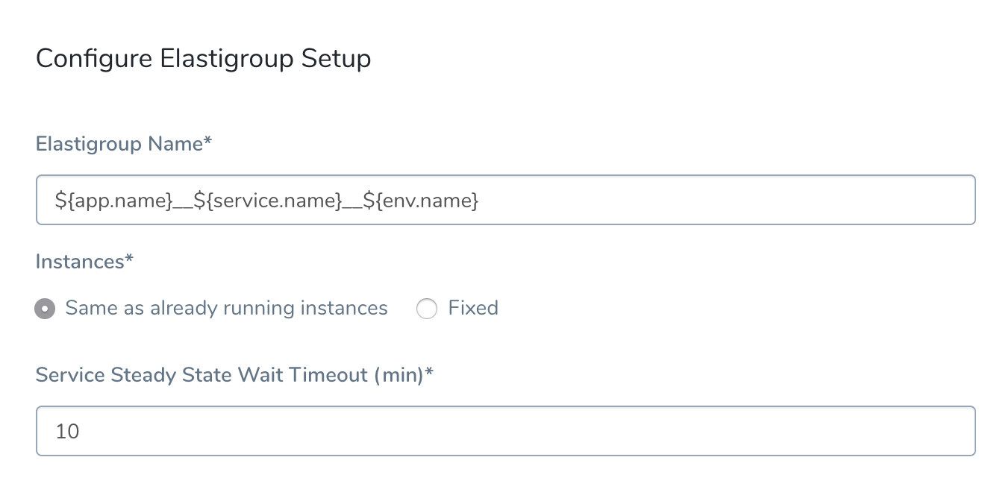

If you select **Fixed** Instances, the dialog expands as shown here:

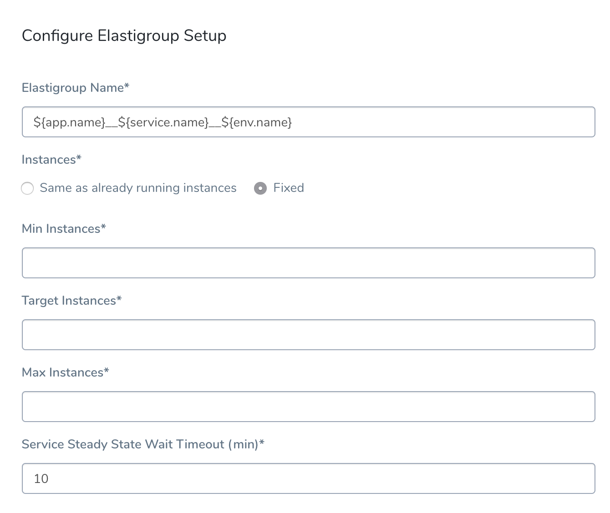

This expanded Setup dialog provides the following fields, all of which require entries:


|  |  |
| --- | --- |
| **Field** | **Description** |
| **Elastigroup Name** | Either enter a name for the Elastigroup that Harness will create (e.g., `MyApp_MyAmiService_MyInfra`), or accept the default name that Harness automatically generates. Entering a custom name will make your Elastigroup easier to identify. |
| **Min Instances** | Enter the minimum number of instances that the Elastigroup should have at any time. This number can be `0`. |
| **Target Instances** | Set the target number of instances for the Elastigroup to maintain. |
| **Max Instances** | Enter the maximum number of instances that the Elastigroup collection should have at any time. |
| **Service Steady State Wait Timeout** | Enter how many minutes Harness should wait for Elastigroups to register instances and reach steady state. (This setting is internal to Harness.) |

When you are done, the dialog will look something like this:


This dialog's instance settings correspond directly to the resulting Elastigroup's settings, as shown here:


#### Elastigroup Setup in Deployment

Let's look at an example where the Elastigroup Setup—configured as shown above—is deployed. Here is the step in the Harness Deployments page:

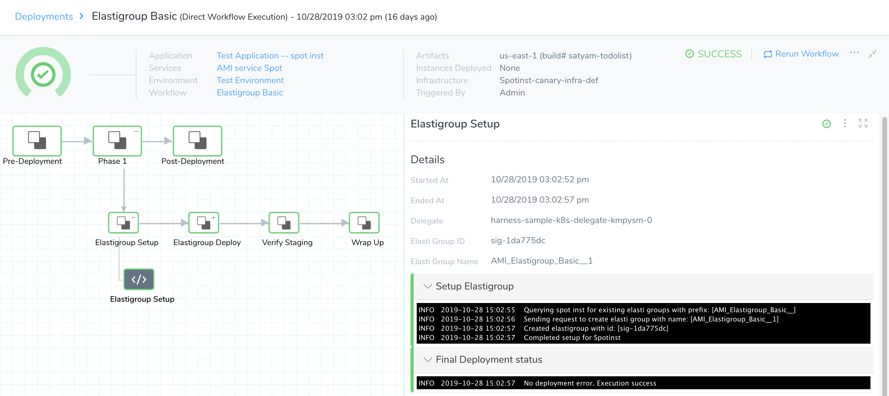

Here is partial output, showing a successful setup:


```
Querying Spotinst for existing Elastigroups with prefix: [AMI_Elastigroup_Basic__]  
Sending request to create Elastigroup with name: [AMI_Elastigroup_Basic__1]  
Created Elastigroup with ID: [sig-1da775dc]  
Completed setup for Spotinst
```

### Step 2: Elastigroup Deploy

In Step 2, select **Elastigroup Deploy** to open a dialog where you can define how many instances to deploy in the Elastigroup, as either a count or a percentage:


The right-hand drop-down offers two options that govern the values that you enter in the adjacent field:

* **Percent:** Specify a percentage of the **Target Instances** that you set in [Step 1: Elastigroup Setup](#basic_setup_asg).
* **Count:** Specify an exact number of instances. (This cannot exceed the **Max Instances** that you set in [Step 1: Elastigroup Setup](#basic_setup_asg).)

For this example, we'll use a **Count** of **2**:

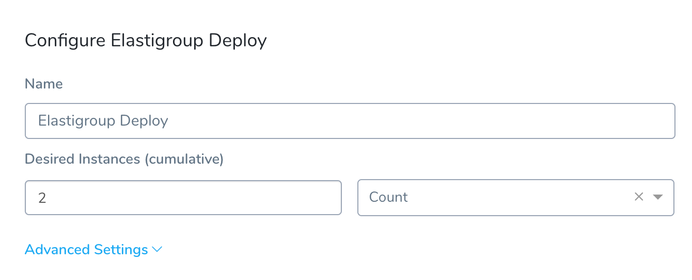

#### Elastigroup Deploy Step in Deployment

Using the **Elastigroup Deploy** configuration shown above—requesting a modest **Desired Instances** count of **2**—here is the **Deploy Service** step in the Harness Deployments page:

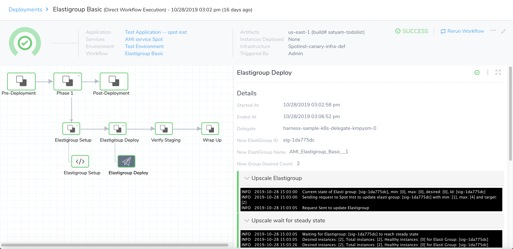

Here's partial output, showing a successful resizing and deployment:


```
Current state of Elastigroup: [sig-1da775dc], min: [0], max: [0], desired: [0], ID: [sig-1da775dc]  
Sending request to Spotinst to update Elastigroup: [sig-1da775dc] with min: [1], max: [4] and target: [2]  
Request Sent to update Elastigroup  
...  
Waiting for Elastigroup: [sig-1da775dc] to reach steady state  
Desired instances: [2], Total instances: [2], Healthy instances: [0] for Elastigroup: [sig-1da775dc]  
...  
Desired instances: [2], Total instances: [2], Healthy instances: [2] for Elastigroup: [sig-1da775dc]  
Elastigroup: [sig-1da775dc] reached steady state
```

### Elastigroup Rollback Steps

By default, each Elastigroup Basic Workflow includes a **Rollback Steps** section, containing an **Elastigroup Rollback** step. There's nothing to configure in this step.


To see how the default behavior works, see the [Canary > Rollback Steps](#rollback_1) section.


### Basic Workflow Deployment

Now that the setup is complete, you can click **Deploy** in the Workflow to deploy the artifact to your Elastigroup.


In the resulting dialog, use the **Build / Version** drop-down to select the AMI you want to deploy. (Harness populates this list from the Artifact Source settings in the [Service](#service) you created.) Then click **Submit**.


Once the Workflow deploys, the Deployments page confirms success.


To verify the completed deployment, log into your Spotinst Console and display the newly deployed instance(s).

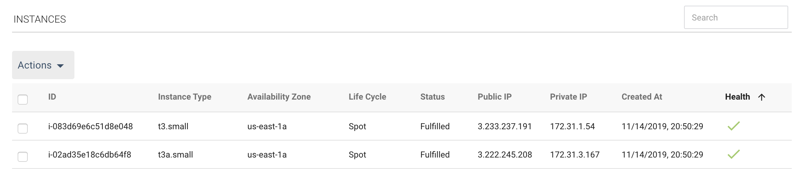


### Blue/Green Deployments Overview

Assuming that you've set up all [prerequisites](#prerequisites), the following sections outline how to create a Blue/Green Workflow and deploy your AMI.

There are two Blue/Green deployment options for Spotinst, defined by the traffic-shifting strategy you want to use:

* **Incrementally Shift Traffic** — In this Workflow, you specify a Production Listener and Rule with two Target Groups for the new Elastigroup to use. Next you add multiple **Shift Traffic Weight** steps.  
Each Shift Traffic Weight step increments the percentage of traffic that shifts to the Target Group for the new Elastigroup.  
Typically, you add Approval steps between each Shift Traffic Weight to verify that the traffic may be increased.
* **Instantly Shift Traffic** — In this Workflow, you specify Production and Stage Listener Ports and Rules to use, and then a **Swap Production with Stage** step swaps all traffic from Stage to Production.

You specify the traffic shift strategy when you create the Harness Blue/Green Workflow for your AMI Spotinst deployment. What steps are available in the Workflow depend on the strategy you select.

### Blue/Green with Incremental Traffic Shift

Currently, this feature is behind a Feature Flag. Contact [Harness Support](mailto:support@harness.io) to enable the feature.This deployment method lets you add Workflow steps to incrementally shift traffic from the Target Group used by the previous Elastigroup to the Target Group used by the new Elastigroup you are deploying.

With this strategy, you are not shifting traffic from stage and production environments. You are shifting traffic incrementally for a production environment. In this way, it is similar to a Canary strategy.

However, in a Canary deployment, the percentage of traffic that goes to the new Elastigroup is determined by the number of instances or the forwarding policy of the load balancer.

With this Incremental Traffic Shift strategy, you are controlling the percentage of traffic sent to the new Elastigroup.

In this section, we will review the requirements, and then describe how the traffic shifting works.

Next, we will walk through building the Workflow for the deployment strategy.

#### Harness Delegate, Service, and Infrastructure Definition Requirements

There are no specific Harness Delegate, Service, and Infrastructure Definition requirements beyond the standard setup described in [Harness Prerequisites](#harness_prerequisites) and [Define the Infrastructure](#define_the_infrastructure) above.

#### Spotinst Requirements

These are described in [Spotinst Prerequisites](#spotinst_prerequisites) above.

#### AWS ELB Listener Requirements

You need the following AWS ELB setup:

* AWS Application Load Balancer configured with one [Listener](https://docs.aws.amazon.com/elasticloadbalancing/latest/application/create-listener.html).
* The Listener must have a [Rule](https://docs.aws.amazon.com/elasticloadbalancing/latest/application/listener-update-rules.html) redirecting to two [Target Groups](https://docs.aws.amazon.com/elasticloadbalancing/latest/application/load-balancer-target-groups.html) (TGs).
* You will need registered target instances for the Target Groups.

Here is an example of an ALB Listeners rule redirecting to two TGs:


This example uses the default rule, but in most cases you will have several rules for redirecting traffic to your services. Typically, the default rule is used as the last rule to catch actions that the other rules do not.

#### Target Group Weight Shifting

The ALB Listener has two TGs with the following weights:

* One TG has a weight of 100 (100%) — This TG is used for the **existing Elastigroup** (pre-deployment).
* The other TG has a weight of 0 — This TG is used for the **new Elastigroup** you are deploying.

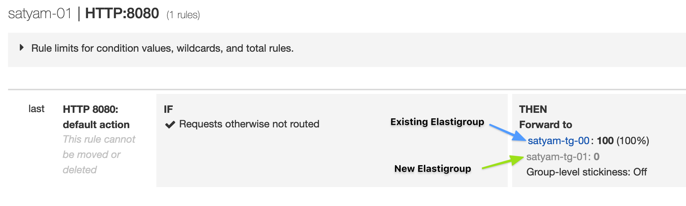

When Harness first creates the new Elastigroup it adjusts its instances to the TG with a weight of 0.

Later in the Workflow, you add **Shift Traffic Weight** step(s) to adjust the weight for this TG. For example, here is a **Shift Traffic Weight** step adjust the weight to 10%:

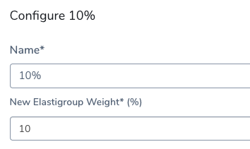

The weight for the **other** TG is automatically set to the remaining percentage. In this case, 90%.

You keep adding **Shift Traffic Weight** steps until the weight of the TG for the new Elastigroup is 100.

You can manipulate traffic shifting using as many **Shift Traffic Weight** steps as you like.Typically, you add [Approval](https://docs.harness.io/article/0ajz35u2hy-approvals) steps between each **Shift Traffic Weight** step to ensure that everything is running smoothly. For example, you can test the new feature(s) of your app before approving. This is a simple way to incorporate A/B testing into your Workflow.

Approval steps are very useful because they enable you to cancel a deployment and return to the pre-deployment traffic weighting with a single step.The Workflow looks something like the following. Here the names of the **Shift Traffic Weight** steps have been changed to describe the weights they are assigning (10%, 100%):

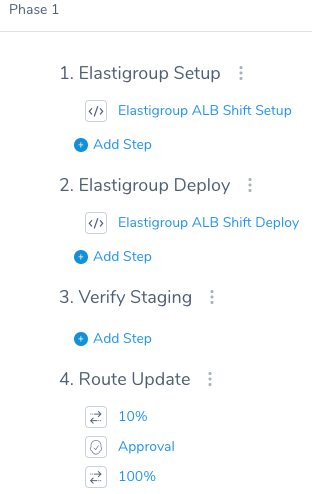

When you deploy the Workflow, you can see the traffic shift:


Let's walk through an example.

#### Create the Blue/Green Workflow

1. In the Harness Application containing the Service and Infrastructure Definition you want to use, click **Workflows**.
2. Click **Add Workflow**.
3. Enter a name for the Workflow.
4. In **Workflow Type**, select **Blue/Green Deployment**.
5. Select an **Environment** and **Service**, and the **Infrastructure Definition** containing your imported Elastigroup JSON Configuration.
6. In **Traffic Shift Strategy**, select **Incrementally Shift Traffic using ELB**.
7. Click **Submit**.

Harness creates the Workflow and automatically adds the steps for deployment.

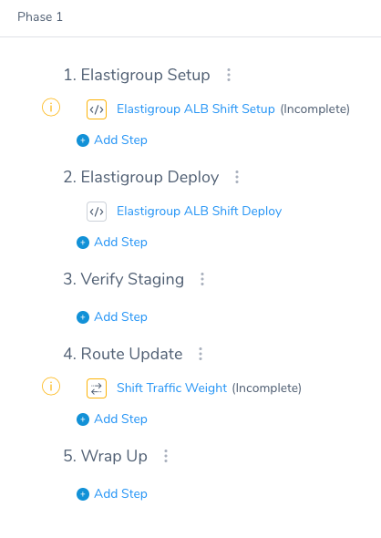

By default, only one **Shift Traffic Weight** step is added. Unless you want to shift the traffic in one step, you will likely add more **Shift Traffic Weight** steps to incrementally shift traffic.

Let's walk through each step.

#### Elastigroup ALB Shift Setup

This step creates the new Elastigroup. In this step, you name the new Elastigroup, specify how instances its uses, and then identity the production load balancer, listener, and Rule to use.

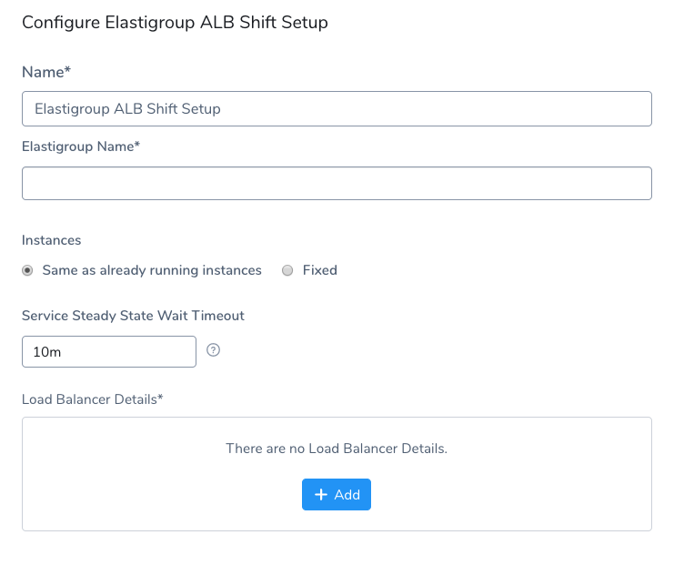

1. Once you have named and defined the number of instances for the Elastigroup, in **Load Balancer Details**, click **Add**.
2. In **Elastic Load Balancer**, select the ELB to use for production traffic.
3. In **Production Listener ARN**, select the Listener to use. This is the listener containing the rule whose weights you will adjust.
4. In **Production Listener Rule ARN**, select the ARN for the rule to use. You can find the ARN by its number in the AWS console.
5. Click **Submit**.

Most of the settings support [Workflow variable expressions](https://docs.harness.io/article/766iheu1bk-add-workflow-variables-new-template). You can use these to template this step and then allow its values to be specified at deployment runtime. You can even pass in the values using a Harness [Trigger](https://docs.harness.io/article/revc37vl0f-passing-variable-into-workflows).When you deploy this Workflow, the output for the step will show the Elastigroup creation and load balancer assignments:


```
Loading Target group data for Listener: [arn:aws:elasticloadbalancing:us-east-1:xxxxxxxxxxxxx:listener/app/satyam-lb/980c9f831d52b33c/f6e4d6f0f276b87f] at port: [null] of Load Balancer: [null]  
Rule Arn: [arn:aws:elasticloadbalancing:us-east-1:xxxxxxxxxxxxx:listener-rule/app/satyam-lb/980c9f831d52b33c/f6e4d6f0f276b87f/f315cc7bdf7adfcb]  
Target group: [arn:aws:elasticloadbalancing:us-east-1:xxxxxxxxxxxxx:targetgroup/satyam-tg-01/0e3345a650f122f4] is Prod, and [arn:aws:elasticloadbalancing:us-east-1:xxxxxxxxxxxxx:targetgroup/satyam-tg-00/1f832e1015afe03d] is Stage  
Deleting Elastigroup with name: [satyam__STAGE__Harness] if it exists  
Creating new Elastigroup with name: [satyam__STAGE__Harness]  
Id of new Elastigroup: [sig-f99216ae]  
Getting data for Prod elastigroup with name: [satyam]  
Completed Blue green setup for Spotinst Traffic Shift.
```
You can see how it identifies both of the TGs for production and stage.

You selected the rule to use and Harness automatically selected the TG with a weight of 0 for production and the TG with a weight of 100 for stage.

Later, in the **Shift Traffic Weight** step(s), these weights are what you will be adjusting.

#### Elastigroup ALB Shift Deploy

This step simply deploys the new Elastigroup you created. It brings the new Elastigroup to steady state with the number of instances you selected in the previous **Elastigroup ALB Shift Setup** step.

There is nothing to configure in this step. You can see its output in the deployment details:

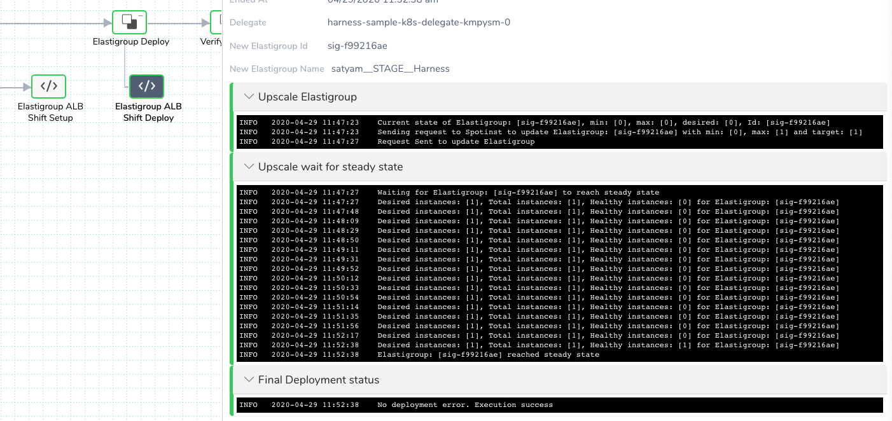

#### Shift Traffic Weight

This is the step where you shift traffic from the TG for the previous Elastigroup to the new Elastigroup you are deploying.

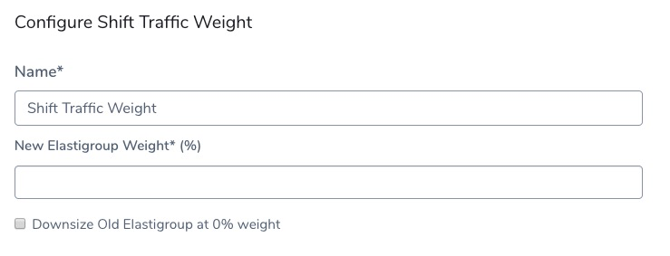

1. In **Name**, it can helpful to name the step after the traffic shift percentage it will apply, such as **10%**. You might also choose to name it according to its position, like **Shift Step 1**.
2. In **New Elastigroup Weight**, enter the percentage of traffic you want shifted from the previous Elastigroup to the new Elastigroup you are deploying.

Most of the settings support [Workflow variable expressions](https://docs.harness.io/article/766iheu1bk-add-workflow-variables-new-template). You can use these to template this step and then allow its values to be specified at deployment runtime. You can even pass in the values using a Harness [Trigger](https://docs.harness.io/article/revc37vl0f-passing-variable-into-workflows).Here is an example of what this step looks like when it shifts traffic 10% during deployment:

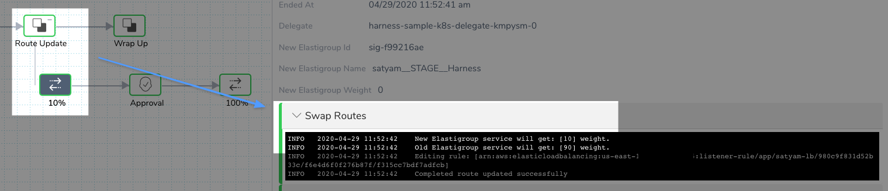

You can see that the New Elastigroup is receiving 10% of traffic and the old Elastigroup is receiving 90%.

Next, you will likely want to follow the Shift Traffic Weight step with an [Approval step](https://docs.harness.io/article/0ajz35u2hy-approvals). This way you can test the new Elastigroup before shifting more traffic to it.

Add more **Shift Traffic Weight** and **Approval** steps until you shift traffic to 100.

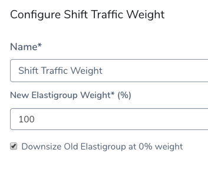

Now your Workflow is ready for deployment.

When you deploy, the final **Shift Traffic Weight** step will look something like this:


##### Downsize Old Elastigroup at 0% weight

The **Downsize Old Elastigroup at 0% weight** setting should only be selected for the **Shift Traffic Weight** step that shifts traffic to **100%** in its **New Elastigroup Weight** setting.

When this setting is enabled, the old Elastigroup is downsized.

##### Shift Traffic Weight Rollback

In the Workflow **Rollback Steps**, Harness adds a **Shift Traffic Weight Rollback** step automatically. If rollback occurs, Harness rolls back to the pre-deployment Elastigroup and TG assignments.

If no Spotinst service setup is found, Harness skips rollback.

In many cases, Harness users place an Approval step in Rollback Steps also:


### Blue/Green with Instant Traffic Shift

In this scenario, a Blue/Green deployment reliably deploys your AMI(s) by maintaining new and old versions of Elastigroups that using these AMIs. The Elastigroups run behind an Application Load Balancer (ALB) using two listeners, Stage and Prod. These listeners forward respectively to two Target Groups (TGs), Stage and Prod, where the new and old Elastigroups are run. 

Elastigroups perform the functions that Auto Scaling Groups perform in standard AMI deployments.In the first stage of deployment, the new Elastigroup—created using the new AMI you are deploying—is attached to the Stage Target Group:


Blue/Green deployments are achieved by swapping routes between the Target Groups—always attaching the new Elastigroup first to the Stage Target Group, and then to the Prod Target Group:

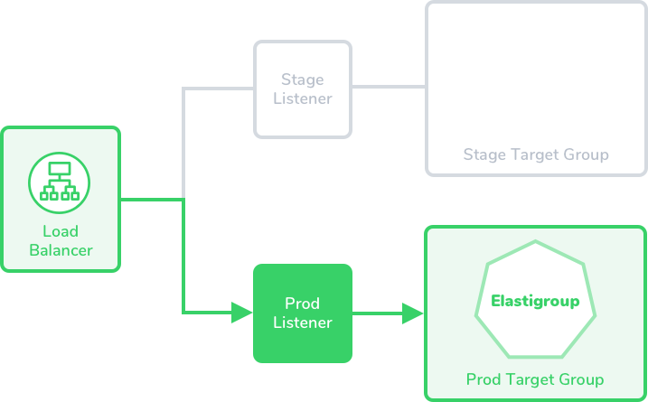
#### Workflow Overview

By default, AMI Elastigroup Blue/Green Workflows in Harness have five steps:

1. [Elastigroup Setup](#setup_asg_bg): Specify how many instances to launch, their resizing order, and their steady state timeout.
2. [Elastigroup Deploy](#upgrade_asg_bg): Specify the number or percentage of instances to deploy within the Elastigroup you've configured in the preceding step.
3. **Verify Staging:** Optionally, specify Verification Providers or Collaboration Providers.
4. [Route Update](#swap_routes_bg): Re-route requests to the Elastigroup that contains the newest stable version of your AMI.
5. **Wrap Up:** Optionally, specify post-deployment commands, notifications, or integrations.

Harness preconfigures the **Setup**, **Deploy**, and **Swap Routes** steps. Below, we outline those steps' defaults and options, with examples of the deployment logs' contents at each step.

The **Verify Staging** and **Wrap Up** steps are placeholders, to which you can add integrations and commands. For details on adding **Verify Staging** integrations, see [Continuous Verification](https://docs.harness.io/article/myw4h9u05l-verification-providers-list).


#### Create the Blue/Green Workflow

In your Application, click **Workflows** > **Add Workflow**. The **Workflow** dialog appears.

1. Enter a **Name**, and (optionally) enter a **Description** of this Workflow's purpose.
2. In **Workflow Type**, select **Blue/Green Deployment**.
3. Select the **Environment** and [Service](#service) **that** you created for your AMI Elastigroup deployments.
4. Select the **Infrastructure Definition** you [configured earlier](#add_infra_def) for AMI Elastigroup deployments. The dialog will now look something like this: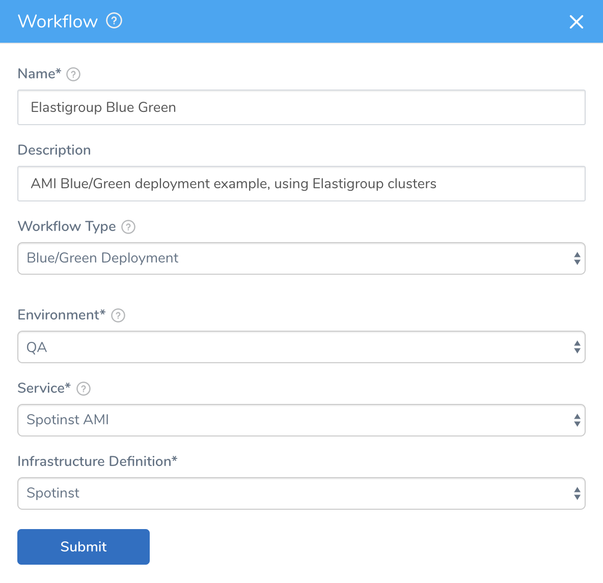
5. Click **Submit**. The new Blue/Green Workflow is preconfigured.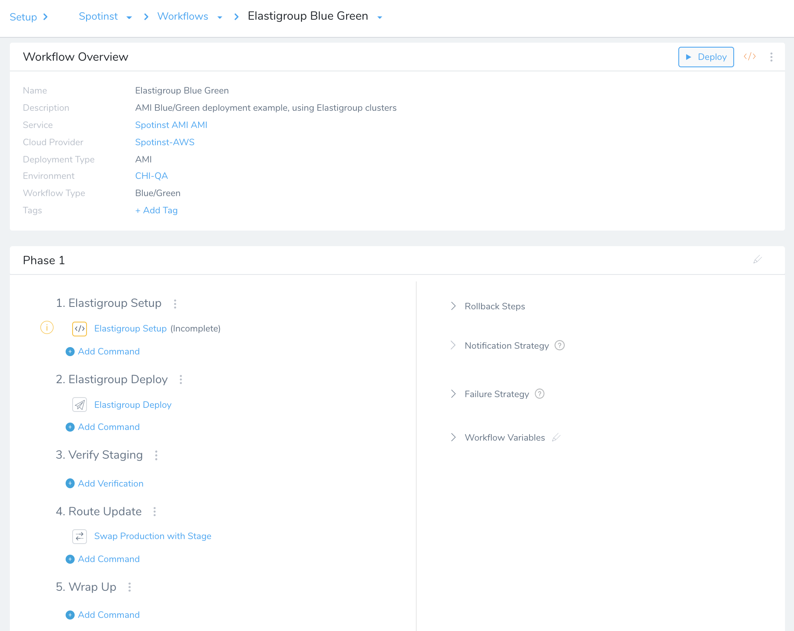

Next, we will examine options for configuring the Blue/Green deployment's **Elastigroup Setup**, **Deploy Elastigroup**, and **Route Update** steps.


#### Step 1: Elastigroup Setup

In Step 1, select **Elastigroup Setup** to open a dialog where you can fine-tune the Elastigroup clusters and Load Balancer configuration for this deployment:

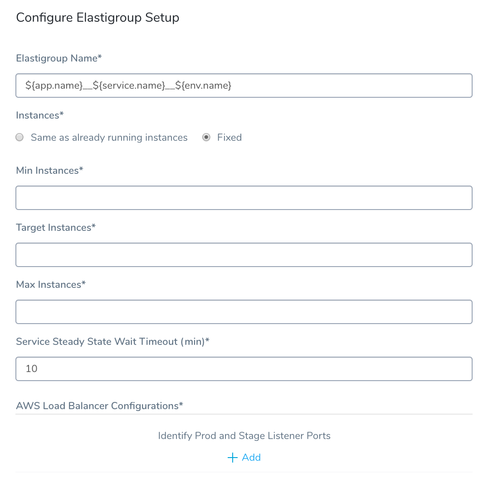

For most settings here, see the corresponding [AMI Basic Workflow instructions](ami-deployment.md#basic-setup-asg). The following steps and recommendations are specific to Elastigroup Blue/Green deployments:

1. In the **Elastigroup Name** field, you can choose to enter a short, recognizable name. (The default name will be a long string automatically concatenated from variables representing the Harness Application, Service, and Environment names.)
2. Harness recommends setting the **Service Steady State Wait Timeout (min)** field to at least **20** minutes, as shown in the above screen capture. This is a safe interval to prevent deployments from failing while waiting for the [Route Update](#swap_routes_bg) step's Blue/Green switchover to complete.
3. In the **AWS Load Balancer Configurations** section, click **Add** to open the controls shown below: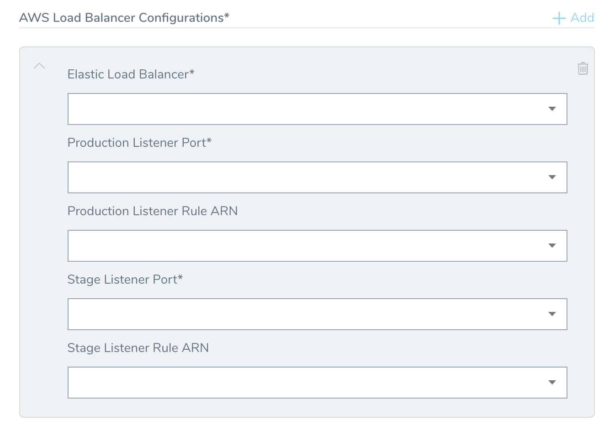
4. Use the **Elastic Load Balancer** drop-down to select at least one load balancer specified in your Infrastructure Definition's [Elastigroup Configuration](#add_elastigroup_configuration).
5. Select, or type in, your desired **Production Listener Port** and **Stage Listener Port**.  
  
You can use the **Add** link to select additional load balancers for this Workflow.The dialog's lower panel will now look something like this: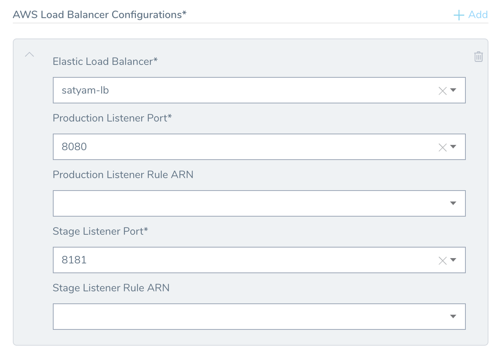

**Listener Rules** — If you are using [Listener Rules](https://docs.aws.amazon.com/elasticloadbalancing/latest/application/load-balancer-listeners.html#listener-rules) in your target groups, you can select them in **Production Listener Rule ARN** and **Stage Listener Rule ARN**.

If you do not select a listener rule, Harness uses the Default rule. You do not need to select the Default rule.

Default rules don't have [conditions](https://docs.aws.amazon.com/elasticloadbalancing/latest/application/load-balancer-listeners.html#rule-condition-types), but other rules do. If you select other rules, ensure the traffic that will use the rules matches the conditions you have set in the rules.

For example, if you have a path condition on a rule to enable [path-based routing](https://docs.aws.amazon.com/elasticloadbalancing/latest/application/tutorial-load-balancer-routing.html), ensure that traffic uses that path.

1. Click **Submit** to save your Elastigroup Setup.


##### Elastigroup Setup in Deployment

Let's look at an example deployment of the Elastigroup Setup shown above. Here is this step in the Harness Deployments page:

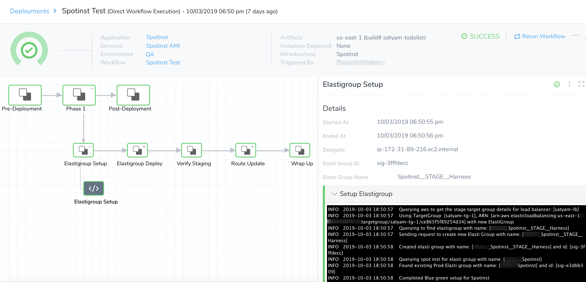

Here's partial output, showing a successful setup:


```
Querying aws to get the stage target group details for load balancer: [satyam-lb]  
Using TargetGroup: [satyam-tg-1], ARN: [arn:aws:elasticloadbalancing:us-east-1:XXXXXXXXXXXX:targetgroup/satyam-tg-1/ce865f5f89254d34] with new ElastiGroup  
Querying to find Elastigroup with name: [Spotinst__STAGE__Harness]  
Sending request to create new Elasti Group with name: [Spotinst__STAGE__Harness]  
Created Elastigroup with name: [Spotinst__STAGE__Harness] and id: [sig-3fffdecc]  
Querying Spotinst for Elastigroup with name: [Spotinst]  
Found existing Prod Elasti group with name: [Spotinst] and id: [sig-e3dbb309]  
Completed Blue green setup for Spotinst
```

#### Step 2: Elastigroup Deploy

In Step 2, define how many instances to deploy in the new Elastigroup cluster, as either a count or a percentage. This deployment example uses percentage scaling, with a desired target of 100%.

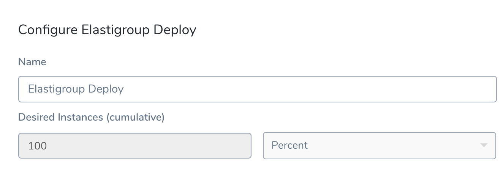

For details about how this setting corresponds to AWS parameters, see the AMI Basic Workflow topic's [Step 2: Deploy Service](ami-deployment.md#upgrade-asg) section.


##### Elastigroup Deploy Step in Deployment

At this point, Harness deploys the new Elastigroup—containing instances created from your new AMI—to the Stage Target Group:

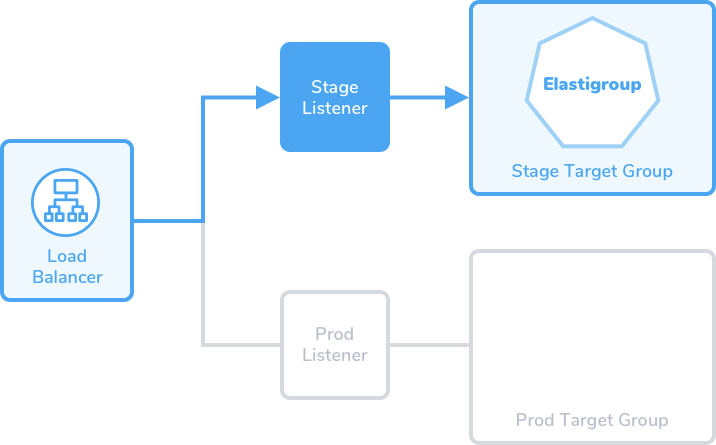

Using the 100% **Desired Instances** configuration shown above, here is the **Elastigroup Deploy** step in the Harness Deployments page:


The **Upscale Elastigroup** log shows the initial request to enlarge the Elastigroup:


```
Current state of Elastigroup: [sig-3fffdecc], min: [0], max: [0], desired: [0], Id: [sig-3fffdecc]  
Sending request to Spotinst to update elasti group: [sig-3fffdecc] with min: [0], max: [1] and target: [1]  
Request Sent to update Elastigroup
```
Next, the **Upscale wait for steady state** log shows the **Elastigroup** successfully resized and at steady state:


```
Waiting for Elastigroup: [sig-3fffdecc] to reach steady state  
Desired instances: [1], Total instances: [1], Healthy instances: [0] for Elastigroup: [sig-3fffdecc]  
...  
Desired instances: [1], Total instances: [1], Healthy instances: [1] for Elastigroup: [sig-3fffdecc]  
Elastigroup: [sig-3fffdecc] reached steady state
```
And the **Final Deployment status** log shows success:


```
No deployment error. Execution success.
```
##### Approval Sub-Step

This example shows an (optional) Approval added to Step 2. It requests manual approval, following successful registration of the Stage Elastigroup, and prior to the Blue/Green (staging/production) switchover in the Step 4.

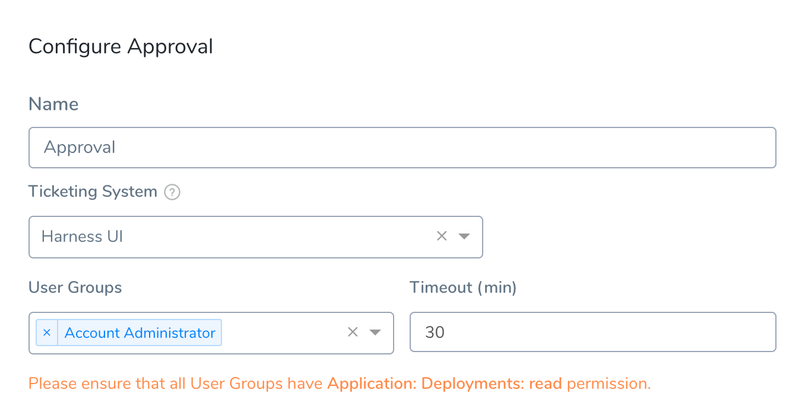


#### Step 4: Route Update

This is the heart of a Blue/Green deployment. Here, Harness directs your selected Load Balancer(s) to perform the following swap:

* Rename the new staging (Blue) Elastigroup to match the production route.
* Rename your production (Green) Elastigroup to match the staging route.

When this step is complete, the new Elastigroup—containing the instances created from your new AMI—are deployed to the production route:


In Step 4, open the **Swap Production with Stage** dialog if you want to toggle the **Downsize Old Elastigroup** setting. When enabled, this check box directs AWS to free up resources from the old Elastigroup once the new Elastigroup registers its targets and reaches steady state.

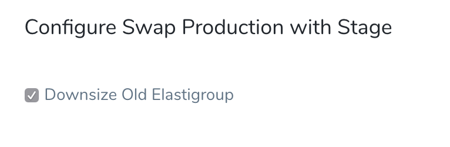


##### Swap Production with Stage Step in Deployment

Using the configuration shown above, here is the **Swap Production with Stage** step in the Harness Deployments page:


Here's partial output. The **Swap Routes** log shows successful swapping of the two Elastigroups' routes:


```
Sending request to rename Elastigroup with ID: [sig-3fffdecc] to [Spotinst]  
Sending request to rename Elastigroup with ID: [ElastiGroup(id=sig-e3dbb309, name=Spotinst, capacity=ElastiGroupCapacity(minimum=0, maximum=1, target=1))] to [Spotinst__STAGE__Harness]  
Updating Listener Rules for Load Balancer  
Route Updated Successfully
```
Now that the former production Elastigroup (`sig-e3dbb309`) has been swapped to staging, the **Downscale Elastigroup** log next shows a request to zero out its instances:


```
Current state of Elastigroup: [sig-e3dbb309], min: [0], max: [1], desired: [1], ID: [sig-e3dbb309]  
Sending request to Spotinst to update Elastigroup: [sig-e3dbb309] with min: [0], max: [0] and target: [0]  
Request Sent to update Elastigroup
```
The **Downscale wait for steady state** log next confirms the staging group's zero instances:


```
Waiting for Elastigroup: [sig-e3dbb309] to reach steady state  
Elastigroup: [sig-e3dbb309] does not have any instances.
```
And the **Final Deployment status** log confirms the **Route Update** step's success:


```
No deployment error. Execution success.
```

#### Deployment Example

Once your setup is complete, you can click the Workflow's **Deploy** button to start the Blue/Green deployment.


In the resulting **Start New Deployment** dialog, select the AMI to deploy, and click **Submit**.

As the Workflow deploys, the Deployments page displays details about the deployed instances.

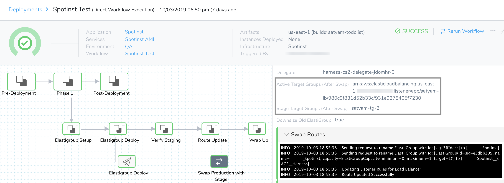

To verify the completed deployment, log into your [Spotinst Console](https://console.spotinst.com/#/aws/ec2/elastigroup/list) and locate the newly deployed instance(s).

### Continuous Verification with Route Update

You can add Harness Continuous Verification to the **Verify Staging** section of the Workflow, but that only verifies the deployment before the **Route Update** section where you use **Shift Traffic Weight** or **Swap Production with Stage**.

To verify deployment after you use **Shift Traffic Weight** or **Swap Production with Stage**, you can add AppDynamics and ELK verification steps.

Click **Add Step**, and then locate these options.


For information on setting these up, see [Verify Deployments with AppDynamics](https://docs.harness.io/article/ehezyvz163-3-verify-deployments-with-app-dynamics) and [Verify Deployments with Elasticsearch](https://docs.harness.io/article/e2eghvcyas-3-verify-deployments-with-elasticsearch).


### Canary Workflow and Deployment

Assuming that you've set up all [prerequisites](#prerequisites), the following sections outline how to create a Canary Workflow and deploy your AMI. To avoid duplication, they focus on Elastigroup-specific configuration and deployment. For background and details, please refer to these related [AMI Canary Deployment Guide](ami-canary.md) sections:

* [Overview](ami-canary.md#overview) and [Default Structure](ami-canary.md#default-structure) for Canary deployment concepts—how Harness progressively deploys your AMI instances.
* [Create a Canary Workflow](ami-canary.md#workflow) for the fundamentals of a Harness AMI Canary deployment—how the default Workflow phases and steps implement the Canary model.

Elastigroups perform the functions that Auto Scaling Groups perform in standard AMI deployments.

#### To Create the Canary Workflow:

1. In your Application, click **Workflows** > **Add Workflow**.
2. In the resulting **Workflow** dialog, enter a unique **Name** and (optionally) a **Description** of this Workflow's purpose.
3. In **Workflow Type**, select **Canary Deployment**.
4. Select the **Environment** that you [configured earlier](#harness_prereq). (This Environment provides a template for your Elastigroups.)  
   The dialog will now look something like this:
   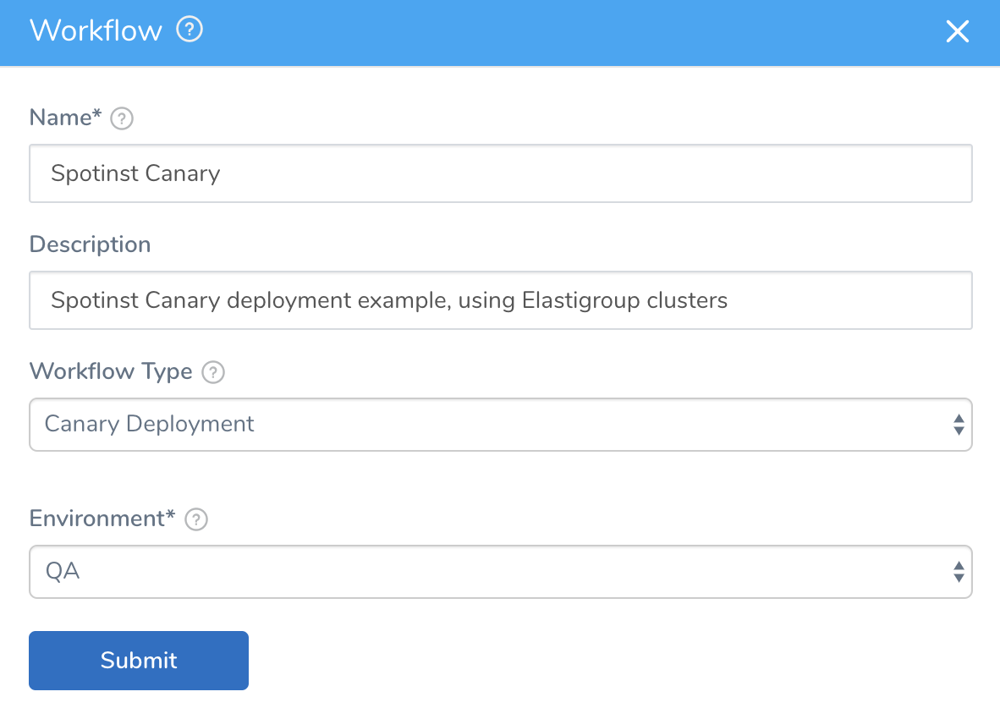
5. Click **SUBMIT**. You've now created your new Canary Workflow.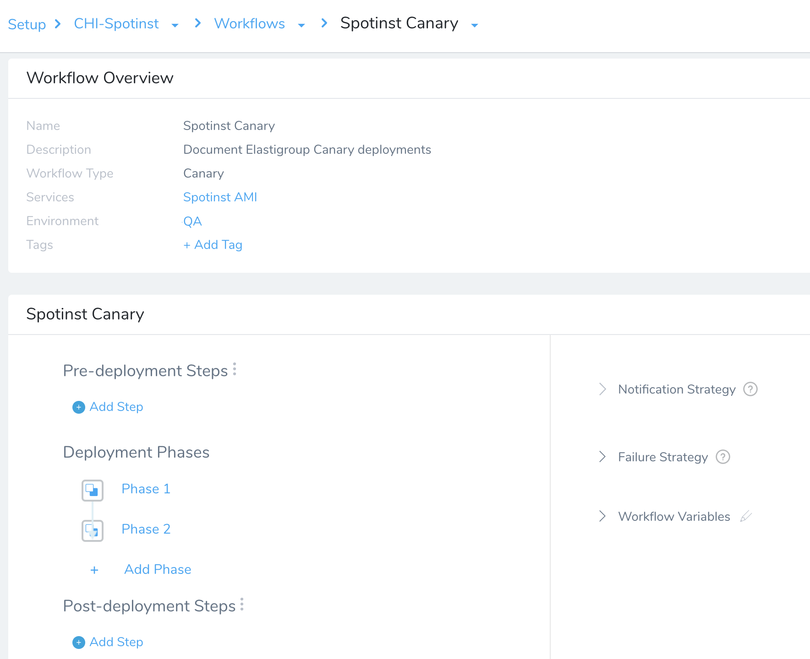


#### Example Structure

In this guide's remaining sections, we will expand only the Workflow's **Deployment Phases**—adding multiple phases, each deploying a percentage of the instance count specified in the first phase. This will build out the following structure:

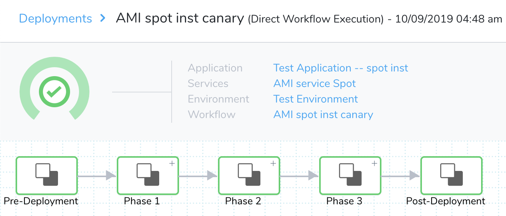

Here are the phases and steps we'll build:

1. [Phase 1: Canary](#phase_1)
   * [Elastigroup Setup](#setup_asg): Specify how many EC2 instances to launch in the Elastigroup that Harness deploys at the end of the Workflow. This step also specifies the steady state timeout.
   * [Deploy Service](#upgrade_asg_1): Specify the percentage of instances to deploy in this phase. When you add additional phases, each phase automatically includes a Deploy Service step, which you must configure with the count or percentage of instances you want deployed in that phase.
   * [Verify Staging](#verify_service_1): This is a stub, while Harness adds support for [Verification Providers](https://docs.harness.io/article/myw4h9u05l-verification-providers-list) in Elastigroup Canary deployments.
   * [Rollback Steps](#rollback_1): Roll back the ASG if deployment fails. (Rollback steps are automatically added here, and to each of the remaining phases. This guide covers them only in this first phase.)
2. [Phase 2: Canary](#phase_2)
   * [Deploy Service](#upgrade_asg_2): Upgrade the Elastigroup to a higher percentage of instances.
   * [Verify Staging](#verify_service_2): This example uses a second round of CloudWatch tests.
3. [Phase 3: Primary](#phase_3)
   * [Deploy Service](#upgrade_asg_3): Upgrade the Elastigroup to its full target capacity.

Ready to deploy? Let's configure and execute this sample Workflow's three Deployment Phases.


### Phase 1: Canary

This example Workflow's first phase defines your Elastigroup, upgrades it to a 25% Canary deployment, and evaluates this partial deployment using (in this example) [CloudWatch](https://docs.harness.io/article/q6ti811nck-cloud-watch-verification-overview) verification.

To add a Canary Phase:

1. In **Deployment Phases**, click **Add Phase**.
2. In **Service**, select the Service you previously [set up](#service) for this AMI.
3. Select the [Infrastructure Definition](#add_infra_def) that you previously configured.
4. In **Service Variable Overrides**, you can add values to overwrite any variables in the Service you selected. Click **Add**, then enter the **Name** of the variable to override, and the override **Value**. (For details, see [Workflow Phases](https://docs.harness.io/article/m220i1tnia-workflow-configuration#workflow_phases).)  
   The **Workflow Phase** dialog will now look something like this:
   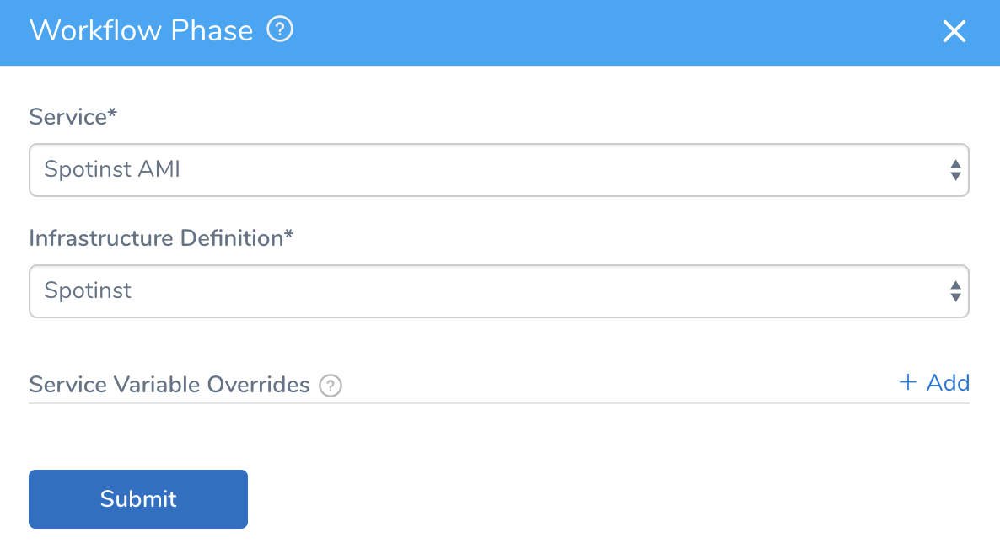
5. Click **Submit**. The new Phase is created.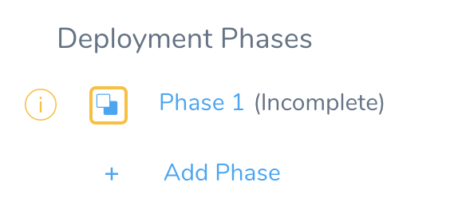
6. Click **Phase 1** to define this Phase's Steps.  
  
On the resulting page, we'll fill in the predefined structure for Steps 1 and 2, and add a Verification provider in Step 3.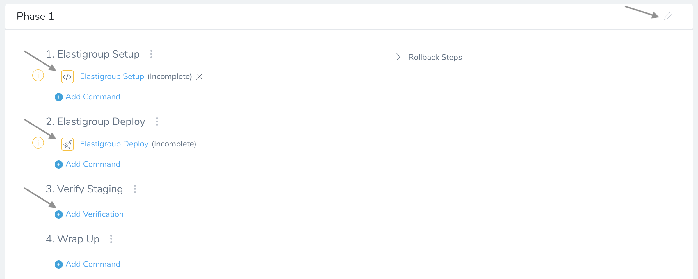

You can give each Phase a descriptive name by clicking the pencil icon at the top right.


#### Step 1: Elastigroup Setup

In Step 1, select **Elastigroup Setup** to define your Elastigroup's instances in the dialog shown below:

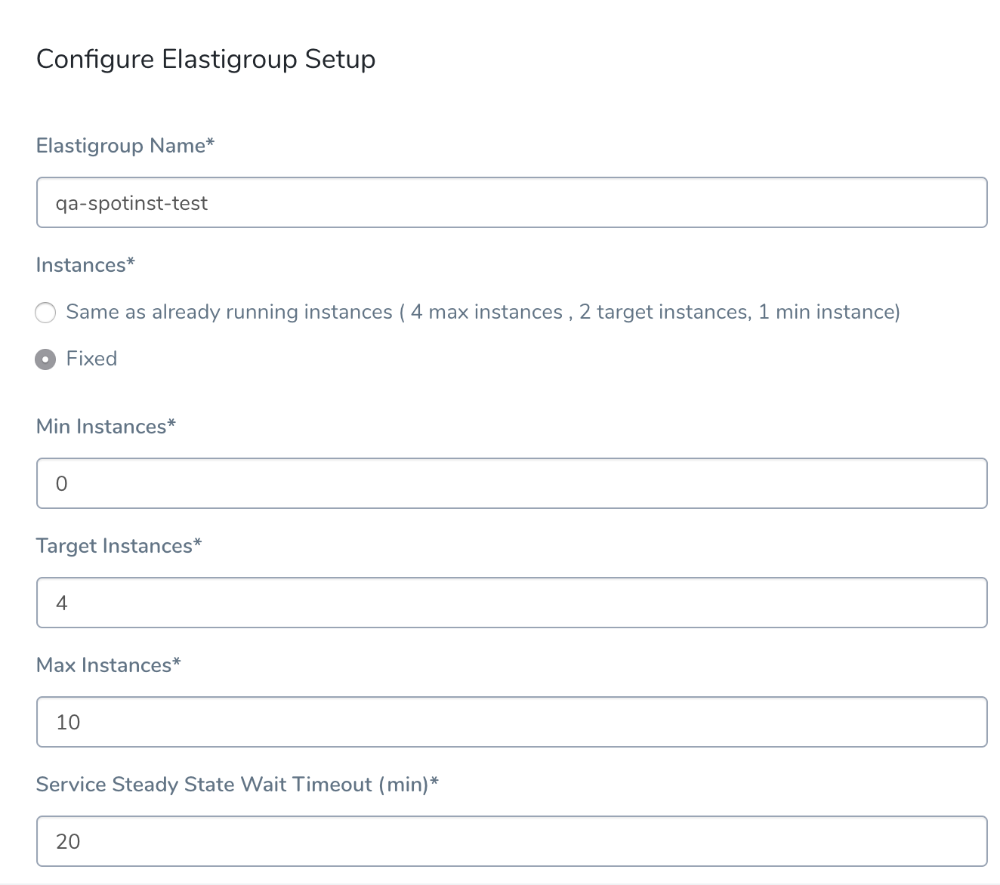

For details about this dialog's fields, see the corresponding [AMI Basic Workflow instructions](ami-deployment.md#basic-setup-asg). For this Workflow, we've selected **Fixed Instances**, and have set **Max Instances** to **10** and **Target Instances** to **4**. We've also increased the default **Timeout** to **20** minutes.

All Canary counts or percentages specified later in the Workflow are based on the **Target Instances** setting. So, when we later deploy **25%** in this phase's [Elastigroup Deploy](#upgrade_asg_1) step, that will be 25% of this **Target Instances** setting.
##### Elastigroup Setup Step in Deployment

Let's look at an example of deploying the Elastigroup Setup we configured above. Here's the step in the Harness Deployments page:

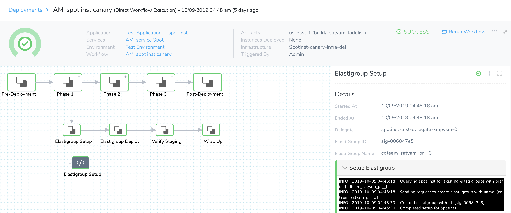

Here's partial output, showing a successful setup:


```
Querying Spotinst for existing Elastigroups with prefix: [cdteam_satyam_pr__]  
Sending request to create Elastigroup with name:[cdteam_satyam_pr__5]  
Created Elastigroup with ID: [sig-054f224d]  
Completed setup for Spotinst
```
The new Elastigroup is set up, but no instances are deployed yet. Instances will be deployed in this phase's [following](#upgrade_asg_1) **Elastigroup Deploy** step, and in future phases' similar steps.


#### Step 2: Elastigroup Deploy

In Step 2, select **Elastigroup Deploy** to open a dialog where you can define how many (by **Count** or **Percent**) of the Elastigroup's Target Instances to deploy:

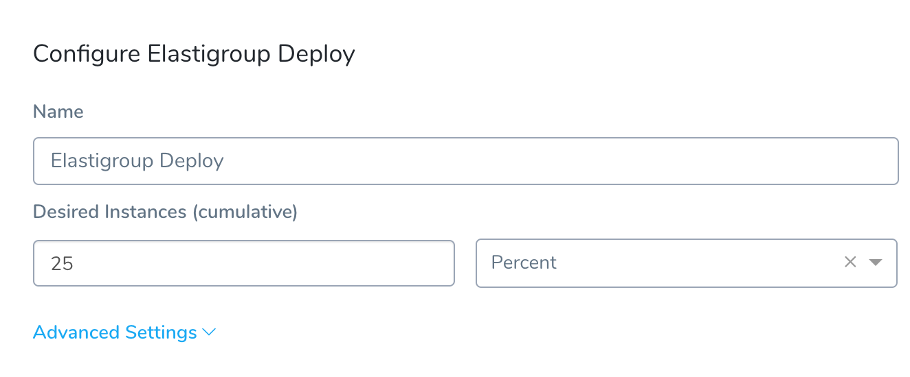

In this example, we've selected **Percent** units, and **25** percent of the **Target Instances** we set in the [previous step](#setup_asg)'s **Elastigroup Setup**.

For general information on customizing this dialog's settings, and on how they correspond to AWS parameters, see the corresponding [AMI Basic Workflow section](ami-deployment.md#upgrade-asg).
##### Elastigroup Deploy Step in Deployment

Using the **Elastigroup Setup** configuration shown above, here is the **Elastigroup Deploy** step in the Harness Deployments page:

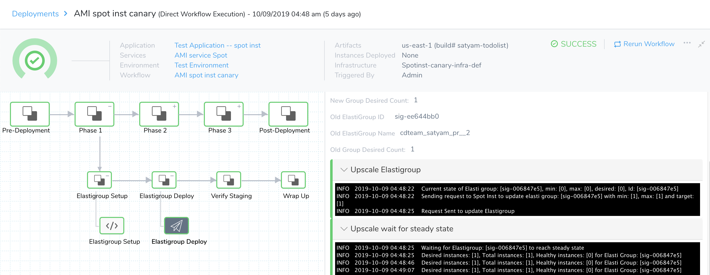

The **Upscale Elastigroup** log shows the request to expand the Elastigroup. We requested **25 Percent** of **4 Target Instances**, so the log shows a request for `target: [1]`.


```
Current state of Elastigroup: [sig-054f224d], min: [0], max: [0], desired: [0], ID: [sig-054f224d]  
      
Sending request to Spotinst to update Elastigroup: [sig-054f224d] with min: [1], max: [1] and target: [1]  
      
Request Sent to update Elastigroup
```
The **Upscale wait for steady state** log (excerpted) confirms that the new Elastigroup has successfully expanded to `Healthy instances: [1]`.


```
Waiting for Elastigroup: [sig-054f224d] to reach steady state  
Desired instances: [1], Total instances: [1], Healthy instances: [0] for Elastigroup: [sig-054f224d]  
...  
Desired instances: [1], Total instances: [1], Healthy instances: [1] for Elastigroup: [sig-054f224d]  
Elastigroup: [sig-054f224d] reached steady state
```

#### Step 3: Verify Staging

Harness does not yet support [Verification Providers](https://docs.harness.io/article/myw4h9u05l-verification-providers-list) in Elastigroup Canary deployments.Once Continuous Verification support is added for Elastigroup, a Canary Workflow's Canary phases are the ideal places to add verification steps, using the [Canary Analysis strategy](https://docs.harness.io/article/0avzb5255b-cv-strategies-and-best-practices#canary_analysis). If the Canary phases are verified, you can assume that the Primary phase will proceed successfully.

For an example of how a **Verify Staging** step appears in the Harness Deployments page (and its **Details** panel), see our (non-Elastigroup) AMI Canary Deployment Guide's [Step 3: Verify Service](ami-canary.md#verify-service-1).


#### Rollback Steps

By default, each Elastigroup Canary phase includes a **Rollback Steps** section, containing an **Elastigroup Rollback** step. There's nothing to configure in this step.

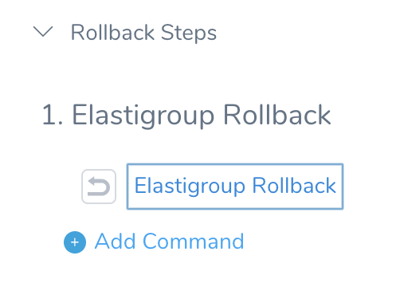

If an Elastigroup Canary phase fails to deploy, its Rollback step will roll back the whole Workflow to its state prior to this deployment, by performing the following operations:

* Roll back all Workflow phases, at once.
* Restore the old Elastigroup to its original capacity.
* Downscale the new Elastigroup, and delete it. This deletes its newly created instances, conserving AWS resources and costs.

A rollback does not modify the configuration JSON within Spotinst.

Here is a rollback example, from a separate deployment:

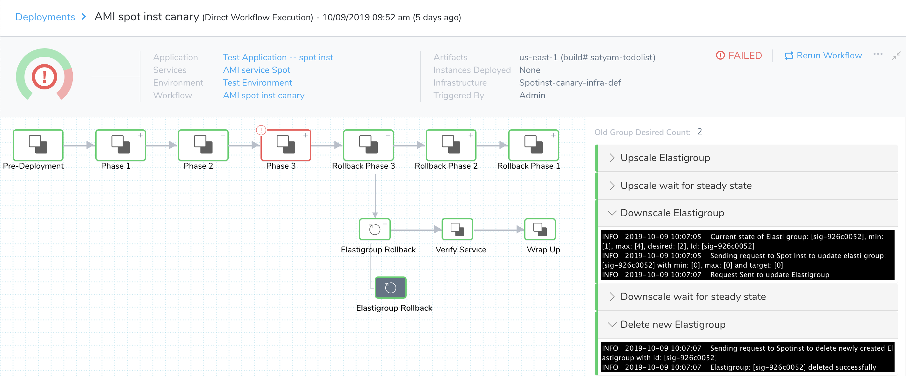

Excerpts from the **Upscale Elastigroup** and **Upscale wait for steady state** logs show the old Elastigroup expanding back to its original capacity:


```
Current state of Elastigroup: [sig-006847e5], min: [0], max: [0], desired: [0], Id: [sig-006847e5]  
Sending request to Spotinst to update Elastigroup: [sig-006847e5] with min: [1], max: [4] and target: [2]  
Waiting for Elastigroup: [sig-006847e5] to reach steady state  
Desired instances: [2], Total instances: [2], Healthy instances: [0] for Elastigroup: [sig-006847e5]  
...  
Desired instances: [2], Total instances: [2], Healthy instances: [2] for Elastigroup: [sig-006847e5]  
Elastigroup: [sig-006847e5] reached steady state
```
Excerpts from the **Downscale Elastigroup** and **Downscale wait for steady state** logs show the new Elastigroup shrinking to zero instances:


```
Current state of Elastigroup: [sig-926c0052], min: [1], max: [4], desired: [2], Id: [sig-926c0052]  
Sending request to Spotinst to update Elastigroup: [sig-926c0052] with min: [0], max: [0] and target: [0]  
...  
Waiting for Elastigroup: [sig-926c0052] to reach steady state  
Elastigroup: [sig-926c0052] does not have any instances.
```
Finally, the **Delete new Elastigroup** log confirms the deletion of the failed new Elastigroup:


```
Sending request to Spotinst to delete newly created Elastigroup with id: [sig-926c0052]  
Elastigroup: [sig-926c0052] deleted successfully
```

### Phase 2: Canary

In this example Workflow, we'll add a second Canary phase, in which we'll define a second **Elastigroup Deploy** step. To add the second phase:

1. In **Deployment Phases**, again click **Add Phase**.
   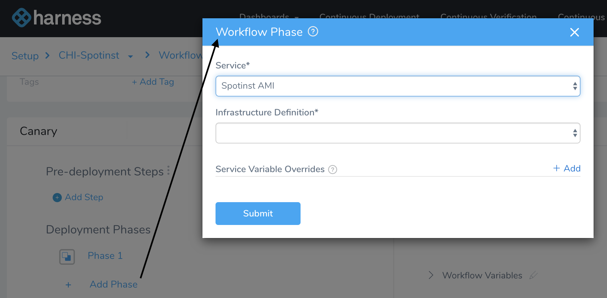
2. In the resulting **Workflow Phase** dialog, select the same **Service**, **Infrastructure Definition**, and any **Service Variable Overrides** that you selected in [Phase 1](#phase_1).
3. Click **Submit** to create the new Phase.


#### Step 1: Deploy Service

Since we already [set up the Elastigroup](#setup_asg) in Phase 1, this new phase's Step 1 defaults directly to **Elastigroup Deploy**.

Click the **Elastigroup Deploy** link to open this dialog, where we're again using **Percent** scaling, but doubling the percentage to **50 Percent** of the Elastigroup's **Target Instances**, before clicking **Submit**:


To review: This means we're requesting 50 percent of the **4** Target Instances that we specified in Phase 1's [Elastigroup Setup](#setup_asg) step.


##### Deploy Service Step in Deployment

Using the **Upgrade AutoScaling Group** configuration shown above, here is the **Deploy Service** step in the Harness Deployments page:

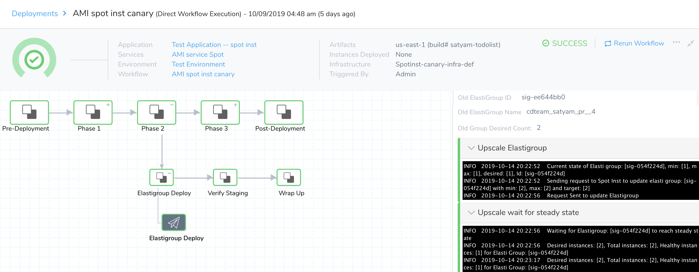

Here is partial log output, showing the Elastigroup successfully resized and at steady state. The upgrade to `Desired instances: [2]` corresponds to our request for **50 Percent** of **4 Target Instances**:


```
Current state of Elastigroup: [sig-054f224d], min: [1], max: [1], desired: [1], ID: [sig-054f224d]  
Sending request to Spotinst to update Elastigroup: [sig-054f224d] with min: [2], max: [2] and target: [2]  
Waiting for Elastigroup: [sig-054f224d] to reach steady state  
Desired instances: [2], Total instances: [2], Healthy instances: [1] for Elastigroup: [sig-054f224d]  
Request Sent to update Elastigroup  
...  
Desired instances: [2], Total instances: [2], Healthy instances: [2] for Elastigroup: [sig-054f224d]  
Elastigroup: [sig-054f224d] reached steady state  
...  
No deployment error. Execution success.
```

#### Step 2: Verify Staging

Once Harness adds [Continuous Verification](https://docs.harness.io/article/myw4h9u05l-verification-providers-list) support for Elastigroup deployments, you could use this step to verify this second Canary phase using any Harness-supported [Verification Provider](https://docs.harness.io/article/myw4h9u05l-verification-providers-list#supported_providers).


### Phase 3: Primary

If prior Canary phases succeed, the Workflow's final phase runs the actual deployment—creating an Elastigroup with the full number of instances you specified in the [Elastigroup Setup](#setup_asg) step.

To add this final phase:

1. Return to the Workflow's details page.
2. In **Deployment Phases**, below your two existing Phases, again click **Add Phase**.
3. In the resulting **Workflow Phase** dialog, select the same **Service**, **Infrastructure Definition**, and any **Service Variable Overrides** that you selected in [Phase 1](#phase_1).
4. Click **Submit** to create the new Phase.  
  
The resulting **Phase 3** page provides structure only for an **Elastigroup Deploy** step, and that's the only step we'll define.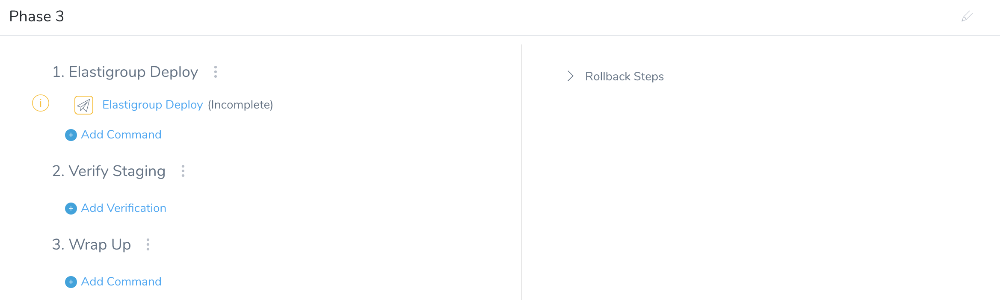


#### Step 1: Deploy Service

To define this phase's scaling:

1. In Step 1, select **Elastigroup Deploy**.
2. In the resulting dialog, again select **Percent** scaling, and set the **Desired Instances** to **100** percent of the Elastigroup's Target Instances**:**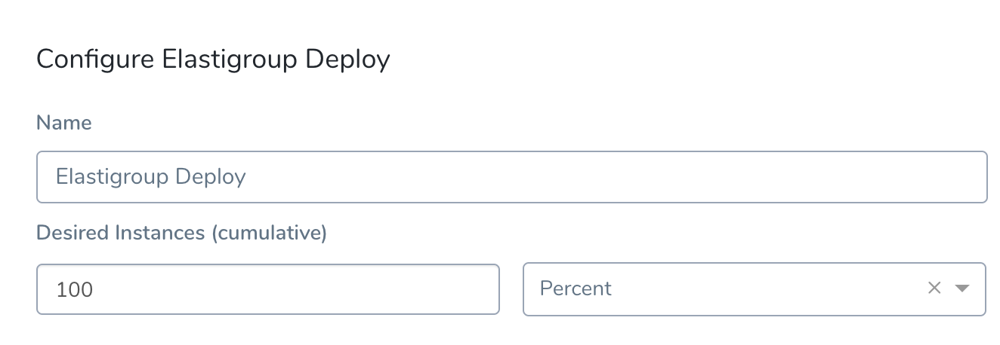
3. Click **SUBMIT** to complete this Workflow's three-phase configuration.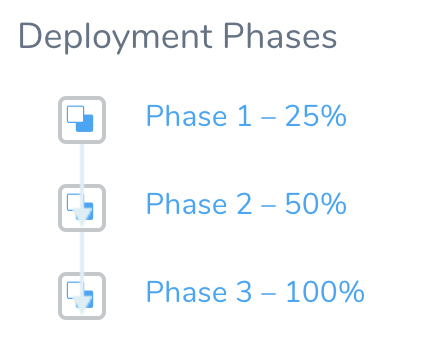


##### Elastigroup Deploy Step in Deployment

Using the **Elastigroup Deploy** configuration shown above, here is this final **Deploy Service** step in the Harness Deployments page:

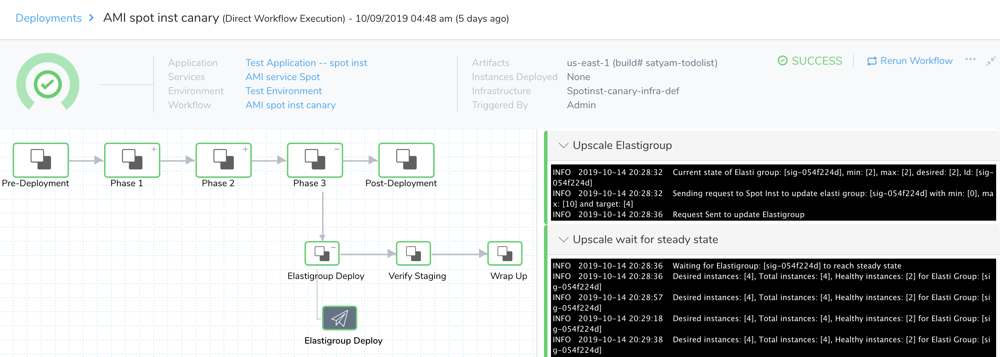

Here is partial output, showing the Elastigroup fully upscaling to `Desired instances: [4]`, and reaching steady state:


```
Current state of Elastigroup: [sig-054f224d], min: [2], max: [2], desired: [2], Id: [sig-054f224d]  
Sending request to Spotinst to update Elastigroup: [sig-054f224d] with min: [0], max: [10] and target: [4]  
Request Sent to update Elastigroup  
...  
Waiting for Elastigroup: [sig-054f224d] to reach steady state  
Desired instances: [4], Total instances: [4], Healthy instances: [2] for Elastigroup: [sig-054f224d]  
...  
Desired instances: [4], Total instances: [4], Healthy instances: [3] for Elastigroup: [sig-054f224d]  
...  
Desired instances: [4], Total instances: [4], Healthy instances: [4] for Elastigroup: [sig-054f224d]  
Elastigroup: [sig-054f224d] reached steady state  
...   
No deployment error. Execution success.
```
And at this point...our AMI is fully deployed.


### Deploy the Workflow

As with the [AMI Basic deployment](ami-deployment.md#deployment-basic), once your setup is complete, you can click the Workflow's **Deploy** button to start the Canary deployment.


In the resulting **Start New Deployment** dialog, select the AMI to deploy, and click **Submit**.

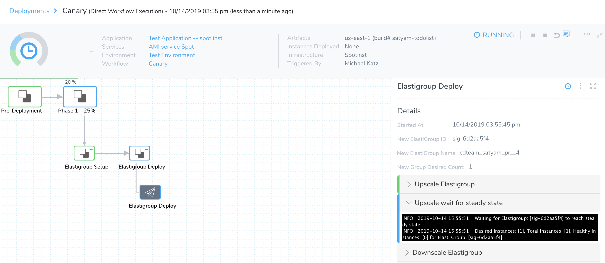

As the Workflow deploys, the Deployments page displays details about the deployed instances.To verify the completed deployment, log into your [Spotinst Console](https://console.spotinst.com/#/aws/ec2/elastigroup/list) and locate the newly deployed instance(s).


### Frequently Asked Questions

#### How Does Harness Downsize Old ASGs?

See [How Does Harness Downsize Old Elastigroups?](../../concepts-cd/deployment-types/ami-spotinst-elastigroup-deployments-overview.md#how-does-harness-downsize-old-elastigroups).

#### Can a single Workflow deploy multiple Services, each with different User Data?

You define [User Data](ami-deployment.md#deployment-specification-user-data) at the Service level. A Harness Canary Workflow can deploy different Services, each in a separate Workflow phase. Currently, each Harness Blue/Green Workflow supports only a single Service. However, as a multi-Service workaround, you can combine multiple Blue/Green Workflows in a Pipeline.

#### Can changeable Elastigroup parameters be set in Harness' JSON, without configuring them in Spotinst?

Yes. Because Harness directs Spotinst to build the Elastigroups at deployment time, you can use the Harness Infrastructure Definition's **Elastigroup Configuration** JSON to define infrastructure not yet configured in Spotinst. For details, see [Service Variables in Elastigroup Configuration](#svc_variables).

#### Can users set inbound-traffic restrictions on a Blue/Green deployment's Staging port?

Yes. Assign an appropriate port in your Workflow's [Elastigroup Setup](#setup_asg_bg) step.


### Next Steps

* Add monitoring to your AMI deployment and running instances: see [Continuous Verification](https://docs.harness.io/article/myw4h9u05l-verification-providers-list) and [24/7 Service Guard Overview](https://docs.harness.io/article/dajt54pyxd-24-7-service-guard-overview).

