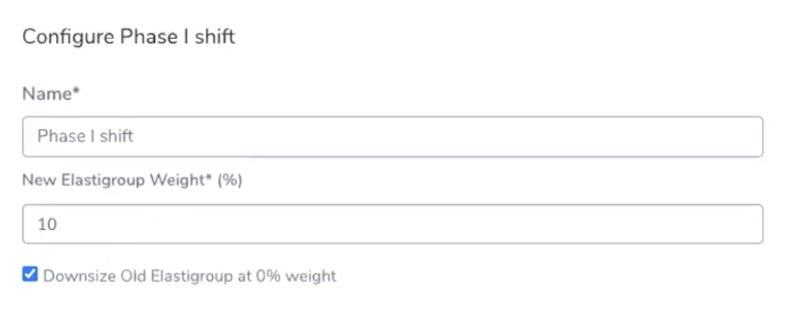
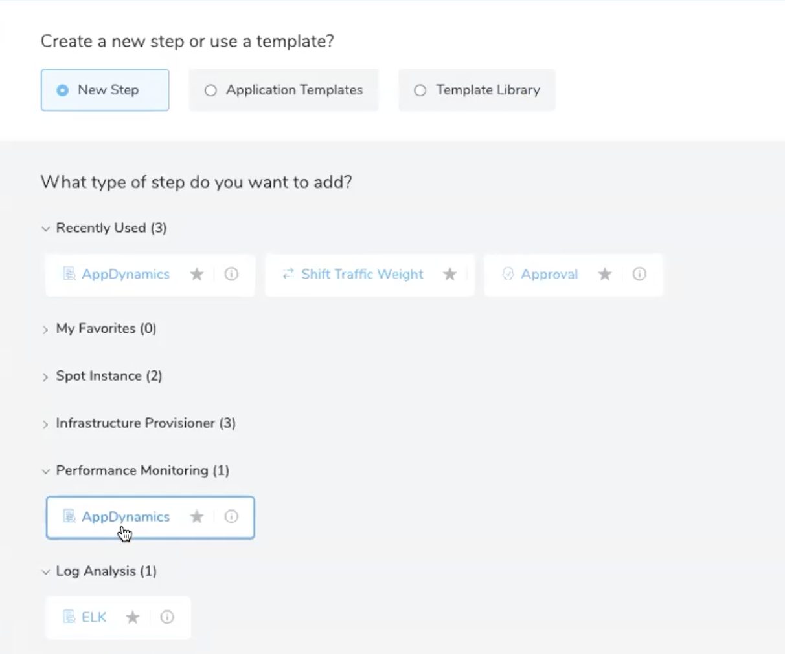
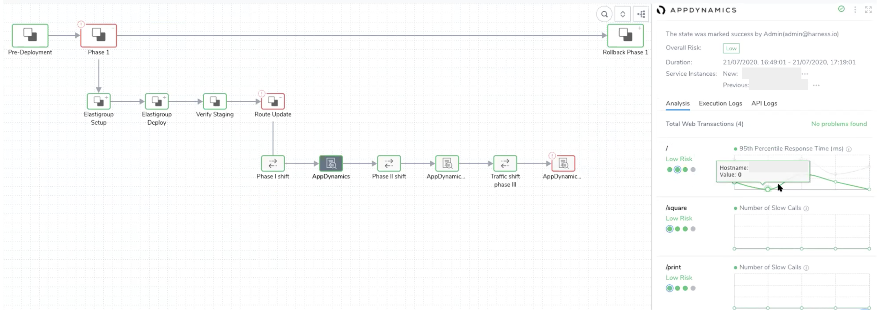

You can configure performance monitoring and log analysis verification of Spotinst traffic shifting. 

Currently, this feature is only supported for SpotInst Blue/Green deployments.

### Before You Begin

* Review the [prerequisites for configuring the Workflow using Traffic Split Strategy](ami-elastigroup.md#spotinst-prerequisites).
* Follow the deployment instructions for [Blue/Green Deployment with Incremental Traffic Shift](ami-elastigroup.md#blue-green-with-incremental-traffic-shift).

### Step 1: Add the Workflow with Traffic Shift Strategy

1. In the Harness Application containing the Service and Infrastructure Definition you want to use, click **Workflows**.
2. Click **Add Workflow**.
3. Enter a name for the Workflow.
4. In **Workflow Type**, select **Blue/Green Deployment**.
5. Select an **Environment** and **Service**, and the **Infrastructure Definition** containing your imported Elastigroup JSON Configuration.
6. In **Traffic Shift Strategy**, select Incrementally **Shift Traffic using ELB**.
7. Click **Submit**.

Harness creates the Workflow and automatically adds the steps for deployment.

By default, only one **Shift Traffic Weight** step is added. Unless you want to shift the traffic in one step, you will likely add more **Shift Traffic Weight** steps to incrementally shift traffic.

For more information about Blue/Green Deployment and Workflow creation, see [Blue/Green Deployment with Incremental Traffic Shift](ami-elastigroup.md#blue-green-with-incremental-traffic-shift).

### Step 2: Add Traffic Split Step

1. Add the required steps in sections for deployment and staging verification.
2. Add traffic shift steps in the Route Update section after the Verify Staging section based on the percentage shift required.

You can manipulate traffic shifting using as many Shift Traffic Weight steps as you like.

Typically, you add Approval steps between each Shift Traffic Weight step to ensure that everything is running smoothly. For example, you can test the new feature(s) of your app before approving. This is a simple way to incorporate A/B testing into your Workflow.

Approval steps are very useful because they enable you to cancel a deployment and return to the pre-deployment traffic weighting with a single step.

### Step 3: Add Verification Step

In the **Route Update** section, after each traffic split step, you can add the verification step for one of the following:

* **Performance Monitoring**—**AppDynamics**: For more information on configuring AppDynamics verification, see [Verify Deployments with AppDynamics](../../continuous-verification/appdynamics-verification/3-verify-deployments-with-app-dynamics.md).
* **Log Analysis**—**ELK**: For more information on configuring ELK verification see [Verify Deployments with Elasticsearch](../../continuous-verification/elk-elasticsearch-verification/3-verify-deployments-with-elasticsearch.md).

Make sure you add the verification steps for traffic split only in the **Route Update** section.

The configure AppDynamics/ELK procedure is similar to the regular configuration, except for the **Baseline for Risk Analysis** input. You can select only **Canary Analysis**.

Traffic split analysis will be performed only if the new traffic percentage is less than 50%. Analysis will not be performed if the traffic split is more than 50%.

### Step 4: View Verification Results

Once you have executed the Workflow, Harness performs the verification you configured and displays the results in the **Deployments** and **Continuous Verification** pages. Verification is executed in real time, quantifying the business impact of every production deployment.

For a quick overview of the verification UI elements, see [Continuous Verification Tools](../../../starthere-firstgen/meet-harness.md#continuous-verification-tools). For details about viewing and interpreting verification results, see [Verification Results Overview](../../continuous-verification/continuous-verification-overview/concepts-cv/deployment-verification-results.md).

