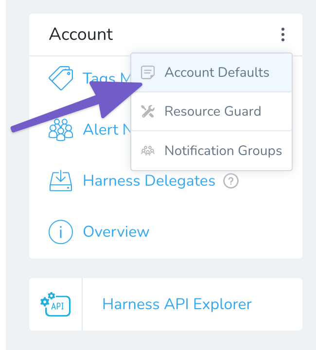
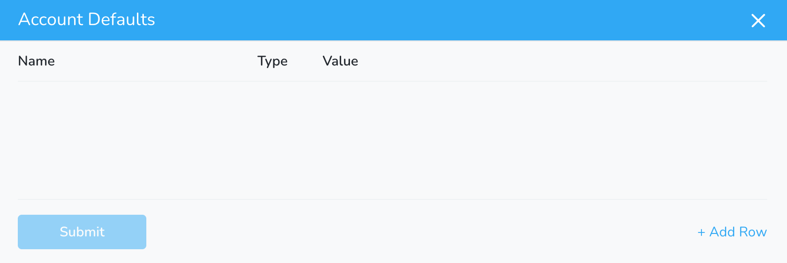
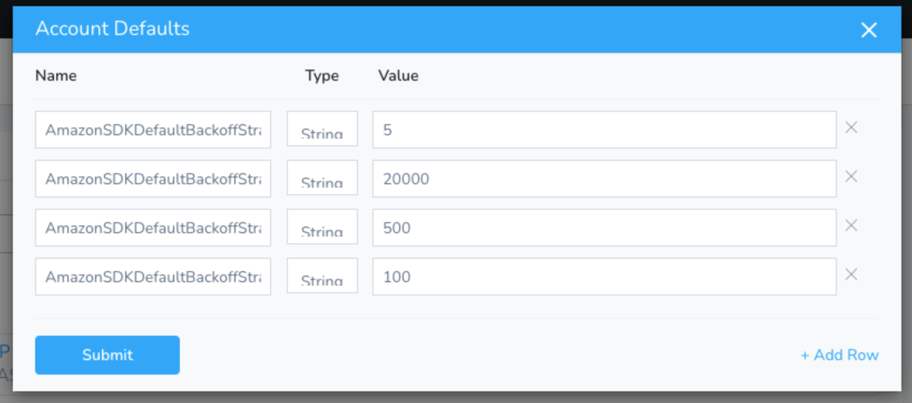

In some Harness CloudFormation and ECS deployments you might get failures with `ThrottlingException` or `Rate exceeded` errors for CloudFormation and ECS API calls.

This can happen when CloudFormation and ECS API calls exceed the maximum allowed API request rate per AWS account and region. Requests are throttled for each AWS account on a per-region basis to help service performance. See [Service endpoints and quotas](https://docs.aws.amazon.com/general/latest/gr/aws-service-information.html) from AWS.

This topic describes how to remedy this situation by setting Amazon SDK default backoff strategy params for CloudFormation and ECS.

### Limitations

* If you have multiple AWS accounts tied to one Harness account with backoff strategy params enabled, backoff params and strategies will be applied on all AWS accounts.

### Equal Jitter and Full Jitter Backoff Strategies

The Amazon SDK Default backoff strategy is the combination of Equal Jitter and Full Jitter backoff strategies. The SDK Default strategy uses the Full Jitter strategy for non-throttled exceptions and the Equal Jitter strategy for throttled exceptions.

Here's the list of non-throttled error and status codes where Full Jitter strategy is applied: 


```
"TransactionInProgressException",  
"RequestTimeout",  
"RequestTimeoutException",  
"IDPCommunicationError",  
500,  
502,  
503,  
504,  
"RequestTimeTooSkewed",  
"RequestExpired",  
"InvalidSignatureException",  
"SignatureDoesNotMatch",  
"AuthFailure",  
"RequestInTheFuture",  
"IOException"
```
Here's list of throttled error codes where Equal Jitter strategy is applied:


```
"Throttling",  
"ThrottlingException",  
"ThrottledException",  
"ProvisionedThroughputExceededException",  
"SlowDown",  
"TooManyRequestsException",  
"RequestLimitExceeded",  
"BandwidthLimitExceeded",  
"RequestThrottled",  
"RequestThrottledException",  
"EC2ThrottledException",  
"PriorRequestNotComplete",  
"429 Too Many Requests"
```
For more strategies, see [Exponential Backoff And Jitter](https://aws.amazon.com/blogs/architecture/exponential-backoff-and-jitter/) from AWS.

### Setting Backoff Strategy Params in Harness

In a Harness CloudFormation or ECS implementation, you can set these parameters using **Account Defaults** settings.

In your Harness account, click **Setup**.

In **Account**, click more options (︙), and then click **Account Defaults**.



The **Account Defaults** appear.



To add a parameter, click **Add Row**.

Here's the list of supported Amazon default SDK backoff strategy parameters:

All values are in milliseconds.

|  |  |  |
| --- | --- | --- |
| **Default SDK Backoff Strategy Param** | **Default Value** | **Description** |
| `AmazonSDKDefaultBackoffStrategy_maxErrorRetry` | `5` ms | The maximum number of retries. |
| `AmazonSDKDefaultBackoffStrategy_baseDelay` | `100` ms | Base delay for *FullJitterBackoffStrategy.* |
| `AmazonSDKDefaultBackoffStrategy_maxBackoff` | `20000` ms | The maximum backoff time after which retries will not be performed. |
| `AmazonSDKDefaultBackoffStrategy_throttledBaseDelay` | `500` ms | Base delay for *EqualJitterBackoffStrategy.* |

When you're done, the **Account Defaults** will look something like this:



### Next Steps

You will need to tune Amazon SDK Default backoff strategy params based on the API request rate per AWS account and region already set.

