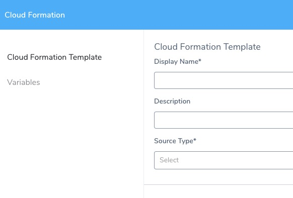
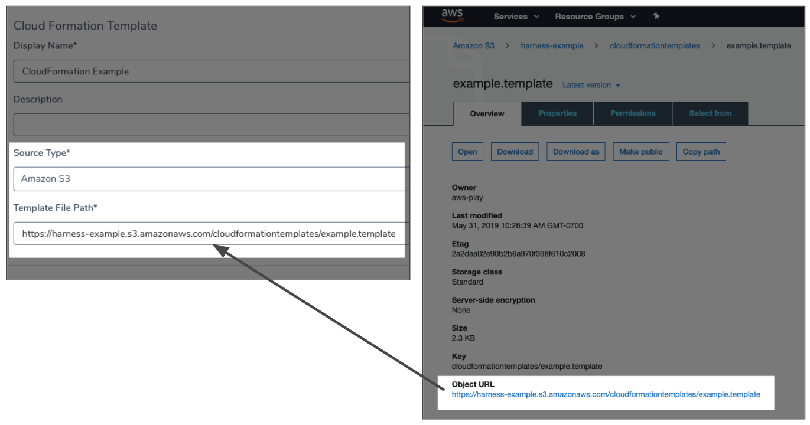
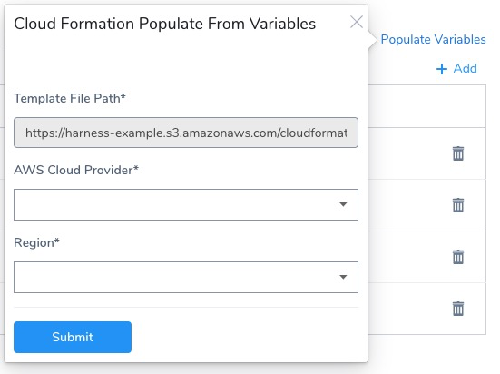
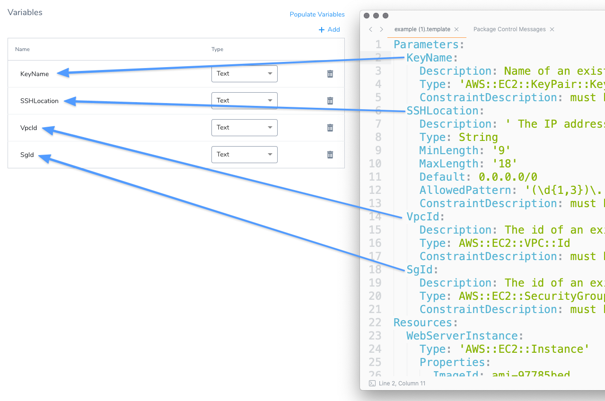
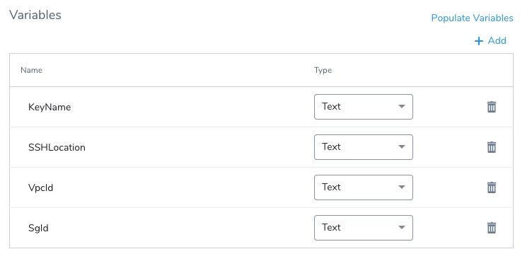
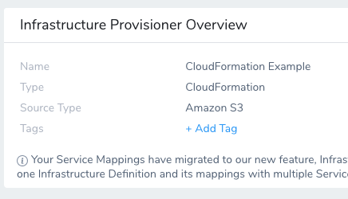

This content is for Harness [FirstGen](../../../../getting-started/harness-first-gen-vs-harness-next-gen.md). Switch to [NextGen](https://docs.harness.io/article/vynj4hxt98).This topic describes how to set up a Harness Infrastructure Provisioner for CloudFormation.

Once the Harness Infrastructure Provisioner is set up, you can use it to define a deployment target in a Harness Infrastructure Definition.

Once you add the Infrastructure Definition to a Workflow, you add a CloudFormation Create Stack step to the Workflow. The CloudFormation Create Stack step uses the same Harness Infrastructure Provisioner to run your templates and build the target infrastructure, and then deploy to it.

This topic walks you through a detailed setup of a Harness CloudFormation Provisioner.


### Before You Begin

* [CloudFormation Provisioning with Harness](../../concepts-cd/deployment-types/cloud-formation-provisioning-with-harness.md)
* [Set Up Your Harness Account for CloudFormation](cloud-formation-account-setup.md)

### Limitations

* Harness supports first class CloudFormation provisioning for AWS-based infrastructures:
	+ SSH
	+ AMI/Auto Scaling Group
	+ ECS
	+ Lambda
* AWS CloudFormation has its own template limits. See [Limits and Restrictions](https://aws.amazon.com/cloudformation/faqs/#Limits_and_Restrictions) from AWS.
* If you have plus signs (`+`) in the AWS S3 bucket URL, Harness changes these to spaces. Harness changes the plus signs because plus signs in AWS S3 URLs are interpreted as spaces by AWS. It is a limitation of AWS. If you want to use a `+` in your URL, replace it with URL encoding `%2B` in any file path in Harness.

### Visual Summary

This topic describes step 1 in the Harness CloudFormation Provisioning implementation process:


Once you have completed this topic, you can move onto the next step: [Map CloudFormation Infrastructure](map-cloud-formation-infrastructure.md).

### Step 1: Add a CloudFormation Provisioner

Setting up the CloudFormation Provisioner involves the following steps:

1. Add your CloudFormation template via its S3 bucket, Git repo, or simply paste it into Harness.
2. Import any input variables.

Let's get started.

To set up a CloudFormation Infrastructure Provisioner, do the following:

1. In your Harness Application, click **Infrastructure Provisioners**.
2. Click **Add Infrastructure Provisioner**, and then click **CloudFormation**. The **Add CloudFormation Provisioner** dialog appears.
   
3. In **Display Name**, enter the name for this provisioner. You will use this name to select this provisioner in Harness Infrastructure Definition and the CloudFormation Create Stack Workflow step.

### Step 2: Add Your CloudFormation Template

Your CloudFormation template can be added in one of three ways:

* AWS S3 bucket.
* Git repo.
* Paste in the template.

For S3 and the Git repo, you must have an AWS Cloud Provider or Source Repro Provider set up in Harness. See [Set Up Your Harness Account for CloudFormation](cloud-formation-account-setup.md).

Let's walk through these options.

CloudFormation templates may be in JSON or YAML and Harness accepts both formats. Nested stacks are supported for **Amazon S3** source types only. This is an [AWS limitation](https://docs.aws.amazon.com/AWSCloudFormation/latest/UserGuide/aws-properties-stack.html).

#### Template Body

1. If you select **Template Body**, then paste in the CloudFormation template JSON or YAML.


You can also use [Harness variable expressions](https://docs.harness.io/article/9dvxcegm90-variables), such as [Workflow variables](https://docs.harness.io/article/766iheu1bk-add-workflow-variables-new-template), in **Template Body**.

#### Git Repository

For Git Repository, ensure that you have added a SourceRepo Provider in Harness that connects to your Git repo. For more information, see [Add SourceRepo Providers](https://docs.harness.io/article/ay9hlwbgwa-add-source-repo-providers).

If you select **Git Repository**, do the following:

1. In **Source Repository**, select a SourceRepo Provider for the Git repo you added to your Harness account.
2. In **Commit ID**, select **Latest from Branch** or **Specific Commit ID**.
3. In **Branch/Commit ID**, enter the branch or commit ID for the remote repo.
4. In **File Path**, enter the repo file and folder path.  
  
For example, if the full path to your script is **http://github.com/johnsmith/harness/branch1/scripts/foo.yaml**, and you selected **Branch** and entered **branch1**, in **File Path** you can enter **scripts/foo.yaml** or even **./scripts/foo.yaml**.  
  
Using the same example, if you selected **Specific Commit ID** and enter a commit ID, in **File Path** you can enter **scripts/foo.yaml** or even **./scripts/foo.yaml**.

You cannot also use [Harness variable expressions](https://docs.harness.io/article/9dvxcegm90-variables), such as [Workflow variables](https://docs.harness.io/article/766iheu1bk-add-workflow-variables-new-template), in **File Path** at this time.

#### Amazon S3

For Amazon S3, ensure you have added an AWS Cloud Provider to connect Harness to your AWS account, as described in [Set Up Your Harness Account for CloudFormation](cloud-formation-account-setup.md).

If you select **Amazon S3**, in **Template File Path**, enter the URL for the template in its S3 bucket.



Only enter the [globally-unique S3 bucket name URL](https://docs.aws.amazon.com/AmazonS3/latest/userguide/UsingBucket.html). Not the region-specific URL.You can also use [Harness variable expressions](https://docs.harness.io/article/9dvxcegm90-variables), such as [Workflow variables](https://docs.harness.io/article/766iheu1bk-add-workflow-variables-new-template), in **Template File Path**.Ensure that the AWS Cloud Provider has permissions to read the bucket contents. The required policies is `AmazonS3ReadOnlyAccess` and you need another policy with the action `cloudformation:GetTemplateSummary`. See [Set Up Your Harness Account for CloudFormation](cloud-formation-account-setup.md).

You can find many template samples from CloudFormation [Sample Templates](https://docs.aws.amazon.com/AWSCloudFormation/latest/UserGuide/cfn-sample-templates.html).

### Step 3: Add Input Variables

Likely, your template contains [input parameters](https://docs.aws.amazon.com/AWSCloudFormation/latest/UserGuide/gettingstarted.templatebasics.html#gettingstarted.templatebasics.parameters) that require specific values be passed in when Harness creates a stack from the template. For example, here is an input parameter for a key pair named **KeyName**:


```
Parameters:  
  KeyName:  
    Description: Name of an existing EC2 KeyPair to enable SSH access to the instance  
    Type: 'AWS::EC2::KeyPair::KeyName'  
    ConstraintDescription: must be the name of an existing EC2 KeyPair.
```
You can add these input parameters to your Harness CloudFormation Provisioner and specify the values for the inputs when you use this provisioner in a Workflow.

In **Variables**, click **Add** to add your inputs manually.

You can use **Populate Variables** if you added a URL to your template in an S3 bucket or Git repo.

You can also use **Populate Variables** if you added your template manually, but you will need to also select an AWS Cloud Provider and region. Harness uses those to access the AWS CloudFormation API, parse the template you entered manually, and extract the variables.We will cover the **Populate Variables** scenario.

1. Click **Populate Variables**. The **Populate from Example** assistant appears.
2. If you are using an AWS S3 source:
	1. In **AWS Cloud Provider**, select the AWS Cloud Provider you added that has permission to access the template in the S3 bucket.
	2. In **Region**, select the AWS region where the AWS Cloud Provider should connect. AWS S3 is global, but AWS connections require a region.
3. If you are using a Git Repository source, you do not need to enter anything.
4. Click **Submit**. The input parameters from your template are added automatically:
5. For each input, select the type of value required: **Text** or **Encrypted Text**. When this provisioner is added to a Workflow, the user will have to provide a value for the input that matches the type. Encrypted Text values use secrets you set up in Harness [Secrets Management](https://docs.harness.io/article/au38zpufhr-secret-management).

Here is what the input variables look like in a Workflow CloudFormation Create Stack step:



### Step 4: Complete the CloudFormation Provisioner

Once you have completed your setup, click **Submit**. The CloudFormation Provisioner is created.



Next you will map template outputs to the Harness Infrastructure Definition settings Harness requires for provisioning.

### Next Steps

* [Map CloudFormation Infrastructure](map-cloud-formation-infrastructure.md)

