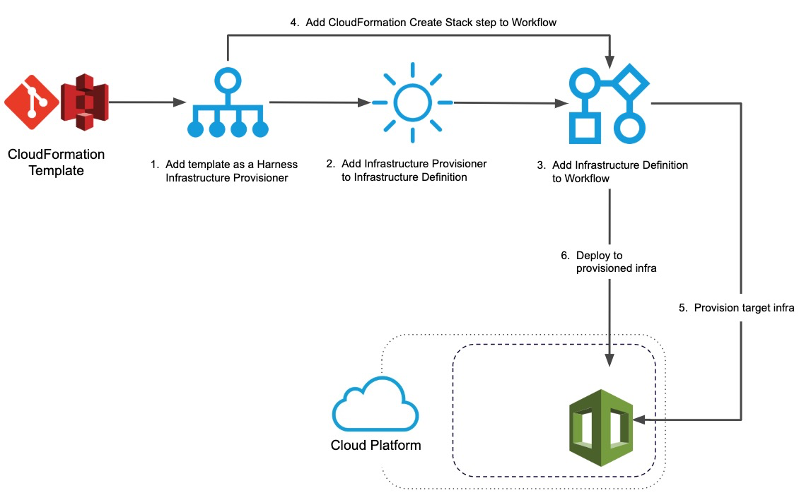
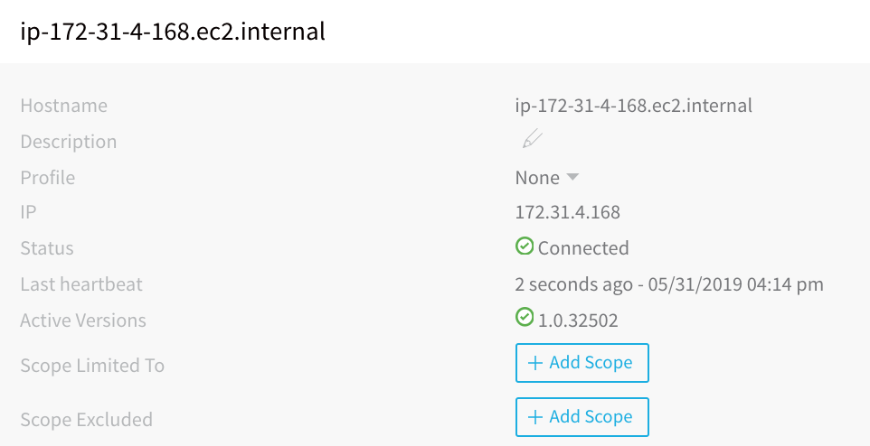
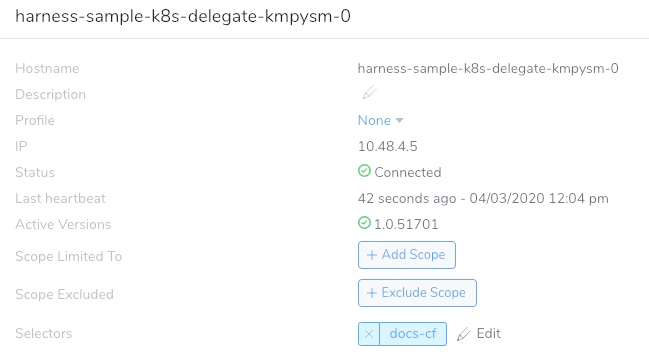
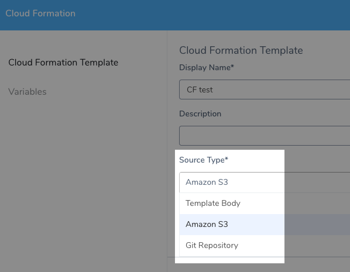

This content is for Harness [FirstGen](../../../../getting-started/harness-first-gen-vs-harness-next-gen.md). Switch to [NextGen](https://docs.harness.io/article/vynj4hxt98).The first step in integrating your CloudFormation templates and processes is setting up the necessary Harness account components: Delegates, Cloud Providers, and Source Repo Providers.

This topic describes how to set up these components for CloudFormation.

Once your account is set up, you can begin integrating your CloudFormation templates. See  [Add CloudFormation Templates](add-cloud-formation-templates.md).


### Before You Begin

* [Harness Key Concepts](https://docs.harness.io/article/4o7oqwih6h-harness-key-concepts)
* [CloudFormation Provisioning with Harness](../../concepts-cd/deployment-types/cloud-formation-provisioning-with-harness.md)
* [Delegate Installation and Management](https://docs.harness.io/article/h9tkwmkrm7-delegate-installation)
* [Add Cloud Providers](https://docs.harness.io/article/whwnovprrb-cloud-providers)
* [Add Source Repo Providers](https://docs.harness.io/article/ay9hlwbgwa-add-source-repo-providers)

### Visual Summary

This topic describes the Harness account setup steps that you perform before you start to add your CloudFormation templates.

Once your Harness account is set up, CloudFormation provisioning in Harness is as follows:



### Review: Limitations

* Harness CloudFormation integration does not support AWS Serverless Application Model (SAM) templates. Only standard [AWS CloudFormation templates](https://docs.aws.amazon.com/AWSCloudFormation/latest/UserGuide/cfn-whatis-concepts.html#w2ab1b5c15b7).
* Harness Infrastructure Provisioners are only supported in Canary and Multi-Service deployment types. For AMI deployments, Infrastructure Provisioners are also supported in Blue/Green deployments.

### Step 1: Set Up Harness Delegates

There are many types of Delegates, but for CloudFormation, the Shell Script and ECS Delegates are used most often.

The Harness AWS Cloud Provider can connect Harness to your AWS account, and Source Repo if needed, using these Delegates. For more information, see [Delegate Installation and Management](https://docs.harness.io/article/h9tkwmkrm7-delegate-installation) and [Add Cloud Providers](https://docs.harness.io/article/whwnovprrb-cloud-providers).

The Delegate should be installed where it can connect to the provisioned environment it creates.

Ideally, this is the same subnet as the instances you will provision, but if you are provisioning the subnet then you can put the Delegate in the same VPC and ensure that it can connect to the provisioned subnet using security groups.

To set up the Delegate, do the following:

1. Install the Delegate on a host where it will have connectivity to your provisioned instances. To install a Delegate, follow the steps in [Delegate Installation and Management](https://docs.harness.io/article/h9tkwmkrm7-delegate-installation) using a Shell Script or ECS Delegate. Once the Delegate is installed, it will be listed on the **Harness Delegates** page.
   
2. When you add a Harness AWS Cloud Provider, you will set up the Cloud Provider to assume the IAM role used by the Delegate. This is done using a Delegate Selector. For steps on installing a Delegate Selector, see [Delegate Installation and Management](https://docs.harness.io/article/h9tkwmkrm7-delegate-installation).

When you are done, the Delegate listing will look something like this:



#### Permissions

The Delegate requires permissions according to the target deployment service (ECS, EC2, Lambda).

For ECS Delegates, you can add an IAM role to the ECS Delegate task definition. For more information, see  [Trust Relationships and Roles](https://docs.harness.io/article/h9tkwmkrm7-delegate-installation#trust_relationships_and_roles).

If you will use AWS S3 as the source for your CloudFormation templates, then the IAM role used by the Delegate will also need policies to read templates from AWS S3. This is described below in [Step 3: Add Template Resource](#step_3_add_template_resource).

### Step 2: Set Up the AWS Cloud Provider

For a CloudFormation deployment, Harness can use a single AWS Cloud Provider to connect to your AWS account and do the following:

* Obtain artifacts from Elastic Container Registry (ECR) or S3.
* Obtain the CloudFormation template from S3.
* Provision infrastructure in AWS.
* Deploy to the provisioned infrastructure in AWS.

When you create the AWS Cloud Provider, you can enter the platform account information for the Cloud Provider to use as credentials, or you can use a Delegate running in your AWS infrastructure to provide the IAM role for the Cloud Provider.

With CloudFormation, you are building an infrastructure on a platform that requires specific permissions, and so the account used by the AWS Cloud Provider (either by username and password or Delegate IAM role) needs the required policies.

For example, to create AWS EC2 AMI instances, the account/role needs the **AmazonEC2FullAccess** policy.

See the list of policies in [Add Cloud Providers](https://docs.harness.io/article/whwnovprrb-cloud-providers).

For steps on adding an AWS Cloud Provider, see [Amazon Web Services (AWS) Cloud](https://docs.harness.io/article/whwnovprrb-cloud-providers#amazon_web_services_aws_cloud).

When the AWS Cloud Provider uses the installed Delegate for credentials via the Delegate's Selector, it assumes the IAM role used to add the Delegate.

#### Permissions

The AWS Cloud Provider must have **create** permissions for the resources you are planning to create using the CloudFormation template.

As discussed earlier, for Harness AWS Cloud Providers, you can install the Delegate in your AWS VPC and have the Cloud Provider assume the permissions used by the Delegate.

Just ensure that the IAM role assigned to the Delegate host (EC2 or ECS) has **create** permissions for the resources you are planning to create using the CloudFormation template.

### Step 3: Add Template Resource

CloudFormation templates are added to Harness by either pasting them into a text field, using an AWS S3 URL that points to the template, or using a Git repo.



Setting up and AWS S3 and Git connections are described below.

Connections to AWS CodeCommit are made in Harness Source Repo Providers, not as an AWS Cloud Provider.

#### Option 1: Use AWS S3

You can use the same AWS Cloud Provider to provision your AWS deployment environment and access the S3 bucket URL.

The AWS Cloud Provider will need credentials to access the S3 bucket.

These policies are required:

* The Managed Policy **AmazonS3ReadOnlyAccess**.
* The [Customer Managed Policy](https://docs.aws.amazon.com/IAM/latest/UserGuide/access_policies_managed-vs-inline.html#customer-managed-policies) you create using `ec2:DescribeRegions`.
* The Customer Managed Policy you create using `cloudformation:GetTemplateSummary`.

The AWS  [IAM Policy Simulator](https://docs.aws.amazon.com/IAM/latest/UserGuide/access_policies_testing-policies.html) is a useful tool for evaluating policies and access.**Policy Name**: `AmazonS3ReadOnlyAccess`.

**Policy ARN:** `arn:aws:iam::aws:policy/AmazonS3ReadOnlyAccess`.

**Description:** Provides read-only access to all buckets via the AWS Management Console.

**Policy JSON:**


```
{  
  "Version": "2012-10-17",  
  "Statement": [  
    {  
      "Effect": "Allow",  
      "Action": [  
        "s3:Get*",  
        "s3:List*"  
      ],  
      "Resource": "*"  
    }  
  ]  
}
```
**Policy Name:** `HarnessS3`.

**Description:** Harness S3 policy that uses EC2 permissions. This is a customer-managed policy you must create. In this example we have named it `HarnessS3`.

**Policy JSON:**


```
{  
    "Version": "2012-10-17",  
    "Statement": [  
        {  
            "Sid": "VisualEditor0",  
            "Effect": "Allow",  
            "Action": "ec2:DescribeRegions",  
            "Resource": "*"  
        }  
    ]  
}
```
If you want to use an S3 bucket that is in a separate account than the account used to set up the AWS Cloud Provider, you can grant cross-account bucket access. For more information, see  [Bucket Owner Granting Cross-Account Bucket Permissions](https://docs.aws.amazon.com/AmazonS3/latest/dev/example-walkthroughs-managing-access-example2.html) from AWS.**Policy Name:** `HarnessCloudFormation`.

**Description:** Returns information about a new or existing template. See [GetTemplateSummary](https://docs.aws.amazon.com/AWSCloudFormation/latest/APIReference/API_GetTemplateSummary.html) from AWS.

**Policy JSON:**


```
{  
    "Version": "2012-10-17",  
    "Statement": [  
        {  
            "Effect": "Allow",  
            "Action": [  
                "cloudformation:GetTemplateSummary"  
            ],  
            "Resource": "*"  
        }  
    ]  
}
```
See [Add Cloud Providers](https://docs.harness.io/article/whwnovprrb-cloud-providers).

The policies can be added to the AWS account you use to set up the AWS Cloud Provider. If the AWS Cloud Provider is using the Delegate for credentials, then the role applied to the Delegate host must have the policies.

The following links provide useful information for ensuring access between EC2 instances and S3 buckets:

* [Verify Resource-Based Permissions Using the IAM Policy Simulator](https://aws.amazon.com/blogs/security/verify-resource-based-permissions-using-the-iam-policy-simulator/)
* [How can I grant my Amazon EC2 instance access to an Amazon S3 bucket in another AWS account?](https://aws.amazon.com/premiumsupport/knowledge-center/s3-instance-access-bucket/)

#### Option 2: Use Your Git Repo

If you want to use a Git repo as the source of your CloudFormation templates, you need to add a connection to your repo as a Harness Source Repo Provider.

See [Add Source Repo Providers](https://docs.harness.io/article/ay9hlwbgwa-add-source-repo-providers).

### Next Steps

* [Add CloudFormation Templates](add-cloud-formation-templates.md)

