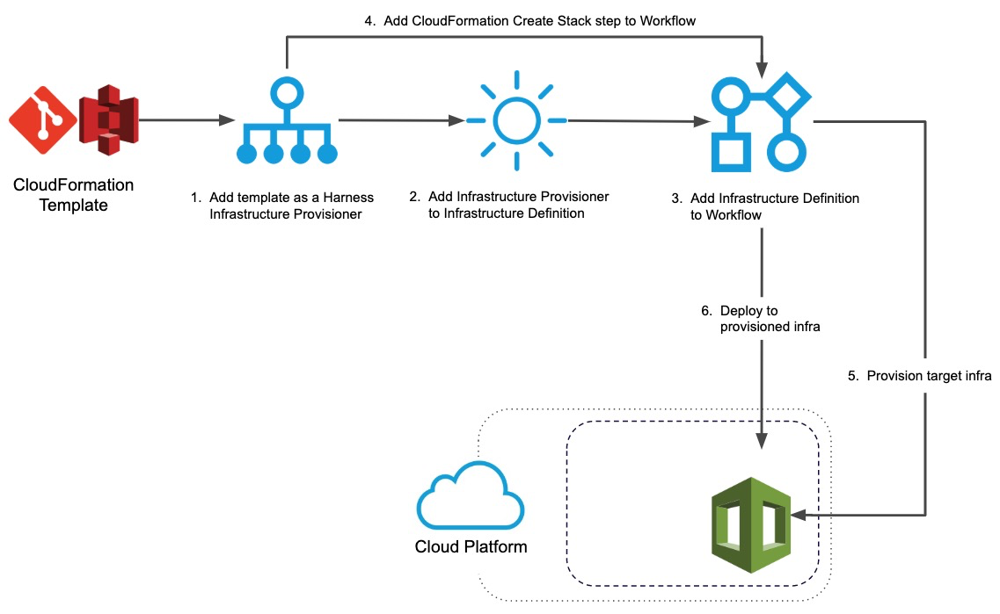
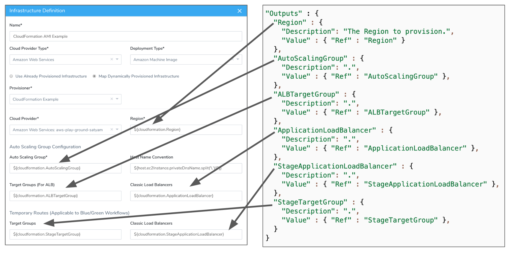
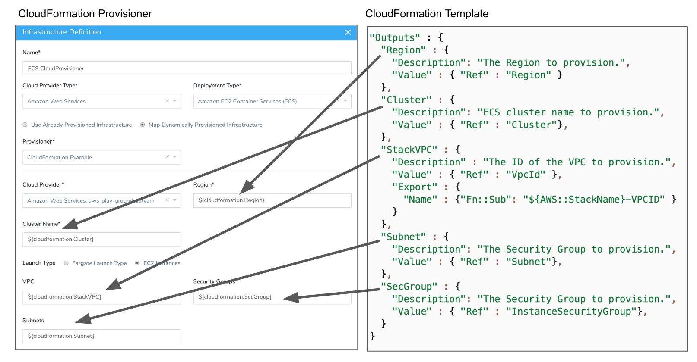
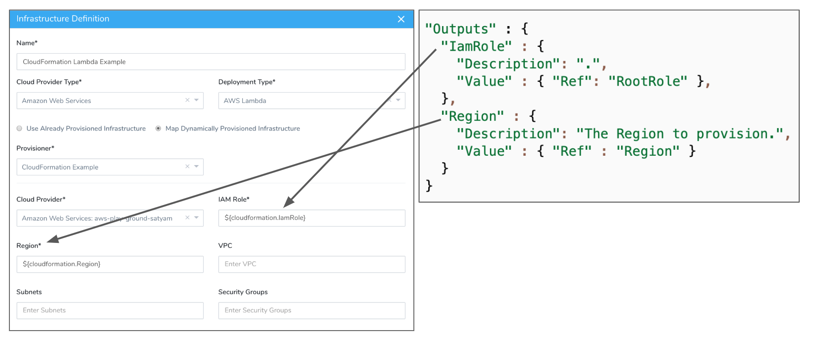
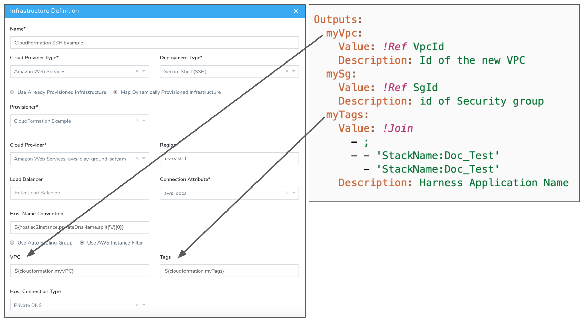
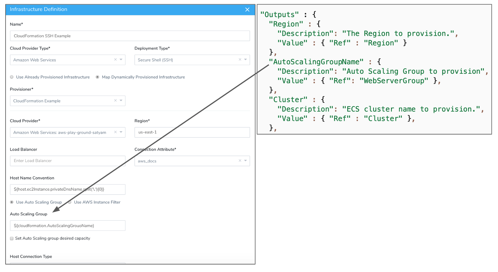

This content is for Harness [FirstGen](../../../../getting-started/harness-first-gen-vs-harness-next-gen.md). Switch to [NextGen](https://docs.harness.io/article/vynj4hxt98).To enable Harness to deploy to the provisioned infrastructure you defined in [Add CloudFormation Templates](add-cloud-formation-templates.md), you map outputs from your CloudFormation template to the Harness Infrastructure Definition settings Harness requires for provisioning.

Mappings provide Harness with the minimum settings needed to provision using your template.

Harness supports first class mapping for AWS-based infrastructures (SSH, ASG, ECS, Lambda).

### Before You Begin

Ensure you have read the following topics before you map the CloudFormation Provisioner in an Infrastructure Definition:

* [CloudFormation Provisioning with Harness](../../concepts-cd/deployment-types/cloud-formation-provisioning-with-harness.md)
* [Set Up Your Harness Account for CloudFormation](cloud-formation-account-setup.md)
* [Add CloudFormation Templates](add-cloud-formation-templates.md)

### Limitations

**AWS Services Supported** — Harness supports first class CloudFormation provisioning for AWS-based infrastructures:

* SSH
* AMI/Auto Scaling Group
* ECS
* Lambda

**Deployment Strategies Supported** — Harness Infrastructure Provisioners are only supported in Canary and Multi-Service types. For AMI and ECS, Infrastructure Provisioners are also supported in Blue/Green deployments.

**CloudFormation Template Outputs** — If you have been running your deployments manually, you might not have outputs configured in your template files. To provision using your CloudFormation template, you will need to add these output variables to your template.

**Template Formats** — CloudFormation templates may be in JSON or YAML.

**CloudFormation Provisioners and Environments:**

* A CloudFormation Provisioner should not be used to provision different infrastructures/stacks within the same Environment.
* A CloudFormation Provisioner + Environment pair should be unique per provisioned infrastructure/stack.

### Visual Summary

This topic describes step 2 in the Harness CloudFormation Provisioning implementation process:



Once you have completed this topic, you can move onto the next step: [Provision using CloudFormation Create Stack](provision-cloudformation-create-stack.md).

### Step: Create an Infrastructure Definition

As noted above, ensure you have done [Set Up Your Harness Account for CloudFormation](cloud-formation-account-setup.md) and [Add CloudFormation Templates](add-cloud-formation-templates.md) before using the CloudFormation Infrastructure Provisioner to create the Infrastructure Definition.

To use a CloudFormation Infrastructure Provisioner to create an ​Infrastructure Definition, do the following:

1. In the same Harness Application where you created the CloudFormation Infrastructure Provisioner, in an existing Environment, click **Add ​Infrastructure Definition**. The ​Infrastructure Definition settings appear.
2. In **Name**, enter the name for the ​Infrastructure Definition. This is the name you will select when you add this ​Infrastructure Definition to a Workflow or Workflow Phase.
3. In **Cloud Provider Type**, select the type of Harness Cloud Provider you will use to connect to the target platform.Harness supports first class mapping for AWS-based infrastructures (SSH, ASG, ECS, Lambda).
4. In **Deployment Type**, select the platform for the deployment, such as ECS, AMI, etc.
5. Select **Map Dynamically Provisioned Infrastructure**. This option reveals the Infrastructure Provisioner settings for the ​Infrastructure Definition.
6. In **Provisioner**, select the name of the CloudFormation Provisioner you want to use.
7. In **Cloud Provider**, select the Cloud Provider to use to connect to the target cloud platform.  
The remainder of the settings are specific to the Provisioner and Cloud Provider you selected.
8. Map the required fields to your CloudFormation template outputs. The platform-specific sections below provide examples for the common deployment types.

You map the CloudFormation template outputs using this syntax, where `exact_name` is the name of the output:


```
${cloudformation.*exact\_name*}
```
When you map a CloudFormation template output to a Harness Infrastructure Definition setting, the expression for the output, `${cloudformation.exact_name​}`, can be used anywhere in the Workflow that uses that CloudFormation Provisioner. This can be useful if you want to echo the outputs in a [Shell Script step](https://docs.harness.io/article/1fjrjbau7x-capture-shell-script-step-output) for example.

### Option 1: Map an AWS AMI/ASG Infrastructure

AMI/ASG and ECS deployments are the only type that supports Terraform and CloudFormation Infrastructure Provisioners in Blue/Green deployments.The AMI deployment type uses an AWS Auto Scaling Group and only requires that you provide a region and Auto Scaling Group.

The Auto Scaling Group output is the Auto Scaling Group you want Harness to mirror (use as a template) when it provisions a new Auto Scaling Group as part of the AMI deployment.

For more information, see [AWS AMI Deployments Overview](../../concepts-cd/deployment-types/aws-ami-deployments-overview.md).

In the following example, we show:

* Required outputs.
* The outputs used for the optional Target Group and Application Load Balancer.
* The stage Target Group and Application Load Balancer used for Blue/Green deployments.



### Option 2: Map an AWS ECS Infrastructure

The ECS mapping supports both ECS launch types, EC2 and Fargate.

The ECS deployment type has two **Launch Type** options:

* **EC2 Instances** - Region and Cluster are required. Here is an example mapping Region and Cluster and the remaining fields:



* **Fargate Launch Type** - Region, Cluster, Task Execution Role, VPC, Subnets, Security Group are required. Here is an example mapping all of these:


See [AWS ECS Deployments Overview](../../concepts-cd/deployment-types/aws-ecs-deployments-overview.md) and [AWS ECS Quickstart](https://docs.harness.io/article/j39azkrevm-aws-ecs-deployments).

### Option 3: Map an AWS Lambda Infrastructure

The Lambda deployment type supports AWS Instance and AWS Auto Scaling Groups. Both require IAM role and region outputs.

Here is an Infrastructure Definition example for Lambda.



See [Lambda Deployment Overview](../lambda-deployments/lambda-deployment-overview.md) and [AWS Lambda Quickstart](https://docs.harness.io/article/wy1rjh19ej-aws-lambda-deployments).

### Option 4: Map a Secure Shell (SSH) Infrastructure on AWS

The Secure Shell (SSH) deployment type is supported with CloudFormation on AWS only. To use SSH with a datacenter, see [Shell Script Provisioner](https://docs.harness.io/article/1m3p7phdqo-shell-script-provisioner).The Secure Shell (SSH) deployment type has two **AWS Node Type** options: **AWS Instance** and **AWS Autoscaling Group**.

For the **AWS Instance**, only AWS tags are required. Here is an example mapping both VPCs and AWS tags:



The remaining settings can also use output variables or be hardcoded.

For AWS **Auto Scaling Group**, only an Auto Scaling Group is required:



See [Traditional Deployments Overview](../../traditional-deployments/traditional-deployments-overview.md).

### Next Steps

Now that the Infrastructure Definition is mapped to the CloudFormation outputs in your script, the provisioned infrastructure can be used as a deployment target by a Harness Workflow. But the CloudFormation template must still be run to provision this infrastructure.

To run the CloudFormation template in your Harness Infrastructure Provisioner and create the infra you defined in Infrastructure Definition, you add a **CloudFormation Create Stack** step to a Workflow that uses the Infrastructure Definition you just set up.

For steps on adding the CloudFormation Create Stack step, see  [Provision using CloudFormation Create Stack](provision-cloudformation-create-stack.md).

