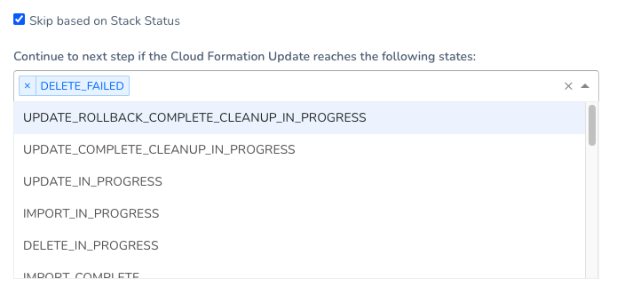
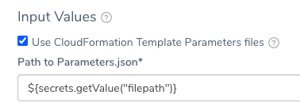
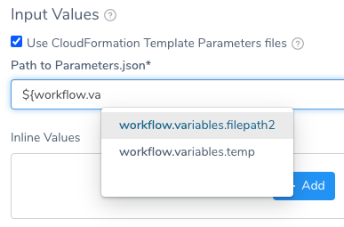
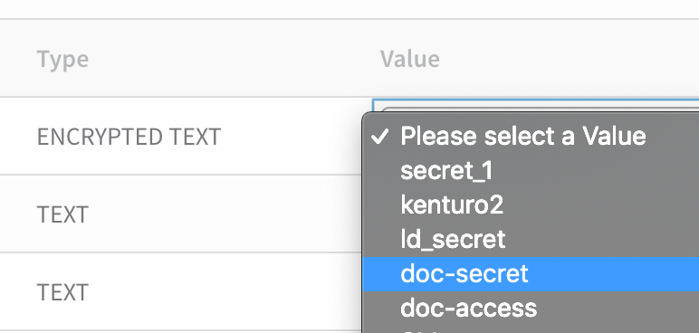
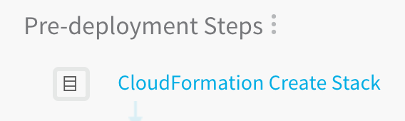
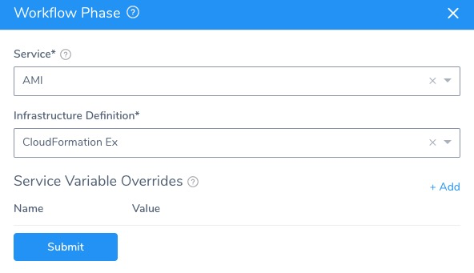

This content is for Harness [FirstGen](../../../../getting-started/harness-first-gen-vs-harness-next-gen.md). Switch to [NextGen](https://docs.harness.io/article/vynj4hxt98).This topic describes how to provision infrastructure using the Workflow CloudFormation Create Stack step.

Once you have [created a CloudFormation Infrastructure Provisioner](add-cloud-formation-templates.md) and [added it to a Harness Infrastructure Definition](map-cloud-formation-infrastructure.md), you add that Infrastructure Definition to a Workflow.

Next, you use the CloudFormation Create Stack step in that Workflow to run the same CloudFormation template added in the Infrastructure Provisioner.

During Workflow pre-deployment, the CloudFormation Create Stack step provisions the target infrastructure.

Next, during Workflow deployment, the Workflow deploys to the provisioned infrastructure as defined in its Infrastructure Provisioner.

## Before You Begin

Ensure you have read the following topics before you add the CloudFormation Create Stack step to a Workflow:

* [CloudFormation Provisioning with Harness](../../concepts-cd/deployment-types/cloud-formation-provisioning-with-harness.md)
* [Set Up Your Harness Account for CloudFormation](cloud-formation-account-setup.md)
* [Add CloudFormation Templates](add-cloud-formation-templates.md)
* [Map CloudFormation Infrastructure](map-cloud-formation-infrastructure.md)

## Important Notes

* **AWS Services Supported**: Harness supports first class CloudFormation provisioning for AWS-based infrastructures:
	+ SSH
	+ AMI/Auto Scaling Group
	+ ECS
	+ Lambda
* **Deployment Strategies Supported**: For most deployments, Harness Infrastructure Provisioners are only supported in Canary and Multi-Service types. For AMI/ASG and ECS deployments, Infrastructure Provisioners are also supported in Blue/Green deployments.
* **Control stack deployment wait time:**  
  Currently, this feature is behind the Feature Flag `CLOUDFORMATION_SKIP_WAIT_FOR_RESOURCES`. Contact [Harness Support](mailto:support@harness.io) to enable the feature.
	+ By default, Harness waits for 30 seconds after a successful stack deployment to ensure that resources have come up.
	+ You can can remove this wait time by enabling the Feature Flag `CLOUDFORMATION_SKIP_WAIT_FOR_RESOURCES`.
	+ If `CLOUDFORMATION_SKIP_WAIT_FOR_RESOURCES` is enabled and you still want to have a waiting condition, use the [AWS CreationPolicy attribute](https://docs.aws.amazon.com/AWSCloudFormation/latest/UserGuide/aws-attribute-creationpolicy.html).

## Where can I use CloudFormation Create Stack?

CloudFormation Create Stack can be used to provision infrastructure or for ad hoc provisioning.

When used in the Pre-deployment steps of a Workflow, the CloudFormation Create Stack provisions infrastructure that can be rolled back in the Workflow fails.

When used outside of the Pre-deployment steps of a Workflow, the CloudFormation Create Stack step does not participate in Workflow rollback. Only use the CloudFormation Create Stack step outside of the Pre-deployment steps of a Workflow for ad hoc provisioning.

To delete the ad hoc provisioned infrastructure in the case of a Workflow failure, add the CloudFormation Delete Stack to the Workflow **Rollback Steps** section. See [Remove Provisioned Infra with CloudFormation Delete Stack](cloudformation-delete-stack.md).

## Visual Summary

This topic describes steps 4 through 6 in the Harness CloudFormation Provisioning implementation process:


For step 1, see [Add CloudFormation Templates](add-cloud-formation-templates.md). For step 2, see [Map CloudFormation Infrastructure](map-cloud-formation-infrastructure.md).

Here is an illustration using a deployment:


1. The **CloudFormation Create Stack** step executes pre-deployment to build the infrastructure.
2. The **Infrastructure Definition** is used to select the provisioned nodes.
3. The app is **installed** on the provisioned node.

## Step 1: Add Environment to Workflow

To use a CloudFormation Provisioner in your Workflow, do the following:

1. In your Harness Application, click **Workflows**.
2. Click **Add Workflow**. The Workflow dialog appears.
3. Enter a name and description for the Workflow.
4. In **Workflow Type**, select **Canary**.
:::note 
For most deployments, Harness Infrastructure Provisioners are only supported in Canary and Multi-Service types. For AMI deployments, Infrastructure Provisioners are also supported in Blue/Green deployments.
:::
5. In **Environment**, select the Environment that has the CloudFormation Provisioner set up in its Infrastructure Definitions.
6. Click **SUBMIT**. The new Workflow is created.

By default, the Workflow includes a **Pre-deployment Steps** section. This is where you will add a step that uses your CloudFormation Provisioner.

## Step 2: Add CloudFormation Create Stack Step to Pre-deployment Steps

In this step you will use the CloudFormation Create Stack step to select the same CloudFormation Infrastructure Provisioner you used in the Workflow Infrastructure Definition.

The CloudFormation Create Stack step will provision using the template in the CloudFormation Infrastructure Provisioner.

The CloudFormation Create Stack step is basically the same as the [`aws cloudformation create-stack`](https://docs.aws.amazon.com/cli/latest/reference/cloudformation/create-stack.html) command.

The CloudFormation Create Stack step provisions your target infrastructure, and so it is added to the **Pre-deployment steps** in the Canary Workflow.

To add the CloudFormation Create Stack step, do the following:

1. In your Workflow, in **Pre-deployment Steps**, click **Add Step**.
2. Select **CloudFormation Create Stack**, and click **Next**.
3. In **Provisioner**, select the same Harness CloudFormation Infrastructure Provisioner you used in the Infrastructure Definition of this Workflow.
4. In **AWS Cloud Provider**, typically, you will select the same Cloud Provider you used when setting up the Infrastructure Definition used by this Workflow.
:::note 
You need to select an AWS Cloud Provider even if the CloudFormation Infrastructure Provisioner you selected uses a manually-entered template body. Harness needs access to the AWS API for CloudFormation via the credentials in the AWS Cloud Provider. Ensure that the AWS Cloud Provider has the credentials described in [Set Up Your Harness Account for CloudFormation](cloud-formation-account-setup.md).
:::
5. In **Region**, select the region where you will be provisioning your resources.  
You can use a [Harness variable expression](https://docs.harness.io/article/9dvxcegm90-variables) in the Region setting, such as a [Workflow variable](https://docs.harness.io/article/766iheu1bk-add-workflow-variables-new-template). This allows you to select the AWS region for the provisioning when you deploy your Workflow.
:::note 
Currently, expressions in the Region setting is in Beta and behind a Feature Flag. Contact [Harness Support](https://mail.google.com/mail/?view=cm&fs=1&tf=1&to=support@harness.io) to enable the feature. Feature Flags can only be removed for Harness Professional and Essentials editions. Once the feature is released to a general audience, it is available for Trial and Community Editions.
:::
6. To name your stack, select **Use Custom Stack Name** and enter a name for your stack. If you do not select this option, Harness will automatically generate a unique name for your stack prefixed with `HarnessStack`and the ID for your Harness Environment, such as `HarnessStack-7HklGe0N6AvviJmZ`.  
   If you plan on using the [CloudFormation Delete Stack](cloudformation-delete-stack.md) step later in this Workflow, it is a good idea to name your stack.
7. In **Role ARN**, enter the Amazon Resource Name (ARN) of an AWS IAM role that CloudFormation assumes to create the stack. If you don't specify a value, Harness uses the credentials you provided via **AWS Cloud Provider**. This allows you to tune the step for provisioning a specific AWS resource. For example, if you will only provision AWS S3, then you can use a role that is limited to S3.  
   You can also use [Harness variable expressions](https://docs.harness.io/article/9dvxcegm90-variables) in **Role ARN**. For example, you can create a Service or Workflow variable and then enter its expression in **Role ARN**, such as `${serviceVariables.roleARN}` or `${workflow.variables.roleArn}`.
8. To acknowledge the capabilities in the CloudFormation template, enable **Specify Capabilities**.  
   This acknowledges that the template contains certain capabilities (for example, `CAPABILITY_AUTO_EXPAND`), giving AWS CloudFormation the specified capabilities before it creates the stack. This is the same as using the `--capabilities` option in the `aws cloudformation create-stack` CLI command. See [create-stack](https://docs.aws.amazon.com/cli/latest/reference/cloudformation/create-stack.html).  
   In **Capabilities**, select one or more of the capabilities from the spec.
9. To add CloudFormation Tags, enable **Add CloudFormation Tags**.  
  
	 Enter the tags in JSON format only (lowercase is required):  

		```
		[{  
		    "key": "string",  
		    "value": "string"  
		},{  
		    "key": "string",  
		    "value": "string"  
		}]
		```
		  
	The tags you add here are applied to all of the resources in the stack. AWS has a limit of 50 unique tags for each stack.  
		  
	You can use Harness variable expressions in the keys and values. See [Built-in Variables List](https://docs.harness.io/article/aza65y4af6-built-in-variables-list) and [Set Workflow Variables](https://docs.harness.io/article/766iheu1bk-add-workflow-variables-new-template).
10. In **Skip based on Stack Status**, you can add the stack states that will not prevent provisioning.
:::note 
Harness checks if the stack is in ROLLBACK\_COMPLETE state before the deployment. If present, Harness deletes the stack and then triggers the deployment.
:::
   
11. In **Timeout**, enter how long Harness should wait for the successful CloudFormation Provisioner set up before failing the Workflow.
12. Click **Next**. The **Input Values** settings appear.

## Option 1: Enter Input Values from Parameter Files

You can use CloudFormation parameters files to specify input parameters for the stack.

This is the same as using the AWS CloudFormation CLI `create-stack` option `--parameters` and a JSON parameters file:


```
aws cloudformation create-stack --stackname startmyinstance  
--template-body file:///some/local/path/templates/startmyinstance.json  
--parameters https://your-bucket-name.s3.amazonaws.com/params/startmyinstance-parameters.json
```
Where the JSON file contains these parameters:


```
[  
  {  
    "ParameterKey": "KeyPairName",  
    "ParameterValue": "MyKey"  
  },   
  {  
    "ParameterKey": "InstanceType",  
    "ParameterValue": "m1.micro"  
  }  
]
```
### Use a CloudFormation Parameter File

1. In **Input Values**, select **Use CloudFormation Template Parameters files**.
2. In **Path to Parameters.json**, enter the path to the parameter file.

### Source Types

Parameter files can be used with git repo and AWS S3 source types. See [Add CloudFormation Templates](add-cloud-formation-templates.md).

### Git-based Parameter Files

Enter the full path to the file.

For Git-based parameter files, the path entered is relative to the **URL** setting of the Source Repo Provider used by the CloudFormation Provisioner.

For example, the CloudFormation Provisioner you select in **Provisioner** uses a Source Repo Provider with a **URL** setting of `https://github.com/account-name/cf-files`.

In the **cf-files** repo folder there is a file named **parameters.json**. So, in **Path to Parameters.json**, you would simply enter **parameters.json**.

### Encrypted Text Secrets

Use can use Harness encrypted text secrets in **Path to Parameters.json**. See [Use Encrypted Text Secrets](https://docs.harness.io/article/ygyvp998mu-use-encrypted-text-secrets).



### Multiple Parameter Files

You can enter paths to single and multiple files. Separate multiple files using commas:


```
https://my-bucket.s3.amazonaws.com/parameters1.json,https://my-bucket.s3.amazonaws.com/parameters3.json
```
### Workflow Variable Expressions in Paths

You can use Harness Workflow variables in **Path to Parameters.json**.



When the Workflow is deployed, by itself, in a Pipeline, or in a Trigger, you will provide values for the Workflow variables. This allows you to templatize the path.

See [Set Workflow Variables](https://docs.harness.io/article/766iheu1bk-add-workflow-variables-new-template) and [Templatize a Workflow](https://docs.harness.io/article/bov41f5b7o-templatize-a-workflow-new-template).

### Workflow Variable Expressions in Files

You can use Harness builtin and Workflow variables in the parameter values inside the parameter file. Harness will replace the variables when it executes the **Pre-deployment Steps** section.

For example:


```
[  
  {  
    "ParameterKey": "KeyPairName",  
    "ParameterValue": "${workflow.variables.KeyPairNameValue}"  
  },   
  {  
    "ParameterKey": "InstanceType",  
    "ParameterValue": "${workflow.variables.InstanceTypeValue}"  
  }  
]
```
### Use Parameters Files and Inline Values Together

You can use **Use CloudFormation Template Parameters files** and **Inline Values** together. Inline Values override parameter file values.

## Option 2: Enter Inline Input Values

The Input Values are automatically populated with the same variables from the CloudFormation Infrastructure Provisioner **Variables** section, as described in [Add CloudFormation Templates](add-cloud-formation-templates.md).

Enter or select a value for each variable in **Input Values**. For encrypted text values, select an Encrypted Text secret from Harness Secrets Management.



For more information, see [Use Encrypted Text Secrets](https://docs.harness.io/article/ygyvp998mu-use-encrypted-text-secrets).

Click **Submit**. The **CloudFormation Create Stack** step is added to your Workflow.



Now your Workflow is set up to provision an infrastructure using your CloudFormation template in the CloudFormation Infrastructure Provisioner, and then deploy to the provisioned infrastructure.

## Step 3: Add Infrastructure Definition to Phases

Now that the Workflow **Pre-deployment** section has your CloudFormation Create Stack step added, you need to add the target Infrastructure Definition where the Workflow will deploy.

This is the same Infrastructure Definition where you mapped your CloudFormation Infrastructure Provisioner outputs, as described in  [Map CloudFormation Infrastructure](map-cloud-formation-infrastructure.md).

For Canary Workflows, Infrastructure Definitions are added in Phases, in the **Deployment Phases** section.

In the **Deployment Phases** section, click **Add Phase**. The Workflow Phase settings appear.

1. In **Service**, select the Harness Service to deploy.
2. In **Infrastructure Definition**, select the target Infrastructure Definition where the Workflow will deploy. This is the same Infrastructure Definition where you mapped your CloudFormation Infrastructure Provisioner outputs, as described in  [Map CloudFormation Infrastructure](map-cloud-formation-infrastructure.md).  
Here is an example:

   
	 
3. Click **Submit**. Use the same Infrastructure Definition for the remaining phases in your Canary Workflow.

Once you are done, your Workflow is ready to deploy.

## Deployment Rollback

If you have successfully deployed CloudFormation resources and on the next deployment there is an error that initiates a rollback, Harness will roll back the provisioned infrastructure to the previous, successful version of the CloudFormation state.

Harness will not increment the serial in the state, but perform a hard rollback to the exact version of the state provided.

Harness determines what to rollback using a combination of the following Harness entities:

`CloudFormation Infrastructure Provisioner + Environment`

If you have templated these settings (using Workflow variables), Harness uses the values it obtains at runtime when it evaluates the template variables.

## Next Steps

* The variables you use to map CloudFormation template outputs in an Infrastructure Definition can also be used in other Workflow commands. See [Using CloudFormation Outputs in Workflow Steps](using-cloudformation-outputs-in-workflow-steps.md).
* If you want to delete the stack as part of a Workflow, see [Remove Provisioned Infra with CloudFormation Delete Stack](cloudformation-delete-stack.md).

