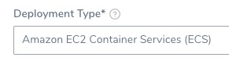
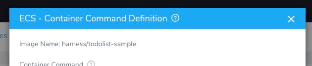
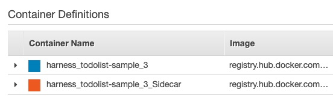
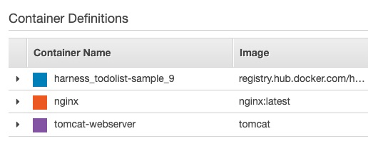
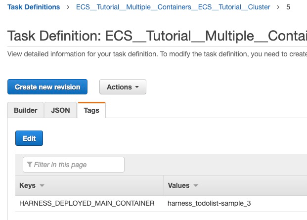
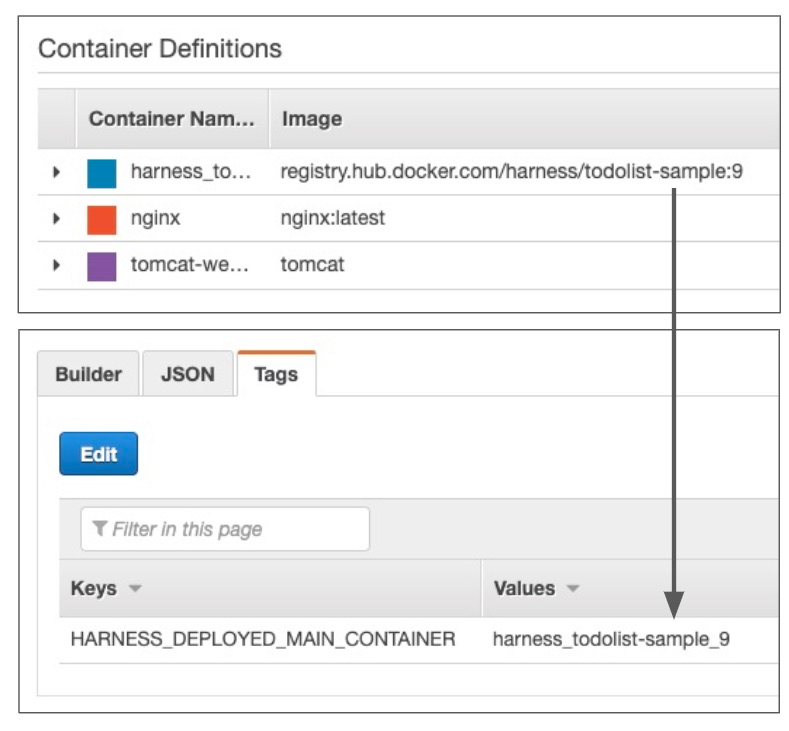
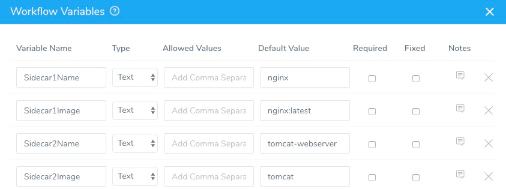
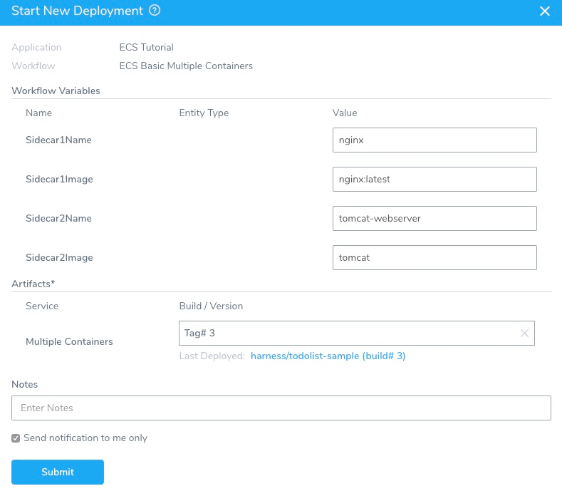

You can deploy sidecar containers using a single Harness ECS Service and Workflow.

In the Harness Service for ECS, in addition to the spec for the Main Container used by Harness, you simply add container specs for however many sidecar containers you need.

Harness deploys all containers and images as defined in the specs.


### Before You Begin

This topic assumes you have read or performed the following:

* [AWS ECS Quickstart](https://docs.harness.io/article/j39azkrevm-aws-ecs-deployments)
* [AWS ECS Deployments Overview](../../concepts-cd/deployment-types/aws-ecs-deployments-overview.md)
* [ECS Workflows](ecs-workflows.md)
* [ECS Blue/Green Workflows](ecs-blue-green-workflows.md)
* AWS ECS [container task definition parameters](https://docs.aws.amazon.com/AmazonECS/latest/developerguide/task_definition_parameters.html#container_definitions) (from AWS).

### Review: ECS Sidecar Containers

AWS ECS sidecar containers are common. They move some of the responsibility of a service out into a containerized module deployed alongside a core application container.

Put simply, they improve performance by freeing your application container from various CPU intensive tasks.

For example, a telemetry sidecar container that must start before and shut down after the other containers in a task, or an initialization container that must complete its work before other containers in the task can start.

Here is a blog post from AWS explaining another sidecar use: [Deploying an NGINX Reverse Proxy Sidecar Container on Amazon ECS](https://aws.amazon.com/blogs/compute/nginx-reverse-proxy-sidecar-container-on-amazon-ecs/).

### Review: New ARN and Resource ID Format Must be Enabled

When deploying sidecar containers, Harness uses an AWS tag to distinguish the Main Container. The Main Container is the container used by Harness for the image Harness deploys. Sidecar containers are used for additional images.

AWS ECS requires that their new ARN and resource ID format be enabled to add tags to the ECS service.

If you have not opted into the new ECS ARN and resource ID format before you attempt deployment, you might receive the following deployment error:

`InvalidParameterException: The new ARN and resource ID format must be enabled to add tags to the service. Opt in to the new format and try again.`

To solve this issue, opt into the new format and try again. For more information, see  [Migrating your Amazon ECS deployment to the new ARN and resource ID format](https://aws.amazon.com/blogs/compute/migrating-your-amazon-ecs-deployment-to-the-new-arn-and-resource-id-format-2/) from AWS.

### Review: Main Container for ECS Deployments

The Main Container is the container used by Harness for deployments. Its spec is defined in the Harness Service.

You can add sidecar containers, as described in this topic, but you must always include the Main Container.

The Main Container is identified using the following mandatory placeholders:

* `${CONTAINER_NAME}` — At deployment runtime, this placeholder is replaced with a container name based on the image name. Such as `harness_todolist-sample_9`. Each time you deploy the container, its numeric suffix is increased (`_9`).
* `${DOCKER_IMAGE_NAME}` — At deployment runtime, this placeholder is replaced with the Docker image name and tag. Such as `harness/todolist-sample:9`.

The Main Container task spec must have a container definition using the placeholders.

### Step 1: Add Sidecar Container Specs

ECS container specs are added in Harness Services. The **Deployment Type** for the Services must be **Amazon ECS Container Service (ECS)**:



1. In the Harness ECS Service, in **Deployment Specification**, click **Container Specification**. The **ECS - Container Command Definition** settings appear.
   
   The simple interface is for adding a single, EC2 container spec. For Fargate, sidecar containers, or granular settings, use **Advanced Settings**.
2. Click **Advanced Settings**.

Here is where you will enter the sidecar container task definitions.

The first definition is for the Main Container, and uses the Harness placeholders for container name and image:


```
{  
  "containerDefinitions" : [ {  
    "name" : "${CONTAINER_NAME}",  
    "image" : "${DOCKER_IMAGE_NAME}",  
    "cpu" : 1,  
    "memory" : 1000,  
...
```
Now let's add a second container spec for a sidecar container.

For this example, we'll simply copy the default container spec but use the suffix `_Sidecar` for the side container name.


```
...  
{  
    "name" : "${CONTAINER_NAME}_Sidecar",  
    "image" : "${DOCKER_IMAGE_NAME}",  
    "memory" : "512",  
    "portMappings" : [ {  
      "containerPort" : 85,  
      "protocol" : "tcp"  
    } ]  
  } ],  
...
```

Here is what the full specs look like:

```
  

{  

  "containerDefinitions" : [ {  

    "name" : "${CONTAINER_NAME}",  

    "image" : "${DOCKER_IMAGE_NAME}",  

    "links" : [ ],  

    "portMappings" : [ {  

      "containerPort" : 80,  

      "protocol" : "tcp"  

    } ],  

    "memory" : "512",  

    "entryPoint" : [ ],  

    "command" : [ ],  

    "environment" : [ ],  

    "mountPoints" : [ ],  

    "volumesFrom" : [ ],  

    "dependsOn" : [ ],  

    "dnsServers" : [ ],  

    "dnsSearchDomains" : [ ],  

    "extraHosts" : [ ],  

    "dockerSecurityOptions" : [ ],  

    "ulimits" : [ ],  

    "systemControls" : [ ],  

    "resourceRequirements" : [ ]  

  },  

{  

    "name" : "${CONTAINER_NAME}_Sidecar",  

    "image" : "${DOCKER_IMAGE_NAME}",  

    "memory" : "512",  

    "portMappings" : [ {  

      "containerPort" : 85,  

      "protocol" : "tcp"  

    } ]  

  } ],  

  "executionRoleArn" : "${EXECUTION_ROLE}",  

  "volumes" : [ ],  

  "requiresAttributes" : [ ],  

  "placementConstraints" : [ ],  

  "compatibilities" : [ ],  

  "requiresCompatibilities" : [ ],  

  "cpu" : "512",  

  "memory" : "1024",  

  "inferenceAccelerators" : [ ]  

}  


```

Using `${CONTAINER_NAME}_Sidecar` isn't something you would do in production. It's just a simple way to try out the feature yourself. We include an advanced example later in this topic. Once the Service is deployed, you will see both containers in the ECS console:



You can use specs that deploy the Main Container and sidecars.


Here's an advanced example that deploys the Main Container, Nginx, and Tomcat:

```
  

{  

  "containerDefinitions" : [ {  

    "name" : "${CONTAINER_NAME}",  

    "image" : "${DOCKER_IMAGE_NAME}",  

    "memory" : 1024,  

    "links" : [ ],  

    "portMappings" : [ ],  

    "entryPoint" : [ ],  

    "command" : [ ],  

    "environment" : [ ],  

    "mountPoints" : [ ],  

    "volumesFrom" : [ ],  

    "dependsOn" : [ ],  

    "dnsServers" : [ ],  

    "dnsSearchDomains" : [ ],  

    "extraHosts" : [ ],  

    "dockerSecurityOptions" : [ ],  

    "ulimits" : [ ],  

    "systemControls" : [ ],  

    "resourceRequirements" : [ ]  

  },  

{  

  "name": "nginx",  

  "image": "nginx:latest",  

  "memory": 256,  

  "essential": true,  

  "portMappings": [  

    {  

      "containerPort": 8181,  

      "protocol": "tcp"  

    }  

  ]  

},  

{  

  "essential": true,  

  "name": "tomcat-webserver",  

  "image": "tomcat",  

  "memory": 512,  

  "portMappings": [  

      {  

          "hostPort": 91,  

          "containerPort": 9191,  

          "protocol": "tcp"  

      }  

  ]  

}  

   ],  

  "executionRoleArn" : "${EXECUTION_ROLE}",  

  "volumes" : [ ],  

  "requiresAttributes" : [ ],  

  "placementConstraints" : [ ],  

  "compatibilities" : [ ],  

  "requiresCompatibilities" : [ ],  

  "inferenceAccelerators" : [ ],  

  "cpu": 1024  

}  


```

You can see that this example uses the [default public Docker Hub setting for the container image](https://docs.aws.amazon.com/AmazonECS/latest/developerguide/task_definition_parameters.html#container_definition_image). You can also use a local repo.

Harness does not pull these images. They are pulled by ECS.You can see all three container in the ECS console:



That's all you have to do to deploy sidecar containers. Use the Harness Service with a Harness Basic, Canary, or Blue/Green ECS Workflow and all of the containers are deployed.

### Step 2: Identify Main Container by Tag in ECS Console

In a Harness ECS deployment, the container that points to the main artifact being deployed is called the Main Container.

In the container spec, the `${CONTAINER_NAME}` and `${DOCKER_IMAGE_NAME}` placeholders identifies the Main Container. At deployment runtime, the placeholder is replaced with a name generated using the artifact name.

When you add verification steps to the **Verify** section of your Harness Workflow, Harness performs verification on your Main Container only. The sidecar containers are not verified using Harness [Continuous Verification](https://docs.harness.io/article/ina58fap5y-what-is-cv).

The Main Container is identified by Harness using the AWS Tag **HARNESS\_DEPLOYED\_MAIN\_CONTAINER**.

The `key:value` for the tag is `HARNESS_DEPLOYED_MAIN_CONTAINER:<Container_Name>`.

You can see this tag in the ECS console.

Locate the ECS service you deployed, and then click its **Task definition**.


In the task definition, in the **Builder** tab, in **Container Definitions**, you can see the containers that were deployed:


In the task definition **Tags** tab, you can see the Main Container tag that displays the name of the Main Container:



Do not edit or remove this tag.You will see the same Main Container tag when you deploy multiple sidecar containers also:



### Option: Using Workflow Variables in Container Specs

In the container spec, the `${CONTAINER_NAME}` and `${DOCKER_IMAGE_NAME}` placeholders identifies the Main Container. These placeholders must be present.

For the sidecar specs, you can hardcode the name and image values, or you can use Harness [Workflow variable expressions](https://docs.harness.io/article/766iheu1bk-add-workflow-variables-new-template).

When you use Workflow variable expressions, you provide the values for the spec when the Workflow is deployed.

This is one way to template the ECS sidecar container specs.

Let's look at a Harness ECS Workflow with Workflow variables for two sidecar containers:



Now let's look at how these are used in the sidecar container specs in a Harness Service:


```
...  
{  
  "name": "${workflow.variables.Sidecar1Name}",  
  "image": "${workflow.variables.Sidecar1Image}",  
  "memory": 256,  
  "essential": true,  
  "portMappings": [  
    {  
      "containerPort": 8181,  
      "protocol": "tcp"  
    }  
  ]  
},  
{  
  "essential": true,  
  "name": "${workflow.variables.Sidecar2Name}",  
  "image": "${workflow.variables.Sidecar2Image}",  
  "memory": 512,  
  "portMappings": [  
      {  
          "hostPort": 91,  
          "containerPort": 9191,  
          "protocol": "tcp"  
      }  
  ]  
}  
...
```
When the Workflow is deployed, you are prompted to provide values for the Workflow variables used in the Service's container specs:



During deployment, the values you provided for the Workflow variables replace the Workflow variable expressions in the Service's container specs.

### Notes

The following notes discuss important related information.

#### Steady State

Harness deploys and verifies steady state at the ECS task level, not the container level.

But if the task is running in a steady state, then its containers are also in a steady state.

If a single container fails, the task fails.

#### Display Host and Container Information

You can use [Harness built-inn variables expressions](https://docs.harness.io/article/9dvxcegm90-variables) and a [Shell Script](https://docs.harness.io/article/1fjrjbau7x-capture-shell-script-step-output) step in your Workflow to display useful information about the deployed containers and hosts.

Here is an example:


```
echo instance.hostName: ${instance.hostName}  
  
echo instance.host.hostName: ${instance.host.hostName}  
  
echo instance.host.ip: ${instance.host.ip}  
  
echo instance.EcsContainerDetails.dockerId: ${instance.EcsContainerDetails.dockerId}  
  
echo instance.EcsContainerDetails.completeDockerId: ${instance.EcsContainerDetails.completeDockerId}  
  
echo ec2Instance.privateIpAddress: ${instance.host.ec2Instance.privateIpAddress}
```
### Next Steps

* [Harness built-in AWS ECS variable expressions](https://docs.harness.io/article/9dvxcegm90-variables#aws_ecs).

