This topic describes different methods for creating ECS Blue/Green Workflows.

For Canary and Basic Workflows, see [ECS Workflows](ecs-workflows.md).

### Overview

There are two types of ECS Blue/Green deployments in Harness:

* **Elastic Load Balancer (ALB and NLB)** - Using two Target Groups in the ELB, each with its own listener, traffic between the stage and production environments is swapped each time a new service is deployed and verified.

Application Load Balancer (ALB) and Network Load Balancer (NLB) are supported.* **Route 53** **DNS** - Using a AWS Service Discovery namespace containing two service discovery services, and a Route 53 zone that hosts CNAME (alias) records for each service, Harness swaps traffic between the two service discovery services. The swap is achieved using [Weighted Routing](https://docs.aws.amazon.com/Route53/latest/DeveloperGuide/routing-policy.html#routing-policy-weighted), where Harness assigns each CNAME record a relative weight that corresponds with how much traffic to send to each resource.

There are no changes required to your Harness Service or Environment when setting up ECS Blue/Green Workflows.

In this section, we will cover the set up for both Blue/Green deployment methods.

### Review: Permissions

To create and deploy an ECS Workflow, you must belong to a Harness User Group with the following Account Permissions enabled:

* `Workflow Update`
* `Workflow Create`

See [Managing Users and Groups (RBAC)](https://docs.harness.io/article/ven0bvulsj-users-and-permissions).

### ECS Blue/Green Using ELB

With ELB configured for ECS Blue/Green deployment, you have old and new versions of your service running behind the load balancer. Your ELB uses two listeners, Prod and Stage, each forwarding to a different target group where ECS services are run. Blue/Green deployments are achieved by swapping listeners between the target groups, always pointing the Prod listener to the target group running the latest version.

In Harness, you identify which listeners are the Prod and Stage listeners. When Harness deploys, it uses the target group for the Stage listener (for example, **target1**) to test the deployment, verifies the deployment, and then swaps the Prod listener to use that target group. Next, the Stage listener now uses the old target group (**target2**).

When a new version of the service is deployed, the Stage listener and its target group (**target2**) are first used, then, after verification, the swap happens and the Prod listener forwards to **target2** and the Stage listener now forwards to **target1**.

To use ELB for Blue/Green deployment, you must have the following set up in AWS:

* **ELB** **Load Balancer** - An application load balancer must be set up in your AWS VPC. The VPC used by the ELB must have two subnets, each in a separate availability zone, which the ELB will use.
* **Two Listeners** - A listener checks for connection requests from clients, using the protocol and port that you configure, and forwards requests to one or more target groups, based on the rules that you define. Your load balancer must have two listeners set up: One listener for the production traffic (Prod) that points to one target group, and one listener for the stage traffic (Stage) that points to another target group.

You do not need to register instances for the target groups. Harness will perform that step during deployment.

For more information on ELB Application Load Balancers, see [What Is an Application Load Balancer?](https://docs.aws.amazon.com/elasticloadbalancing/latest/application/introduction.html) from AWS.

Application Load Balancer (ALB) and Network Load Balancer (NLB) are supported.

#### Ports Used in Blue/Green Using ELB

There are three places where ports are configured in this deployment:

* Harness ECS Service **Container Specification** - You will specify ports in the **Port Mappings** in the Container Specification.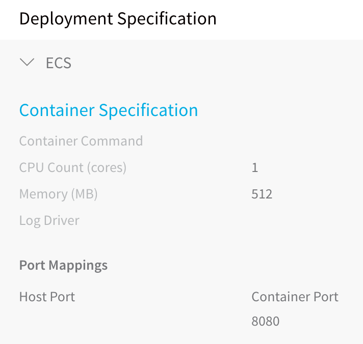

The port number used here must also be used in the ELB Target Groups you use for Blue/Green.
* **Target Group** - You will create two target groups, and Harness will swap them to perform Blue/Green. When you create a target group, you will specify the same port number as the **Port Mappings** in the Container Specification in Service: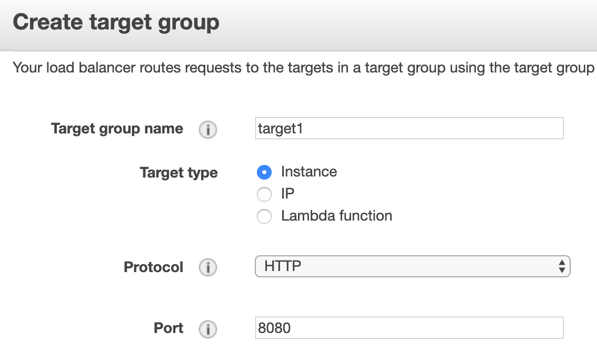

Both target groups must use the same port number, which is also the same number as the **Port Mappings** in the Container Specification in Service.
* **ELB Listener** - In your ELB, you create a listener for each target group. Listeners also use port numbers, but these are simply entry points for the ELB. For example, one listener uses port 80, and the other listener uses 8080.

If the port number used in the **Port Mappings** in the Container Specification in Service does not match the port number used in the target groups, you will see this error:


```
Error: No container definition has port mapping that matches the target port: 80 for target group:   
arn:aws:elasticloadbalancing:us-west-1:4xxxxxxx5317:targetgroup/target1/ac96xxxxxx1d16
```
Simply correct the port numbers and rerun the deployment.

#### Set Up AWS for Blue/Green Using ELB

To set up AWS for Blue/Green using ELB and Harness, do the following:

1. Ensure you have a Harness Delegate installed on an instance in the same VPC where your ECS cluster and load balancer are installed.
2. In the AWS EC2 console, click **Target Groups**.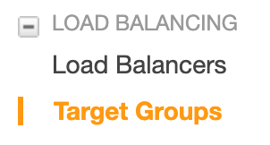
3. In Target Groups, click **Create target group**.
4. Give the target group a name, such as **target1**, and port **8080**.
5. Select the VPC where your ECS cluster instances will be hosted, and click **Create**.
6. Create a second target group using a new name, such as **target2**, use the same port number, **8080**, and the same VPC as the first target.

   It is important that you use the same port numbers for both target groups.When you are done, the target configuration will look something like this:

   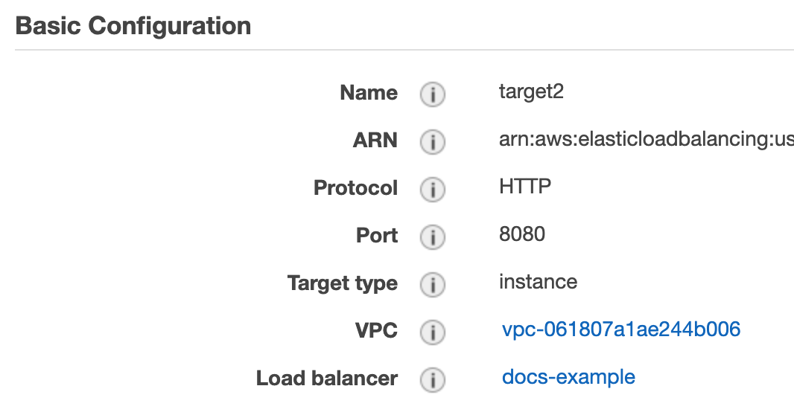

   Now that your targets are created, you can create the load balancer that will switch between the targets.

7. Create a Application Load Balancer. In the EC2 Console, click **Load Balancers**.

   
   
2. Click **Create Load Balancer**, and then under **Application Load Balancer**, click **Create**.

   

You do not need to add listeners at this point. We will do that after the load balancer is created.

Ensure that the VPC you select for the load balancer has two subnets, each in a separate availability zone, like the following:


Once your load balancer is created, you can add its Prod and Stage listeners.

1. In your load balancer, click its **Listeners** tab to add the targets you created as listeners.
   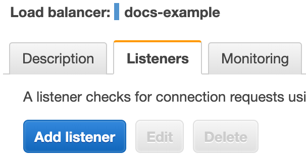
2. Click **Add Listener**.
3. In the **Protocol : port** section, enter the port number for your first target, port **80**. Listeners do not need to use the same port numbers as their target groups.
4. In **Default action**, click **Add action**, and select **Forward to**, and then select your target.
   
5. Click **Save**.
6. Repeat this process to add a listener using the other target you created, using a port number such as **8080**. When you are done you will have two listeners:


You AWS ELB setup is complete. Now you can set up you Harness Workflow.

#### Blue/Green Workflow with ELB

To set up a Blue/Green deploy using ELB in Harness, do the following:

1. In Harness, in your Application, click **Workflows**, and then click **Add Workflow**. The **Workflow** dialog appears.
2. Enter the following options to select a Blue/Green Deployment using DNS:
   * **Name** - Enter the name of the Workflow, such as **ECS BG ELB**.
   * **Description** - Enter a description to provide context for the Workflow.
   * **Workflow Type** - Select **Blue/Green Deployment**.
   * **Environment** - Select the Environment where the ECS Service Infrastructure you want to use is configured.
   * **Service** - Select the ECS Service you created for your Application.
   * **Infrastructure Definition** - Select the Infrastructure Definition where you want to deploy your ECS Service.
3. When you select the Infrastructure Definition, the **Blue Green Switch** field appears.
4. In **Blue Green Switch**, select **Elastic Load Balancer (ELB)**. When you are done the dialog will look something like this: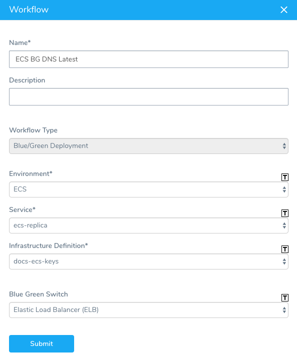
5. Click **SUBMIT**. The ECS Blue Green Workflow appears. The following image shows the default steps.

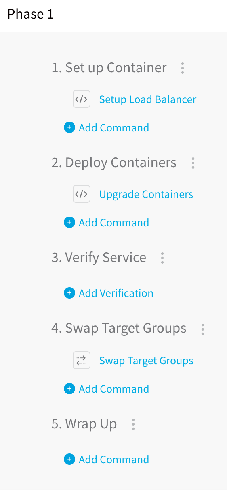

The following section describes how to configure the default steps.

#### ECS Blue Green Load Balancer Setup

The ECS Blue Green Load Balancer Setup step is where you specify the load balancer and target listeners for Harness to use when deploying.

Click **ECS Blue Green Load Balancer Setup** top open it. ECS Blue Green Load Balancer Setup has the following fields:

* **ECS Service Name** - Enter a name for the ECS service that will be deployed. You will see this name in your cluster once the service is deployed.
* **Desired Instance Count** - Specify the number of instances to deploy. The first time you run this Workflow, there are no instances of the service running. You can set a number in **Max Instances** or **Fixed Instances Count**. After this Workflow has been deployed successfully, you can set a number in **Fixed Instances Count** only.
* **Elastic Load Balancer** - Click here and select the AWS load balancer you added. Harness uses the Delegate to locate the load balancers and list them in Elastic Load Balancer. If you do not see your load balancer, ensure that the Delegate is in the same VPC. Once the load balancer is selected, Harness will populate the Prod and Stage Listener drop-downs.
* **Prod Listener** - Select the ELB listener that you want to use as the Prod Listener.
* **Stage Listener** - Select the ELB listener that you want to use as the Stage Listener.
* **Listener Rules** — If you are using [Listener Rules](https://docs.aws.amazon.com/elasticloadbalancing/latest/application/load-balancer-listeners.html#listener-rules) in your target groups, you can select them in **Production Listener Rule ARN** and **Stage Listener Rule ARN**.
	+ If you do not select a listener rule, Harness uses the Default rule. You do not need to select the Default rule.
	+ Default rules don't have [conditions](https://docs.aws.amazon.com/elasticloadbalancing/latest/application/load-balancer-listeners.html#rule-condition-types), but other rules do. If you select other rules, ensure the traffic that will use the rules matches the conditions you have set in the rules.
	+ For example, if you have a path condition on a rule to enable [path-based routing](https://docs.aws.amazon.com/elasticloadbalancing/latest/application/tutorial-load-balancer-routing.html), ensure that traffic uses that path.

The following image shows how the AWS load balancer and listeners map to the ECS Blue Green Load Balancer Setup settings:

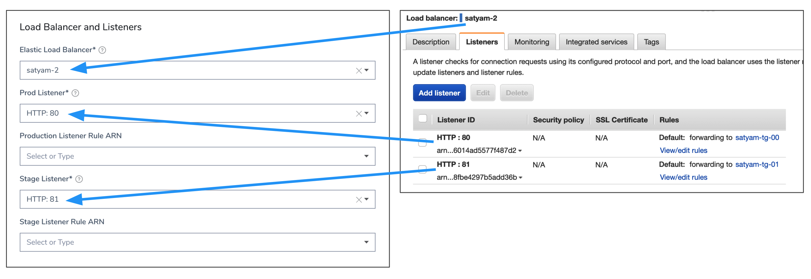

* **IAM Role** - You can leave this field blank as this setting isn't often necessary with Blue/Green ECS deployments. You can select the IAM role to use when using the ELB. The role must have the [AmazonEC2ContainerServiceRole](https://docs.aws.amazon.com/AmazonECS/latest/developerguide/service_IAM_role.html) policy.
* **Target Container Name** and **Target Port** - You can leave these fields blank. They are used if the container specification has multiple container definitions, which is not common. When you deploy your ECS service with Harness, Harness uses the container name and port from the **Service Specification** in the Harness Service. If you choose to use these fields, note that as an ECS requirement Target Container cannot be empty if Target Port is defined.
* **Service Steady State Wait Timeout** - Enter how many minutes Harness should wait for the ECS service to reach steady state. You cannot use Harness variable expressions in this setting. They are supported in Basic and Canary Workflow types, when using Replica Scheduling.
* **AWS Auto Scalar Configuration** - For more information, see [AWS Auto Scaling with ECS](ecs-workflows.md#aws-auto-scaling-with-ecs).

When you are finished, click **SUBMIT**. You now have defined the load balancer and target listeners for Harness to use when executing the Blue/Green deployment.

Here's what the **ECS Blue Green Load Balancer Setup** step looks like in a Deployment of the Workflow.

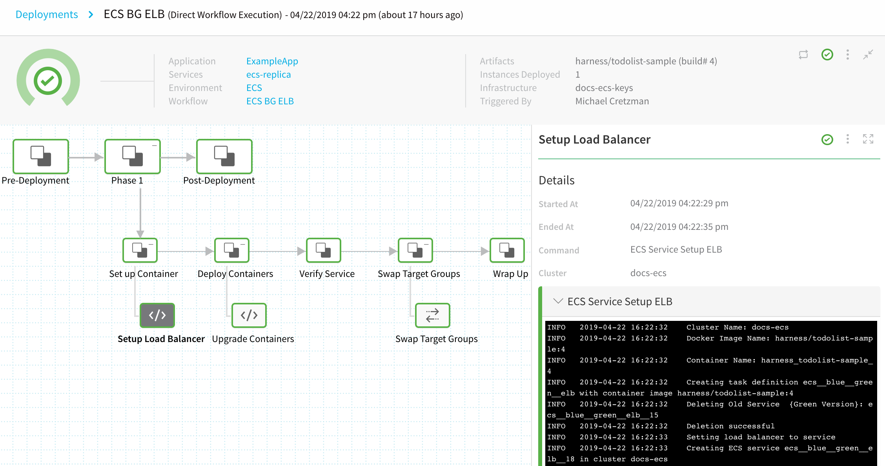

Here's the output from the step, where the old version of the service is deleted, and the load balancer is set up to use the new version via target group **target1**:


```
Cluster Name: docs-ecs  
Docker Image Name: harness/todolist-sample:4  
Container Name: harness_todolist-sample_4  
Creating task definition ecs__blue__green__elb with container image harness/todolist-sample:4  
**Deleting Old Service**  {Green Version}: ecs__blue__green__elb__15  
Deletion successful  
Setting load balancer to service  
Creating ECS service ecs__blue__green__elb__18 in cluster docs-ecs   
Checking for Auto-Scalar config for existing services  
No Auto-scalar config found for existing services  
Load Balancer Name: docs-example  
Target Group ARN: arn:aws:elasticloadbalancing:us-west-1:44xxxxxxx17:targetgroup/**target1**/6998xxxxxfbfe
```
#### Upgrade Containers

The Upgrade Containers step adds new ECS service instances.

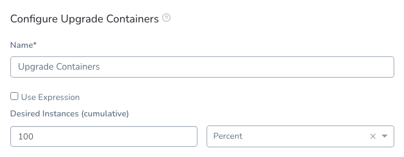

In **Desired Instances**, set the number or percentage of ECS service instances to use for this stage.

The value in **Desired Instances** relates to the number of ECS service instances set in the **Setup Load Balancer** dialog. For example, if you entered 2 as the **Desired Instance Count** in **Setup Load Balancer** and then enter 50 Percent in **Upgrade Containers**, that means Harness will deploy 1 ECS service instance.

**Use Expressions:** You can use [Harness Service, Environment Override, and Workflow](https://docs.harness.io/article/9dvxcegm90-variables) variable expressions in **Desired Instances** by selecting **Use Expression** and then entering the expression, like `${workflow.variables.DesiredInstances}`. When you run the Workflow, you can provide a value for the variable.Here's what the **Upgrade Containers** step looks like in a Deployment of the Workflow.

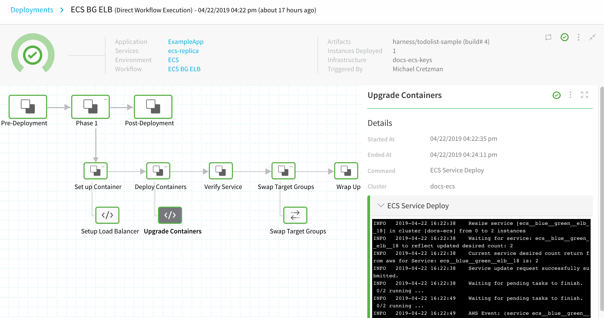

Here's the output from the step, where the desired count is updated to 2, and 2 targets are registered in **target1**.


```
Resize service [ecs__blue__green__elb__18] in cluster [docs-ecs] from 0 to 2 instances  
Waiting for service: ecs__blue__green__elb__18 to reflect updated desired count: 2  
Current service desired count return from aws for Service: ecs__blue__green__elb__18 is: 2  
Service update request successfully submitted.  
Waiting for pending tasks to finish. 0/2 running ...  
Waiting for pending tasks to finish. 0/2 running ...  
AWS Event: (service ecs__blue__green__elb__18) has reached a steady state.  
Waiting for pending tasks to finish. 2/2 running ...  
AWS Event: (service ecs__blue__green__elb__18) **has started 2 tasks**:   
    (task 897f0145edb440daae1952e7a9f6d3f6) (task a97da5fbda594f6aa8bdf82296572bf1).  
Waiting for service to be in steady state...  
AWS Event: (service ecs__blue__green__elb__18) **registered 2 targets**  
    in (target-group arn:aws:elasticloadbalancing:us-west-1:448640225317:targetgroup/**target1**/6998b12a548efbfe)  
AWS Event: (service ecs__blue__green__elb__18) has reached a steady state.  
Service has reached a steady state  
No Autoscalar config provided.  
  
Container IDs:  
  10.0.0.132 (new)  
  10.0.0.132 (new)  
  
Completed operation  
----------  
  
Service [ecs__blue__green__elb__17] in cluster [docs-ecs] stays at 2 instances  
No Autoscalar config provided.  
Completed operation  
----------
```
#### Upgrade Containers and Rollback Containers Steps are Dependent

In order for rollback to add ECS Auto Scaling to the previous, successful service, you must have both the **Upgrade Containers** and **Rollback Containers** steps in the same Phase.


Since ECS Auto Scaling is added by the **Upgrade Containers** step, if you delete **Upgrade Containers**, then **Rollback Containers** has no ECS Auto Scaling to roll back to.

If you want to remove ECS Auto Scaling from a Phase, delete both the **Upgrade Containers** and **Rollback Containers** steps. The Phase will no longer perform ECS Auto Scaling during deployment or rollback.

#### Swap Target Groups

The **Swap Target Groups** step performs the Blue/Green route swap once the deployment is verified. That is why **Swap Target Groups** comes after the **Verify Service** section in the Workflow.

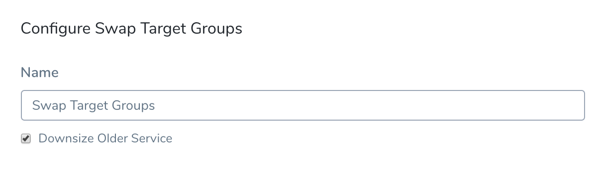

When you deploy, Harness will use the target group for the **Stage Listener** in the **Setup Load Balancer** step for deployment. After verifying the success of the deployment, the **Swap Target Groups** step simply swaps the target groups between the listeners. Now, the target group with the latest version receives production traffic. The target group with the old version receives the stage traffic.

The following image shows two ECS deployments. In the first deployment, the service uses the **target1** target group, and in the second deployment, the service uses the **target2** target group.

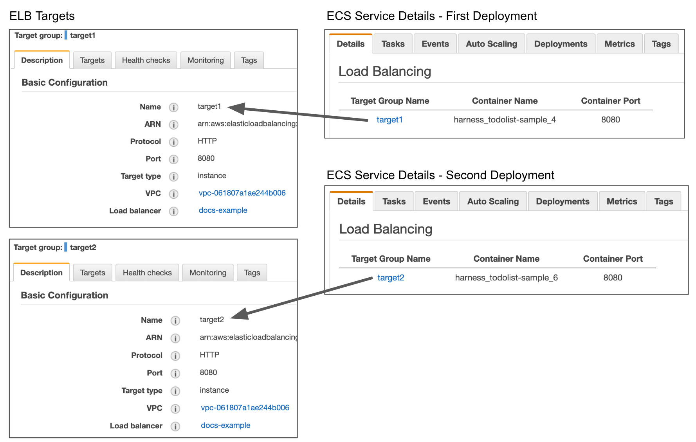

**Downsize Older Service:** choose whether to downsize the older, previous version of the service.

If you enable this option, the previous service is downsized to 0. The service is downsized, but not deleted. If the older service needs to be brought back up again, it is still available.

**Delay:** use this setting to to reduce incidents where non-idle connections are sent to the old service before ELB terminates the connection. This helps you ensure that all traffic has migrated to the new service before Harness begins shutting down the old service.

Currently, the **Delay** feature is behind a Feature Flag. Contact [Harness Support](mailto:support@harness.io) to enable the feature. Feature Flags can only be removed for Harness Professional and Essentials editions. Once the feature is released to a general audience, it's available for Trial and Community Editions.  
  
See [New features added to Harness](https://changelog.harness.io/?categories=fix,improvement,new) and [Features behind Feature Flags](https://changelog.harness.io/?categories=early-access) (Early Access) for Feature Flag information.Here's what the **Swap Target Groups** step looks like in a Deployment of the Workflow.

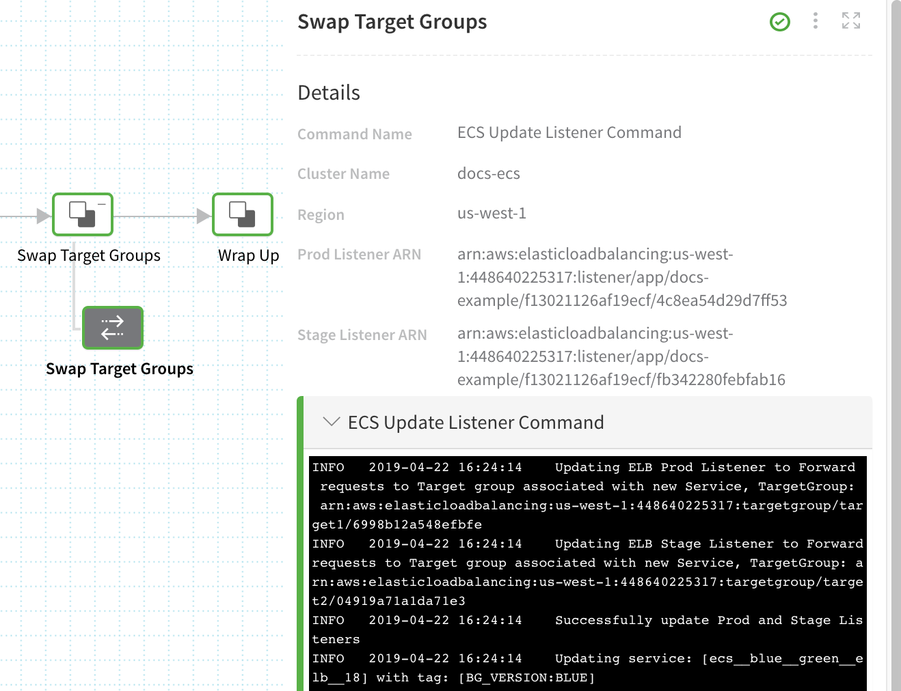

Here's the output from the step, where the Prod listener is now pointed to **target1** and the Stage listener is pointed to **target2**.


```
Updating ELB **Prod Listener** to Forward requests to Target group associated with new Service, TargetGroup:  
    arn:aws:elasticloadbalancing:us-west-1:44xxxx17:targetgroup/**target1**/69xxxxxxxefbfe  
Updating ELB **Stage Listener** to Forward requests to Target group associated with new Service, TargetGroup:  
    arn:aws:elasticloadbalancing:us-west-1:44xxxx17:targetgroup/**target2**/04xxxxxxxda71e3  
Successfully update Prod and Stage Listeners  
Updating service: [ecs__blue__green__elb__18] with tag: [BG_VERSION:BLUE]  
Tag update successful  
Updating service: [ecs__blue__green__elb__17] with tag: [BG_VERSION:GREEN]  
Tag update successful  
Downsizing Green Service: ecs__blue__green__elb__17  
Waiting for service: ecs__blue__green__elb__17 to reflect updated desired count: 0  
Current service desired count return from aws for Service: ecs__blue__green__elb__17 is: 0  
Waiting: [30] seconds for the downsize to complete ECS services to synchronize
```
You can also see the service count for the old version downsized to 0.

If you look at the service in the AWS ECS console, you can see the `BLUE` and `GREEN` tags added to them to indicate their status using the `BG_VERSION` key:

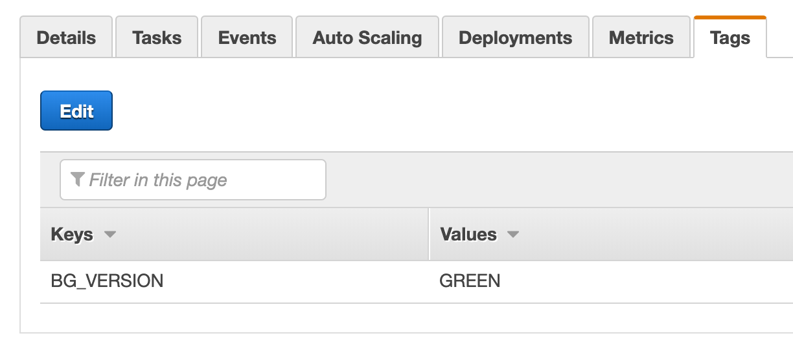

### ECS Blue/Green Using DNS

Using AWS Route 53 DNS, you can swap production traffic from an older version of a service to the newer version of the service. In this architecture, both services (Blue and Green) have a Service Discovery Service associated with them. This associates the services with URLs in a hosted DNS zone that was created when the namespace of the Service Discovery Services was created.

To use DNS for Blue/Green deployment, you must have the following set up in AWS:

* **Service Discovery namespace** - A Service Discovery namespace containing two Service Discovery services. This is added in AWS Cloud Map.
* **Route 53 zone** - An Amazon Route 53 zone to host the CNAME (alias) records Harness will register and use to swap traffic between the two Service Discovery services. When you create a namespace in AWS Cloud Map a zone is created automatically; however, Harness cannot modify this zone due to AWS restrictions. Consequently, you need to create a separate DNS zone where Harness can register CNAME records.

Harness will register the CNAME records in the zone when you first deploy your Workflow. You simply provide Harness with the name to use in the CNAME records.

Let's look at an example AWS setup. Here is the namespace **bg-namespace** created in AWS Cloud Map:

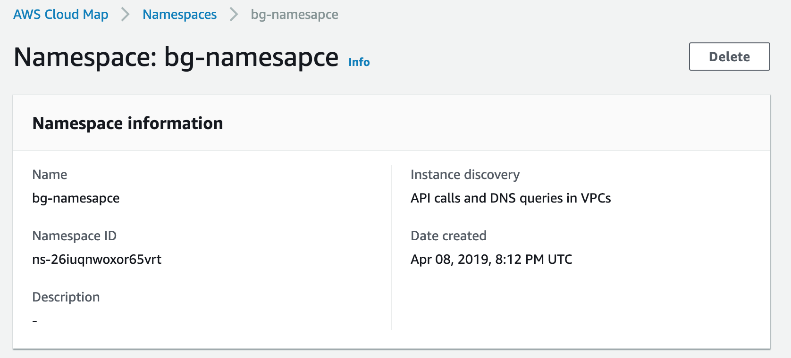

When you create the namespace, AWS created a Route 53 DNS zone for the namespace automatically, containing the NS and SOA record for the namespace. In our example, the namespace is **bg-namespace**:

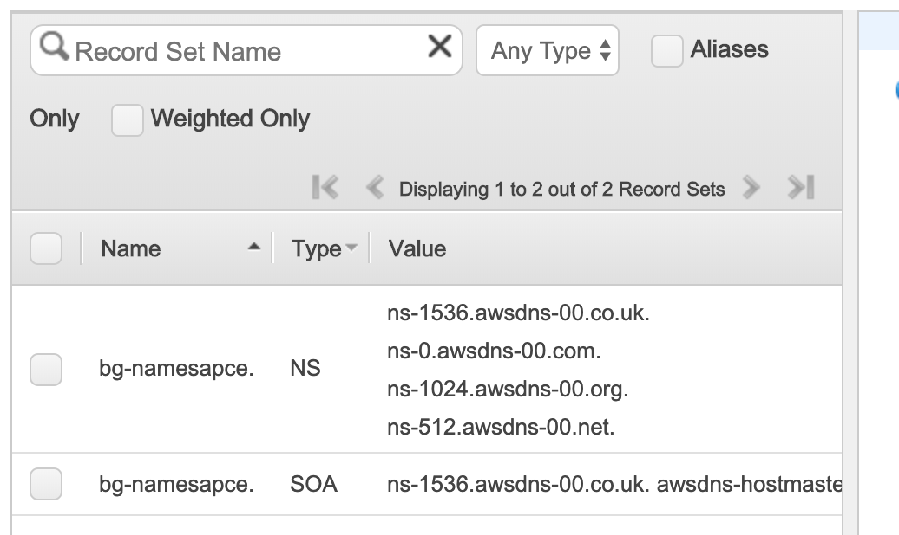

Harness is not able to modify this zone due to AWS restrictions, and so you need to add another zone where Harness can register CNAME records, and manage their weights for routing. In our example, we will create another namespace name **bg-namespace\_upper**:

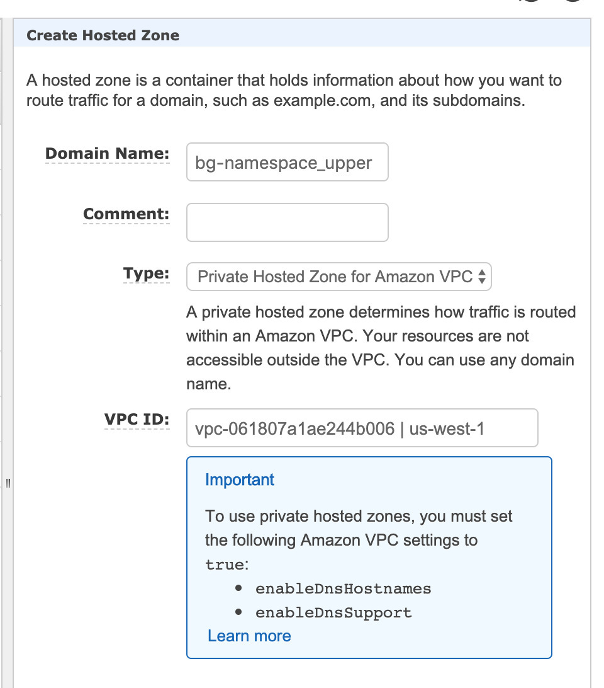

When you are done, Route 53 will have two zones: the zone automatically created by AWS Cloud Map (**bg-namespace**) and the zone you created manually (**bg-namespace\_upper**):

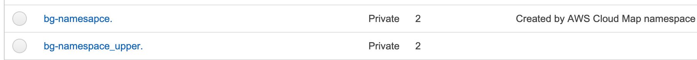

Next, you need to create the two services in the namespace. You can do this via AWS CLI or the AWS Cloud Map console. Below are examples using the AWS Cloud Map console.

#### Set up AWS for Blue/Green Using DNS

To create the two new services, in AWS Cloud Map, in your namespace, click **Create service**.

1. For **Service name**, enter a name such as **service1**.
2. In **DNS configuration**, select **Weighted routing**, and in Record type, select **SRV**.
3. Click **Create service**. The new service is added to the namespace.
4. Repeat these steps to add a second service, **service2**. When you are finished, the AWS Cloud Map page for the namespace will look something like this:

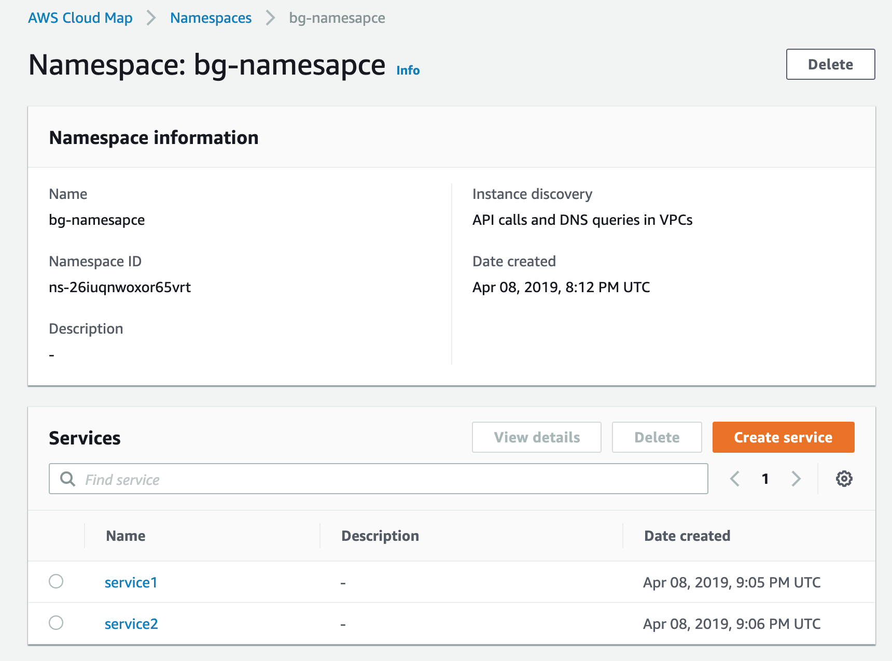

Now that you AWS setup is complete, you can create your Blue/Green Deployment Workflow in Harness.

#### Blue/Green Workflow with DNS

To set up a Blue/Green using DNS in Harness, do the following:

1. In Harness, in your Application, click **Workflows**, and then click **Add Workflow**. The **Workflow** dialog appears.
2. Enter the following options to select a Blue/Green Deployment using DNS:
   * **Name** - Enter the name of the Workflow, such as **ECS BG DNS**.
   * **Description** - Enter a description to provide context for the Workflow.
   * **Workflow Type** - Select **Blue/Green Deployment**.
   * **Environment** - Select the Environment where the ECS Service Infrastructure you want to use is configured.
   * **Service** - Select the ECS Service you created for your Application.
   * **Infrastructure Definition** - Select the Infrastructure Definition where you want to deploy your ECS Service.
3. When you select the Infrastructure Definition, the **Blue Green Switch** field appears.
2. In **Blue Green Switch**, select **Domain Name System (DNS)**. When you are done the dialog will look something like this: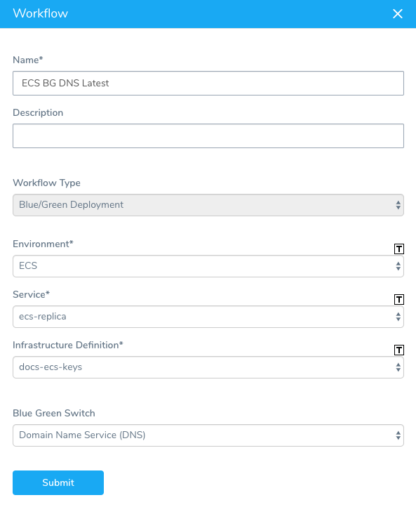
3. Click **SUBMIT**. The ECS Blue Green Workflow appears. The following image shows the default steps.

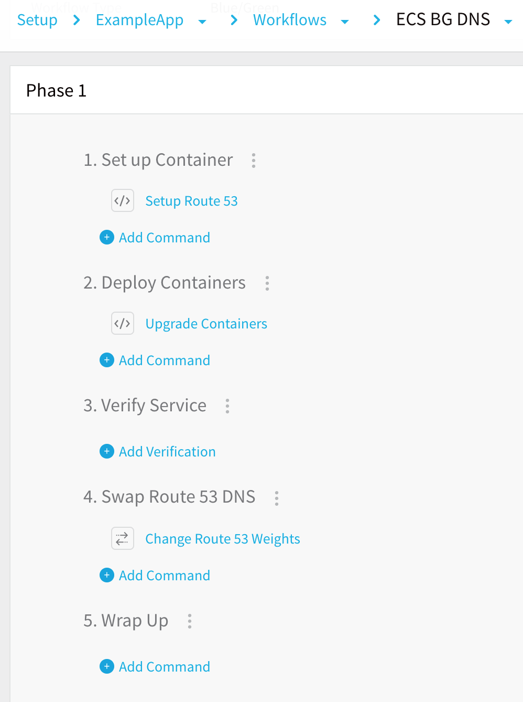

The following section describe the default steps.

#### ECS Blue Green Route 53 Setup

The ECS Blue Green Route 53 Setup step is where you will specify the namespace, services, and hosted zone information needed by Harness to register the CNAME records for your services.

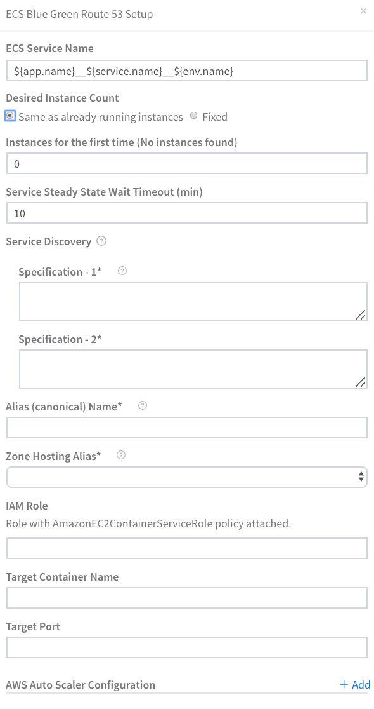

The **ECS Blue Green Route 53 Setup** step has the following settings.

* **ECS Service Name** - Enter a name for the ECS Service that will be deployed AWS, or use the default values provided by Harness.
* **Desired Instance Count** - Specify the number of service instances to deploy, using **Same as already running instances** or **Fixed**.
* **Service Discovery** - This section is where you will specify the AWS namespace, service, and zone information.
* **Specification - 1** and **Specification - 2** - These are the JSON specifications for the services you created in your namespace. You will need to enter the JSON description for each service, like this:


```
{  
    "registryArn": "arn:aws:servicediscovery:us-east-1:52516162:service/srv-xxxxxxxxx",  
    "containerName": "${CONTAINER_NAME}",  
    "containerPort": 8080  
}
```
You can use `containerPort` or `port`.

To obtain the `registryArn`, look at the **Service ID** in AWS Cloud Map:

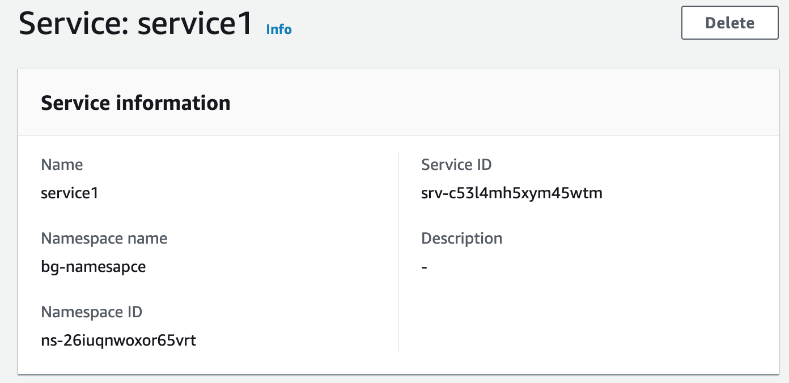

Copy the **Service ID** for each service and enter them into the JSON for **Specification - 1** and **Specification - 2**, like this:

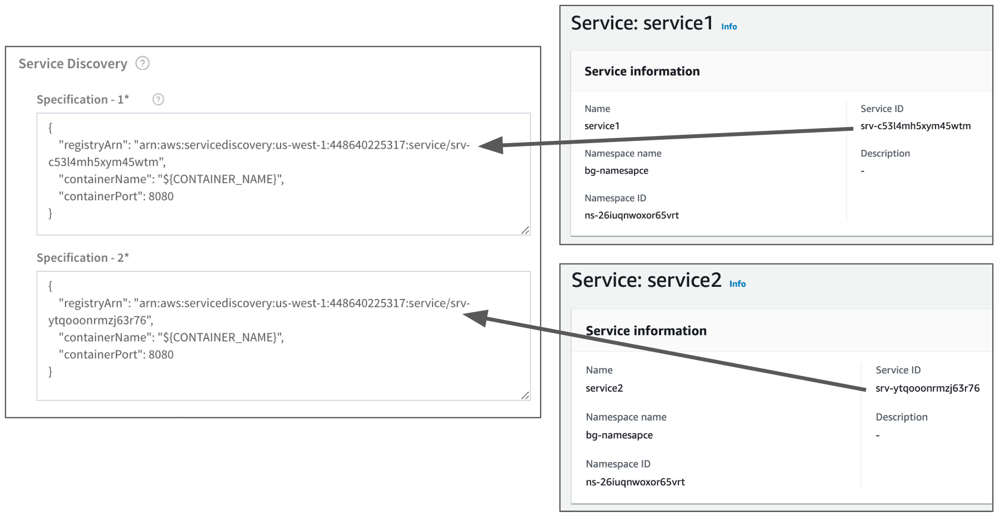

* **Alias (canonical) Name** - The name for the alias that you want redirected using the CNAME records. Typically, this is your app name, like **myapp**. You must include the zone name also. In our example, we are using **bg-namespace\_upper** as the zone name, and so, in **Alias (canonical) Name**, we enter `myapp.bg-namespace_upper.`. Note the dot at the end of the name entered.
* **Zone Hosting Alias** - The name of the zone hosting the CNAME record.

The following image shows the **Alias (canonical) Name** and **Zone Hosting Alias** settings and their corresponding DNS records. In this example, the CNAME records are already registered, but when you first deploy this will not be the case and Harness will register the records.

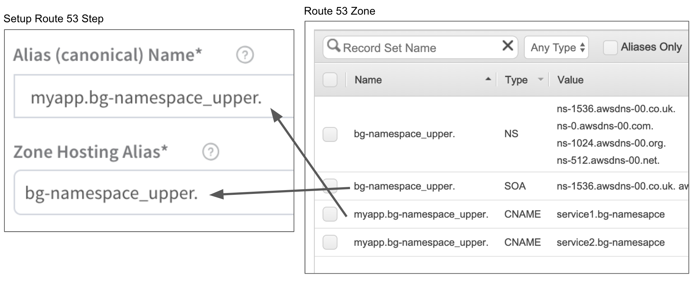

* **IAM Role** - You can leave this field blank as this setting isn't often necessary with Blue/Green ECS deployments. You can select the IAM role to use when using the ELB. The role must have the [AmazonEC2ContainerServiceRole](https://docs.aws.amazon.com/AmazonECS/latest/developerguide/service_IAM_role.html) policy.
* **Target Container Name** and **Target Port** - You can leave these fields blank. They are used if the container specification has multiple container definitions, which is not common. When you deploy your ECS service with Harness, Harness uses the container name and port from the **Service Specification** in the Harness Service. If you choose to use these fields, note that as an ECS requirement Target Container cannot be empty if Target Port is defined.
* **AWS Auto Scalar Configuration** - For more information, see [AWS Auto Scaling with ECS](ecs-workflows.md#aws-auto-scaling-with-ecs).

Here's what the **Setup Route 53** step looks like in a Deployment of the Workflow.

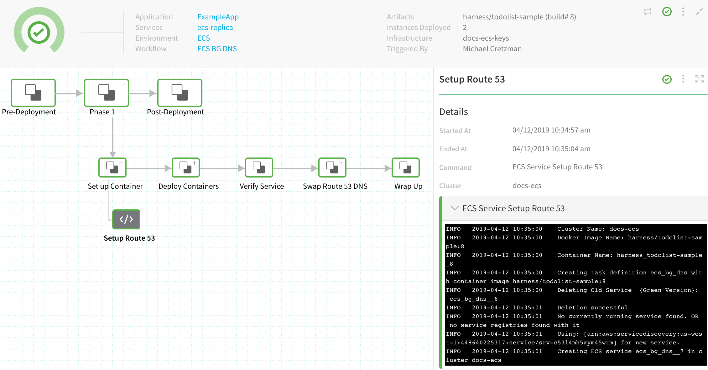

Here's the output from the step, where the current service ID is listed, and the service ID you provided in the **Specification - 1** field is used to create the new service.


```
Cluster Name: docs-ecs  
Docker Image Name: harness/todolist-sample:4  
Container Name: harness_todolist-sample_4  
Creating task definition ecs_bg_dns with container image harness/todolist-sample:4  
Current ECS service uses: [arn:aws:servicediscovery:us-west-1:448640225317:service/**srv-c53l4mh5xym45wtm**]  
Using: [arn:aws:servicediscovery:us-west-1:448640225317:service/**srv-ytqooonrmzj63r76**] for new service.  
Creating ECS service ecs_bg_dns__8 in cluster docs-ecs   
Checking for Auto-Scalar config for existing services  
No Auto-scalar config found for existing services
```
#### Upgrade Containers

The Upgrade Containers step adds new ECS service instances.

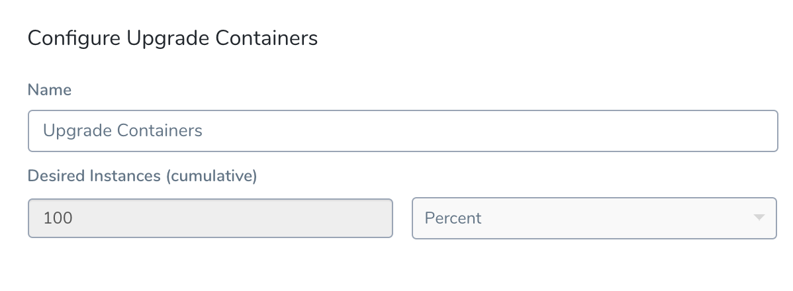

In **Desired Instances**, set the number or percentage of ECS service instances to use for this stage.

The value in **Desired Instances** relates to the number of ECS service instances set in the **Setup Route 53** dialog. For example, if you entered 2 as the **Desired Instance Count** in **Setup Route 53** and then enter 50 Percent in **Upgrade Containers**, that means, Harness will deploy 1 ECS service instance.

Here's what the **Upgrade Containers** step looks like in a Deployment of the Workflow.

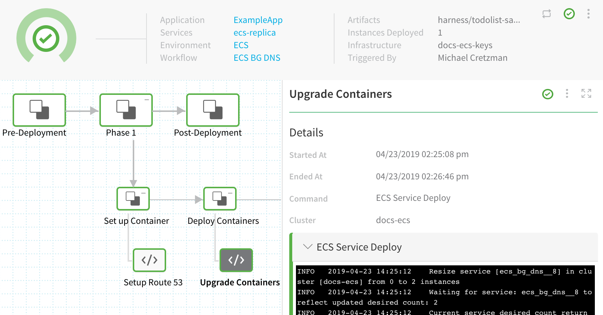

Here's the output from the step, where the service count is increased to 2.


```
Resize service [ecs_bg_dns__8] in cluster [docs-ecs] from 0 to 2 instances  
Waiting for service: ecs_bg_dns__8 to reflect updated desired count: 2  
Current service desired count return from aws for Service: ecs_bg_dns__8 is: 2  
Service update request successfully submitted.  
Waiting for pending tasks to finish. 0/2 running ...  
Waiting for pending tasks to finish. 0/2 running ...  
AWS Event: (service ecs_bg_dns__8) has started 2 tasks: (task b870fbd5f86342e6a2bc94600598fa25) (task 90f926fdf9c44b8ea35d0ad0474013d6).  
Waiting for pending tasks to finish. 0/2 running ...  
Waiting for pending tasks to finish. 2/2 running ...  
Waiting for service to be in steady state...  
AWS Event: (service ecs_bg_dns__8) has reached a steady state.  
Service has reached a steady state  
No Autoscalar config provided.  
  
Container IDs:  
  10.0.0.132 (new)  
  10.0.0.132 (new)  
  
Completed operation  
----------  
  
Service [ecs_bg_dns__7] in cluster [docs-ecs] stays at 2 instances  
No Autoscalar config provided.  
Completed operation  
----------  

```
#### Upgrade Containers and Rollback Containers Steps are Dependent

In order for rollback to add ECS Auto Scaling to the previous, successful service, you must have both the **Upgrade Containers** and **Rollback Containers** steps in the same Phase.


Since ECS Auto Scaling is added by the **Upgrade Containers** step, if you delete **Upgrade Containers**, then **Rollback Containers** has no ECS Auto Scaling to roll back to.

If you want to remove ECS Auto Scaling from a Phase, delete both the **Upgrade Containers** and **Rollback Containers** steps. The Phase will no longer perform ECS Auto Scaling during deployment or rollback.

#### Change Route 53 Weights

A weight value determines the proportion of DNS queries that Route 53 responds to using the current record. The **Change Route 53 Weights** step is configured with two weights to apply to the CNAME records Harness registers.

By default, the weights are **100** for the new service and **0** for the old service. A weight of **0** disables routing to a resource using this CNAME record. This performs a complete redirect to the new service each time a new service is deployed.

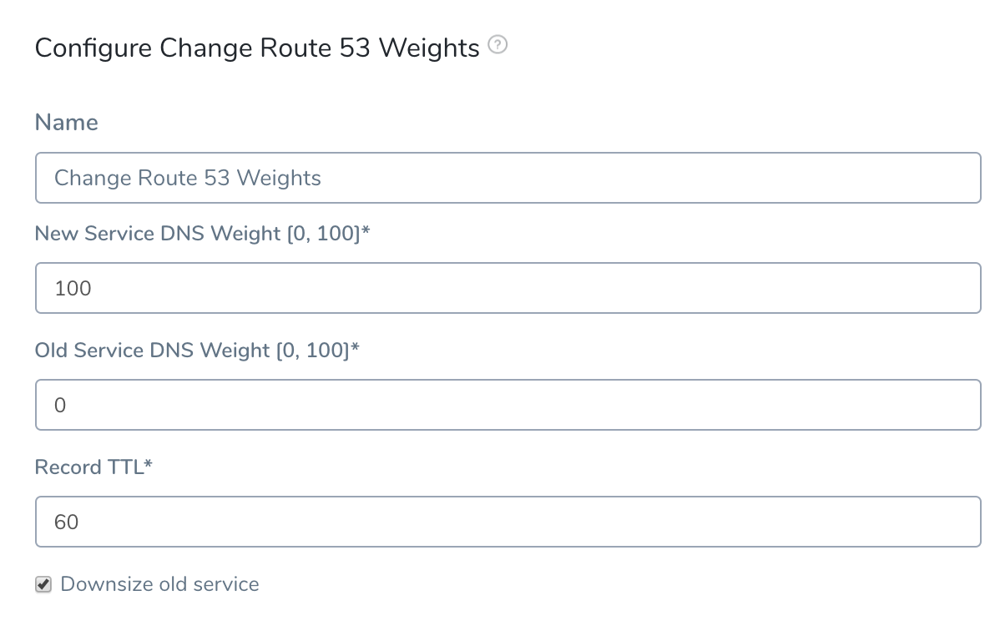

Here's what the Change Route 53 Weights step looks like in a Deployment of the Workflow.

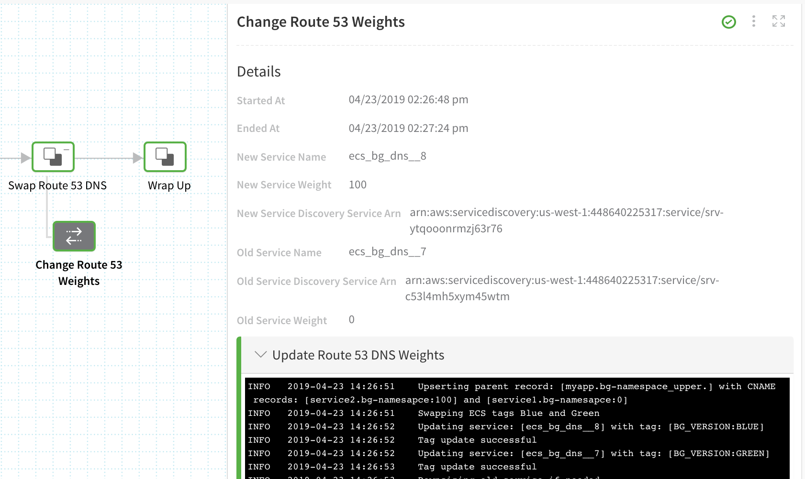

The Details section displays the service names and weights.

Here's the output from the step, where the CNAME records are registered with the zone you added, and the weights are applied. Tags for the ECS services are also added to identify that they are BLUE or GREEN. The service for the old version is downsized to 0 but not deleted.


```
Upserting parent record: [myapp.bg-namespace_upper.] with CNAME records: [service2.bg-namesapce:100] and [service1.bg-namesapce:0]  
Swapping ECS tags Blue and Green  
Updating service: [ecs_bg_dns__8] with tag: [BG_VERSION:BLUE]  
Tag update successful  
Updating service: [ecs_bg_dns__7] with tag: [BG_VERSION:GREEN]  
Tag update successful  
Downsizing old service if needed  
Downsizing Green Service: ecs_bg_dns__7  
Waiting for service: ecs_bg_dns__7 to reflect updated desired count: 0  
Current service desired count return from aws for Service: ecs_bg_dns__7 is: 0  
Waiting: [30] seconds for the downsize to complete ECS services to synchronize
```
In the Route 53 console, you can see the result of the CNAME weights in the zone you created, in the **Weight** column. Note that the **Set ID** column also lists **Harness-Green** or **Harness-Blue**.


You can also see the Blue/Green tag in the ECS console, in the **Tags** tab for the service:

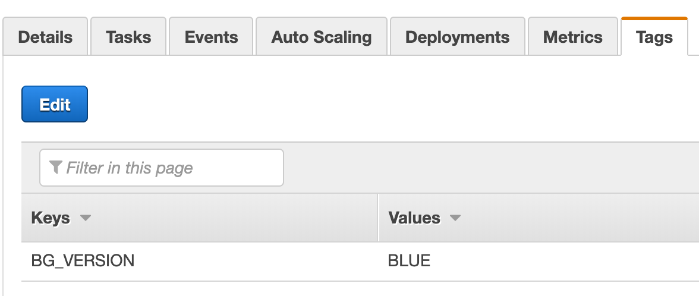

### Rollbacks

See [ECS Rollbacks](https://docs.harness.io/article/d7rnemtfuz-ecs-rollback).

### Post-Production Rollback

Harness also supports post-production rollback for cases where you want to recover from a deployment that succeeded on technical criteria, but that you want to undo for other reasons.

See [Rollback Production Deployments](https://docs.harness.io/article/2f36rsbrve-post-deployment-rollback).

### Next Step

* [ECS Workflows](ecs-workflows.md)
* [ECS Setup in YAML](ecs-setup-in-yaml.md)
* [ECS Troubleshooting](ecs-troubleshooting.md)
* [Pipelines](https://docs.harness.io/article/zc1u96u6uj-pipeline-configuration)
* [Triggers](https://docs.harness.io/article/xerirloz9a-add-a-trigger-2)

