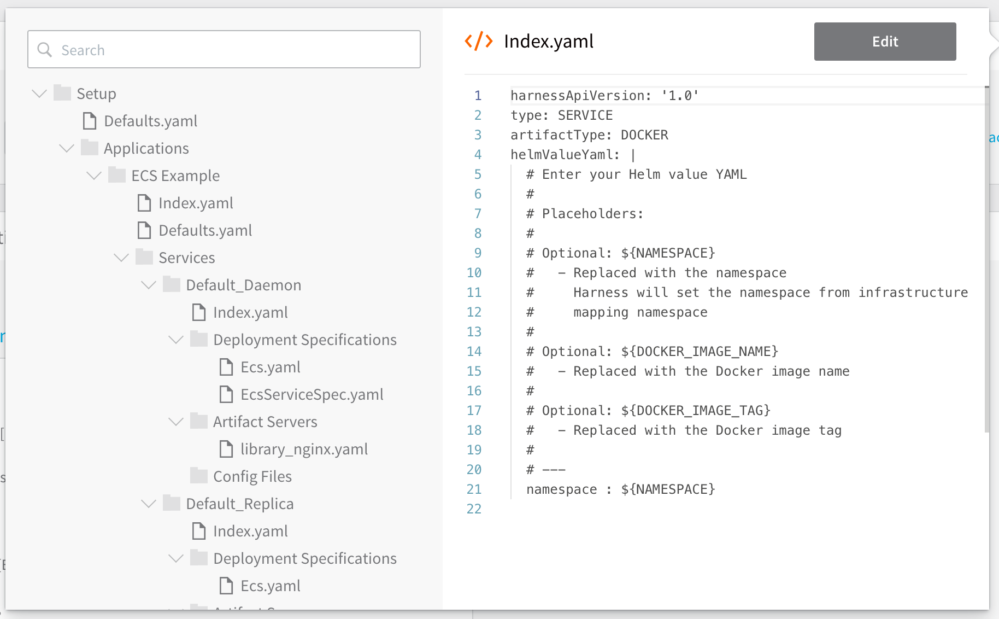

All of the Harness configuration steps in this guide can be performed using code instead of the Harness user interface. You can view or edit the YAML for any Harness configuration by clicking the **YAML>** button on any page.


When you click the button, the Harness code editor appears.



For example, here is the YAML for the Daemon Scheduler, Basic Workflow we set up in this guide.


```
harnessApiVersion: '1.0'  
type: BASIC  
envName: stage-ecs  
failureStrategies:  
- executionScope: WORKFLOW  
  failureTypes:  
  - APPLICATION_ERROR  
  repairActionCode: ROLLBACK_WORKFLOW  
  retryCount: 0  
notificationRules:  
- conditions:  
  - FAILED  
  executionScope: WORKFLOW  
  notificationGroupAsExpression: false  
  notificationGroups:  
  - Account Administrator  
phases:  
- type: ECS  
  computeProviderName: aws-ecs  
  daemonSet: false  
  infraMappingName: example -AWS_ECS--Amazon Web Services- aws-ecs- us-west-1  
  name: Phase 1  
  phaseSteps:  
  - type: CONTAINER_SETUP  
    name: Setup Container  
    steps:  
    - type: ECS_DAEMON_SERVICE_SETUP  
      name: ECS Daemon Service Setup  
    stepsInParallel: false  
  - type: VERIFY_SERVICE  
    name: Verify Service  
    stepsInParallel: false  
  - type: WRAP_UP  
    name: Wrap Up  
    stepsInParallel: false  
  provisionNodes: false  
  serviceName: Default_Daemon  
  statefulSet: false  
rollbackPhases:  
- type: ECS  
  computeProviderName: aws-ecs  
  daemonSet: false  
  infraMappingName: example -AWS_ECS--Amazon Web Services- aws-ecs- us-west-1  
  name: Rollback Phase 1  
  phaseNameForRollback: Phase 1  
  phaseSteps:  
  - type: CONTAINER_SETUP  
    name: Setup Container  
    phaseStepNameForRollback: Setup Container  
    statusForRollback: SUCCESS  
    steps:  
    - type: ECS_SERVICE_SETUP_ROLLBACK  
      name: Rollback Containers  
    stepsInParallel: false  
  - type: VERIFY_SERVICE  
    name: Verify Service  
    phaseStepNameForRollback: Deploy Containers  
    statusForRollback: SUCCESS  
    stepsInParallel: false  
  - type: WRAP_UP  
    name: Wrap Up  
    stepsInParallel: false  
  provisionNodes: false  
  serviceName: Default_Daemon  
  statefulSet: false  
templatized: false  

```
For more information, see [Configuration as Code](https://docs.harness.io/article/htvzryeqjw-configuration-as-code) and [Harness GitOps](https://docs.harness.io/article/khbt0yhctx-harness-git-ops).

The above example is a simple one. If you are using more steps, like a [Terraform Infrastructure Provisioner](../../terraform-category/terraform-provisioner-step.md) step, there will be additional labels and values.

### Review: Do Not Use Multiple ECS Setup Steps

The ECS Service Setup is added to a Harness ECS Workflow automatically when you create the Workflow.

Your Basic Workflow or Canary Workflow Phase should only use one ECS Setup step. If you use multiple ECS Setup steps, the last step overrides all previous steps, rendering them useless.

