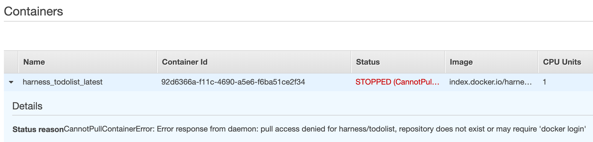

The following errors might occur when setting up and deploying ECS in Harness:

* [Rate Exceeded](ecs-troubleshooting.md#rate-exceeded)
* [New ARN and Resource ID Format Must be Enabled](ecs-troubleshooting.md#new-arn-and-resource-id-format-must-be-enabled)
* [Unable to Place a Task Because no Container Instance met all of its Requirements](ecs-troubleshooting.md#unable-to-place-a-task-because-no-container-instance-met-all-of-its-requirements)
* [Cannot Pull Container Image](ecs-troubleshooting.md#cannot-pull-container-image)
* [Invalid CPU or Memory Value Specified](ecs-troubleshooting.md#invalid-cpu-or-memory-value-specified)
* [ClientException: Fargate requires that 'cpu' be defined at the task level](ecs-troubleshooting.md#client-exception-fargate-requires-that-cpu-be-defined-at-the-task-level)
* [ClientException: The 'memory' setting for container is greater than for the task](ecs-troubleshooting.md#client-exception-the-memory-setting-for-container-is-greater-than-for-the-task)
* [AmazonElasticLoadBalancingException: Rate exceeded](ecs-troubleshooting.md#amazon-elastic-load-balancing-exception-rate-exceeded)

For information on ECS troubleshooting, see [Amazon ECS Troubleshooting](https://docs.aws.amazon.com/AmazonECS/latest/developerguide/troubleshooting.html) from AWS.

### Rate Exceeded

A common issue with AWS deployments is exceeding an AWS rate limit for some AWS component, such as ECS clusters per region or maximum number of scaling policies per Auto Scaling Groups.

For steps to increase any AWS limits, see [AWS Service Limits](https://docs.aws.amazon.com/general/latest/gr/aws_service_limits.html) from AWS.

### New ARN and Resource ID Format Must be Enabled

Harness uses tags for Blue/Green deployment, but ECS requires the new ARN and resource ID format to be enabled in order to add tags to the ECS service.

If you have not opted into the new ECS ARN and resource ID format before you attempt Blue/Green deployment, you might receive the following error:

`InvalidParameterException: The new ARN and resource ID format must be enabled to add tags to the service. Opt in to the new format and try again.`

To solve this issue, opt into the new format and try again. For more information, see [Migrating your Amazon ECS deployment to the new ARN and resource ID format](https://aws.amazon.com/blogs/compute/migrating-your-amazon-ecs-deployment-to-the-new-arn-and-resource-id-format-2/) from AWS.

### Unable to Place a Task Because no Container Instance met all of its Requirements

The Upgrade Containers step might show the following message:

`(service service-name) was unable to place a task because no container instance met all of its requirements.`

Review the CPU requirements in both the task size and container definition parameters of the task definition.

See [Service Event Messages](https://docs.aws.amazon.com/AmazonECS/latest/developerguide/service-event-messages.html#service-event-messages-list) from AWS.

### Cannot Pull Container Image

You might see Docker errors indicating that when creating a task, the container image specified could not be retrieved.



See [Cannot Pull Container Image Error](https://docs.aws.amazon.com/AmazonECS/latest/developerguide/task_cannot_pull_image.html) from AWS.

### Invalid CPU or Memory Value Specified

See the required settings in [Invalid CPU or Memory Value Specified](https://docs.aws.amazon.com/AmazonECS/latest/developerguide/task-cpu-memory-error.html) from AWS.

### ClientException: Fargate requires that 'cpu' be defined at the task level

Ensure that you add the CPU and Memory settings in the Harness Service Container Specification section—for example:


```
"cpu" : "1",  
  
"memory" : "512"
```
### ClientException: The 'memory' setting for container is greater than for the task

In the Harness Service **Container Specification** JSON, there are two settings for memory. The memory setting for the container must not be greater than the memory setting for the task:


```
{  
  
  "containerDefinitions" : [ {  
  
    "name" : "${CONTAINER_NAME}",  
  
    "image" : "${DOCKER_IMAGE_NAME}",  
  
    "memory" : 512,  
  
    ...  
  
  } ],  
  
  "executionRoleArn" : "${EXECUTION_ROLE}",  
  
  ...  
  
  "cpu" : "1",  
  
  "memory" : "512",  
  
  "networkMode" : "awsvpc"  
  
}
```
### AmazonElasticLoadBalancingException: Rate exceeded

You might receive this error as a result of AWS Load Balancer rate limiting. For more information, see [Limits for Your Application Load Balancers](https://docs.aws.amazon.com/elasticloadbalancing/latest/application/load-balancer-limits.html) from AWS.

