This topic describes how to set up Harness Basic and Canary Workflows for ECS deployments.

### Overview

Workflows are the deployment steps for your ECS services, including deployment types such as Canary and Blue/Green. Workflows can involve a few steps or multiple phases each composed of several steps.

This topic covers Canary and Basic ECS Workflows. For ECS Blue/Green Workflows, see [ECS Blue/Green Workflows](ecs-blue-green-workflows.md).ECS Harness Workflows differ according to the ECS Service Scheduler (Replica and Daemon) used by the Harness Service in the Workflow. In this section, we will set up one Workflow for each Replica and Daemon Scheduler:

* **Workflow 1: Replica Scheduling using Canary Deployment.**
	+ Phase 1 - 50% Deployment:
		- Setup Container: ECS Service Setup.
		- Deploy Containers: Upgrade Containers.
	+ Phase 2 - 100% Deployment:
		- Deploy Containers: Upgrade Containers.
* **Workflow 2: Daemon Scheduling using Basic Deployment.**
	+ ECS Daemon Service Setup Step.

### Review: Permissions

To create and deploy an ECS Workflow, you must belong to a Harness User Group with the following Account Permissions enabled:

* `Workflow Update`
* `Workflow Create`

See [Managing Users and Groups (RBAC)](https://docs.harness.io/article/ven0bvulsj-users-and-permissions).

### Review: Do Not Use Multiple ECS Setup Steps

The ECS Service Setup is added to a Harness ECS Workflow automatically when you create the Workflow.

Your Basic Workflow or Canary Workflow Phase should only use one ECS Setup step. If you use multiple ECS Setup steps, the last step overrides all previous steps, rendering them useless.

### Replica Scheduling using Canary Deployment

In this procedure, we will create a Workflow to deploy a Harness Service configured with a Replica Scheduling Strategy, as described in [Replica Strategy](ecs-services.md#replica-strategy).

To create a Workflow using a Service configured with a Replica Scheduling Strategy, do the following:

1. In your Harness Application, click **Workflows**. The **Workflows** page appears.
2. Click **Add Workflow**. The **Workflow** dialog appears.
3. Complete the following fields.
	1. **Name** - Give the Workflow a name that describes its deployment goals, such as **ECS Replica Strategy**.
	2. **Description** - Provide details about the Workflow so other users understand its deployment goals.
	3. **Workflow Type** - Select **Canary Deployment**.
	4. **Environment** - Select the Environment you created for ECS. This is the Environment containing an [Infrastructure Definition](https://docs.harness.io/article/v3l3wqovbe-infrastructure-definitions) for the Harness Service you are deploying with this Workflow. You will select the Service and the Infrastructure Definition when you set up the Canary deployment's stages.
	5. Click **SUBMIT**. The new Workflow is displayed.
	   
		 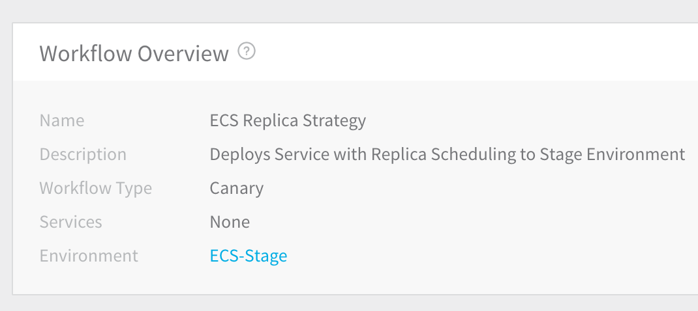
		 
		 Next, you will add two phases for the Canary deployment. The first phase will set up your ECS service and then upgrade ECS service instances to 50% of the available ECS service instances.
4. In the Workflow, in **Deployment Phases**, click **Add Phase**. The **Workflow Phase** dialog appears.  
  
If you are using Infrastructure Definitions, the dialog will look like this: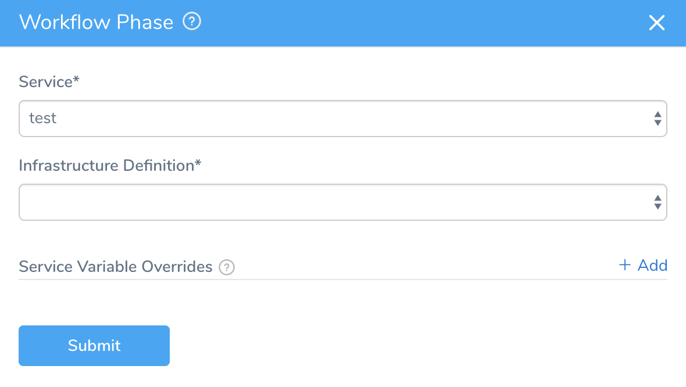
5. Complete the following fields.
	1. **Service** - Select the Harness Service that uses the Replica Strategy.
	2. **Infrastructure Definition** — This list is populated using the Environment you selected when creating the Workflow. Select the Infrastructure Definition that describes the cluster where you will deploy the Amazon ECS service defined in the Harness Service.
	3. **Service Variable Overrides** — If the Harness Service uses variables that you want to override for this Workflow phase, such as those described in [Service Discovery](ecs-services.md#service-discovery), you can override the variable values here.
6. Click **SUBMIT**. The new **Phase 1** page appears.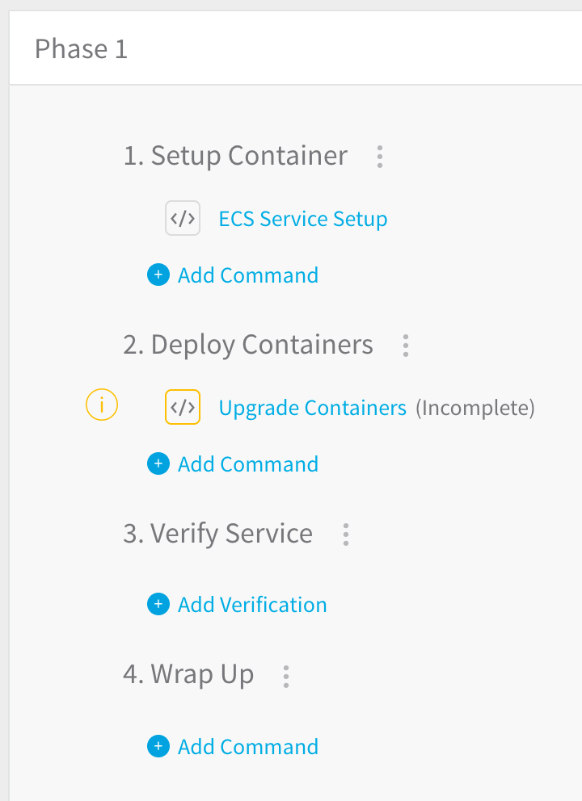
7. Click **ECS Service Setup**. The **ECS Service Setup** dialog appears.

   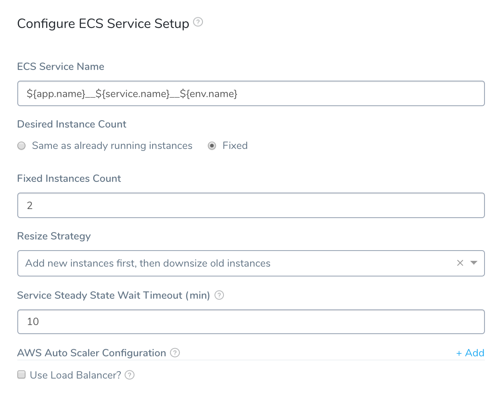
	 
8. Complete the following fields.
	1. **ECS Service Name** - By default, the ECS service will be named using a concatenation of the Harness Application, Service, and Environment names. You can change the name here using text or a variable. Enter **${** in the field to see a list of all of the variables available.
	2. **Same as already running instances** - This field displays the number of desired *ECS service instances* for this stage. By default, the ECS service will be set up using 2 ECS service instances even if the field contains **0**.During deployment, only one old version of the application will be kept. If there are more than one, Harness will reduce their instances to 0.
	3. **Fixed** - Click this option to fix the specific number of ECS service instances to use for this stage. The **Fixed Instances Count** field will appear, where you can enter the value.
	4. **Resize Strategy** - Specify how you want the new ECS service instances added and downsized.
	5. **Service Steady State Wait Timeout** - Specify how many minutes Harness should wait for the ECS service instances to reach Steady State before failing the set up. The default is 10 minutes. If you use an expression for this setting and it fails or evaluates to null, 10 minutes is used.This setting supports Harness variable expressions in Basic and Canary Workflows. They are not supported in Blue/Green Workflows or the ECS Run Task and ECS Daemon Service Setup steps. See [What is a Harness Variable Expression?](https://docs.harness.io/article/9dvxcegm90-variables) and [Set Workflow Variables](https://docs.harness.io/article/766iheu1bk-add-workflow-variables-new-template).
	6. **AWS Auto Scaler Configuration** - See [AWS Auto Scaling with ECS](#aws_auto_scaling_with_ecs).
	7. **Use Load Balancer** - See [Using ELB Load Balancers During Deployment](#using_elb_load_balancers_during_deployment).
	8. Close or Submit the **ECS Service Setup** dialog to return to the **Phase 1** page.

:::note 
To obtain the name of the ECS service deployed currently (from the **ECS Service Setup** step), you can use the Harness variable `${ECS__Service__Setup.serviceName}`. You might want to use the name in additional Workflow steps.
:::

9. Click **Upgrade Containers**. The **Upgrade Containers** dialog appears.
2. In **Desired Instances**, set the number or percentage of ECS service instances to use for this stage. As this is Phase 1 of a Canary deployment, enter **50 Percent**.  

   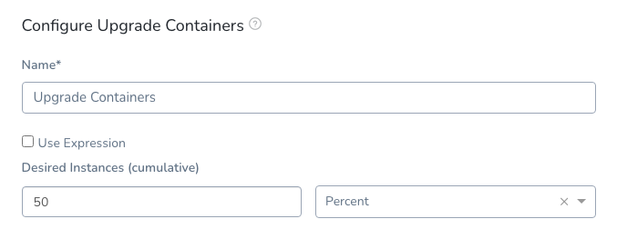
	 
	 The value in **Desired Instances** relates to the number of ECS service instances set in the **ECS Service Setup** dialog. For example, if you entered **2** as the **Fixed Instances Count** in **ECS Service Setup** and then enter **50 Percent** in **Upgrade Containers**, that means, for this phase, Harness will deploy **1** ECS service instance.The timeout for the **Upgrade Containers** step is inherited from the preceding **ECS Service Setup** step.**Use Expressions:** You can use [Harness Service, Environment Override, and Workflow](https://docs.harness.io/article/9dvxcegm90-variables) variable expressions in **Desired Instances** by selecting **Use Expression** and then entering the expression, like `${workflow.variables.DesiredInstances}`. When you run the Workflow, you can provide a value for the variable.
	 
	 
3. Click **SUBMIT**.
4. Click the name of the Workflow in the breadcrumb links to return to the **Workflow** page and add the second Phase of this Canary deployment.

   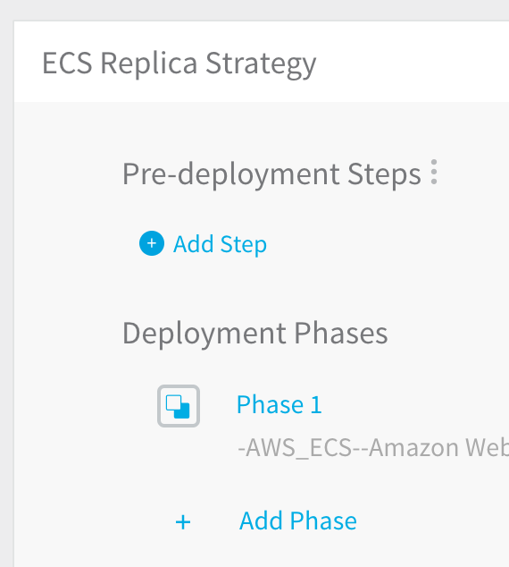
	 
5. To add **Phase 2**, click **Add Phase**.
6. In the **Workflow Phase** dialog, complete the following fields.
	1. **Service** - Select the same Harness Service that uses the Replica Strategy.
	2. **Infrastructure Definition** — Select the Infrastructure Definition that describes the cluster where you will deploy the Amazon ECS service defined in the Harness Service.
	3. **Service Variable Overrides** - If the Harness Service uses variables that you want to override for this Workflow phase, such as those described in [Service Discovery](#service_discovery), you can override the variable values here.
7. Click **SUBMIT**. The **Phase 2** page appears.

   
	 
	 As this is the second phase in the Canary deployment, it will only run if Phase 1 deployed successfully. Let's upgrade the number of containers to 100%.
8. Click **Upgrade Containers**. The **Upgrade Containers** dialog appears.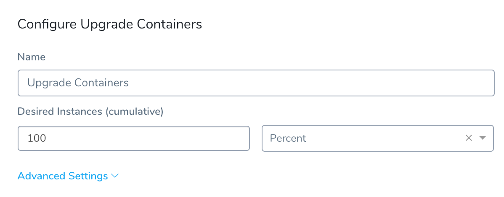
9. In **Desired Instances**, enter **100**, choose **Percent**, and click **SUBMIT**. This will deploy the full count of ECS service instances.

The Workflow is complete. You can run the Workflow to deploy the ECS service with the Replica strategy to your ECS cluster.

### Daemon Scheduling using Basic Deployment

In this procedure, we will create a Workflow to deploy a Harness Service configured with a Daemon Scheduling Strategy, as described in [Daemon Strategy](ecs-services.md#daemon-strategy).

To deploy a Harness Service configured with a Daemon Scheduling Strategy, do the following:

1. In your Harness Application, click **Workflows**. The **Workflows** page appears.
2. Click **Add Workflow**. The **Workflow** dialog appears, in one of the following formats.  
   We will be creating a Basic Deployment Workflow using the Harness Service configured with a Daemon Scheduling Strategy.
3. Complete the following fields.
	1. **Name** - Give the Workflow a name that describes its deployment goals, such as **ECS Daemon Strategy**.
	2. **Description** - Provide details about the Workflow so other users understand its deployment goals.
	3. **Workflow Type** - Select **Basic Deployment**.
	4. **Environment** - Select the Environment you created for ECS. This is the Environment containing an [Infrastructure Definition](https://docs.harness.io/article/v3l3wqovbe-infrastructure-definitions) for the Harness Service you are deploying with this Workflow. You will select the Service and Infrastructure Definition when you set up the Basic deployment.
4. Click **SUBMIT**. The new Workflow is displayed.

   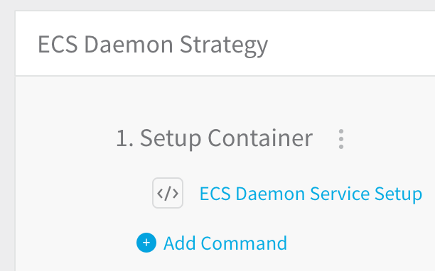
	 
	 This Workflow will simply set up the ECS service using a Daemon strategy.
5. Click the **ECS Daemon Service Setup** step. The **ECS Daemon Service Setup** dialog appears.
   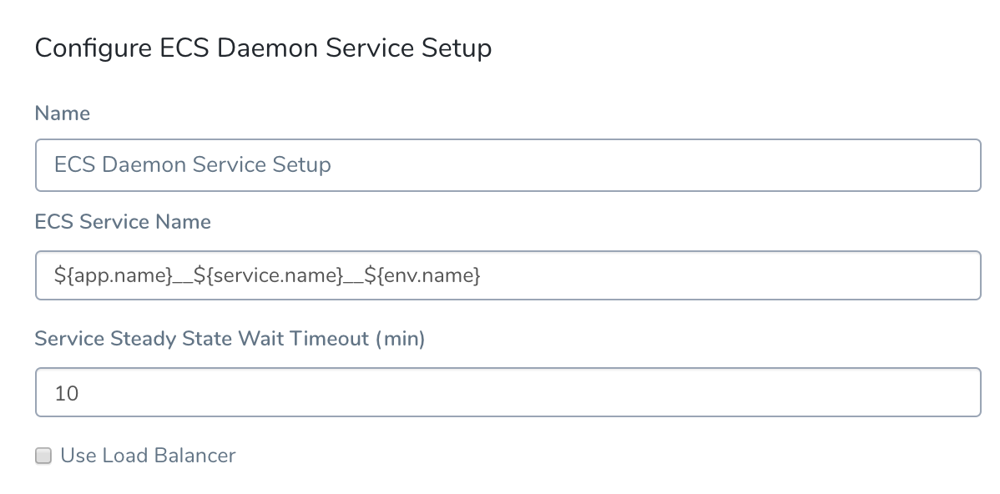
6. Complete the following fields.
	1. **ECS Service Name** - The step will create the ECS service using the names of the Harness Application, Service, and Environment.
	2. **Service Steady State Wait Timeout** - Specify how many minutes Harness should wait for the instances to reach Steady State before failing the set up.  
	You cannot use Harness variable expressions in this setting in the ECS Daemon Service Setup step. You can use them in the Replica scheduling scenario.
	3. Click **SUBMIT**.

The Workflow is complete. You can run the Workflow to deploy the ECS service with the Daemon strategy to your ECS cluster.

### Using ELB Load Balancers During Deployment

Currently, the single ELB is available in production, but the **multiple ELBs** feature is behind the Feature Flag `ECS_MULTI_LBS`. See [Multiple Load Balancers](#multiple_load_balancers) below.Harness can use one or more AWS Elastic Load Balancers (ALB and NLB only) for your Amazon ECS service to distribute traffic evenly across the tasks in your service.

When you set up an ELB configuration in Harness, you specify the target group for the ECS service.

When each task for your ECS service is started, the container and port combination specified in the **Service Specification** in the Harness Service is registered with that target group and traffic is routed from the load balancer to that task.

For information about using ELB and ECS, see [Service Load Balancing](https://docs.aws.amazon.com/AmazonECS/latest/developerguide/service-load-balancing.html) from AWS.In a Harness Workflow, the **ECS Service Setup** and **ECS Daemon Service Setup** steps allow you to use ELBs when deploying your ECS service.

To use ELBs in the **ECS Service Setup** or **ECS Daemon Service Setup** steps, do the following:

1. In the **ECS Service Setup** or **ECS Daemon Service Setup** step, in **AWS LoadBalancer Configuration**, click **Add**. The ELB settings appear.
   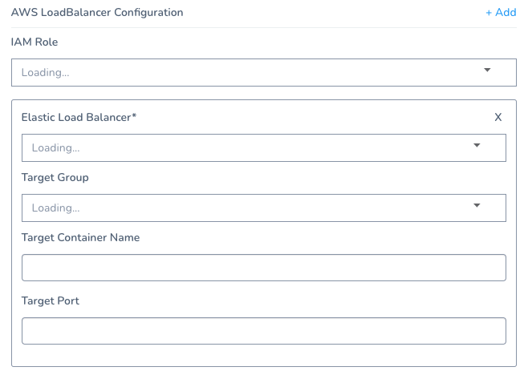
2. Complete the following ELB settings.
	1. **IAM Role** - The role must have the [AmazonEC2ContainerServiceRole](https://docs.aws.amazon.com/AmazonECS/latest/developerguide/service_IAM_role.html) policy.
	2. **Elastic Load Balancer** - Select the ELB that you want to use. The list is populated using the Infrastructure Definition in the Workflow setup. Once you select an ELB, Harness will fetch the list of target groups.
	3. **Target Group** - Select the target group for the load balancer. You associate a target group to an ECS service. Each target group is used to route requests to one or more registered targets.
	4. **Target Container Name** and **Target Port** - You can leave these fields blank. They are used if the container specification has multiple container definitions, which is not common. When you deploy your ECS service with Harness, Harness uses the container name and port from the **Service Specification** in the Harness Service. If you choose to use these fields, note that as an ECS requirement Target Container cannot be empty if Target Port is defined.  
	In **Target Container Name**, you can also use the `${CONTAINER_NAME}` parameter used in the Harness ECS Service spec.
3. Click **SUBMIT**.

The ELB configuration is set. When Harness deploys the ECS service, traffic will be routed from the load balancer to the service task.

You can use Harness [Service Config variables](https://docs.harness.io/article/q78p7rpx9u-add-service-level-config-variables), [Workflow variables](https://docs.harness.io/article/766iheu1bk-add-workflow-variables-new-template), and [CloudFormation Outputs](../cloudformation-category/using-cloudformation-outputs-in-workflow-steps.md) for all of these settings.

#### Multiple Load Balancers

Currently, this feature is behind the Feature Flag `ECS_MULTI_LBS`. Contact [Harness Support](mailto:support@harness.io) to enable the feature.To use multiple Load Balancers, simply click **Add** in **AWS LoadBalancer Configuration**.

Complete the settings as described above.

The IAM role selected in **IAM Role** is used for all Load Balancers.

You can use Harness [Service Config variables](https://docs.harness.io/article/q78p7rpx9u-add-service-level-config-variables), [Workflow variables](https://docs.harness.io/article/766iheu1bk-add-workflow-variables-new-template), and [CloudFormation Outputs](../cloudformation-category/using-cloudformation-outputs-in-workflow-steps.md) for all of these settings.

### AWS Auto Scaling with ECS

For details on how Harness applies ECS Auto Scaling, see [ECS Auto Scaling](https://docs.harness.io/article/28ehkmqy3v-ecs-auto-scaling).The ECS service(s) you deploy with Harness can be configured to use AWS Service Auto Scaling to adjust its desired ECS service count up or down in response to CloudWatch alarms. For more information on using Auto Scaling with ECS, see [Target Tracking Scaling Policies](https://docs.aws.amazon.com/AmazonECS/latest/developerguide/service-autoscaling-targettracking.html) from AWS.

This is what the AWS Auto Scaling setting looks like in the ECS console:

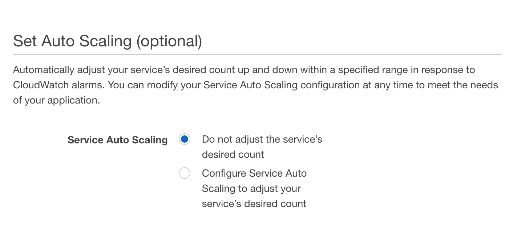

In Harness, you configure Auto Scaling in the **ECS Service Setup** step of a Workflow (for example, Canary Deployment).

ECS Auto Scaling is performed using the **Upgrade Containers** step. If you delete this step from a Phase, no ECS Auto Scaling is performed in that Phase. You can add the step to a previous Phase, but you must also add its corresponding **Rollback Containers** step. See [Upgrade Containers and Rollback Containers Steps are Dependent](#upgrade_containers_and_rollback_containers_steps_are_dependent).There are two AWS Auto Scaling resource types that you must be set up in Harness to use Auto Scaling with ECS:

* **Scalable Target** - Specifies a resource that AWS Application Auto Scaling can scale. For more information, see [ScalableTarget](https://docs.aws.amazon.com/AWSCloudFormation/latest/UserGuide/aws-resource-applicationautoscaling-scalabletarget.html) from AWS.
* **Scalable Policy** - Defines a scaling policy that Application Auto Scaling uses to adjust your application resources. For more information, see [ScalingPolicy](https://docs.aws.amazon.com/AWSCloudFormation/latest/UserGuide/aws-resource-applicationautoscaling-scalingpolicy.html) from AWS.

Before you set up Auto Scaling for the ECS service in Harness, you need to obtain the JSON for the Scalable Target and Scalable Policy resources from AWS.

The JSON format used in the **Auto Scaler Configurations** settings should match the AWS standards as described in [ScalableTarget](https://docs.aws.amazon.com/autoscaling/application/APIReference/API_ScalableTarget.html) and [ScalablePolicy](https://docs.aws.amazon.com/autoscaling/application/APIReference/API_ScalingPolicy.html).To obtain the Scalable Target, connect to an EC2 instance in your VPC and enter the following:

`aws application-autoscaling describe-scalable-targets --service-namespace ecs`

For more information, see [describe-scalable-targets](https://docs.aws.amazon.com/cli/latest/reference/application-autoscaling/describe-scalable-targets.html) from AWS.

To obtain the Scalable Policy, enter the following:

`aws application-autoscaling describe-scaling-policies --service-namespace ecs`

For more information, see [describe-scaling-policies](https://docs.aws.amazon.com/cli/latest/reference/application-autoscaling/describe-scaling-policies.html) from AWS.

To create the Scalable Target and Scalable Policy resources, see the [register-scalable-target](https://docs.aws.amazon.com/cli/latest/reference/application-autoscaling/register-scalable-target.html) and [put-scaling-policy](https://docs.aws.amazon.com/cli/latest/reference/application-autoscaling/put-scaling-policy.html) commands from AWS.To set up Auto Scaling for the ECS service in the Harness Workflow, do the following:

1. In a Workflow with the **ECS Service Setup** step, open the **ECS Service Setup** step.
2. In **Auto Scaler Configurations**, the Auto Scaling property fields appear.
   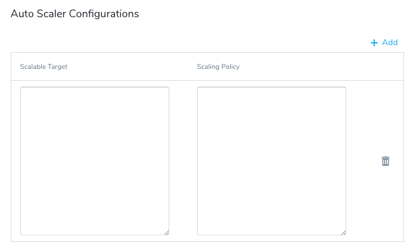
3. In **Scalable Target**, paste the JSON for the property.This should follow the [AWS ScalableTarget JSON format](https://docs.aws.amazon.com/AWSCloudFormation/latest/UserGuide/aws-resource-applicationautoscaling-scalabletarget.html). 

   For example:

		```
		{  
		  
		  "ServiceNamespace": "ecs",  
		  
		  "ScalableDimension": "ecs:service:DesiredCount",  
		  
		  "MinCapacity": 2,  
		  
		  "MaxCapacity": 5,  
		  
		  "RoleARN": "arn:aws:iam::448XXXXXXX7:role/aws-service-role/ecs.application-autoscaling.amazonaws.com/AWSServiceRoleForApplicationAutoScaling_ECSService"  
		  
		}
		```
		
4. In **Scaling Policy**, paste the JSON for the property.This should follow the [AWS ScalingPolicy JSON format](https://docs.aws.amazon.com/AWSCloudFormation/latest/UserGuide/aws-resource-applicationautoscaling-scalingpolicy.html).

   For example:

		```
		{  
		  
		  "ScalableDimension": "ecs:service:DesiredCount",  
		  
		  "ServiceNamespace": "ecs",  
		  
		  "PolicyName": "P1",  
		  
		  "PolicyType": "TargetTrackingScaling",  
		  
		  "TargetTrackingScalingPolicyConfiguration": {  
		  
		    "TargetValue": 60.0,  
		  
		    "PredefinedMetricSpecification": {  
		  
		      "PredefinedMetricType": "ECSServiceAverageCPUUtilization"  
		  
		    },  
		  
		    "ScaleOutCooldown": 300,  
		  
		    "ScaleInCooldown": 300  
		  
		  }  
		  
		}
		```
		
When Harness deploys your ECS service, it will register the service with an AWS Auto Scaling Group to apply the scaling policy, scaling out (and in) using CloudWatch target tracking.

To obtain the name of the Auto Scaling Group created by Harness, use the Harness variable `${ami.newAsgName}`. For example, you could add a Shell Script command to your Workflow that contains the command `echo ${ami.newAsgName}`.

### Upgrade Containers and Rollback Containers Steps are Dependent

In order for rollback to add ECS Auto Scaling to the previous, successful service, you must have both the **Upgrade Containers** and **Rollback Containers** steps in the same Phase.


Since ECS Auto Scaling is added by the **Upgrade Containers** step, if you delete **Upgrade Containers**, then **Rollback Containers** has no ECS Auto Scaling to roll back to.

If you want to remove ECS Auto Scaling from a Phase, delete both the **Upgrade Containers** and **Rollback Containers** steps. The Phase will no longer perform ECS Auto Scaling during deployment or rollback.

### ECS Steady State Check Command

You can use the **ECS Steady State Check** command in an ECS Workflow to check for the steady state of a service you have deployed using a method other than the default **ECS Service Setup** or **ECS Daemon Service Setup** commands, such as a **Shell Script** command.

The **ECS Steady State Check** command may be added to the **Deploy Containers** section of a Workflow. The **ECS Steady State Check** command dialog looks like this:


In **ECS Service Name**, enter the name of the ECS service you are deploying.

In **Timeout**, enter how long Harness should wait for Steady State to be reached before failing the deployment. The default is **600000** ms (10 minutes).

### Rollback Command

When you created a Workflow for an ECS service a Rollback command is automatically added to the **Rollback Steps** section of the Workflow (and its Phases).

If Harness needs to rollback and restore the ECS setup to its previous working version, or if you interrupt the deployment to roll it back manually, the first step is to rollback the ECS services.

When a rollback occurs, Harness rolls back all Workflow phases in the reverse order they were deployed. This is true for ECS services deployed to EC2 or Fargate clusters.

See [ECS Rollbacks](https://docs.harness.io/article/d7rnemtfuz-ecs-rollback).

### Deploy ECS Workflows

Once your ECS Workflow is complete, you can deploy it to your ECS cluster. For more information about deploying Workflows, see [Deploy a Workflow](https://docs.harness.io/article/m220i1tnia-workflow-configuration#deploy_a_workflow).

Let’s look at the deployment of an ECS Workflow that deploys an ECS service using the Replica Strategy as part of a Canary deployment. Here is what the completed **Phase 1** looks like in Harness.

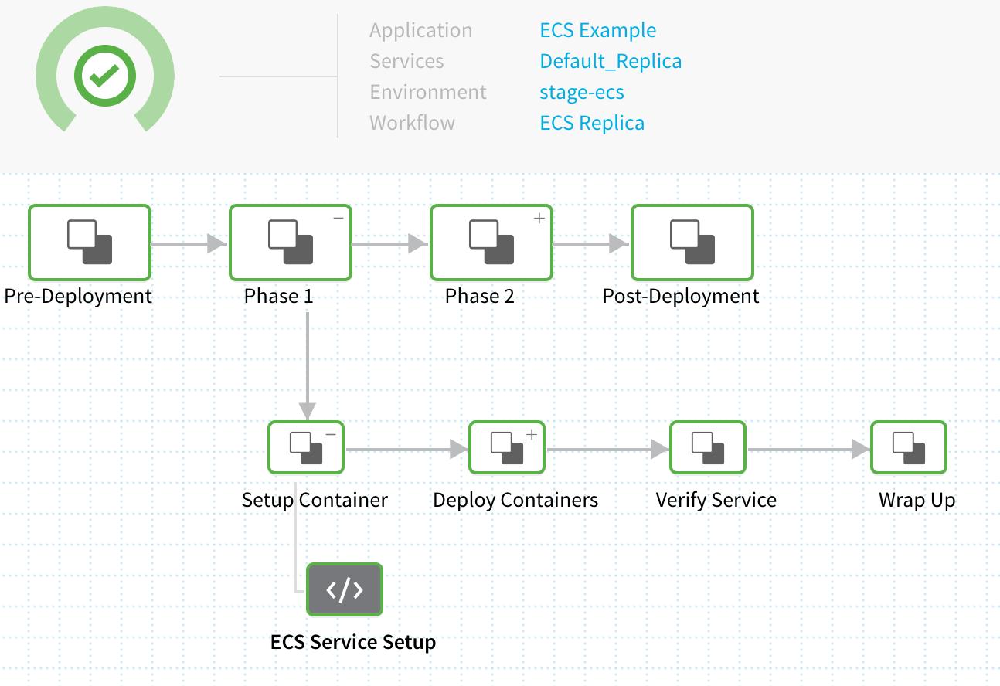

The **ECS Service Setup** step displays the steps executed by the Harness Delegate installed in the same AWS VPC as the ECS cluster named **example**. Here’s the output with comments explaining the deployment:


```
INFO   2019-01-07 13:32:54    Begin execution of command: Setup ECS Service  
  
**# Cluster named example is selected**  
INFO   2019-01-07 13:32:54    Cluster Name: example  
  
**# Artifact source is identified**  
INFO   2019-01-07 13:32:54    Docker Image Name: library/nginx:stable-perl  
  
**# Container name is created**  
INFO   2019-01-07 13:32:54    Container Name: library_nginx_stable-perl  
  
**# Task definition is created using the Harness Service Container Specification**  
INFO   2019-01-07 13:32:54    Creating task definition ECS__Example__Default_Replica__stage__ecs with container image library/nginx:stable-perl  
  
INFO   2019-01-07 13:32:54    Creating ECS service ECS__Example__Default_Replica__stage__ecs__4 in cluster example  
  
INFO   2019-01-07 13:32:54      
  
INFO   2019-01-07 13:32:54    Cleaning versions with no tasks  
  
**# No Auto Scaling Configured for this deployment**  
  
INFO   2019-01-07 13:32:54    Checking for Auto-Scalar config for existing services  
  
INFO   2019-01-07 13:32:54    No Auto-scalar config found for existing services  
  
**# Deployment Success**  
  
INFO   2019-01-07 13:32:54    Command execution finished with status SUCCESS  

```
Next, the Upgrade Containers Step updates the desired count of 2 services:


```
INFO   2019-01-07 13:32:56    Begin execution of command: Resize ECS Service  
  
**# Resize instances to 50% of 2 (1 instance)**  
  
INFO   2019-01-07 13:32:56    Resize service [ECS__Example__Default_Replica__stage__ecs__4] in cluster [example] from 0 to 1 instances  
  
INFO   2019-01-07 13:32:56    Waiting for service: ECS__Example__Default_Replica__stage__ecs__4 to reflect updated desired count: 1  
  
**# Resize Complete**  
INFO   2019-01-07 13:32:56    Current service desired count return from aws for Service: ECS__Example__Default_Replica__stage__ecs__4 is: 1  
  
INFO   2019-01-07 13:32:56    Service update request successfully submitted.  
  
INFO   2019-01-07 13:32:56    Waiting for pending tasks to finish. 0/1 running ...  
  
INFO   2019-01-07 13:33:37    Waiting for service to be in steady state...  
  
**# Service reached Steady State**  
  
INFO   2019-01-07 13:33:37    Service has reached a steady state  
  
**# Pull dockerId**  
  
INFO   2019-01-07 13:33:37    Fetching container meta data from http://10.0.0.53:51678/v1/tasks  
  
INFO   2019-01-07 13:33:37    Successfully fetched dockerId  
  
INFO   2019-01-07 13:33:37      
  
INFO   2019-01-07 13:33:37    Container IDs:  
  
INFO   2019-01-07 13:33:37      6452d4b0ef39 - 10.0.0.53 (new)  
  
INFO   2019-01-07 13:33:37      
  
INFO   2019-01-07 13:33:37    Completed operation  
  
INFO   2019-01-07 13:33:37    ----------  
  
**# Deployment Success**  
  
INFO   2019-01-07 13:33:48    Command execution finished with status SUCCESS
```
This example is for Phase 1 of a Canary deployment where 50% of 2 services are deployed. Once the Canary deployment is complete and both services are deployed, you can see the deployed services in the AWS ECS console:

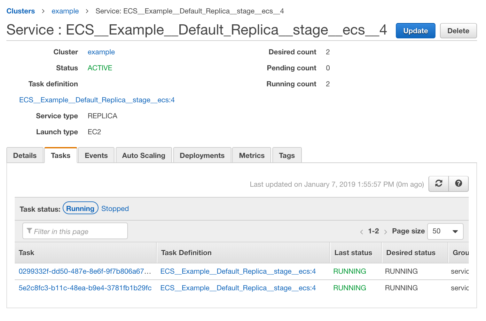

### Post-Production Rollback

Harness also supports post-production rollback for cases where you want to recover from a deployment that succeeded on technical criteria, but that you want to undo for other reasons.

See [Rollback Production Deployments](https://docs.harness.io/article/2f36rsbrve-post-deployment-rollback).

### Next Step

Now that you have completed a successful deployment, explore some of the other ECS and general Harness topics:

* [ECS Blue/Green Workflows](ecs-blue-green-workflows.md)
* [ECS Setup in YAML](ecs-setup-in-yaml.md)
* [ECS Troubleshooting](ecs-troubleshooting.md)
* [Pipelines](https://docs.harness.io/article/zc1u96u6uj-pipeline-configuration)
* [Triggers](https://docs.harness.io/article/xerirloz9a-add-a-trigger-2)

