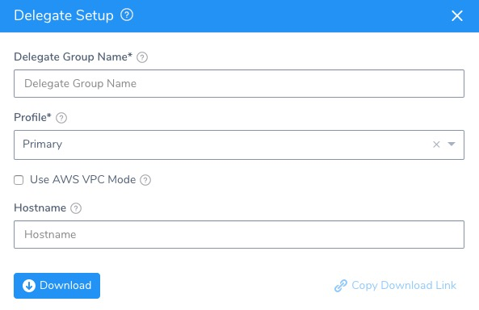
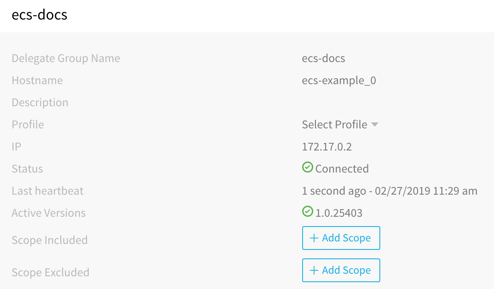

The Harness ECS Delegate is software you install in your environment that connects to Harness Manager and performs Continuous Delivery tasks.


This topic shows you how to install the Harness ECS Delegate in a ECS cluster as an ECS service to enable the Delegate to connect to your AWS resources.


### Set up an ECS Delegate


You can run the ECS Delegate in the same subnet as the target ECS cluster, which is often the easiest way to manage the Delegate. But this is not a requirement. The ECS cluster for the Harness ECS Delegate does not need to run in the same VPC as the target
 ECS cluster where you will deploy your ECS services.


#### Requirements for ECS Delegate


The Harness ECS Delegate runs as an ECS service in an ECS cluster. The ECS setup used to host the ECS Delegate must have the following:


* ECS Cluster.
* ECS Cluster must have 8GB memory for each ECS Delegate service added (m5ad.xlarge minimum).
* AWS IAM Role containing the required policies. The AWS policies are described in detail in
 [ECS (Existing Cluster)](https://docs.harness.io/article/whwnovprrb-infrastructure-providers#ecs_existing_cluster). For information on adding an IAM role to the ECS Delegate task definition, see
 [Trust Relationships and Roles](#trust_relationships_and_roles).


You can also use a Shell Script Delegate on an EC2 instance that assumes the same role as your ECS cluster. In this case, update the trust relationship of the IAM role so that the EC2 instances can assume the role. You can set this up in the **Trust relationships** tab of the IAM role:


The Harness ECS Delegate requires an IAM role and policies to execute its deployment tasks (API calls, etc). For ECS clusters, there are two IAM roles to consider:


* The IAM role assigned to the cluster. When you set up an ECS cluster you select an IAM role for the cluster.
* The IAM role assigned to the Task Definition.


For this tutorial, we will apply all of the roles and policies needed by the ECS Delegate to the IAM role assigned to the cluster.


The IAM roles and policies applied to the cluster are inherited by the EC2 hosting the cluster. Consequently, in a production deployment, you might elect to add the roles and policies to the Task Definition for the Harness ECS Delegate instead. For more
 information on the best practices with ECS roles, see 
 [Amazon ECS Container Instance IAM Role](https://docs.aws.amazon.com/AmazonECS/latest/developerguide/instance_IAM_role.html) from AWS.
For information on adding the IAM role and policy, see
 [Amazon ECS Container Instance IAM Role](https://docs.aws.amazon.com/AmazonECS/latest/developerguide/instance_IAM_role.html) from AWS.


Ensure that you add the IAM roles and policies to your ECS cluster when you create it. You cannot add the IAM roles and policies to an existing ECS cluster. You can add policies to whatever role is already assigned to an existing ECS cluster.
**Need a Cluster?** If you do not have an AWS account, you can use an
 [AWS Free Tier account](https://aws.amazon.com/free/) and create an ECS cluster by following the steps in
 [ECS Getting Started](https://console.aws.amazon.com/ecs/home?region=us-east-1#/getStarted) from Amazon. If you do have an AWS account and you want to evaluate Harness with ECS, you can simply create a new ECS cluster in your AWS account.


Though it is not a requirement, as a best practice, install the Delegate in the same VPC as the AWS resources Harness will use. You can even choose to install the Delegate in the same subnet. Installing the Delegate in the same VPC will help you to avoid
 cross-VPC networking complexities.

#### Set up ECS Delegate in AWS


In most cases, your will want to run the ECS Delegate with the default launch type, EC2. You can also run it as a Fargate launch type, but this requires some additional steps.


There are two specs in the Harness ECS Task Spec download, **ecs-task-spec.json** and **service-spec-for-awsvpc-mode.json**. For EC2 or awsvpc and Fargate, use the **ecs-task-spec.json** spec to create the default
 task definition named **harness-delegate-task-spec**.


For EC2, you simply reference the definition name when using the `aws ecs create-service` command.


For awsvpc network mode and Fargate, use the **service-spec-for-awsvpc-mode.json** service spec when using the `aws ecs create-service` command and it will reference the **harness-delegate-task-spec** task definition.


The following procedure describes how to set up the ECS Delegate for the common EC2 launch type scenario:


1. Download the ECS Delegate Task Spec.
	1. In **Harness Manager**, click **Setup**, and then click **Harness Delegates**.
	2. Click **Download Delegate**, and click the copy icon next to **ECS Task Spec**. The **Delegate Setup** dialog appears.
  
	   
     
	3. In **Delegate Group Name**, enter the name for your Delegate. When you add more ECS Delegates in the future, you can add to this group. All Delegates in this group use the same Task Definition, and share the same Delegate settings,
	 including Selectors. When you change a Selector, it will apply to all Delegates running under that Group.
	4. In **Profile**, select a Profile for the Delegate. The default is named **Primary**. For more information, see
	 [Delegate Profiles](https://docs.harness.io/article/h9tkwmkrm7-delegate-installation#delegate_profiles).
	5. Select **Use AWS VPC Mode** if you want to run the ECS Delegate task with a
	 [FARGATE launch type](https://docs.aws.amazon.com/AmazonECS/latest/developerguide/launch_types.html).
	6. In **Hostname**, enter a hostname for the ECS Delegate. If you do not enter a hostname, ECS will use your Docker container ID as the hostname for the ECS Delegate. If you provide a hostname, ECS uses it.
	7. Click **Download**. The ECS Task Spec is downloaded. Next, you will use the aws CLI to register the ECS Task Spec and then create the ECS service for the ECS Delegate.
2. Register the ECS Task Spec in AWS.
	1. Open a Terminal and navigate to the folder where you downloaded the ECS Task Spec.`$ cd /Users/johnsmith/Desktop/delegates/ECS`
	1. Extract the ECS Task Spec download.
	   `$ tar -zxvf harness-delegate-ecs.tar.gz`
	2. Navigate to the extracted folder: `cd harness-delegate-ecs`.
	3. Log into AWS using your AWS Access Key ID and AWS Secret Key ID.

    	`$ aws configure`
    	  
    	`AWS Access Key ID [****************LPAA]: XXXXXXX`
    	  
    	`AWS Secret Access Key [****************4z52]: XXXXXXX`

   4. Register the ECS task definition using the Harness ECS Task Spec.
	  
  	   `$ aws ecs register-task-definition --cli-input-json file://ecs-task-spec.json`
       
  	    The JSON for the task is output.
      
	5. View the completed task.
    
      `$ aws ecs list-task-definitions`
      
     	The `taskDefinitionArns` is output.
    
3. Obtain the name of the ECS cluster where you want to create the ECS service. The cluster must have a minimum of 8GB of memory (m5ad.xlarge minimum).

4. Create the ECS service for ECS Delegate.

	1. Create the ECS service using the task definition, providing the service name in `--service-name`, cluster name in `--cluster`, and the desired number of tasks in `--desired-count`. The cluster will need a minimum
	 of 8GB of memory per task.

	  `$ aws ecs create-service --service-name ecs-example --task-definition harness-delegate-task-spec --cluster default --desired-count 1`
	  
	  The output will display the JSON for the new service.
	  
    	`{`
    	  
    	`"service": {`
    	  
    	`"status": "ACTIVE",`
    	  
    	`"serviceRegistries": [],`
    	  
    	`"pendingCount": 0,`
    	  
    	`"launchType": "EC2",`
    	  
    	`"schedulingStrategy": "REPLICA",`
    	  
    	`"loadBalancers": [],`
    	  
    	`"placementConstraints": [],`
    	  
    	`"createdAt": 1551222417.28,`
    	  
    	`"desiredCount": 1,`
    	  
    	`"serviceName": "ecs-delegate",...`
  
	2. View the new service.

    	`$ aws ecs list-services --cluster default`
  	  
    	The output will display the new service:
  	  
    	`{`
    	  
    	`"serviceArns": [`
    	  
    	`"arn:aws:ecs:us-west-1:023826572170:service/ecs-delegate",`
    	  
    	`...`
    	  
    	`}`
  
	3. Wait 5 to 10 minutes for ECS to allocate resources for the service.
5. View the new ECS Delegate in Harness Manager.
	1. In **Harness Manager**, in the **Installations** page. When the ECS Delegate connects to the Harness Manager, it is listed with a status of **Connected**:
	 
	  
  
  	Congratulations! You are done installing and running the ECS Delegate.
	  The following steps simply show you how to use a Selector name to identify this Delegate when making a connection to AWS. You simply instruct Harness to connect to AWS using the same IAM role as the Delegate via its Selector name.
    
6. Once the Delegate is listed in Harness Manager, assign a Selector to the Delegate.
	1. Next to the **Selectors** label in the Delegate listing, click **Edit**.
	2. In the **Edit Selector** dialog, enter a Selector name, for example, **ecs-delegate**, and press **Enter**. Click **SUBMIT**. The Selector is listed.
7. Use the ECS Delegate for a Cloud provider connection.
	1. In **Harness Manager**, click **Setup**.
	2. Click **Cloud Providers**. The **Cloud Providers** page appears.
	3. Click **Add Cloud Provider**. The **Cloud Provider** dialog appears.
	4. In **Type**, select **AWS**.
	5. In **Display Name**, enter a name for the Cloud Provider, such as **aws-ecs**.
	6. Enable the **Assume IAM Role on Delegate** option.
	7. In **Delegate Selector**, click to select the Selector you gave the Delegate.
	8. Click **SUBMIT**. The Cloud Provider is added.

Later, when you create a Harness Service or an Infrastructure Definition in a Harness Environment, you will select this Cloud Provider and Harness will use the connection to obtain ECS cluster and networking information.


#### Fargate Specs and Delegates


For awsvpc network mode and Fargate, use the **service-spec-for-awsvpc-mode.json** service spec when using the `aws ecs create-service` command and it will reference the **harness-delegate-task-spec** task definition.


For the Fargate launch type, you must update the ECS task spec with the following
 [standard Fargate settings](https://aws.amazon.com/blogs/compute/migrating-your-amazon-ecs-containers-to-aws-fargate/):


* Set `requiresCompatibilities` to `FARGATE` instead of `EC2`.
* Add `executionRoleArn` to the ECS task spec. This is needed by FARGATE launch types.


Here is an example:


```
{  
    "containerDefinitions": [  
        {  
        ...  
        }  
    ],  
    "requiresCompatibilities": [  
        "FARGATE"  
    ],  
    "executionRoleArn": "arn:aws:iam::<your_account_id>:role/ecsTaskExecutionRole",  
    "memory": "6144",  
    "networkMode": "awsvpc",  
    "cpu": "1024",  
    "family": "harness-delegate-task-spec"  
}
```

##### Multiple Delegates on Delegates Page


For ECS Delegates using the EC2 launch type, Harness uses the hostname in the Task Spec as the Delegate name.


For ECS Delegates using the Fargate launch type, or when using awsvpc mode, Harness cannot use the hostname in the Task Spec because AWS does not allow it. Harness uses the container ID instead (the Docker container ID and not the Amazon ECS container
 ID for the container).


Consequently, every time a new task comes is run, a new Delegate is registered in Harness. This can result in multiple Delegates on the Harness Manager **Harness Delegates** page.


#### Multiple ECS Delegates


You can add multiple ECS Delegates using the following methods:


* **Add more tasks to the ECS service** - If you installed the ECS Delegate as a ECS service, you can update the number of tasks in the ECS service. Find the task in the ECS console and click **Run more like this**. New delegates
 will be created and will have same Delegate Group in the Harness Manager.
* **Add more services** - Create a new ECS service, in same or another cluster, using same ECS task definition.
* **Add more tasks** - If you are running the ECS Delegate as an individual task, and not as an ECS service, you can create more ECS tasks using same ECS task definition. It does not matter if you use the same ECS cluster.


#### ECS Delegate Options


You can use the ECS Delegate Task Spec to set up the ECS Delegate in one of two ways:


* **Recommended** - Create ECS services using the task definition created from the ECS Delegate Task Spec. An ECS service will spin up a new ECS Delegate task if any ECS Delegate task goes down, thus maintaining a persistent ECS Delegate.
* Create and run individual ECS tasks using the task definition created from the ECS Delegate Task Spec.


#### Network Modes


When you download the ECS Delegate Task Spec, you can select **awsvpc** as the network mode. When you create the service using the ECS Delegate Task Spec, use the service-spec-for-awsvpc-mode.json file:


```
aws ecs create-service --cli-input-json file://<$PATH>/service-spec-for-awsvpc-mode.json
```

The ECS console will request network configuration info when you run the Delegate task or service, including subnets, security groups, and public IP (for Fargate launch type).


#### Change ECS Delegate Defaults


To change CPU, memory, port mappings, or hostname, edit the default values in **ecs-task-spec.json** file. You can also change any other JSON fields as needed.


#### Trust Relationships and Roles


If you have an IAM role that you want an ECS task to use, you need to add a trust relationship using a **taskRoleArn** definition in the ECS task definition. Consequently, if you have an IAM role that you want the ECS Delegate to use, you
 need to add a **taskRoleArn** definition in the ECS Delegate task definition.


The taskRoleArn is the resource ARN of an IAM role that grants containers in the task permission to call AWS APIs on your behalf.


By default, the ECS Delegate task definition does not use a taskRoleArn, but uses the cluster-level IAM role that was used to create the existing cluster.


Here is an example of a ECS Delegate task definition with the taskRoleArn added before the container definition:


```
{  
  "ipcMode": null,  
  "executionRoleArn": null,  
  "**taskRoleArn**": "arn:aws:iam::123456789012:role/my-task-role"  
  "containerDefinitions": [  
    {  
      "dnsSearchDomains": null,  
      "logConfiguration": null,  
      "entryPoint": null,  
      "portMappings": [  
        {  
...
```

For more information, see
 [Modifying a Role](https://docs.aws.amazon.com/IAM/latest/UserGuide/id_roles_manage_modify.html) from AWS.
### Add a Delegate Selector


When Harness makes a connection to your ECS cluster via its Delegates, it will select the best Delegate according to its history and
 [other factors](https://docs.harness.io/article/h9tkwmkrm7-delegate-installation#how_does_harness_manager_pick_delegates). To ensure a specific Delegate is used by a Harness entity, you can scope the Delegate as explained in
 [Delegate Scope](https://docs.harness.io/article/h9tkwmkrm7-delegate-installation#delegate_scope), or you can add Selectors to Delegates and then reference the tags in commands and configurations.


For this guide, we will use a Delegate Selector. Later, when you add an AWS Cloud Provider to your Harness account, you will use the Delegate Tag you added to ensure the Cloud Provider uses that Delegate.


For steps on using Delegate Selector with your ECS Delegate, see the steps in
 [Set up ECS Delegate in AWS](https://docs.harness.io/article/h9tkwmkrm7-delegate-installation#set_up_ecs_delegate_in_aws).


### Next Step


* [2 - ECS Connectors and Providers Setup](ecs-connectors-and-providers-setup.md)


