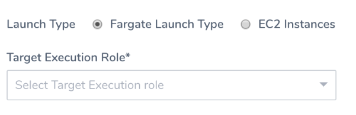
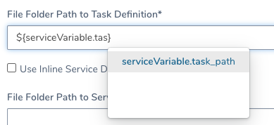
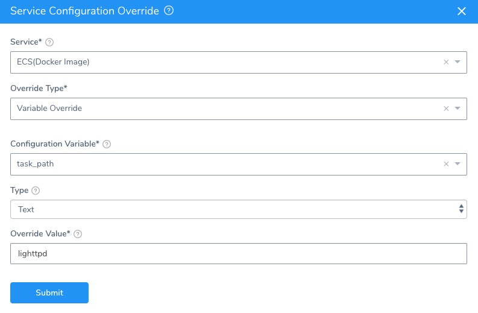

As an alternative to entering your [ECS task and/or service definitions inline](ecs-services.md), you can use your Git repo for task and/or service definition JSON files. At deployment runtime, Harness will pull these files and use them to create your containers and services.

This remote definition support enables you to leverage the build tooling and scripts you use currently for updating the definitions in your repos.

You can also use a Git repo for your entire Harness Application, and sync it unidirectionally or bidirectionally. For more information, see  [Configuration as Code](https://docs.harness.io/article/htvzryeqjw-configuration-as-code). There is no conflict between the Git repo used for remote definition files and the Git repo used for the entire Harness Application.

### Before You Begin

* [Add Source Repo Providers](https://docs.harness.io/article/ay9hlwbgwa-add-source-repo-providers)
* [AWS ECS Quickstart](https://docs.harness.io/article/j39azkrevm-aws-ecs-deployments)

### Limitations

* For EC2, the required `${DOCKER_IMAGE_NAME}` placeholder must be in your task definition. See [Review: Task Definition Placeholders](#review_task_definition_placeholders) below.
* For Fargate, the required `${EXECUTION_ROLE}` placeholder must be in your task definition. See [Review: Task Definition Placeholders](#review_task_definition_placeholders) below.
* You can use remote files for the task definition and the service definitions, or you can use a remote task definition and inline service specification.
* You cannot use an inline task definition and remote service specification.
* Remote files must be in JSON format.
* Remote files must be formatted to meet ECS JSON formatting standards. See [task definition](https://docs.aws.amazon.com/AmazonECS/latest/developerguide/task_definition_parameters.html) and [service definition](https://docs.aws.amazon.com/AmazonECS/latest/developerguide/service_definition_parameters.html) parameters from AWS.
* Remote definition files are supported for Git repos only. AWS S3 buckets will be supported in the near future.

### Supported Platforms and Technologies

See  [Supported Platforms and Technologies](https://docs.harness.io/article/220d0ojx5y-supported-platforms).

### Step 1: Link Harness to Your Repo

Add a Harness Source Repo Provider to connect Harness to the repo where your ECS definitions are located.

See [Add Source Repo Providers](https://docs.harness.io/article/ay9hlwbgwa-add-source-repo-providers).

### Step 2: Link Remote Definitions

1. In your Harness ECS Service, in **Deployment Specification**, click more options (**︙**), and then select **Link Remote Definitions**.  
The ECS Task Definitions settings appear.
2. In **Source Repository**, select the Harness Source Repo Provider you added.
3. In **Commit ID** , select **Latest from Branch** or **Specific Commit ID**.
4. In **Branch/Commit ID** (required), enter the branch or commit ID for the remote repo.
5. In **File Folder Path to Task Definition**, enter the repo folder path to the task definition.  
   For example, if the repo you set up in your Source Repo Provider is **https://github.com/aws-samples/aws-containers-task-definitions**, and the folder containing your task definition is **nginx**, you would enter **nginx**.
6. If you want to enter an inline service definition, select **Use Inline Service Definition**.
7. To link to a remote service definition in the repo configured in your **Source Repository**, in **File Folder Path to Service Definition**, enter the repo folder path to the service definition.
8. Click **Submit**.

### Review: Task Definition Placeholders

The ECS task definition JSON uses the following placeholders.

* [`${DOCKER_IMAGE_NAME}`](#docker_image_name)
* [`${CONTAINER_NAME}`](#container_name)
* [`${EXECUTION_ROLE}`](#execution_role)

Ensure that the required placeholders `${DOCKER_IMAGE_NAME}` and `${EXECUTION_ROLE}` (for Fargate) are used.

#### `${DOCKER_IMAGE_NAME}` 

**Required.** This placeholder is used with the image label in the JSON:`"image" : "${DOCKER_IMAGE_NAME}"`The placeholder is replaced with the Docker image name and tag at runtime.

```
...     "volumesFrom": [],      "image": "registry.hub.docker.com/library/nginx:stable-perl",      ...      "name": "library_nginx_stable-perl"    }
```

#### `${CONTAINER_NAME}` 

This placeholder is used with the name label in the JSON:`"name" : "${CONTAINER_NAME}"`The placeholder is replaced with a container name based on the Docker image name at runtime. 


#### `${EXECUTION_ROLE}` 

**Required for Fargate.** This placeholder is used with the `executionRoleArn` label in the JSON.

`"executionRoleArn" : "${EXECUTION_ROLE}"`

At deployment runtime, the `${EXECUTION_ROLE}` placeholder is replaced with the ARN of the **Target Execution Role** used by the Infrastructure Definition of the Workflow deploying this Harness Service.



You can also replace the `${EXECUTION_ROLE}` placeholder with another ARN manually in the Container Definition in the Service. This will override the **Target Execution Role** used by the Infrastructure Definition.

Replacing the `${EXECUTION_ROLE}` placeholder manually is usually only done when using a private repo.

In most cases, you can simply leave the placeholder as is.For more information, see  [Amazon ECS Task Execution IAM Role](https://docs.aws.amazon.com/AmazonECS/latest/developerguide/task_execution_IAM_role.html) from AWS. |

### Option 1: Using Variables for Remote Definition Paths

You can use Service Configuration variables in the paths for the remote definition files.

This enables you to change the paths when you deploy the Service, and to override them at the Harness Environment level.

In the Harness Service, in **Config Variables**, click **Add Variable**.

In **Config Variable**, enter a name, such as **task\_path**, and enter a path in **Value**.

In **ECS Task Definitions**, in **File Folder Path to Task Definition**, enter the variable expression, such as `${serviceVariable.task_path}`:



You can also use Config Variables for values in your remote definitions, but this can be more complicated to manage.

### Option 2: Override Remote Paths in Environments

If you have used Service Config Variables in the Task Definitions settings, you can override these values at the Harness Environment level.

See [Override a Service Configuration in an Environment](https://docs.harness.io/article/4m2kst307m-override-service-files-and-variables-in-environments) for details.

Basically, you select the Service Config variable and provide a new value:



### Option 3: Override Remote Paths in Workflows

To override a path in a Workflow, you can use a [Workflow variable](https://docs.harness.io/article/766iheu1bk-add-workflow-variables-new-template) in the Harness ECS Service's **Task Definition** settings.

First, you create a Workflow variable in the Workflow that will deploy the Harness ECS Service that uses a remote task definition. For example, `${workflow.variables.new_path}`.

Next, in the Harness ECS Service's **Task Definition** settings, you add the Workflow variable expression in the **File Folder Path to Task Definition** setting.


When you deploy the Workflow (independently or in a Pipeline), you are prompted to provide a value for the Workflow variable.

You can also pass in a Workflow variable value using a Trigger or between Workflows in a Pipeline. See [Passing Variables into Workflows and Pipelines from Triggers](https://docs.harness.io/article/revc37vl0f-passing-variable-into-workflows) and [Pass Variables between Workflows](https://docs.harness.io/article/gkmgrz9shh-how-to-pass-variables-between-workflows).

### Configure As Code

To see how to configure the settings in this topic using YAML, configure the settings in the UI first, and then click the **YAML** editor button.

