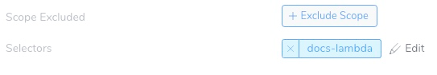
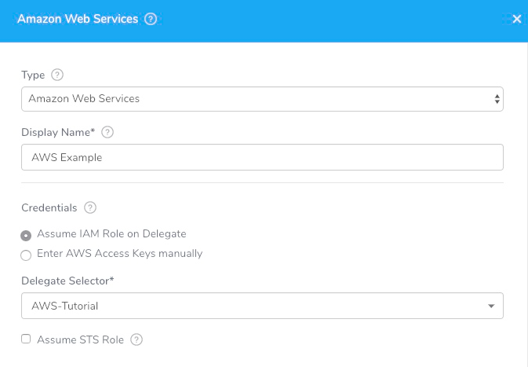

This content is for Harness [FirstGen](../../../../getting-started/harness-first-gen-vs-harness-next-gen.md). Switch to [NextGen](https://docs.harness.io/article/5fnx4hgwsa).This topic sets up the Harness Delegate, Artifact Server, and Cloud Provider for your Lambda Deployment.

### Before You Begin

* See [Harness Key Concepts](https://docs.harness.io/article/4o7oqwih6h-harness-key-concepts).

### Step 1: Create Roles and Policies

Create an IAM role to support Harness Lambda deployments.

You will apply this role to the host that runs the Harness Delegate you install later, or to the AWS account you use to connect with Harness.

The AWS [IAM Policy Simulator](https://docs.aws.amazon.com/IAM/latest/UserGuide/access_policies_testing-policies.html) is a useful tool for evaluating policies and access.

##### IAM Read Access

Ensure that the IAM role assigned to the Delegate host has the **IAMReadOnlyAccess** (arn:aws:iam::aws:policy/IAMReadOnlyAccess) policy attached. The policy provides read-only access to IAM for the Delegate so that it can confirm that it has other required policies.

##### Amazon S3

The Lambda function metadata is pulled from an AWS S3 bucket and therefore the Delegate needs the **AmazonS3ReadOnlyAccess** (arn:aws:iam::aws:policy/AmazonS3ReadOnlyAccess) policy.

##### EC2 and ECS

The Delegate might be a Shell Script Delegate installed on an EC2 instance or an ECS Delegate installed on an ECS cluster. The required policies for the Delegate are described here:

* [ECS (Existing Cluster)](https://docs.harness.io/article/whwnovprrb-cloud-providers#ecs_existing_cluster) - **AmazonEC2ContainerServiceforEC2Role** and a custom Harness policy.
* [AWS EC2](https://docs.harness.io/article/whwnovprrb-cloud-providers#aws_ec2) - **AmazonEC2FullAccess**.

##### AWS Lambda Policies

For the Delegate to perform operations with Lambda, it requires an IAM role with the following policies:

* **AWSLambda\_FullAccess (previously AWSLambdaFullAccess)** (arn:aws:iam::aws:policy/AWSLambda\_FullAccess)
* **AWSLambdaRole** (arn:aws:iam::aws:policy/service-role/AWSLambdaRole)

The IAM role attached to your EC2 Delegate host must have the **AWSLambdaRole** (arn:aws:iam::aws:policy/service-role/AWSLambdaRole) policy attached. The policy contains the `lambda:InvokeFunction` needed for Lambda deployments:


```
{  
    "Version": "2012-10-17",  
    "Statement": [  
        {  
            "Effect": "Allow",  
            "Action": [  
                "lambda:InvokeFunction"  
            ],  
            "Resource": [  
                "*"  
            ]  
        }  
    ]  
}
```
Attach the AWSLambdaRole (arn:aws:iam::aws:policy/service-role/AWSLambdaRole) policy to the IAM role for the Delegate host in EC2 or ECS.

For more information, see [Identity-based IAM Policies for AWS Lambda](https://docs.aws.amazon.com/lambda/latest/dg/access-control-identity-based.html) from AWS.

##### Summary

If the IAM role assigned to the Delegate has the following roles you will encounter no related issues:

* Shell Script Delegate on EC2 instance policies or ECS Delegate policies
* IAMReadOnlyAccess
* AWSLambdaRole
* AWSLambda\_FullAccess (previously AWSLambdaFullAccess)

##### Policy Requirements for Serverless Dashboard

To see your Lambda invocations on the [Serverless Dashboard](https://docs.harness.io/article/vlj9xbj315-serverless-functions-dashboard), the [Execution Role](https://docs.aws.amazon.com/lambda/latest/dg/lambda-intro-execution-role.html) for the Lambda function must have the following policies:

* AmazonEC2FullAccess
* AWSLambda\_FullAccess (previously AWSLambdaFullAccess)
* AWSLambdaVPCAccessExecutionRole
* AWSLambdaRole
* CloudWatchReadOnlyAccess

The Function Invocations are updated every 10 minutes.

### Step 2: Install the Harness Delegate

The Harness Delegate runs in your AWS VPC and executes all deployment steps, such the artifact collection and commands. The Delegate makes outbound HTTPS connections to the Harness Manager only.

The simplest method is to install a Harness Shell Script or ECS Delegate in same AWS VPC as your Lambda functions and then set up the Harness AWS Cloud Provider to use the same IAM credentials as the installed Delegate. This is described in [Add the Cloud Provider](1-delegate-and-connectors-for-lambda.md#add-the-cloud-provider) below.

For steps on installing a Delegate in your VPC, see [Delegate Installation and Management](https://docs.harness.io/article/h9tkwmkrm7-delegate-installation).

#### Delegate Selector

To ensure the IAM role applied to the Delegate you installed in the AWS VPC is used by your AWS Cloud Provider, you add Selectors to the Delegate and reference the Selector in the AWS Cloud Provider.



For steps on adding Selectors, see [Delegate Installation and Management](https://docs.harness.io/article/h9tkwmkrm7-delegate-installation).

### Step 3: Add an AWS Cloud Provider

In this section, we will add a Harness AWS Cloud Provider to your Harness account to connect to both AWS S3, Lambda, and the VPC. You can use a single or separate AWS Cloud Providers for the connections, but using a single AWS Cloud Provider is easiest.

As Harness provides first-class support for [CloudWatch](https://docs.harness.io/article/q6ti811nck-cloud-watch-verification-overview), you can also use the same AWS Cloud Provider for your CloudWatch connection.

#### Permissions

The AWS Cloud Provider in this example will assume the IAM Role associated with the Delegate you installed in your VPC. If you choose to use a AWS user account for the connection, apply the same policies to its IAM role described in [IAM Roles](1-delegate-and-connectors-for-lambda.md#iam-roles) above.

#### Add the Cloud Provider

For the AWS Cloud Provider in Harness, you can specify an AWS account or assume the IAM role used by the installed Harness Delegate (recommended).



##### AWS Cloud Provider

To set up an AWS Cloud Provider, do the following:

1. In the Harness Manager, click **Setup**, and then click **Cloud Providers**.
2. Click **Add Cloud Provider**. The **Cloud Provider** dialog appears.
3. In **Type**, select **Amazon Web Services**.
4. In **Display Name**, enter the name that you will use to refer to this Cloud Provider when setting up your Harness Application, such as **AWS Cloud**. You will use the name when setting up Harness Environments, Service Infrastructures, and other settings.
5. In **Credentials**, select **Assume IAM Role on Delegate** (recommended) or **Enter AWS Access Keys manually**. If you selected **Enter AWS Access Keys manually**, enter your username and password.  
If you selected **Assume IAM Role on Delegate**, in **Delegate Selector**, select the Selector that you added to the Delegate installed in your VPC.

### Next Steps

* [Add Lambda Functions](2-service-for-lambda.md)
* [Define your Lambda Target Infrastructure](3-lambda-environments.md)

