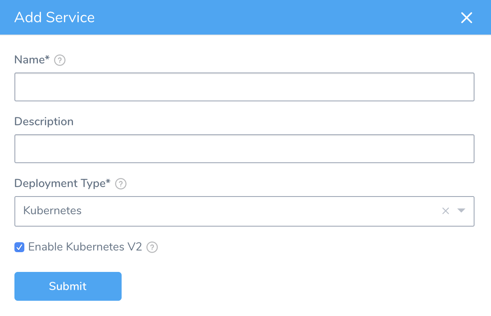
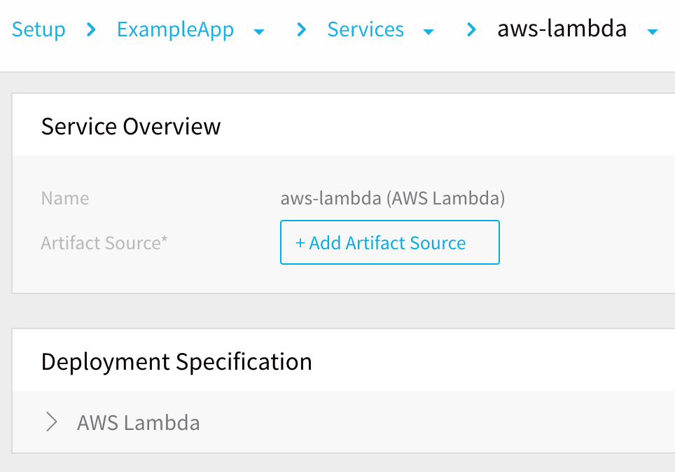
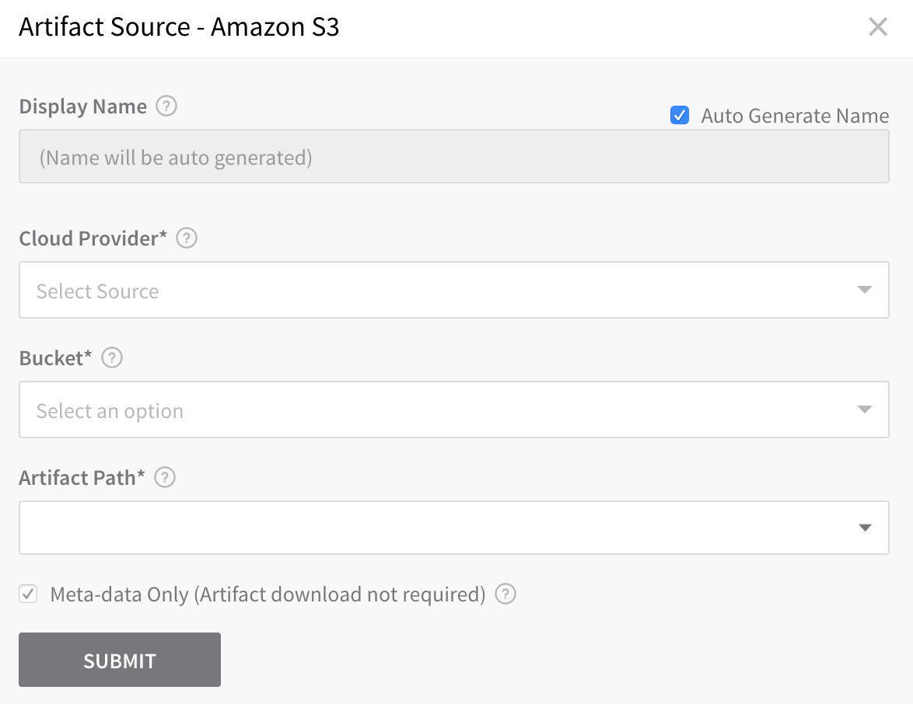
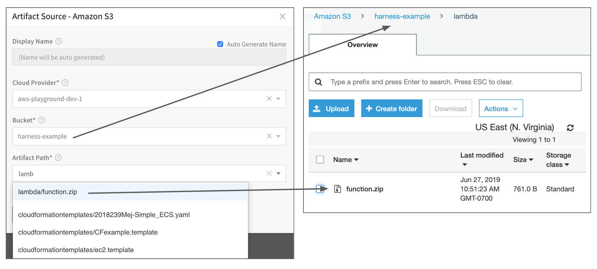
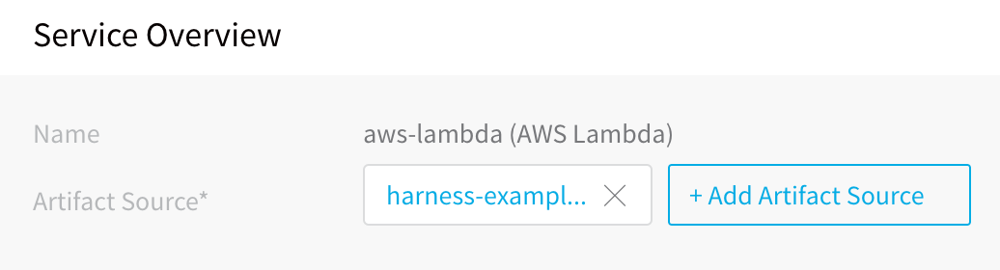

This content is for Harness [FirstGen](/docs/getting-started/harness-first-gen-vs-harness-next-gen.md). Switch to [NextGen](/docs/continuous-delivery/deploy-srv-diff-platforms/serverless-lambda-cd-quickstart.md).This topic describes how to create a Harness Application and adds a Service that uses a function file, runtime, and handler information to define the Lambda function to deploy.

### Before You Begin

* [Connect to AWS for Lambda Deployments](1-delegate-and-connectors-for-lambda.md)

### Review: Artifact Source Support

Harness supports the following artifact sources with Lambda:

* [Jenkins](../../../firstgen-platform/account/manage-connectors/add-jenkins-artifact-servers.md)
* [Artifactory](../../../firstgen-platform/account/manage-connectors/add-artifactory-servers.md)
* [AWS S3](1-delegate-and-connectors-for-lambda.md)
* [Nexus](../../../firstgen-platform/techref-category/cd-ref/artifacts-ref/nexus-artifact-sources.md)
* [Custom Artifact Source](../../model-cd-pipeline/setup-services/custom-artifact-source.md)

### Supported runtimes

Harness supports the following runtimes:

- nodejs4.3
- nodejs4.3-edge
- nodejs6.10
- nodejs8.10
- nodejs10.x
- nodejs12.x
- nodejs14.x
- nodejs16.x
- nodejs18.x
- java8.al2
- java11
- python2.7
- python3.6
- python3.7
- python3.8
- python3.9  
- dotnetcore1.0
- dotnetcore2.0
- dotnetcore2.1
- dotnetcore3.1
- dotnet6
- go1.x
- ruby2.5
- ruby2.7
- provided
- provided.al2

### Step 1: Create a Harness Lambda Service

To add the Lambda Service, do the following:

1. In your new Application, click **Services**. The **Services** page appears.
2. In the **Services** page, click **Add Service**. The **Service** dialog appears.
   
3. In **Name**, enter a name for your Service, such as **aws-lambda**. You will use this name to select this Service when you set up a Harness Environment and Workflow.
4. In **Description**, enter a description for your Service.
5. In **Deployment Type**, select **AWS Lambda**.
6. Click **SUBMIT**. The new Service is displayed.



### Step 2: Add Lambda Functions

An Artifact Source in a Lambda Service is the Lambda function file you want to deploy. The Artifact Source uses the AWS Cloud Provider you set up for your Harness account, as described in [Delegate and Connectors for Lambda](1-delegate-and-connectors-for-lambda.md).

To add an Artifact Source to this Service, do the following:

1. In your Lambda Service, click **Add Artifact Source**, and then click **Amazon S3**. For information on using a Custom Artifact Source, see [Custom Artifact Source](../../model-cd-pipeline/setup-services/custom-artifact-source.md). 

   The **Amazon S3 Artifact Source** dialog appears.

   
   
2. In **Cloud Provider**, select the AWS Cloud Provider you set up in [Delegate and Connectors for Lambda](1-delegate-and-connectors-for-lambda.md).
3. In **Bucket**, select the S3 bucket containing the Lambda function zip file you want.
4. In **Artifact Path**, select the Lambda function zip file containing your functions. Here is how your S3 bucket and file relate to the Artifact Source dialog:

   

   The **Meta-data Only** option is selected by default. Harness will not copy the actual zip file. During runtime, Harness passes the metadata to Lambda where it is used to obtain the file.

5. Click **SUBMIT**. The Lambda function file is added as an Artifact Source.

   

### Step 3: Lambda Function Specification

In **Lambda Function Specification**, you provide details about the Lambda functions in the zip file in Artifact Source.

Click **Lambda Function Specification**. The **AWS Lambda Function Specifications** dialog appears.

The details you provide are very similar to the options in the AWS CLI `aws lambda create-function` command. For more information, see [create-function](https://docs.aws.amazon.com/cli/latest/reference/lambda/create-function.html) from AWS.


Some of the options are specified in Harness Environments and Workflows to help you reuse the Service with multiple Environments and Workflows.

By default, the **AWS Lambda Function Specifications** dialog displays a function. If you have multiple Lambda functions in the zip file in Artifact Source, click **Add Function** and provide details for each function.

For each function in the **Functions** section, enter the following function information:

* **Runtime** - The [Lambda runtime](https://docs.aws.amazon.com/lambda/latest/dg/lambda-runtimes.html) that executes your function. This is the runtime for all functions in this spec. AWS can change its runtime version support. For example, AWS no longer supports **nodejs6.10**.
* **Function Name** - The name of your function. This name will become part of the function ARN in Lambda.  
Harness uses default variables for the name that include your Harness Application, Service, and Environment names (`${app.name}_${service.name}_${env.name}`). If you use these, you need to append a unique suffix to each function name, for example `${app.name}_${service.name}_${env.name}_my-function`. Or you can replace the entire name.
* **Handler** - The method that the runtime executes when your function is invoked. The format for this value varies per language. See [Programming Model](https://docs.aws.amazon.com/lambda/latest/dg/programming-model-v2.html) for more information.

For example, let's look at a Node.js function in a file named **index.js**:


```
exports.handler =  async function(event, context) {  
  console.log("EVENT: \n" + JSON.stringify(event, null, 2))  
  return context.logStreamName  
}
```
The value of the **Handler** setting is the file name (**index**) and the name of the exported handler module, separated by a dot. In our example, the handler is **index.handler**. This indicates the handler module that's exported by index.js.

* **Memory Size** - The amount of memory available to the function during execution. Choose an amount [between 128 MB and 3,008 MB](https://docs.aws.amazon.com/lambda/latest/dg/limits.html) in 64 MB increments. There are two Execution Timeout settings. A default setting and a function-specific setting.
* **Execution Timeout** - The amount of time that Lambda allows a function to run before stopping it. The default is 3 seconds. The maximum allowed value is 900 seconds. There are two Execution Timeout settings. A default setting and a function-specific setting.

When you are done, the **AWS Lambda Function Specifications** dialog will look something like this:


When you are done, click **Submit**. Your function is added to the Service.

### Option: Lambda Environment Variables using Service Config Variables

You can use [Config Variables](../../model-cd-pipeline/setup-services/add-service-level-config-variables.md) in your Service to create [Lambda Environment Variables](https://docs.aws.amazon.com/lambda/latest/dg/configuration-envvars.html).

Encrypted Config Variables will appear as plaintext Environment Variables in Lambda.

When you deploy your function, Harness replaces any existing Environment variables with the variables you added as Service Config Variables.

### Next Steps

* [Define your Lambda Target Infrastructure](3-lambda-environments.md)
* [Create a Basic Lambda Deployment](4-lambda-workflows-and-deployments.md)
* [Troubleshooting AWS Lambda Deployments](../../../firstgen-troubleshooting/troubleshooting-harness.md#aws-lambda)

