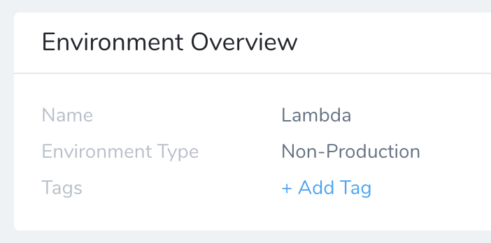
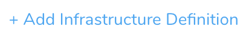
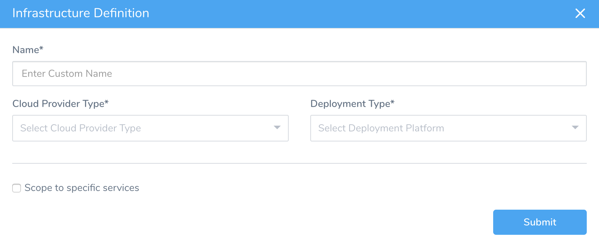
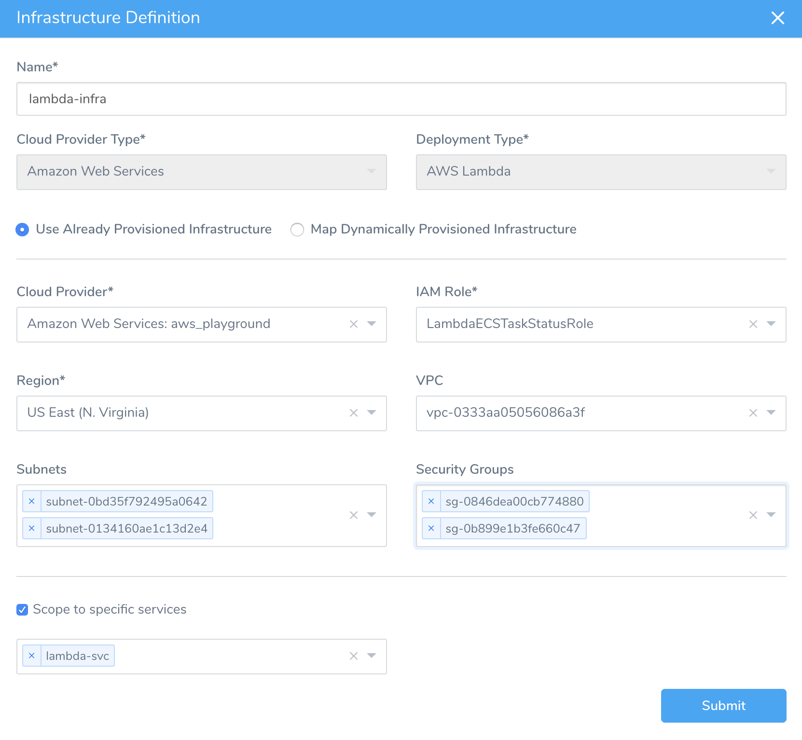

This content is for Harness [FirstGen](../../../../getting-started/harness-first-gen-vs-harness-next-gen.md). Switch to [NextGen](https://docs.harness.io/article/5fnx4hgwsa).Once you've added a Lambda Service to your Application, you can define Environments where your Service can be deployed. Within an Environment, you specify the following in an Infrastructure Definition:

* The Lambda Service that contains your functions zip file and functions specs. (Set up in [Add Lambda Functions](2-service-for-lambda.md).)
* A deployment type. In this case, **Lambda**.
* The AWS Cloud Provider you set up in [Connect to AWS for Lambda Deployments](1-delegate-and-connectors-for-lambda.md).

An Environment can be a Dev, QA, Production, or other Environment. You can deploy one or many Services to each Environment by creating an Infrastructure Definition in the Environment for each Service.

In this topic:

* [Before You Begin](#before_you_begin)
* [Step 1: Create an Environment](#step_1_create_an_environment)
* [Step 2: Define the Lambda Infrastructure](#step_2_define_the_lambda_infrastructure)
* [Option: Provision the Lambda Infrastructure](#option_provision_the_lambda_infrastructure)
* [Option: Override Service Settings](#option_override_service_settings)
* [Next Steps](#next_steps)

### Before You Begin

* [Connect to AWS for Lambda Deployments](1-delegate-and-connectors-for-lambda.md)
* [Add Lambda Functions](2-service-for-lambda.md)

### Step 1: Create an Environment

The following procedure creates an Environment for the Lambda Service type, as set up in [Add Lambda Functions](2-service-for-lambda.md).

1. In your Harness Application, click **Environments**. The **Environments** page appears.
2. Click **Add Environment**. The **Environment** dialog appears.
3. In **Name**, enter a name that describes the deployment environment, for example, **Lambda**.
4. In **Environment Type**, select **Non-Production**.
5. Click **SUBMIT**. The new **Environment** page appears.

### Step 2: Define the Lambda Infrastructure

You must define one or more Infrastructure Definitions for the Environment.

A Harness Infrastructure Definition defines the AWS VPC, subnets, and security groups to use for the Lambda deployment.

To add the Infrastructure Definition:

1. In the Harness Environment, click **Add Infrastructure Definition**. The **Infrastructure Definition** dialog appears.
   
   The **Infrastructure Definition** dialog appears.
2. Enter a **Name** that will identify this Infrastructure Definition when you [add it to a Workflow](4-lambda-workflows-and-deployments.md).
3. In **Cloud Provider Type**, select **Amazon Web Services**.
4. In **Deployment Type**, select **AWS Lambda**. This expands the **Infrastructure Definition** dialog to look something like this:
   
5. Select **Use** **Already Provisioned Infrastructure**, and follow the [Define a Provisioned Infrastructure](#define_provisioned_infrastructure) steps below.

If you are using a configured Harness [Infrastructure Provisioner](https://docs.harness.io/article/o22jx8amxb-add-an-infra-provisioner), instead select **Map Dynamically Provisioned Infrastructure**, and then select the provisioner. The settings below are for **Use Already Provisioned Infrastructure**.

#### Define a Provisioned Infrastructure

The **Infrastructure Definition** dialog's lower section defines settings similar to the `‑‑role` and `‑‑vpc-config` options in the `aws lambda create-function` command. For example:


```
$ aws lambda create-function --function-name ExampleApp-aws-lambda-Lambda-my-function \  
--runtime nodejs8.10 --handler index.handler --zip-file lambda/function.zip \  
**--role** execution-role-arn \  
**--vpc-config** SubnetIds=comma-separated-vpc-subnet-ids,SecurityGroupIds=comma-separated-security-group-ids
```
To fill out the **Infrastructure Definition** dialog's lower section:

1. In **Cloud Provider**, select the AWS Cloud Provider you added in [Connect to AWS for Lambda Deployments](1-delegate-and-connectors-for-lambda.md).

:::note
After your **Cloud Provider** selection, the remaining drop-down lists take a few seconds to populate. Later, some fields will again take a few seconds to repopulate based on your selections in other fields.
:::
   
2. In **IAM Role**, select [IAM role](https://docs.aws.amazon.com/lambda/latest/dg/lambda-intro-execution-role.html) that AWS Lambda assumes when it executes your function.
3. In **Region**, select the AWS region where your function will be used.
4. In **VPC**, to connect your function to a VPC to access private resources during execution, select the VPC. If you do not select a VPC, then the function executes in "*non-VPC*" mode.

:::note
Lambda runs your function code securely within a VPC by default. However, to enable your Lambda function to access resources inside your private VPC, you must provide additional, VPC-specific configuration information that includes private subnet IDs and security group IDs. AWS Lambda uses this information to set up elastic network interfaces (ENIs) that enable your function to connect securely to other resources within your private VPC. 

For more information and guidelines, see [Configuring a Lambda Function to Access Resources in an Amazon VPC](https://docs.aws.amazon.com/lambda/latest/dg/vpc.html) or [Configuring a Lambda function to access resources in a VPC](https://docs.aws.amazon.com/lambda/latest/dg/configuration-vpc.html) from AWS.
:::
   
5. In **Subnets**, select the subnet IDs for the subnets (within the VPC) where the Lambda function will access resources. AWS recommends that you choose at least two subnets for Lambda to run your functions in high availability mode.
6. In **Security Groups**, select the security group ID(s) for the Lambda function. When you set a VPC for your function to access, your Lambda function loses default Internet access. If you require external Internet access for your function, make sure that your security group allows outbound connections, and that your VPC has a NAT gateway.
7. Enable **Scope to Specific Services**, and use the adjacent drop-down to select the Harness Lambda Service you created in [Add Lambda Functions](2-service-for-lambda.md).

:::note
Scoping is a recommended step, to make this Infrastructure Definition available to any Workflow or Phase that uses your Lambda Service.
:::

   When you are done, the dialog will look something like this:

   

8. Click **Submit**. The new Infrastructure Definition is added to the Harness environment.

### Option: Provision the Lambda Infrastructure

With Harness, you can use a CloudFormation template to provision the Lambda infrastructure. For more information, see [Map an AWS Lambda Infrastructure](../cloudformation-category/map-cloud-formation-infrastructure.md#option-3-map-an-aws-lambda-infrastructure).

### Option: Override Service Settings

Your Environment can overwrite Service Config Variables, Config Files, and other settings. This enables you to maintain a Service's native settings, but change them when the Service is used with this Environment.

For more information, see [Override a Service Configuration](https://docs.harness.io/article/n39w05njjv-environment-configuration#override_a_service_configuration).

### Next Steps

* [Create a Basic Lambda Deployment](4-lambda-workflows-and-deployments.md)
* [Troubleshoot AWS Lambda Deployments](https://docs.harness.io/article/g9o2g5jbye-troubleshooting-harness#aws_lambda)

