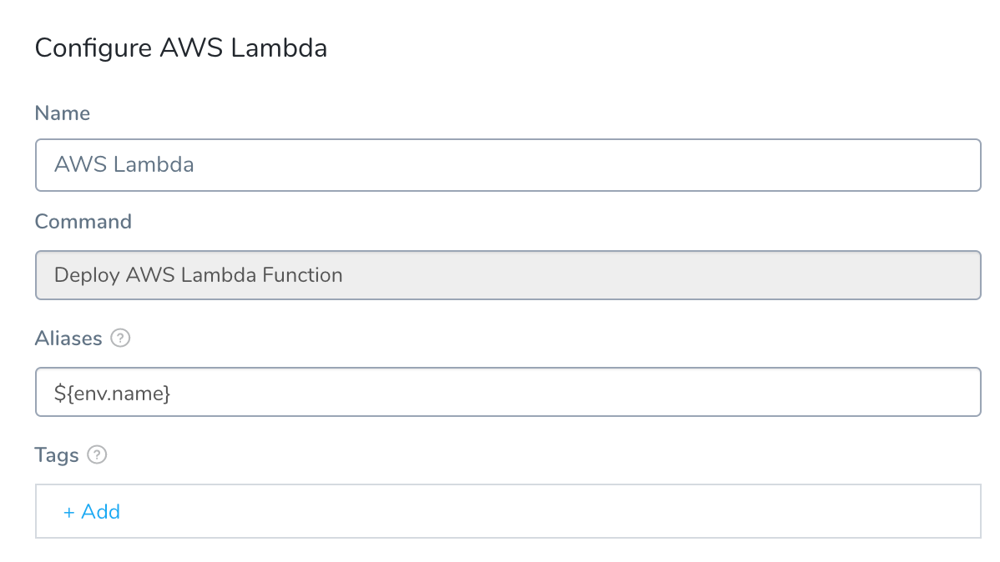
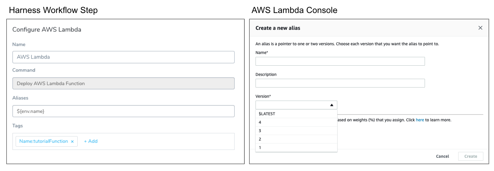
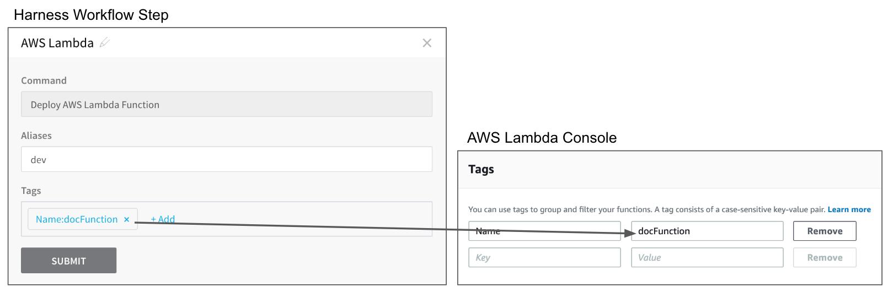
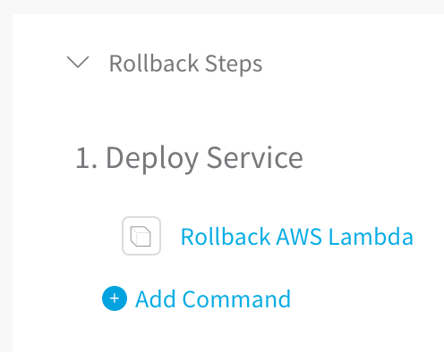
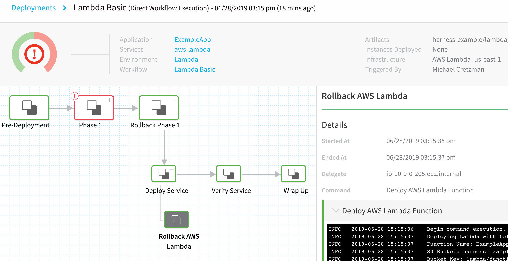
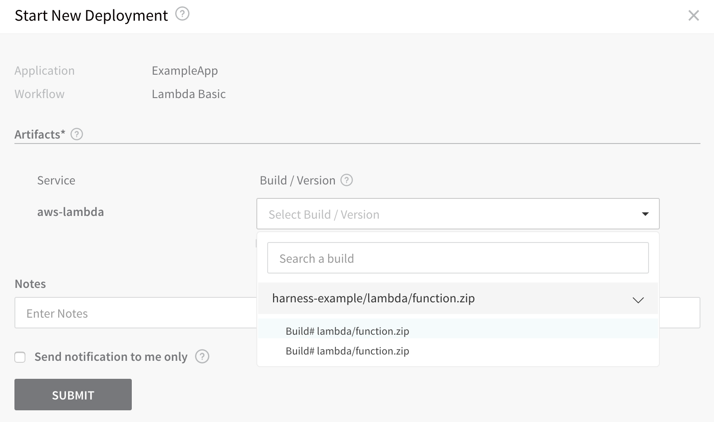
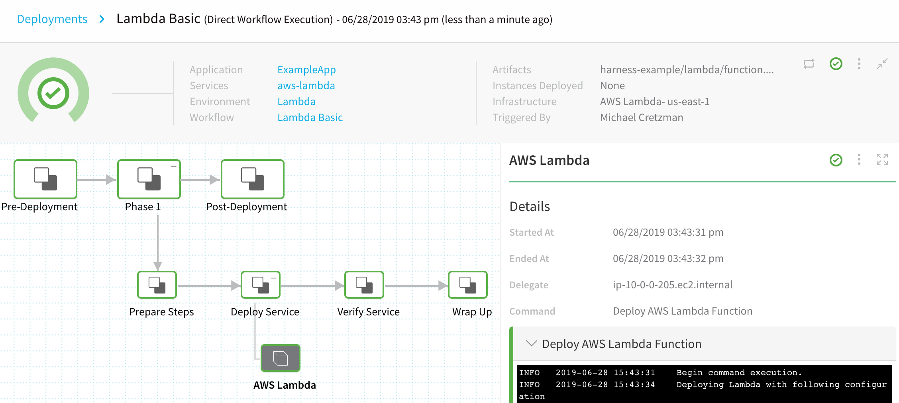
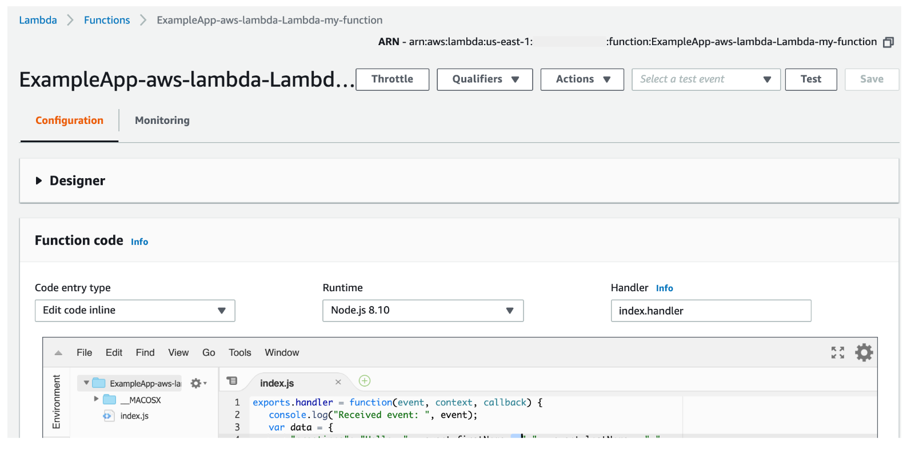

This content is for Harness [FirstGen](../../../../getting-started/harness-first-gen-vs-harness-next-gen.md). Switch to [NextGen](https://docs.harness.io/article/5fnx4hgwsa).By default, Harness Basic Workflows for Lambda have two steps:

* **AWS Lambda** - This step deploys the function and also sets the Lambda aliases and tags for the function.
* **Rollback AWS Lambda** - If a deployment fails, this step uses aliases to roll back to the last successful version of a Lambda function.

In this topic:

* [Before You Begin](#before_you_begin)
* [Step 1: Create the Lambda Workflow](#step_1_create_the_lambda_workflow)
* [Step 2: Configure Lambda Aliases and Tags](#step_2_configure_lambda_aliases_and_tags)
* [Review: Rollback AWS Lambda Step](#review_rollback_aws_lambda_step)
* [Example: Lambda Workflow Deployment](#example_lambda_workflow_deployment)
* [Next Steps](#next_steps)

### Before You Begin

* [Connect to AWS for Lambda Deployments](1-delegate-and-connectors-for-lambda.md)
* [Add Lambda Functions](2-service-for-lambda.md)
* [Define your Lambda Target Infrastructure](3-lambda-environments.md)

### Step 1: Create the Lambda Workflow

To create a Basic Workflow for Lambda, do the following:

1. In your Application, click **Workflows**.
2. Click **Add Workflow**. The **Workflow** dialog appears.
   
3. In **Name**, enter a name for your Workflow, such as **Lambda Basic**.
4. In **Workflow Type**, select **Basic Deployment**.
5. In **Environment**, select the Environment you created for your Lambda deployment in [Define Your Lambda Target Infrastructure](3-lambda-environments.md).
6. In **Service**, select the Lambda Service you created in [Add Lambda Functions](2-service-for-lambda.md).
7. Select the Infrastructure Definition you created in [Define your Lambda Target Infrastructure](3-lambda-environments.md).
8. Click **SUBMIT**. The new Basic Workflow is created and pre-configured with the **AWS Lambda** step.

### Step 2: Configure Lambda Aliases and Tags

When you deploy the Workflow, the AWS Lambda step creates the Lambda functions defined in the Service you attached to the Workflow. This is the equivalent of the [aws lambda create-function](https://docs.aws.amazon.com/cli/latest/reference/lambda/create-function.html) API command.

The next time you run the Workflow, manually or as the result of a [Trigger](https://docs.harness.io/article/xerirloz9a-add-a-trigger-2), the AWS Lambda step updates the Lambda functions. This is the equivalent of the [aws lambda update-function-configuration](https://docs.aws.amazon.com/cli/latest/reference/lambda/update-function-configuration.html) API command.

In the Workflow, click the **AWS Lambda** step. The **AWS Lambda** dialog appears.



The dialog provides settings for Lambda Aliases and Tags.

#### Versioning with Aliases

This topic assumes that you are familiar with [Lambda versioning](https://docs.aws.amazon.com/lambda/latest/dg/versioning-intro.html).Published Lambda functions are immutable objects (they cannot be changed), and are versioned with the latest always being published to `$LATEST`. These versions are made up of both code as well as configuration settings. Once the code and configuration are published, the function becomes immutable.

Continuous delivery on Lambda requires that Harness manage the versioning (via aliases) and rollbacks. Since each new version is immutably pushed to `$LATEST`, rolling back to a previous version becomes complicated.

Harness solves this complexity by keeping track of the aliases required to recreate the function, the code, and the configuration. An alias is a pointer to one or two versions.

Harness handles the burden of managing the code and configuration in order to properly version, tag, or recreate the previous version, thus allowing for fully-automated rollbacks based on prescriptive failure strategies.

The AWS Lambda step in the Workflow applies the alias just like you would using the AWS Lambda console:



By default, Harness names the alias with the name of the Environment by using the built-in Harness variable **${env.name}**. You can replace this with whatever alias you want, or use other built-in Harness variables by entering **$** and seeing what variables are available.


Once the Workflow is deployed and a Lambda function has been versioned using the alias in the **AWS Lambda** step, you can see the versioning in the AWS Lambda console:


#### Tags

Tags are key-value pairs that you attach to AWS resources to organize them. For Lambda functions, tags simplify the process of tracking the frequency and cost of each function invocation.

You can set the tags for your Lambda functions in the **AWS Lambda** step and, once deployed, you can see the tags in the AWS Lambda console:



##### Existing Tags are Replaced During Deployment

When you deploy a new version of your function, Harness replaces any existing tags with the tags you added in your Workflow. If you leave the tags empty on a subsequent deployment, the tags are replaced with empty values.

### Review: Rollback AWS Lambda Step

In the Basic Workflow you can see the **Rollback AWS Lambda** step.



This step initiates rollback if the AWS Lambda step fails, or if a step elsewhere in the Workflow fails.



The best way to see what the Rollback AWS Lambda step does is to look at a log for a rollback.

**Lambda rollbacks are a little unusual:** instead of rolling back to a previous, successful version, Harness takes that previous, successful version and creates a new version. The new version is deployed as the "rollback". Let's look at an example. Both the previous, successful version and the new version will have the same Sha256.

In the following scenario, the previous, successful version of the function was **version 2**. When Harness fails to publish **version 3** (we added an HTTP call that intentionally failed), it publishes the previous version as a new version and names it **version 4**. Version 3 is never deployed.

First, Harness gets the function configuration and VPC settings from the last successful version:


```
Begin command execution.  
Deploying Lambda with following configuration  
Function Name: ExampleApp-aws-lambda-Lambda-my-function  
S3 Bucket: harness-example  
Bucket Key: lambda/function.zip  
Function handler: index.handler  
Function runtime: nodejs8.10  
Function memory: 128  
Function execution timeout: 3  
IAM role ARN: arn:aws:iam::00000000000:role/service-role/TestAwsLamdaRole  
VPC: vpc-00a7e8ea4fd1ffd9d  
Subnet: [subnet-0c945c814c09c9aed, subnet-05788710b1b06b6b1]  
Security Groups: sg-05e7b8b9cad94b393
```
Next, Harness updates and publishes the previous version as version 4:


```
Function: [ExampleApp-aws-lambda-Lambda-my-function] exists. Update and Publish  
  
Existing Lambda Function Code Sha256: [U+zi3X2Fu+ojXZzd58XXXXXXXXXXB05evN2U=].  
  
New Lambda function code Sha256: [U+zi3X2Fu+ojXZzd58MIKDKXXXXXXXXXXAB05evN2U=]  
  
Function code didn't change. Skip function code update  
  
Updating function configuration  
  
Function configuration updated successfully  
  
Publishing new version  
  
Published new version: [4]  
  
Published function ARN: [arn:aws:lambda:us-east-1:00000000000:function:ExampleApp-aws-lambda-Lambda-my-function:4]  
  
Untagging existing tags from the function: [arn:aws:lambda:us-east-1:00000000000:function:ExampleApp-aws-lambda-Lambda-my-function]  
  
Executing tagging for function: [arn:aws:lambda:us-east-1:00000000000:function:ExampleApp-aws-lambda-Lambda-my-function]  
  
Successfully deployed lambda function: [ExampleApp-aws-lambda-Lambda-my-function]  
  
=================  
Successfully completed AWS Lambda Deploy step
```
As you can see, the rollback succeeded and version 4 is published.

### Example: Lambda Workflow Deployment

Now that the Basic Workflow for Lambda is set up, you can click **Deploy** in the Workflow to deploy the Lambda functions in the Harness Service to your AWS Lambda environment.


In **Start New Deployment**, in **Build / Version**, select the zip file in the S3 bucket you set up as an Artifact Source for your Harness Lambda Service:



Click **SUBMIT**. The Workflow is deployed.



To see the completed deployment, log into your AWS Lambda console. The Lambda function is listed:



You can also log into AWS and use the [aws lambda get-function](https://docs.aws.amazon.com/cli/latest/reference/lambda/get-function.html) command to view the function:


```
$ aws lambda get-function --function-name ExampleApp-aws-lambda-Lambda-my-function  
{  
    "Code": {  
        "RepositoryType": "S3",   
        "Location": "https://prod-04-2014-tasks.s3.amazonaws.com/snapshots/..."  
    },   
    "Configuration": {  
        "TracingConfig": {  
            "Mode": "PassThrough"  
        },   
        "Version": "$LATEST",   
        "CodeSha256": "U+zi3X2Fu+ojXZzd58MIKDK56UaVASDA0KAB05evN2U=",   
        "FunctionName": "ExampleApp-aws-lambda-Lambda-my-function",   
        "VpcConfig": {  
            "SubnetIds": [  
                "subnet-05788710b1b06b6b1",   
                "subnet-0c945c814c09c9aed"  
            ],   
            "VpcId": "vpc-00a7e8ea4fd1ffd9d",   
            "SecurityGroupIds": [  
                "sg-05e7b8b9cad94b393"  
            ]  
        },   
        "MemorySize": 128,   
        "RevisionId": "4c3d4cfd-f72b-4f4c-9c0a-031d9cfe9e46",   
        "CodeSize": 761,   
        "FunctionArn": "arn:aws:lambda:us-east-1:00000000000:function:ExampleApp-aws-lambda-Lambda-my-function",   
        "Handler": "index.handler",   
        "Role": "arn:aws:iam::00000000000:role/service-role/TestAwsLamdaRole",   
        "Timeout": 3,   
        "LastModified": "2019-06-28T22:43:32.241+0000",   
        "Runtime": "nodejs8.10",   
        "Description": ""  
    },   
    "Tags": {  
        "Name": "docFunction"  
    }  
}
```
### Next Steps

* [Troubleshoot AWS Lambda Deployments](https://docs.harness.io/article/g9o2g5jbye-troubleshooting-harness#aws_lambda)

