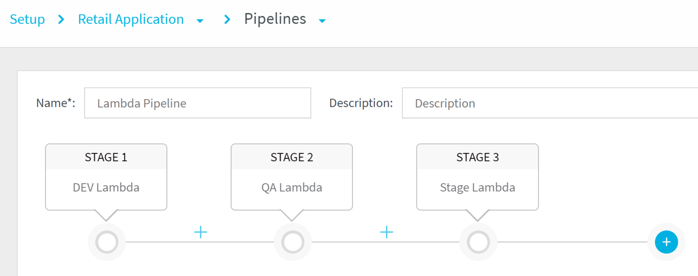

This content is for Harness [FirstGen](../../../../getting-started/harness-first-gen-vs-harness-next-gen.md). Switch to [NextGen](https://docs.harness.io/article/5fnx4hgwsa).Setting up a Lambda deployment is as simple as adding your function zip file, configuring function compute settings, and adding aliases and tags. Harness takes care of the rest of the deployment, making it consistent, reusable, and safe with automatic rollback.

For a general overview of how Harness works, see [Harness Architecture](https://docs.harness.io/article/de9t8iiynt-harness-architecture) and [Application Components](https://docs.harness.io/article/bucothemly-application-configuration).Basically, the Harness setup for Lambda is akin to using the AWS CLI [aws lambda](https://docs.aws.amazon.com/cli/latest/reference/lambda/index.html#cli-aws-lambda) [create-function](https://docs.aws.amazon.com/cli/latest/reference/lambda/create-function.html), [update-function-code](https://docs.aws.amazon.com/cli/latest/reference/lambda/update-function-code.html), and [update-function-configuration](https://docs.aws.amazon.com/cli/latest/reference/lambda/update-function-configuration.html) commands, as well as the many other commands that are needed.

The benefit with Harness is that you can set up your Lambda deployment once, with no scripting, and then have your Lambda functions deployed automatically as they are updated in your AWS S3 bucket. You can even templatize the deployment Environment and Workflow for use by other devops and developers in your team.

Furthermore, Harness manages Lambda function versioning to perform rollback when needed.

The following list describes the major steps we will cover in this guide:

1. **Delegate** - Install the Harness Shell Script or ECS **Delegate** in your AWS VPC.
2. **AWS Cloud Provider** - Add the AWS Cloud Provider. This is a connection to your AWS account. The AWS Cloud Provider can use your user account or the IAM role assigned to the Delegate host.  
The AWS Cloud Provider is used to connect Harness to your Lambda deployment environment and to Amazon S3 to obtain your Lambda code files.
3. **Harness Application** - Create the Harness Application for your Lambda CD pipeline. The Harness Application represents your Lambda code and functional spec, their deployment pipelines, and all the building blocks for those pipelines. Harness represents your Lambda deployment using a logical group of one or more entities: Services, Environments, Workflows, Pipelines, Triggers, and Infrastructure Provisioners. Applications organize all of the entities and configurations in Harness CD.
4. **Harness Service** - Create the Harness Service using the Lambda type.
	1. Set up your Lambda code artifact source, Lambda Function Specification, and any config variables and files.
5. **Harness Environment** - Create the Harness Environment containing the Service Infrastructure definition of your AWS deployment environment, and any overrides of Service settings.
6. **Harness Workflow** - Create the Basic deployment Harness Workflow. This Workflow will deploy the Service (your Lambda code) to the Environment (your AWS Lambda functions for the region).  
You can also add your Lambda Aliases and Tags as part of the Workflow.
7. **Deploy** the Workflow.
8. Advanced options not covered in this guide:
	1. **Harness Pipeline** - Create a Harness Pipeline for your deployment, including Workflows and Approval steps. Typically, Harness customers will deploy Lambda Pipelines with a Workflow for Dev, QA, Stage, etc:
	   
	   This example doesn't show Approval steps between Pipeline stages, which are also common. For more information, see our [Pipelines](https://docs.harness.io/article/zc1u96u6uj-pipeline-configuration) and [Approvals](https://docs.harness.io/article/0ajz35u2hy-approvals) topics.
	2. **Harness Trigger** - Create a Harness Trigger to automatically deploy your Workflows or Pipeline according to your criteria. Typically, customers use a Trigger to execute a Lambda Pipeline using the Trigger's **On New Artifact** condition. Each time the Lambda artifact, such as a zip file, is updated in the artifact repository (AWS S3), the Pipeline is executed and the new Lambda function is deployed.  
	For more information, see [Triggers](https://docs.harness.io/article/xerirloz9a-add-a-trigger-2).
	3. **Harness Infrastructure Provisioners** - Create Harness Infrastructure Provisioners, such as CloudFormation and Terraform, for your deployment environments. For more information, see [Infrastructure Provisioners](https://docs.harness.io/article/o22jx8amxb-add-an-infra-provisioner).
	4. Continuous Verification:
		1. **Deployment Verification** - Once you have successfully deployed you can add your APM and logging apps as Verification Providers, and then add Verify Steps to your Workflows. Harness will use its machine-learning to find anomalies in your deployments. For more information, see [Continuous Verification](https://docs.harness.io/article/myw4h9u05l-verification-providers-list).
		2. **24/7 Service Guard** - Monitor your live applications, catching problems that surface minutes or hours following deployment. For more information, see [24/7 Service Guard](https://docs.harness.io/article/dajt54pyxd-24-7-service-guard-overview).

Harness fully-integrates with **AWS CloudWatch** to apply Harness machine learning to CloudWatches monitoring and operational data. See [CloudWatch Verification](https://docs.harness.io/article/q6ti811nck-cloud-watch-verification-overview).

### Next Steps

* [Troubleshooting AWS Lambda Deployments](https://docs.harness.io/article/g9o2g5jbye-troubleshooting-harness#aws_lambda)

