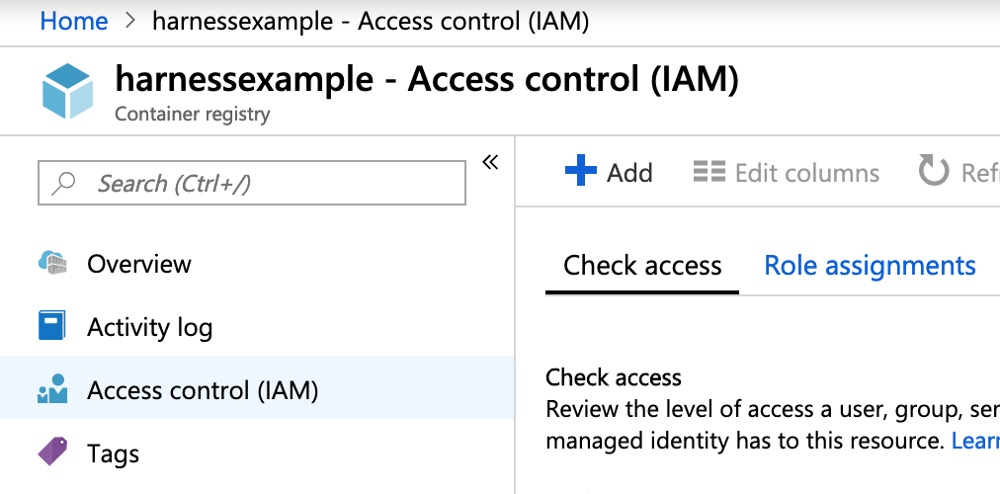
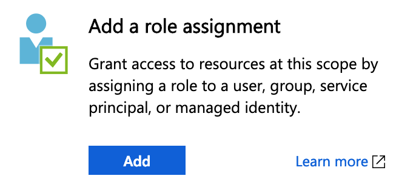
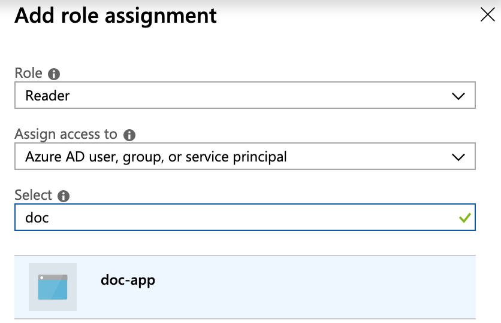
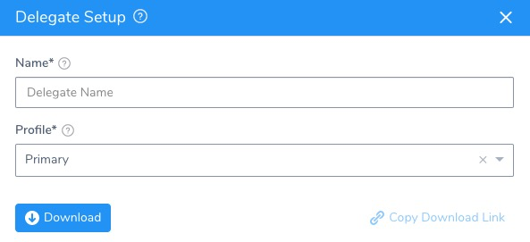
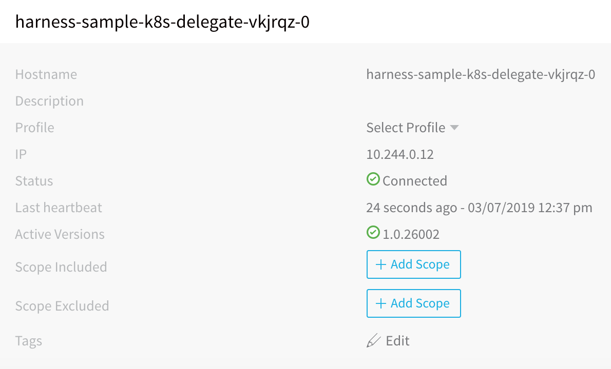
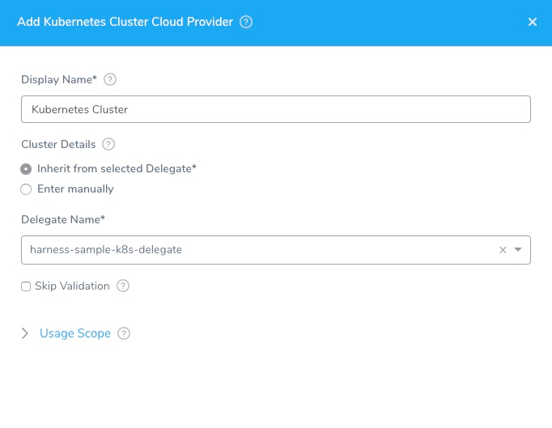
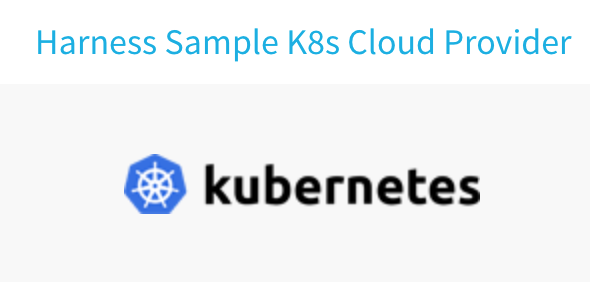
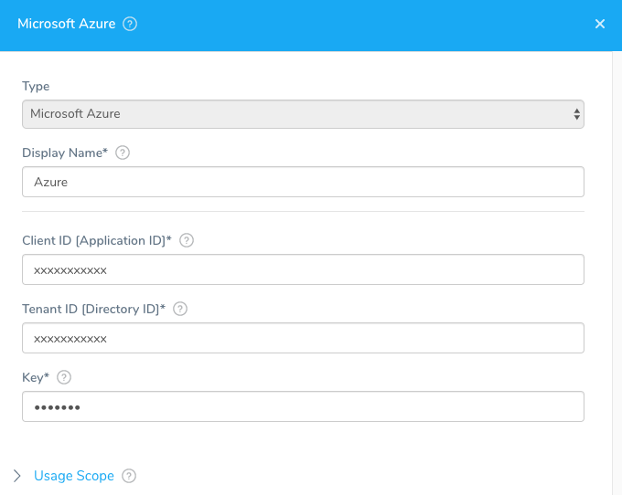

This content is for Harness [FirstGen](../../../../getting-started/harness-first-gen-vs-harness-next-gen.md). Switch to [NextGen](https://docs.harness.io/article/m7nkbph0ac).This topic describes how to set up your Harness account settings to support an Azure deployment.

### Limitations

Harness uses the Azure SDK among other methods and Authenticated proxy is not supported for Azure SDK. Consequently, you cannot use Azure connections for artifacts, machine images, etc, that require proxy authentication. This is an Azure limitation, not a Harness limitation. This is a known Azure limitation with Java environment properties and their SDK.

### Permissions and Roles

This section discusses the permissions and roles needed for the Harness connections to Azure. The setup steps for the Harness Delegate and Cloud Providers that use these roles are provided in their respective sections.

The Azure permissions and roles required for each of the Harness connections to Azure are as follows:

* **Harness Kubernetes Delegate** - The Harness Kubernetes Delegate is installed in the AKS cluster where you plan to deploy. You simply need to log into your AKS cluster and install it. No additional role is required.
	+ The Harness Kubernetes Delegate install file will create a pod in the cluster and make an outbound connection to the Harness Manager. No Azure permissions are required.
	+ The minimum Delegate resource requirements in the AKS cluster are 8GB RAM and 6GB Disk Space. Your AKS cluster will need enough resources to run the Delegate and your app. For the example in this guide, we created a cluster with 4 cores and 16GB of total memory.
	+ For information about Harness Delegates, see [Delegate Installation and Management](https://docs.harness.io/article/h9tkwmkrm7-delegate-installation), [Delegate Server Requirements](https://docs.harness.io/article/70zh6cbrhg-harness-requirements), and [Delegate Connection Requirements](https://docs.harness.io/article/11hjhpatqz-connectivity-and-permissions-requirements).
* **Harness Kubernetes Cluster Cloud Provider** - You will use the credentials of the Harness Kubernetes Delegate you installed in AKS for the Kubernetes Cluster Cloud Provider. No Azure permissions are required.

:::note
If you choose to use the Harness Azure Cloud Provider to connect to AKS, then you must assign the AKS **Owner** role to an Azure App Registration. The Client ID (Application ID), Tenant ID (also called the Directory ID), and Key for that Azure App Registration is then used to set up the Harness Azure Cloud Provider.
:::

* **Harness Azure Cloud Provider** - The Azure Cloud Provider connects to the ACR container. The Azure Cloud Provider requires the following App Registration information: Client ID (Application ID), Tenant ID (also called the Directory ID), and a Key. The Azure App you use for this connection must have the **Reader** role on the ACR container you want to use.

:::note
**Why two connections to Azure?** When you create an AKS cluster, Azure also creates a service principal to support cluster operability with other Azure resources. You can use this auto-generated service principal for authentication with an ACR registry. If you can use this method, then only the Kubernetes Cloud Provider is needed.In this guide, we create separate connections for AKS and ACR because, in some instances, you might not be able to assign the required role to the auto-generated AKS service principal granting it access to ACR. 

For more information, see [Authenticate with Azure Container Registry from Azure Kubernetes Service](https://docs.microsoft.com/en-us/azure/container-registry/container-registry-auth-aks) from Azure.
:::

To register an App and assign it a role in an ACR container, the App must exist within the scope of an Azure resource group. The resource group includes the resources that you want to manage as a group, and is typically set up by your Azure account administrator. It is a common Azure management scope. For more information, see [Deploy resources with Resource Manager templates and Azure portal](https://docs.microsoft.com/en-us/azure/azure-resource-manager/resource-group-template-deploy-portal) from Azure.

To set up the ACR container with the Azure App and **Reader** role, do the following:

1. In the ACR container, click **Access control (IAM)**.
2. Click **Add a role assignment**.
3. In **Role**, enter **Reader**.
4. In **Assign access to**, select **Azure AD user, group, or service principal**.
5. In **Select**, enter the name of the Azure App that you will use to connect Harness. In this example, the App is name **doc-app**.
6. Click the name of the App. When you are finished, the settings will look something like this:
7. Click **Save**.

When you add the Azure Cloud Provider later in this guide, you will use the Client ID (Application ID), Tenant ID (also called the Directory ID), and a Key from that App to set up the Azure Cloud Provider. Harness will use the Reader role attached to the Azure App to connect to your ACR container.

### Delegate Setup

The simplest method for connecting Harness to AKS is to install the Harness Kubernetes Delegate in your AKS cluster and then set up the Harness Kubernetes Cluster Cloud Provider to use the same credentials as the Delegate.

Here is a quick summary of the steps for installing the Kubernetes Delegate in your AKS cluster:

1. Download the Harness Kubernetes Delegate.
	1. In Harness, click **Setup**.
	2. Click **Harness Delegates**.
	3. Click **Download Delegate**, and then click **Kubernetes YAML**.  
	The **Delegate Setup** dialog appears.
	4. In **Name**, enter a name for your Delegate, for example **harness-sample-k8s-delegate**. You will use this name later when selecting this Delegate in the **Kubernetes Cluster Cloud Provider** dialog.
	5. In **Profile**, select a Profile for the Delegate. The default is named **Primary**.
	6. Click **Download**. The Kubernetes file is downloaded to your computer.
	7. In a Terminal, navigate to the folder where the Kubernetes file was downloaded and extract the YAML file:  
	  
	  `$ tar -zxvf harness-delegate-kubernetes.tar.gz`
	
	8. Navigate into the folder that was extracted:  
	  
	   `$ cd harness-delegate-kubernetes`  
	  
	 The Kubernetes Delegate YAML file is ready to be installed in your AKS cluster.
	 
2. Install the Harness Kubernetes Delegate in the AKS Kubernetes cluster. The easiest way to install the Delegate is to use the Azure CLI locally.

	1. In the same Terminal you used to extract the Kubernetes Delegate YAML file, log into your Azure Subscription:  
	  
	  `$ az login -u <username> -p <password>`
	
	2. Connect to the AKS cluster where you plan to deploy:  
	  
	   `$ az aks install-cli`  
	  
	   `$ az aks get-credentials --resource-group <resource_group> --name myHarnessCluster`
		 
	3. Install the Harness Kubernetes Delegate:  
	  
		`kubectl apply -f harness-delegate.yaml`  
		  
		You will see the following output:  
		  
		`namespace/harness-delegate created`  
		`clusterrolebinding.rbac.authorization.k8s.io/harness-delegate-cluster-admin created`  
		`secret/harness-sample-k8s-delegate-proxy created`  
		`statefulset.apps/harness-sample-k8s-delegate-vkjrqz created`
		
	4. Verify that that Delegate pod is running:  
	  
		`kubectl get pods -n harness-delegate`  
		  
		The output shows the status of the pod:  
		  
		`harness-sample-k8s-delegate-vkjrqz-0 1/1 Running 0 57s`

3. View the Delegate in Harness. In Harness, view the **Harness Delegates** page. Once the Delegate is installed, the Delegate is listed in the Installations page in a few moments.

### Cloud Providers Setup

In this section, we will add a Harness Kubernetes Cluster Cloud Provider and a Azure Cloud Provider to your account.

#### Kubernetes Cluster Cloud Provider

When a Kubernetes cluster is created, you specify the authentication methods for the cluster. For a Kubernetes Cluster Cloud Provider in Harness, you can use these methods to enable Harness to connect to the cluster as a Cloud Provider, or you can simply use the Harness Kubernetes Delegate installed in the cluster.

For this guide, we will set up the Kubernetes Cluster Cloud Provider using the Delegate we installed earlier as the authentication method.

##### Add Kubernetes Cluster Cloud Provider

To set up the Kubernetes Cluster Cloud Provider, do the following:

1. In Harness, click **Setup**.
2. In **Setup**, click **Cloud Providers**.
3. Click **Add Cloud Provider**. The **Cloud Provider** dialog appears.
4. In **Type**, select **Kubernetes Cluster**. The Cloud Provider dialog changes to display the Kubernetes Cluster settings.
5. In **Display Name**, enter a name for the Cloud Provider, such as **Harness Sample K8s Cloud Provider**. You will use this name when setting up the Infrastructure Definition settings in Harness later.
6. Select **Inherit from selected Delegate**.
7. In **Delegate Name**, select the name of the Delegate you installed in your cluster earlier. When you are finished, the dialog will look something like this:
8. Click **TEST** to verify the settings, and then click **SUBMIT**. The Kubernetes Cloud Provider is added.

#### Azure Cloud Provider

The Azure Cloud Provider connects to the ACR container. The Azure Cloud Provider requires the following App Registration information: Client ID (Application ID), Tenant ID (also called the Directory ID), and a Key. The Azure App you use for this connection must have the **Reader** role on the ACR container you want to use.

##### Add Azure Cloud Provider

To set up the Azure Cloud Provider, do the following:

1. In Harness, click **Setup**.
2. In **Setup**, click **Cloud Providers**.
3. Click **Add Cloud Provider**. The **Cloud Provider** dialog appears.
4. In **Type**, select **Microsoft Azure**. The Cloud Provider dialog changes to display the Microsoft Azure settings.
5. In **Display Name**, enter a name for the Cloud Provider, such as **azure**. You will use this name when setting up the **Artifact Source** settings in Harness later.
6. In **Client ID**, enter the **Client/****Application ID** for the Azure app registration you are using. It is found in the Azure Active Directory **App registrations**. For more information, see [Quickstart: Register an app with the Azure Active Directory v1.0 endpoint](https://docs.microsoft.com/en-us/azure/active-directory/develop/quickstart-v1-add-azure-ad-app) from Microsoft.  
  
   To access resources in your Azure subscription, you must assign the Azure App registration using this Client ID to a role in that subscription. Later, when you set up an Artifact Source in a Harness Source, you will select a subscription. If the Azure App registration using this Client ID is not assigned a role in a subscription, no subscriptions will be available. For more information, see [Assign the application to a role](https://docs.microsoft.com/en-us/azure/active-directory/develop/howto-create-service-principal-portal#assign-the-application-to-a-role) from Microsoft.
	 
7. In **Tenant ID**, enter the Tenant ID of the Azure Active Directory in which you created your application. 

   This is also called the **Directory ID**. For more information, see [Get tenant ID](https://docs.microsoft.com/en-us/azure/azure-resource-manager/resource-group-create-service-principal-portal#get-tenant-id) from Azure.
	 
8. In **Key**, enter the authentication key for your application. 

    This is found in **Azure Active Directory**, **App Registrations**. Doubleclick the App name. Click **Settings**, and then click **Keys**. 
		
		You cannot view existing key values, but you can create a new key. For more information, see [Get application ID and authentication key](https://docs.microsoft.com/en-us/azure/azure-resource-manager/resource-group-create-service-principal-portal#get-application-id-and-authentication-key) from Azure. Azure has previewed a new App Registrations blade that displays keys in the **Certificates & secrets** tab, under **Client secrets**.
		
9. When you are finished the Azure Cloud Provider dialog will look something like this:
10. Click **TEST** to verify the settings, and then click **SUBMIT**. The Azure Cloud Provider is added.

    

You're all connected! Now you can start using Harness to set up CD.

### Next Step

* [2 - Service and Azure Artifact Source](2-service-and-artifact-source.md)

