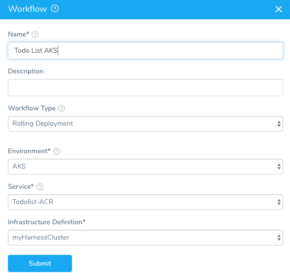
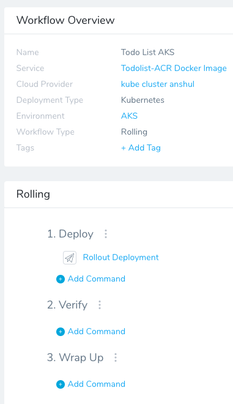
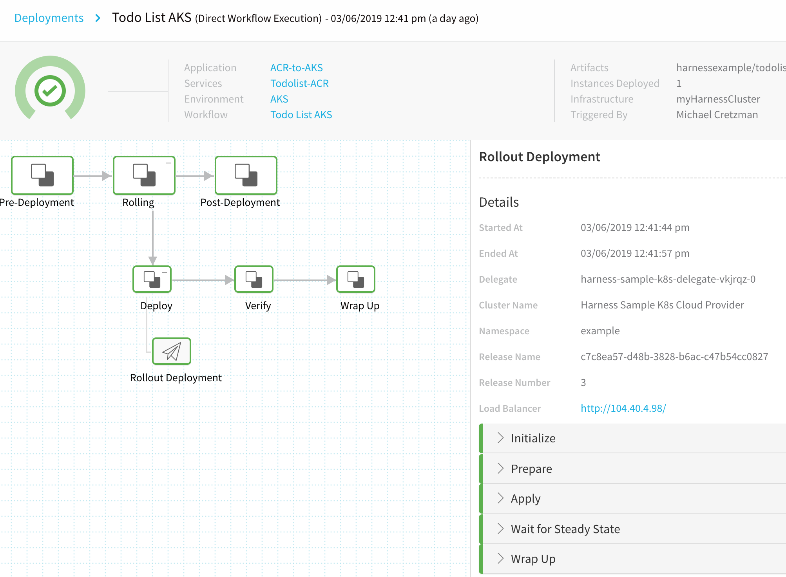
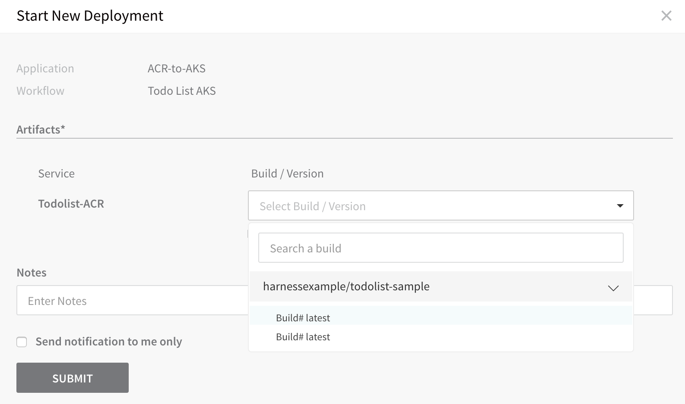
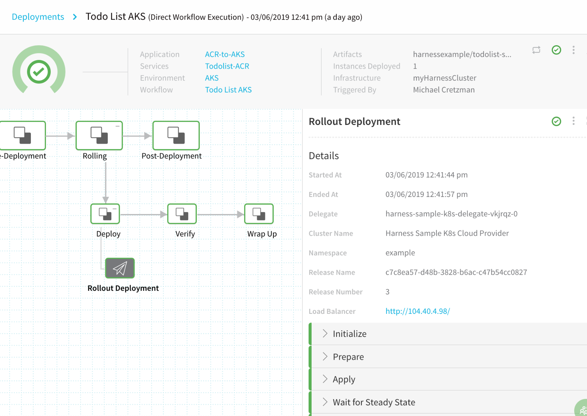
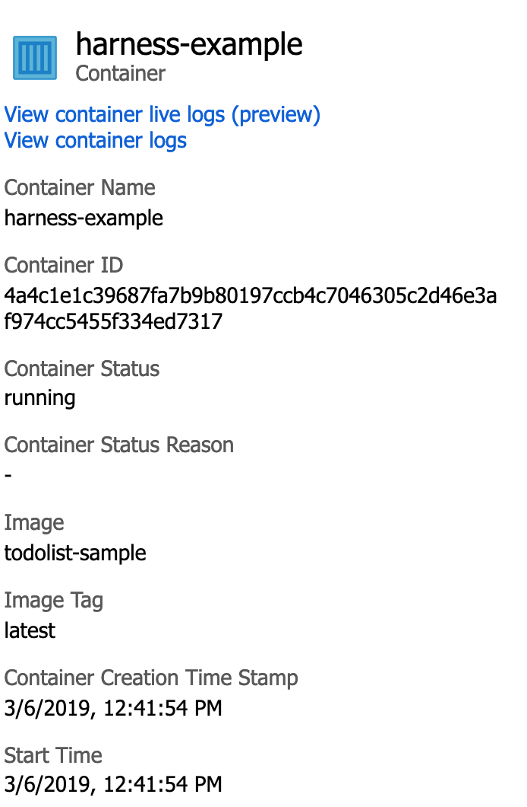
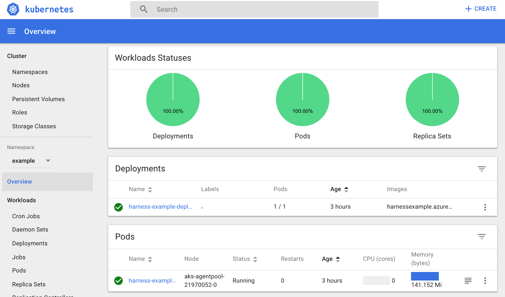

This content is for Harness [FirstGen](../../../../getting-started/harness-first-gen-vs-harness-next-gen.md). Switch to [NextGen](https://docs.harness.io/article/m7nkbph0ac).This section will walk you through creating a Kubernetes Workflow in Harness and what the Workflow steps deployment logs include:

* [Workflow Setup](4-azure-workflows-and-deployments.md#workflow-setup)
	+ [Initialize](4-azure-workflows-and-deployments.md#initialize)
	+ [Prepare](4-azure-workflows-and-deployments.md#prepare)
	+ [Apply](4-azure-workflows-and-deployments.md#apply)
	+ [Wait for Steady State](4-azure-workflows-and-deployments.md#wait-for-steady-state)
	+ [Wrap Up](4-azure-workflows-and-deployments.md#wrap-up)
* [AKS Workflow Deployment](4-azure-workflows-and-deployments.md#aks-workflow-deployment)
* [Next Step](4-azure-workflows-and-deployments.md#next-step)

### Workflow Setup

In this guide, the Workflow performs a simple Rolling Deployment, which is a Kubernetes Rolling Update. For a detailed explanation, see [Performing a Rolling Update](https://kubernetes.io/docs/tutorials/kubernetes-basics/update/update-intro/) from Kubernetes.

For information on other Workflow types, see [Kubernetes Deployments](https://docs.harness.io/category/kubernetes-deployments).To create a Rolling Workflow for Kubernetes, do the following:

1. In your Application, click **Workflows**.
2. Click **Add Workflow**. The **Workflow** dialog appears.
3. In **Name**, enter a name for your Workflow, such as **Todo List AKS**.
4. In **Workflow Type**, select **Rolling Deployment**.
5. In **Environment**, select the Environment you create for your Kubernetes deployment.
6. In Infrastructure Definition, select the Infrastructure Definition you created earlier. If the Infrastructure Definition does not appear, ensure that you added the Service to the Infrastructure Definition **Scope to specific Services** setting.
7. Click **SUBMIT**. The new Rolling Workflow is pre-configured.



As you can see, there is a Rollout Deployment step set up automatically. That's all the Workflow setup required. The Workflow is ready to deploy. When it is deployed, it will look like this:



You can see each section of the Rollout Deployment listed on the right. To see what that Rollout Deployment step does at runtime, let's look at the logs for each section.

#### Initialize

The Initialize step renders the Kubernetes object manifests in the correct order and validates them.


```
Initializing..  
  
  
Manifests [Post template rendering] :  
  
---  
  
apiVersion: v1  
kind: Namespace  
metadata:  
  name: example  
---  
apiVersion: "v1"  
kind: "Secret"  
metadata:  
  annotations:  
    harness.io/skip-versioning: "true"  
  finalizers: []  
  labels: {}  
  name: "harness-example-dockercfg"  
  ownerReferences: []  
data:  
  .dockercfg: "***"  
stringData: {}  
type: "kubernetes.io/dockercfg"  
---  
apiVersion: v1  
kind: ConfigMap  
metadata:  
  name: harness-example-config  
data:  
  key: value  
---  
apiVersion: v1  
kind: Service  
metadata:  
  name: harness-example-svc  
spec:  
  type: LoadBalancer  
  ports:  
  - port: 80  
    targetPort: 80  
    protocol: TCP  
  selector:  
    app: harness-example  
---  
apiVersion: apps/v1  
kind: Deployment  
metadata:  
  name: harness-example-deployment  
spec:  
  replicas: 1  
  selector:  
    matchLabels:  
      app: harness-example  
  template:  
    metadata:  
      labels:  
        app: harness-example  
    spec:  
      imagePullSecrets:  
      - name: harness-example-dockercfg  
      containers:  
      - name: harness-example  
        image: harnessexample.azurecr.io/todolist-sample:latest  
        envFrom:  
        - configMapRef:  
            name: harness-example-config  
  
  
Validating manifests with Dry Run  
  
kubectl --kubeconfig=config apply --filename=manifests-dry-run.yaml --dry-run  
namespace/example configured (dry run)  
secret/harness-example-dockercfg created (dry run)  
configmap/harness-example-config created (dry run)  
service/harness-example-svc configured (dry run)  
deployment.apps/harness-example-deployment configured (dry run)  
  
Done.
```
Note the `imagePullSecrets` settings. Harness used the Go templating in Service to fully form the correct YAML for Kubernetes.

#### Prepare

The Prepare section identifies the resources used and versions any for release history. Every Harness deployment creates a new release with an incrementally increasing number. Release history is stored in the Kubernetes cluster in a ConfigMap. This ConfigMap is essential for release tracking, versioning and rollback.

For more information, see [Releases and Versioning](https://docs.harness.io/article/ttn8acijrz-versioning-and-annotations#releases_and_versioning).


```
Manifests processed. Found following resources:   
  
Kind                Name                                    Versioned   
Namespace           example                                 false       
Secret              harness-example-dockercfg               false       
ConfigMap           harness-example-config                  true        
Service             harness-example-svc                     false       
Deployment          harness-example-deployment              false       
  
  
Current release number is: 3  
  
No previous successful release found.  
  
Cleaning up older and failed releases  
  
kubectl --kubeconfig=config delete ConfigMap/harness-example-config-2  
  
configmap "harness-example-config-2" deleted  
  
Managed Workload is: Deployment/harness-example-deployment  
  
Versioning resources.  
  
Done
```
#### Apply

The Apply section deploys the manifests from the Service **Manifests** section as one file.


```
kubectl --kubeconfig=config apply --filename=manifests.yaml --record  
  
namespace/example unchanged  
secret/harness-example-dockercfg created  
configmap/harness-example-config-3 created  
service/harness-example-svc unchanged  
deployment.apps/harness-example-deployment configured  
  
Done
```
#### Wait for Steady State

The Wait for Steady State section shows the containers and pods rolled out.


```
kubectl --kubeconfig=config get events --output=custom-columns=KIND:involvedObject.kind,NAME:.involvedObject.name,MESSAGE:.message,REASON:.reason --watch-only  
  
kubectl --kubeconfig=config rollout status Deployment/harness-example-deployment --watch=true  
  
  
Status : Waiting for deployment "harness-example-deployment" rollout to finish: 1 old replicas are pending termination...  
Event  : Pod    harness-example-deployment-cfdb66bf4-qw5g9   pulling image "harnessexample.azurecr.io/todolist-sample:latest"   Pulling  
Event  : Pod   harness-example-deployment-cfdb66bf4-qw5g9   Successfully pulled image "harnessexample.azurecr.io/todolist-sample:latest"   Pulled  
Event  : Pod   harness-example-deployment-cfdb66bf4-qw5g9   Created container   Created  
Event  : Pod   harness-example-deployment-cfdb66bf4-qw5g9   Started container   Started  
Event  : Deployment   harness-example-deployment   Scaled down replica set harness-example-deployment-6b8794c59 to 0   ScalingReplicaSet  
  
Status : Waiting for deployment "harness-example-deployment" rollout to finish: 1 old replicas are pending termination...  
Event  : ReplicaSet   harness-example-deployment-6b8794c59   Deleted pod: harness-example-deployment-6b8794c59-2z99v   SuccessfulDelete  
  
Status : Waiting for deployment "harness-example-deployment" rollout to finish: 1 old replicas are pending termination...  
  
Status : deployment "harness-example-deployment" successfully rolled out  
  
Done.
```
#### Wrap Up

The Wrap Up section shows the Rolling Update strategy used. Here is a sample:


```
...  
Name:                   harness-example-deployment  
Namespace:              example  
CreationTimestamp:      Wed, 06 Mar 2019 20:16:30 +0000  
Labels:                 <none>  
Annotations:            deployment.kubernetes.io/revision: 3  
                        kubectl.kubernetes.io/last-applied-configuration:  
                          {"apiVersion":"apps/v1","kind":"Deployment","metadata":{"annotations":{"kubernetes.io/change-cause":"kubectl apply --kubeconfig=config --f...  
                        kubernetes.io/change-cause: kubectl apply --kubeconfig=config --filename=manifests.yaml --record=true  
Selector:               app=harness-example  
Replicas:               1 desired | 1 updated | 1 total | 1 available | 0 unavailable  
StrategyType:           RollingUpdate  
MinReadySeconds:        0  
RollingUpdateStrategy:  25% max unavailable, 25% max surge  
...  
Events:  
  Type    Reason             Age   From                   Message  
  ----    ------             ----  ----                   -------  
  Normal  ScalingReplicaSet  25m   deployment-controller  Scaled up replica set harness-example-deployment-86c6d74db8 to 1  
  Normal  ScalingReplicaSet  14m   deployment-controller  Scaled up replica set harness-example-deployment-6b8794c59 to 1  
  Normal  ScalingReplicaSet  4s    deployment-controller  Scaled down replica set harness-example-deployment-86c6d74db8 to 0  
  Normal  ScalingReplicaSet  4s    deployment-controller  Scaled up replica set harness-example-deployment-cfdb66bf4 to 1  
  Normal  ScalingReplicaSet  1s    deployment-controller  Scaled down replica set harness-example-deployment-6b8794c59 to 0  
  
Done.
```
### AKS Workflow Deployment

Now that the setup is complete, you can click **Deploy** in the Workflow to deploy the artifact to your cluster.


Next, select the artifact build version and click **SUBMIT**.



The Workflow is deployed.



To see the completed deployment, log into your Azure AKS cluster, click **Insights**, and then click **Controllers**.


If you are using a older AKS cluster, you might have to enable Insights.The container details show the Docker image deployed:



You can also launch the Kubernetes dashboard to see the results:



To view the Kubernetes dashboard, in your AKS cluster, click **Overview**, click **Kubernetes Dashboard**, and then follow the CLI steps.

### Next Step

* [5 - Azure Troubleshooting](5-azure-troubleshooting.md)

