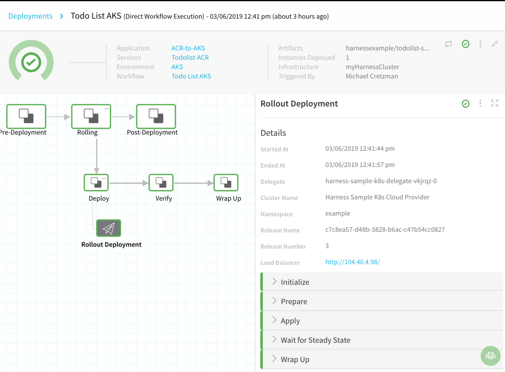
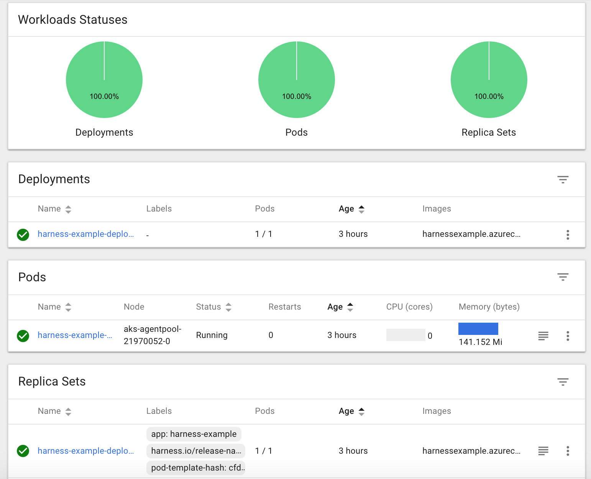

This content is for Harness [FirstGen](../../../../getting-started/harness-first-gen-vs-harness-next-gen.md). Switch to [NextGen](https://docs.harness.io/article/m7nkbph0ac).This guide will walk you through deploying a Docker image in an Azure Container Registry (ACR) repo to an Azure Kubernetes Service (AKS) cluster. This scenario is very popular and a walkthrough of all the steps involved will help you set up this scenario in Harness for your own microservices and apps.

### Deployment Summary

For a general overview of how Harness works, see [Harness Key Concepts](https://docs.harness.io/article/4o7oqwih6h-harness-key-concepts). For a vendor-agnostic, Harness Docker-to-Kubernetes deployment, see our [Kubernetes Quickstart](https://docs.harness.io/article/7in9z2boh6-kubernetes-quickstart) doc.

|  |  |
| --- | --- |
| **Azure deployment in Harness Manager** | **The same deployment in Kubernetes Dashboard** |
|  |  |

#### Deployment Preview

The following list describes the major steps we will cover in this guide:

1. Install the Harness Kubernetes **Delegate** in an AKS Kubernetes cluster.
2. Add **Cloud Providers**. We will create two Harness Cloud Providers:

	1. **Kubernetes Cloud Provider** - This is a connection to your AKS Kubernetes cluster using the Harness Delegate installed in that cluster.
	
	2. **Azure Cloud Provider** - This is a connection to your Azure account to access ACR. 
	
	   For other artifact repositories, a Harness Artifact Server connection is used. For Azure, Harness uses a Cloud Provider connection.
		 
:::note
**Why two connections to Azure?** When you create an AKS cluster, Azure also creates a service principal to support cluster operability with other Azure resources. You can use this auto-generated service principal for authentication with an ACR registry. If you can use this method, then only the Kubernetes Cloud Provider is needed.  
  
In this guide, we create separate connections for AKS and ACR because, in some instances, you might not be able to assign the required role to the auto-generated AKS service principal granting it access to ACR. For more information, see [Authenticate with Azure Container Registry from Azure Kubernetes Service](https://docs.microsoft.com/en-us/azure/container-registry/container-registry-auth-aks) from Azure.
:::
	 
3. Create the Harness **Application** for your Azure CD pipeline. 

   The Harness Application represents a group of microservices, their deployment pipelines, and all the building blocks for those pipelines. Harness represents your microservice using a logical group of one or more entities: Services, Environments, Workflows, Pipelines, Triggers, and Infrastructure Provisioners. Applications organize all of the entities and configurations in Harness CI/CD.

4. Create the Harness **Service** using the Kubernetes type.

	1. Set up your Kubernetes manifests and any config variables and files.
	
	2. Set the **ImagePullSecrets** setting to **true**. This will enable Kubernetes in AKS to pull the Docker image from ACR.
	
5. Create the Harness **Environment** containing the Infrastructure Definition definition of your AKS cluster, and any overrides.
6. Create the Kubernetes deployment Harness **Workflow**.
7. **Deploy** the Workflow to AKS. The deployment will pull the Docker image from ACR at runtime.
8. Advanced options not covered in this guide:

	1. Create a Harness **Pipeline** for your deployment, including Workflows and Approval steps. For more information, see [Pipelines](https://docs.harness.io/article/zc1u96u6uj-pipeline-configuration).
	
	2. Create a Harness **Trigger** to automatically deploy your Workflows or Pipeline according to your criteria. For more information, see [Triggers](https://docs.harness.io/article/xerirloz9a-add-a-trigger-2).
	
	3. Create Harness **Infrastructure Provisioners** for your deployment environments. For more information, see [Infrastructure Provisioners](https://docs.harness.io/article/o22jx8amxb-add-an-infra-provisioner).

#### What Are We Going to Do?

This guide walks you through deploying a Docker image from Azure ACR to Azure AKS using Harness. Basically, the Harness deployment does the following:

* **Docker Image** - Pull Docker image from Azure ACR.
* **Kubernetes Cluster** - Deploy the Docker image to a Kubernetes cluster in Azure AKS in a Kubernetes Rolling Deployment.

#### What Are We Not Going to Do?

This is a brief guide that covers the basics of deploying ACR artifacts to AKS. It does not cover the following:

* Basics of Docker, Kubernetes, ACR, or AKS. For great documentation on these platforms, see [Azure Container Registry Documentation](https://docs.microsoft.com/en-us/azure/container-registry/) and [Azure Kubernetes Service (AKS)](https://docs.microsoft.com/en-us/azure/aks/) from Azure.
* Azure basics. This guide assumes you are familiar with Azure Resource Manager, its terminology and components, such as Resource Groups. For more information, see [Azure Resource Manager overview](https://docs.microsoft.com/en-us/azure/azure-resource-manager/resource-group-overview), [Resource Groups](https://docs.microsoft.com/en-us/azure/azure-resource-manager/resource-group-overview#resource-groups), and [Deploy resources with Resource Manager templates and Azure portal](https://docs.microsoft.com/en-us/azure/azure-resource-manager/resource-group-template-deploy-portal) from Azure.
* Using all of the artifact types Harness supports. We will focus on Docker images, as they are the most popular type.

### Before You Begin

The following are required:

* **ACR repository** - An Azure account with a ACR repository you can connect to Harness.
* **AKS Kubernetes cluster** - An AKS Kubernetes cluster running in your Azure environment.

We will walk you through the process of setting up Harness with connections to ACR and AKS.

### Next Step

* [1 - Harness Account Setup for Azure](1-harness-account-setup.md)

