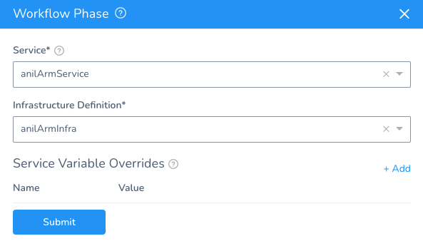
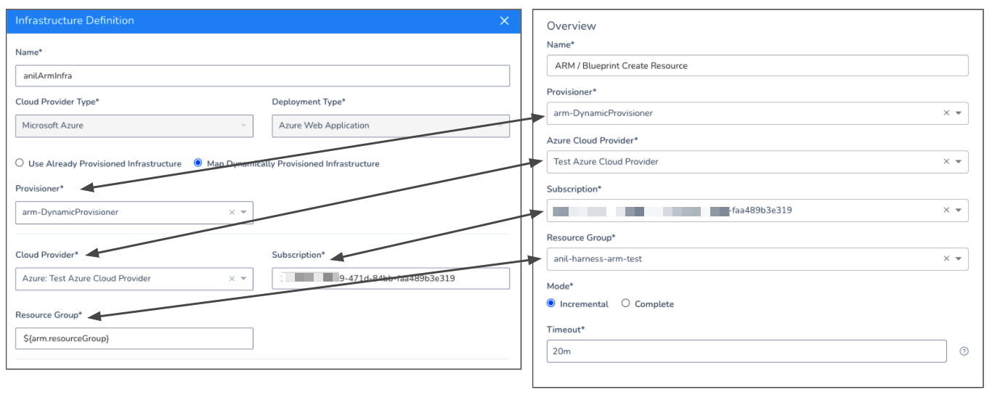

You can use Azure ARM templates to provision the target infrastructure for some Azure deployments. Harness provisions the infrastructure and then deploys to it in the same Workflow.

Currently, on [Azure Web App deployments](../azure-webapp-category/azure-web-app-deployments-overview.md) are supported for target infrastructure provisioning.For steps on using ARM templates to provision non-target infrastructure and resources, see [Provision Resources using a Harness ARM Infrastructure Provisioner](provision-using-the-arm-blueprint-create-resource-step.md).


### Before You Begin

* [Set Up Your Harness Account for Azure ARM](set-up-your-harness-account-for-azure-arm.md)
* [Add Azure ARM Templates to Harness](add-azure-arm-templates.md)
* For a conceptual overview of provisioning with ARM and Blueprints, see [Azure ARM and Blueprint Provisioning with Harness](../../concepts-cd/deployment-types/azure-arm-and-blueprint-provision-with-harness.md).

### Limitations

* See [Azure Resource Management (ARM) How-tos](azure-arm-and-blueprint-how-tos.md).

### Visual Summary

Here's a short video showing how to provision and deploy to the same Azure infrastructure using ARM and Harness:

<!-- Video:
https://harness-1.wistia.com/medias/rpv5vwzpxz-->
<docvideo src="https://www.youtube.com/embed/WfPE9wk4tM0?feature=oembed" />


Here's a diagram of how you use your Azure ARM templates in Harness to provision infra and then deploy to it:


1. **ARM Infrastructure Provisioner**: add your Azure ARM template as a Harness Infrastructure Provisioner. You add it by connecting to the Git repo for the ARM template. You also set the scope (Tenant, etc). You can also enter the ARM template inline without connecting to a Git repo.
2. **​Infrastructure Definition**: define a Harness Infrastructure Definition that maps your ARM outputs to the required Harness settings (Resource Group).
3. **Workflow Setup:** when you create your Workflow, you select the Infrastructure Definition you created, identifying it as the target infrastructure for the deployment.
4. **Workflow Provisioner Step:** in the Workflow, you add an **ARM/Blueprint Create Resource** step that uses the ARM Infrastructure Provisioner you set up. The Workflow will build the infrastructure according to your ARM template. You can also add ARM template parameter values here.
5. **Pre-deployment**: the pre-deployment steps are executed and provision the infrastructure using the **ARM/Blueprint Create Resource** step.
6. **Deployment:** the Workflow deploys to the provisioned infrastructure defined as its target Infrastructure Definition.

### Supported Platforms and Technologies

See [Supported Platforms and Technologies](https://docs.harness.io/article/220d0ojx5y-supported-platforms).

### Step 1: Add the Infrastructure Provisioner

A Harness Infrastructure Provisioner connects Harness to the Git repo where your ARM template is located.

To set up a Harness Infrastructure Provisioner for an ARM template, follow the steps in [Add Azure ARM Templates to Harness](add-azure-arm-templates.md).

### Step 2: Create Infrastructure Definition

Add a new Environment as described in [Add an Environment](https://docs.harness.io/article/n39w05njjv-environment-configuration).

Click **Add Infrastructure Definition**.

Name the Infrastructure Definition.

In **Cloud Provider Type**, select **Microsoft Azure**.

In **Deployment Type**, select **Azure Web Application**.

The **Map Dynamically Provisioned Infrastructure** option appears. This option is only available if you select **Azure Web Application** in **Deployment Type**.

### Step 3: Select the Infrastructure Provisioner

In Provisioner, select the Harness Infrastructure Provisioner you set up for your ARM template.

Harness will use this Infrastructure Provisioner to locate the outputs you map to its **Resource Group** setting.

See [Add Azure ARM Templates to Harness](add-azure-arm-templates.md).

### Step 4: Select the Cloud Provider and Subscription

In **Cloud Provider**, select the Harness Cloud Provider the Workflow will use to connect to the provisioned infrastructure.

Typically, this is the same Cloud Provider used later when you add the **ARM/Blueprint Create Resource** step in the Workflow.

In **Subscription**, enter the Azure Subscription where the ARM template infrastructure will be provisioned.

### Step 5: Map ARM Outputs in Infrastructure Definition

The purpose of the **Map Dynamically Provisioned Infrastructure** option is to map ARM template outputs to the settings Harness needs to provision the infrastructure.

At runtime, Harness will pull the values for the settings from your ARM template.

Ensure that the ARM template you added in the Infrastructure Provisioner you selected in Provisioner includes an output for Resource Group.

For example, here are the outputs from an ARM template to provision Azure Web Apps:


```
...  
"outputs": {  
    "webApp": {  
      "type": "string",  
      "value": "[parameters('siteName')]"  
    },  
    "slot": {  
      "type": "string",  
      "value": "[parameters('deploymentSlot')]"  
    },  
    "resourceGroup": {  
      "type": "string",  
      "value": "harness-arm-test"  
    }  
  }  
...
```
You can see the `resourceGroup` output. You can reference that output, or any output, using the expression `${arm.<output_name>}`.

For example, to reference `resourceGroup` you can use `${arm.resourceGroup}`.

In **Resource Group**, enter `${arm.resourceGroup}`. The value in the output is used at runtime. This is the same as providing the resource group in `az deployment group create`.

Click **Submit**.

The Infrastructure Provisioner is now defined as an Infrastructure Definition.

You can now use this Infrastructure Definition in a Workflow as the target infrastructure.

### Step 6: Select Infrastructure Definition in Workflow

When you create the Harness Workflow that will deploy to the infrastructure in your ARM template, you will select the Infrastructure Definition you created using the ARM template's Infrastructure Provisioner.

In a Canary or Multi-Service Workflow, you add the Infrastructure Definition in the Phase settings.



In a Blue/Green Workflow, you add the Infrastructure Definition in the Workflow settings.


Now that the Infrastructure Definition is set up as the target infrastructure for the Workflow, you can add a step to the Workflow to run the Infrastructure Provisioner and create that target infrastructure.

### Step 7: Add ARM/Blueprint Create Resource Step to Workflow

Canary, Multi-Service, and Blue/Green Workflow types contain a pre-deployment section where you can provision the target infrastructure using your Harness Infrastructure Provisioner.

Let's look at a Blue/Green Workflow.

In a Blue/Green Workflow, in **Provision infrastructure**, click **Add Step**.

Click **ARM/Blueprint Create Resource** and then click **Next**.

In **Overview**, enter the same settings you used in the Infrastructure Definition.

In **Resource Group**, select the same resource group that you used in the `resourceGroup` output in your template.

The following image shows how the settings in the Infrastructure Definition map to the settings in the **ARM/Blueprint Create Resource** step.

In **Mode**, select **Incremental** or **Complete**. This is the same as entering the `--mode` parameter in the `az deployment group create`.

For more information, see [Azure Resource Manager deployment modes](https://docs.microsoft.com/en-us/azure/azure-resource-manager/templates/deployment-modes) from Azure.

In **Timeout**, enter at least 20m. Provisioning Azure resources can take time.

Click **Next**.

### Step 8: Specify Template Parameters

In **Parameters**, you enter or link to your template parameters.

In **Source Type**, select **Inline** or **Remote**.

If you select **Inline**, enter the parameters in **Type/Paste JSON Configuration**.

If you select **Remote**, in **Git Repository**, select the Harness Source Repo Provider that connects to the repo where your parameters file is located.

You can specify the repo branch or commit ID and the path to the parameters JSON file. Always include the filename.

#### Review: Parameters JSON Format

Harness accept ARM template parameters is a specific JSON format.

Typically, a parameters JSON file includes the `$schema` key to specify the location of the JSON schema file, and the `contentVersion` to specify the version of the template:


```
{  
  "$schema": "https://schema.management.azure.com/schemas/2019-04-01/deploymentParameters.json#",  
  "contentVersion": "1.0.0.0",  
  "parameters": {  
    "adminUsername": {  
      "value": "johnsmith"  
    },  
    "adminPassword": {  
      "value": "m2y&oD7k5$eE"  
    },  
    "dnsLabelPrefix": {  
      "value": "genunique"  
    }  
  }  
}
```
When you use parameters text or files with Harness, you must remove the `$schema` and `contentVersion` keys.

Harness provisioning requires you remove these keys due to limitations in the Azure Java SDK and REST APIs. Only the parameter object key:value pairs are allowed.

Using the example above, the parameters would be provided like this in Harness:


```
{  
    "adminUsername": {  
      "value": "johnsmith"  
    },  
    "adminPassword": {  
      "value": "m2y&oD7k5$eE"  
    },  
    "dnsLabelPrefix": {  
      "value": "genunique"  
    }  
}
```
This format must be used whether the parameters are added using a remote file or inline.

Click **Submit**.

The **ARM/Blueprint Create Resource** is added to the Workflow.

You can now add the remaining steps for your deployment to the infrastructure the **ARM/Blueprint Create Resource** step will provision.

### Step 9: Use Template Outputs in Workflow Steps

When you added the Infrastructure Provisioner to the Infrastructure Definition you used the `${arm.resourceGroup}` expression to reference the resource group output in the ARM template.

In the Azure Web App steps, you can use the `${arm.<output_name>}` expression to reference the other outputs relevant to the Web App Workflow steps.

For details on Web App deployments, see [Azure Web App Deployments Overview](../azure-webapp-category/azure-web-app-deployments-overview.md).

Let's look at an example of the **Slot Setup** in a Web App [Blue/Green Workflow deployment](../azure-webapp-category/create-an-azure-web-app-blue-green-deployment.md#step-3-slot-deployment-step).

Normally, you would select or enter the App Service, Deployment, and Target Slots for the Web App deployment.


When provisioning, you enter the `${arm.<output_name>}` expression for each setting, mapping the outputs to the steps settings:


At runtime, Harness will substitute the output values, which in this case are taken from a parameters file, and use them for the **Slot Setup** step.

If the Azure Web App Workflow uses an Infrastructure Definition that uses an Infrastructure Provisioner (such as ARM Infrastructure Provisioner) then the **Slot Setup** step must use template outputs in its settings. The **Slot Setup** step uses the Infrastructure Definition settings to pull App Service and slot information from Azure. If the Infrastructure Definition uses an Infrastructure Provisioner, then Harness cannot obtain this information until runtime.

### Step 10: Deploy the Workflow

Here is an example of a Blue/Green Azure Web App Workflow deployment that uses the Infrastructure Provisioner in its Infrastructure Definition and **ARM/Blueprint Create Resource** step:

In the **ARM/Blueprint Create Resource** step's **Execute ARM Deployment** section, you can see the ARM deployment:


```
Starting template validation  
Saving existing template for resource group - [anil-harness-arm-test]   
Starting ARM Deployment at Resource Group scope ...   
Resource Group - [anil-harness-arm-test]  
Mode - [INCREMENTAL]  
Deployment Name - [harness_533_1615316689992]  
ARM Deployment request send successfully
```
In the **ARM Deployment Steady state** section you can see the deployment reach steady state:


```
Deployment Status for - [harness_533_1615316689992] is [Running]  
Deployment Status for - [harness_533_1615316689992] is [Running]  
Deployment Status for - [harness_533_1615316689992] is [Running]  
Deployment Status for - [harness_533_1615316689992] is [Running]  
Deployment Status for - [harness_533_1615316689992] is [Succeeded]  
  
Microsoft.Web/sites/slots - anil-dynamic-provisioner-webApp/staging :: [Succeeded]  
Microsoft.Web/sites - anil-dynamic-provisioner-webApp :: [Succeeded]  
Microsoft.Web/serverfarms - anil-dynamic-provisioner-webApp-ServicePlan :: [Succeeded]  
  
ARM Deployment - [harness_533_1615316689992] completed successfully
```
In the **Slot Setup** step, you will see that the values provided for the template outputs mapped to that step are used.

Now you have provisioned the Web App target infrastructure and deployed to it using a single Workflow.

For information on rollback, see [Azure ARM Rollbacks](azure-arm-rollbacks.md).

### Sample ARM Template and Parameters

Here is a sample ARM template for creating Azure Web App deployments. You will need to update the outputs for your environment.


```
{  
  "$schema": "https://schema.management.azure.com/schemas/2015-01-01/deploymentTemplate.json#",  
  "contentVersion": "1.0.0.0",  
  "parameters": {  
    "siteName": {  
      "type": "string",  
      "metadata": {  
        "description": "The name of the web app that you wish to create."  
      }  
    },  
    "deploymentSlot": {  
      "type": "string",  
      "metadata": {  
        "description": "The name of the deployment slot that you wish to create."  
      }  
    }  
  },  
  "variables": {  
    "servicePlanName": "[concat(parameters('siteName'), '-ServicePlan')]"  
  },  
  "resources": [  
    {  
      "apiVersion": "2016-09-01",  
      "type": "Microsoft.Web/serverfarms",  
      "kind": "linux",  
      "name": "[variables('servicePlanName')]",  
      "location": "[resourceGroup().location]",  
      "properties": {  
        "name": "[variables('servicePlanName')]",  
        "reserved": true,  
        "numberOfWorkers": "1"  
      },  
      "dependsOn": [],  
      "sku": {  
        "Tier": "Standard",  
        "Name": "S1"  
      }  
    },  
    {  
      "apiVersion": "2016-08-01",  
      "type": "Microsoft.Web/sites",  
      "name": "[parameters('siteName')]",  
      "location": "[resourceGroup().location]",  
      "properties": {  
        "siteConfig": {  
          "name": "[parameters('siteName')]",  
          "appSettings": [  
            {  
              "name": "WEBSITES_ENABLE_APP_SERVICE_STORAGE",  
              "value": "false"  
            }  
          ],  
          "linuxFxVersion": "DOCKER|nginx:alpine"  
        },  
        "serverFarmId": "[resourceId('Microsoft.Web/serverfarms', variables('servicePlanName'))]"  
      },  
      "dependsOn": [  
        "[resourceId('Microsoft.Web/serverfarms', variables('servicePlanName'))]"  
      ]  
    },  
    {  
      "apiVersion": "2020-06-01",  
      "type": "Microsoft.Web/sites/slots",  
      "name": "[concat(parameters('siteName'), '/', parameters('deploymentSlot'))]",  
      "kind": "app",  
      "location": "[resourceGroup().location]",  
      "comments": "This specifies the web app slots.",  
      "tags": {  
        "displayName": "WebAppSlots"  
      },  
      "properties": {  
        "siteConfig": {  
          "name": "[parameters('siteName')]",  
          "appSettings": [  
            {  
              "name": "WEBSITES_ENABLE_APP_SERVICE_STORAGE",  
              "value": "false"  
            }  
          ],  
          "linuxFxVersion": "DOCKER|nginx:alpine"  
        },  
        "serverFarmId": "[resourceId('Microsoft.Web/serverfarms', variables('servicePlanName'))]"  
      },  
      "dependsOn": [  
        "[resourceId('Microsoft.Web/Sites', parameters('siteName'))]"  
      ]  
    }  
  ],  
  "outputs": {  
    "webApp": {  
      "type": "string",  
      "value": "[parameters('siteName')]"  
    },  
    "slot": {  
      "type": "string",  
      "value": "[parameters('deploymentSlot')]"  
    },  
    "resourceGroup": {  
      "type": "string",  
      "value": "MyResourceGroup"  
    }  
  }  
}
```
Here is the parameters file for the template. You will need to update the values for your environment.


```
{  
  "siteName": {  
    "value": "myWebApp"  
  },  
  "deploymentSlot": {  
    "value": "staging"  
  }  
}
```
### Configure As Code

To see how to configure the settings in this topic using YAML, configure the settings in the UI first, and then click the **YAML** editor button.

