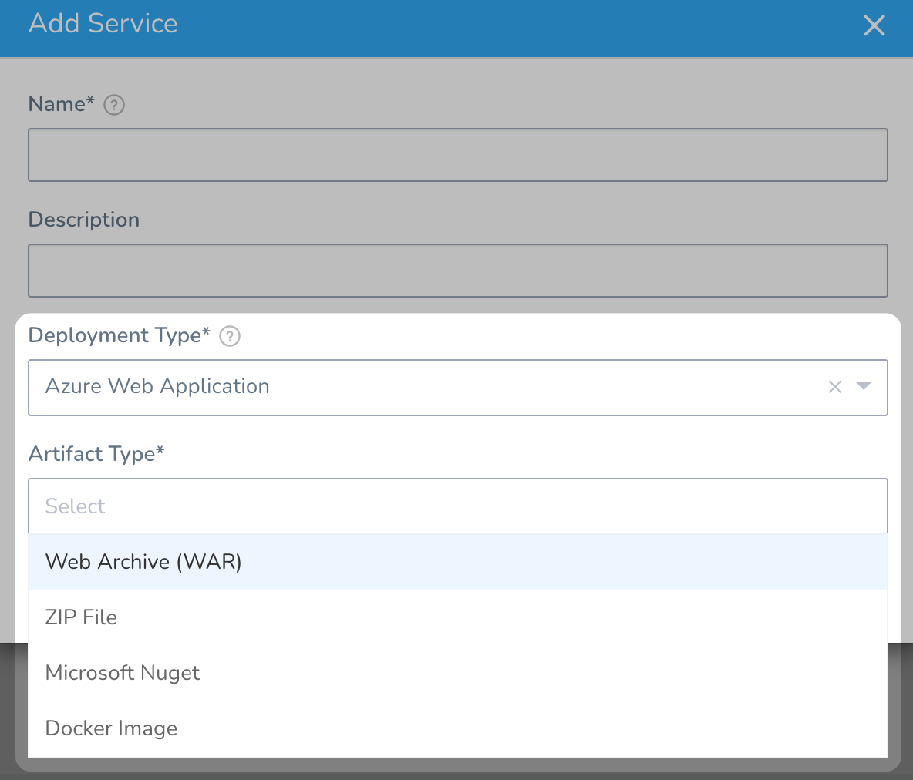
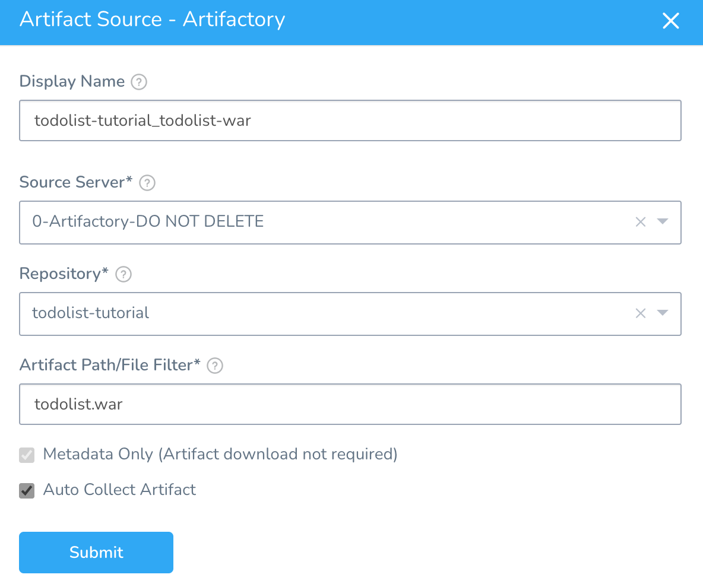
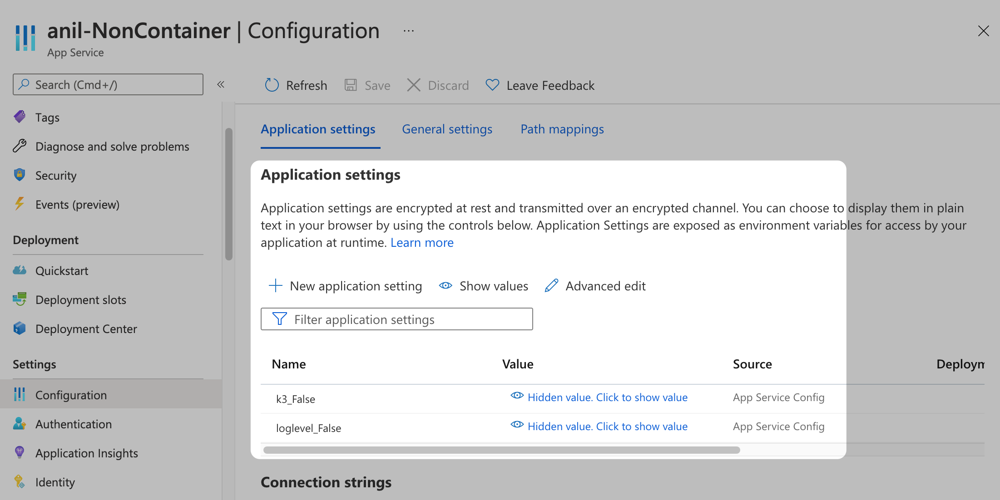

Currently, this feature is behind the Feature Flags `AZURE_WEBAPP`. Contact [Harness Support](mailto:support@harness.io) to enable the feature.Setting up a Harness Azure Web App deployment is a simple process. You add your artifact's repo and settings to a Harness Service, and then add any of the Web App's application settings and connection strings.

These repo and settings are used when Harness deploys your Web App.

This topic covers adding a non-containerized artifact. For steps on adding a Docker image for Web App Deployment, see [Add Your Docker Image for Azure Web App Deployment](add-your-docker-image-for-azure-web-app-deployment.md).

### Before You Begin

* [Azure Web App Deployments Overview](azure-web-app-deployments-overview.md)
* Make sure that you have connected Harness to your Azure subscription as described in [Connect to Azure and Artifact Repo for Your Web App Deployments](connect-to-azure-for-web-app-deployments.md).

### Supported Platforms and Technologies

See [Supported Platforms and Technologies](https://docs.harness.io/article/220d0ojx5y-supported-platforms).

### Limitations

The Harness Azure Web Application Service type supports the following repos:

* **Docker Registry:** see [Add Docker Registry Artifact Servers](https://docs.harness.io/article/tdj2ghkqb0-add-docker-registry-artifact-servers).
* **Artifactory:** see [Add Artifactory Servers](https://docs.harness.io/article/nj3p1t7v3x-add-artifactory-servers).
* **Amazon S3:** see [Add Amazon Web Services (AWS) Cloud Provider](https://docs.harness.io/article/wt1gnigme7-add-amazon-web-services-cloud-provider).
* **Jenkins:** see [Add Jenkins Artifact Servers](https://docs.harness.io/article/qa7lewndxq-add-jenkins-artifact-servers).
* **Azure Artifact:** see [Add an Azure DevOps Artifact Source](https://docs.harness.io/article/rbfjmko1og-add-an-azure-dev-ops-artifact-source).
	+ You can use Maven and NuGet. If you choose the Maven package type you can also use ZIP or WAR. If you use ZIP or WAR, then select ZIP or WAR as the type in your Harness Service Artifact Type.

Harness supports JAR files from the following repos:

* Artifactory
* Amazon S3
* Azure Artifact

Harness zips the JAR and then deploys it and unzips it and installs the App.

### Step 1: Create the Harness Service

The Harness Service represents your Azure Web App.

You identify the artifact for the app, configuration settings, and any secrets and configuration variables.

In your Harness Application, click **Services**.

Click **Add Service**. The Service settings appear.

Enter a name for your Service. Typically, the same name as the Web App.

In **Deployment Type**, select **Azure Web Application**.

In **Artifact Type**, select a non-containerized type.



Click **Submit**. The Service is created.

### Step 2: Add the Artifact

You will add the same artifact you use in your Web App.

Ensure you have set up a Harness Artifact Server or Cloud Provider (for Azure Container Registry or AWS S3) that connects to the image's repo. See [Connect to Azure and Artifact Repo for Your Web App Deployments](connect-to-azure-for-web-app-deployments.md).

In the Harness Service, click **Add Artifact Source**.

Select the Artifact Server type.

Fill out the Artifact Source settings.

For **Jenkins**, you will select the job and artifact. Harness will run the job and obtain the artifact metadata needed to pull the artifact at deployment runtime.For details on configuring the supported Artifact Source types, see [Service Types and Artifact Sources](https://docs.harness.io/article/qluiky79j8-service-types-and-artifact-sources).

Here's an example of an Artifactory Artifact Source used to pull a WAR file:



When you are done, click **Submit**.

Next, click **Artifact History** to see the artifacts and builds Harness pulls from the repo.

### Option: Startup Script

You can use **Script** to add a startup script for your app.

See [What are the expected values for the Startup File section when I configure the runtime stack?](https://docs.microsoft.com/en-us/azure/app-service/faq-app-service-linux#what-are-the-expected-values-for-the-startup-file-section-when-i-configure-the-runtime-stack-) from Azure.

### Option: App Service Configuration

In Azure App Service, app settings are variables passed as environment variables to the application code.

See [Configure an App Service app in the Azure portal](https://docs.microsoft.com/en-us/azure/app-service/configure-common) from Azure.

You can set these using the Azure CLI:


```
az webapp config appsettings set --resource-group <group-name> --name <app-name> --settings DB_HOST="myownserver.mysql.database.azure.com"
```
Or via the portal:



You can also set **Application settings** and **Connection strings** in the Harness Service.

Here's an example of setting **Application settings** in the Harness Service:


This is the same as setting them in the Azure portal, in **Configuration**, **Application Settings**, **Advanced edit**.

#### Important Note

* If you add App Service Configuration settings in the Harness Service, you must include a **name** (`"name":`), and the name must be unique. This is the same requirement in Azure App Services.

#### Using Secrets and Variables Settings

You can use Harness secrets and Service or Workflow variables in the **Application settings** and **Connection strings** in the Harness Service.

These settings use JSON, so ensure that you use quotes around the variable or secret reference:


```
  {  
    "name": "PASSWORD",  
    "value": "${$secret.getValue('secret_key')}",  
    "slotSetting": false  
  },
```
### Next Step

* [Define Your Azure Web App Infrastructure](define-your-azure-web-app-infrastructure.md)

### Configure As Code

To see how to configure the settings in this topic using YAML, configure the settings in the UI first, and then click the YAML editor button.

