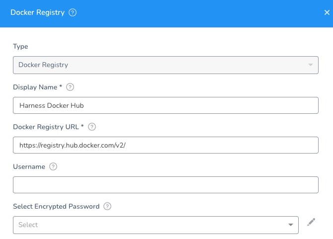
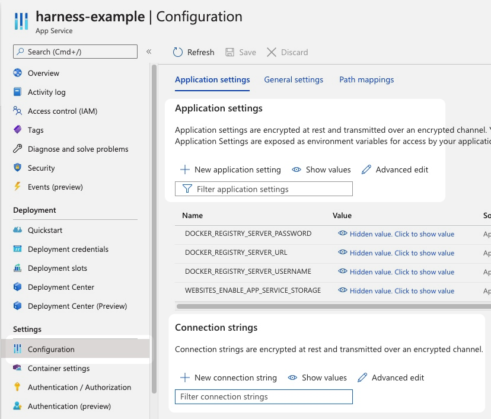
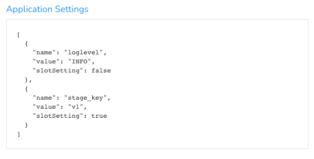
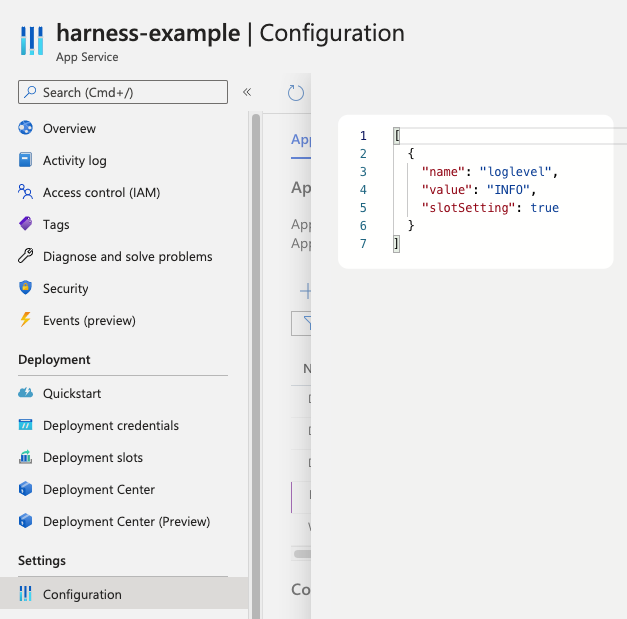

Currently, this feature is behind the Feature Flag `AZURE_WEBAPP`. Contact [Harness Support](https://mail.google.com/mail/?view=cm&fs=1&tf=1&to=support@harness.io) to enable the feature.Setting up a Harness Azure Web App deployment is a simple process. You add your Web App's Docker repo and image settings to a Harness Service, and then add any of the Web App's application settings and connection strings.

These Docker image and settings are used when Harness deploys your Web App.

This topic covers adding a Docker image. For steps on adding a non-containerized artifact for Web App Deployment, see [Add Non-Containerized Artifacts for Azure Web App Deployment](add-a-non-containerized-artifacts-for-azure-web-app-deployment.md).

### Before You Begin

* [Azure Web App Deployments Overview](azure-web-app-deployments-overview.md)
* Make sure that you have connected Harness to your Azure subscription as described in [Connect to Azure and Artifact Repo for Your Web App Deployments](connect-to-azure-for-web-app-deployments.md).

### Visual Summary

<!-- Video:
https://harness-1.wistia.com/medias/rpv5vwzpxz-->
<docvideo src="https://www.youtube.com/embed/psYt_mYKPFY?feature=oembed" />


### Supported Platforms and Technologies

See [Supported Platforms and Technologies](https://docs.harness.io/article/220d0ojx5y-supported-platforms).

### Limitations

The Harness Azure Web Application Service type supports the following repos:

* **Docker Registry:** see [Add Docker Registry Artifact Servers](https://docs.harness.io/article/tdj2ghkqb0-add-docker-registry-artifact-servers).
* **Artifactory:** see [Add Artifactory Servers](https://docs.harness.io/article/nj3p1t7v3x-add-artifactory-servers).
* **Azure Container Registry:** see [Add Microsoft Azure Cloud Provider](https://docs.harness.io/article/4n3595l6in-add-microsoft-azure-cloud-provider).
* **Amazon S3:** see [Add Amazon Web Services (AWS) Cloud Provider](https://docs.harness.io/article/wt1gnigme7-add-amazon-web-services-cloud-provider).
* **Jenkins:** see [Add Jenkins Artifact Servers](https://docs.harness.io/article/qa7lewndxq-add-jenkins-artifact-servers).

### Step 1: Create the Harness Service

The Harness Service represents your Azure Web App.

You identify the Docker image artifact for the app, configuration settings, and any secrets and configuration variables.

In your Harness Application, click **Services**.

Click **Add Service**. The Service settings appear.

Enter a name for your Service. Typically, the same name as the Web App.

In **Deployment Type**, select **Azure Web Application**.

Click **Submit**. The Service is created.

### Step 2: Add the Docker Image Artifact

You will add the same Docker image you use in your Web App.

Ensure you have set up a Harness Artifact Server or Azure Cloud Provider that connects to the image's repo. See [Connect to Azure and Artifact Repo for Your Web App Deployments](connect-to-azure-for-web-app-deployments.md).

In the Harness Service, click **Add Artifact Source**.

Select the Artifact Server type.

Fill out the Artifact Source settings.

For details on configuring the supported Artifact Source types, see [Add a Docker Image](https://docs.harness.io/article/gxv9gj6khz-add-a-docker-image-service).

The settings for the Harness Artifact Server and Artifact Source are a combination of the container settings in your Azure Web App.

Here's the Harness [Docker Registry Artifact Server](https://docs.harness.io/article/tdj2ghkqb0-add-docker-registry-artifact-servers):



The above example uses a public repo, and it requires no username or password.

In the Harness Service, the Artifact Source uses this Artifact Server and points to the Docker Image Name:


The above example uses a [publicly available Docker image from Harness](https://hub.docker.com/r/harness/todolist-sample/tags?page=1&ordering=last_updated). You might want to use that the first time you set up an Azure Web App deployment.When are done, click **Submit**.

Next, click **Artifact History** to see the artifacts and builds Harness pulls from the repo.

### Option: Startup Script

You can use **Script** to add a startup script for your app.

See [What are the expected values for the Startup File section when I configure the runtime stack?](https://docs.microsoft.com/en-us/azure/app-service/faq-app-service-linux#what-are-the-expected-values-for-the-startup-file-section-when-i-configure-the-runtime-stack-) from Azure.

### Option: App Service Configuration

In Azure App Service, app settings are variables passed as environment variables to the application code.

See [Configure an App Service app in the Azure portal](https://docs.microsoft.com/en-us/azure/app-service/configure-common) from Azure.

You can set these using the Azure CLI:


```
az webapp config appsettings set --resource-group <group-name> --name <app-name> --settings DB_HOST="myownserver.mysql.database.azure.com"
```
Or via the portal:



You can also set **Application settings** and **Connection strings** in the Harness Service.

Here's an example of setting **Application settings** in the Harness Service:



This is the same as setting them in the Azure portal **Advanced edit**.



#### Important Notes

* If you add App Service Configuration settings in the Harness Service, you must include a **name** (`"name":`), and the name must be unique. This is the same requirement in Azure App Services.
* Do not set Docker settings in the Harness Service **App Service Configuration**. Harness will override these using the Docker settings in the Harness Artifact Server and Artifact Source.

#### Using Secrets and Variables Settings

You can use Harness secrets and Service or Workflow variables in the **Application settings** and **Connection strings** in the Harness Service.

These settings use JSON, so ensure that you use quotes around the variable or secret reference:


```
  {  
    "name": "PASSWORD",  
    "value": "${$secret.getValue('secret_key')}",  
    "slotSetting": false  
  },
```
### Next Step

* [Define Your Azure Web App Infrastructure](define-your-azure-web-app-infrastructure.md)

### Configure As Code

To see how to configure the settings in this topic using YAML, configure the settings in the UI first, and then click the YAML editor button.

