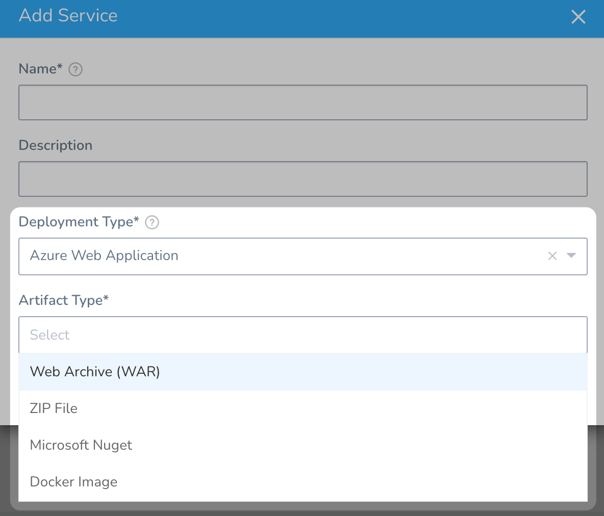
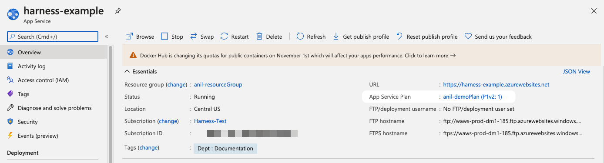
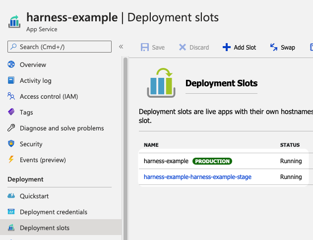
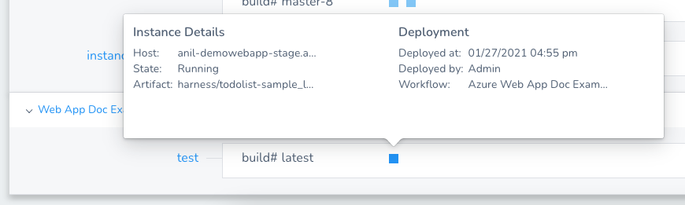

Currently, this feature is behind the Feature Flag `AZURE_WEBAPP`. Contact [Harness Support](https://mail.google.com/mail/?view=cm&fs=1&tf=1&to=support@harness.io) to enable the feature.Azure Web Apps use deployment slots to host different versions of your app. You can then swap these deployment slots without causing any downtime for your users.

Harness deploys your Azure Web Apps using their existing deployment slots. Using Harness, you can incrementally increase traffic to your source slot, and then perform a standard slot swap.

For detailed instructions on deploying an Azure Web App using Harness, see the following how-tos. They are listed in the order they are commonly performed.

* [Connect to Azure for Web App Deployments](connect-to-azure-for-web-app-deployments.md)
* [Add Your Docker Image for Azure Web App Deployment](add-your-docker-image-for-azure-web-app-deployment.md)
* [Add Non-Containerized Artifacts for Azure Web App Deployment](add-a-non-containerized-artifacts-for-azure-web-app-deployment.md)
* [Define Your Azure Web App Infrastructure](define-your-azure-web-app-infrastructure.md)
* [Create an Azure Web App Blue/Green Deployment](create-an-azure-web-app-blue-green-deployment.md)
* [Create an Azure Web App Canary Deployment](create-an-azure-web-app-canary-deployment.md)

Basic deployments are also supported.The following topic covers related deployment concepts:

* [Azure Web App Deployment Rollback](azure-web-app-deployment-rollback.md)

### Before You Begin

Before learning about Harness Azure Web App deployments, you should have an understanding of [Harness Key Concepts](https://docs.harness.io/article/4o7oqwih6h-harness-key-concepts).

### Limitations

* Harness deploys Docker images and non-containerized artifacts for Azure Web Apps. To see what's supported, when you create a Harness Service, see **Artifact Type**:
* Harness uses the Azure SDK among other methods and Authenticated proxy is not supported for Azure SDK. Consequently, you cannot use Azure connections for artifacts, machine images, etc, that require proxy authentication. This is an Azure limitation, not a Harness limitation. This is a known Azure limitation with Java environment properties and their SDK.

#### Azure Limitations

* App Service on Linux isn't supported on [Shared](https://azure.microsoft.com/pricing/details/app-service/plans/) pricing tier.
* You can't mix Windows and Linux apps in the same App Service plan.
* Within the same resource group, you can't mix Windows and Linux apps in the same region.

See [Limitations](https://docs.microsoft.com/en-us/azure/app-service/overview#limitations) from Azure.

### What Does Harness Need Before You Start?

To deploy an Azure Web App using Harness, you only need the following:

* **An existing Azure Web App using a Docker image or non-containerized artifact:** you can create one in minutes in Azure. Here is an example:  

|  |  |
| --- | --- |
| 
	1. Basics |  |
| 
	1. Docker |  |
* **A Docker image or non-containerized artifact:** this is the same image or artifact you used when you created the Azure Web App.
* Azure account connection information.
* **App Service Plan:** the name of the Azure App Service configured for your existing Web App.
* **Two or more running deployment slots for production and staging:** the slots created for your existing Azure Web App:

### What Does Harness Deploy?

Harness deploys the Docker image or non-containerized artifact you select for your Web App to a source deployment slot.

You can then increase traffic to the source slot. Once you have determined that the new image and slot is working, you can swap the source and target slots.

### What Operating Systems are Supported?

Linux and Windows are both supported.

Use a different resource group for each OS. Linux App Service Plans should use a different resource group than Windows App Service Plans. This is a limitation of Azure.

See [Limitations](https://docs.microsoft.com/en-us/azure/app-service/overview#limitations) from Azure.

### What Does a Harness Web App Deployment Involve?

The following list describes the major steps of a Harness Web App deployment:

|  |  |  |
| --- | --- | --- |
| **Step** | **Name** | **Links** |
| 1 | Install a Harness Delegate that can connect to your target Azure region. | [Connect to Azure for Web App Deployments](connect-to-azure-for-web-app-deployments.md) |
| 2 | Add the Docker image or non-containerized artifact Harness will use for the Web App. | [Add Your Docker Image for Azure Web App Deployment](add-your-docker-image-for-azure-web-app-deployment.md)[Add Non-Containerized Artifacts for Azure Web App Deployment](add-a-non-containerized-artifacts-for-azure-web-app-deployment.md) |
| 3 | Select the Subscription and Resource Group to use when Harness deploys a new Web App version. | [Define Your Azure Web App Infrastructure](define-your-azure-web-app-infrastructure.md) |
| 4 | Create a Harness Workflow to perform deployment. | [Create an Azure Web App Blue/Green Deployment](create-an-azure-web-app-blue-green-deployment.md)[Create an Azure Web App Canary Deployment](create-an-azure-web-app-canary-deployment.md)Basic deployments are also supported. |

### Azure Web App In Harness Services Dashboard

The Harness Services dashboard shows the new version of the Azure Web App that you deployed regardless of what slot it is deployed in.

