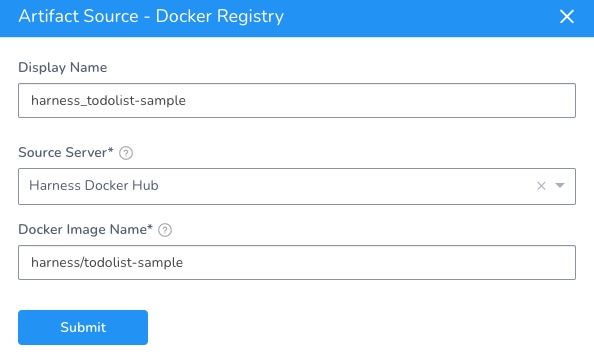

Currently, this feature is behind the Feature Flag `AZURE_WEBAPP`. Contact [Harness Support](https://mail.google.com/mail/?view=cm&fs=1&tf=1&to=support@harness.io) to enable the feature.You connect Harness to your Azure account to deploy Azure Web Apps. You make the connection using a Harness Cloud Provider.

You deploy your Web App using a Docker image or non-containerized artifact. You connect to your image or artifact's repo using a Harness Artifact Server or Cloud Provider (for AWS S3 or Azure ACR). 

In this topic:

* [Before You Begin](#before_you_begin)
* [Supported Platforms and Technologies](#supported_platforms_and_technologies)
* [Review: Azure Connection Options](#review_azure_connection_options)
* [Step 1: Install a Harness Delegate](#step_1_install_a_harness_delegate)
* [Step 2: Set Up the Azure Cloud Provider](#step_2_set_up_the_azure_cloud_provider)
* [Step 3: Set Up the Harness Artifact Server](#step_3_set_up_the_harness_artifact_server)
* [Next Steps](#next_steps)
* [See Also](#see_also)

### Before You Begin

* [Azure Web App Deployments Overview](azure-web-app-deployments-overview.md)
* [Harness Delegate Overview](https://docs.harness.io/article/h9tkwmkrm7-delegate-installation)
* [Harness Key Concepts](https://docs.harness.io/article/4o7oqwih6h-harness-key-concepts)

### Supported Platforms and Technologies

See  [Supported Platforms and Technologies](https://docs.harness.io/article/220d0ojx5y-supported-platforms).

### Review: Azure Connection Options

As covered in [Harness Key Concepts](https://docs.harness.io/article/4o7oqwih6h-harness-key-concepts), you need to install a Harness Delegate in your infrastructure before setting up your Harness deployment.

There are several types of Delegates you can use for an Azure App Service deployment, described in [Delegate Installation Overview](https://docs.harness.io/article/igftn7rrtg-delegate-installation-overview).

Shell Script, Docker, Kubernetes, and Helm Delegates are all options.

### Step 1: Install a Harness Delegate

Follow the installation steps for the Harness Delegate you want to install. See [Delegate Installation Overview](https://docs.harness.io/article/igftn7rrtg-delegate-installation-overview) for the available options.

Make sure this Delegate is in, or can connect to, the resource group for your Azure Web App.

### Step 2: Set Up the Azure Cloud Provider

A Harness Azure Cloud Provider connects to your Azure subscription using your Client ID and Tenant ID.

Follow the steps in [Add Microsoft Azure Cloud Provider](https://docs.harness.io/article/4n3595l6in-add-microsoft-azure-cloud-provider) to connect Harness to Azure.

That's all the setup you need to connect Harness to your account and start your deployment.

If you store the Docker image in Azure Container Registry, then you can use this Azure Cloud Provider you set up and skip the next step.

### Step 3: Set Up the Harness Artifact Server

If you store the Docker image in Azure Container Registry, then you can use the Azure Cloud Provider you set up and skip the Artifact Server setup.A Harness Azure Web App deployment uses a Docker image or non-containerized artifact. You connect Harness to the same repo you use in your Web App in Azure. You made this connection using a Harness Artifact Server or Cloud Provider.

The Harness Azure Web Application Service type supports the following repos:

* **Docker Registry:** see [Add Docker Registry Artifact Servers](https://docs.harness.io/article/tdj2ghkqb0-add-docker-registry-artifact-servers).
* **Artifactory:** see [Add Artifactory Servers](https://docs.harness.io/article/nj3p1t7v3x-add-artifactory-servers).
* **Azure Container Registry:** see [Add Microsoft Azure Cloud Provider](https://docs.harness.io/article/4n3595l6in-add-microsoft-azure-cloud-provider). You can use the Azure Cloud Provider you set up in the previous step.
* **Amazon S3:** see [Add Amazon Web Services (AWS) Cloud Provider](https://docs.harness.io/article/wt1gnigme7-add-amazon-web-services-cloud-provider).
* **Jenkins:** see [Add Jenkins Artifact Servers](https://docs.harness.io/article/qa7lewndxq-add-jenkins-artifact-servers).

For example, here are the Docker Hub settings in an Azure Web App:

Here's the Harness [Docker Registry Artifact Server](https://docs.harness.io/article/tdj2ghkqb0-add-docker-registry-artifact-servers):

The above example uses a public repo, and it requires no username or password.

Later, in the Harness Service, you'll add an Artifact Source that uses this Artifact Server and points to the Docker Image Name:

The above example uses a [publicly available Docker image from Harness](https://hub.docker.com/r/harness/todolist-sample/tags?page=1&ordering=last_updated). You might want to use that the first time you set up an Azure Web App deployment.### Next Steps

* [Add Your Docker Image for Azure Web App Deployment](add-your-docker-image-for-azure-web-app-deployment.md)
* [Add Non-Containerized Artifacts for Azure Web App Deployment](add-a-non-containerized-artifacts-for-azure-web-app-deployment.md)

### See Also

* [Run a custom container in Azure](https://docs.microsoft.com/en-us/azure/app-service/quickstart-custom-container?pivots=container-linux) from Azure.

