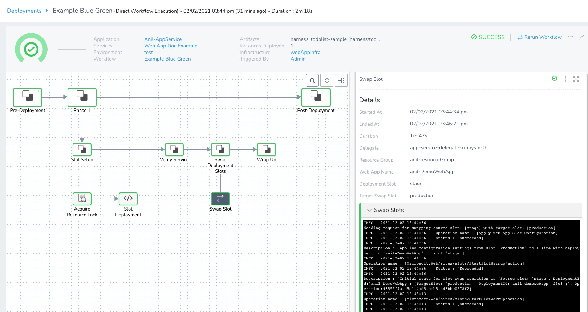
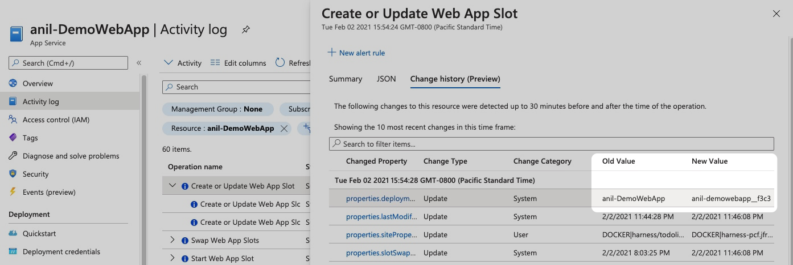

Currently, this feature is behind the Feature Flag `AZURE_WEBAPP`. Contact [Harness Support](https://mail.google.com/mail/?view=cm&fs=1&tf=1&to=support@harness.io) to enable the feature.A Harness Azure Web App Blue/Green deployment swaps traffic from one deployment slot to another.

If you are new to Azure Web App deployment slot swapping, see [What happens during a swap](https://docs.microsoft.com/en-us/azure/app-service/deploy-staging-slots#what-happens-during-a-swap) from Azure.

If you want to shift traffic incrementally as part of the deployment, see [Create an Azure Web App Canary Deployment](create-an-azure-web-app-canary-deployment.md).

### Before You Begin

Make sure you have read the following:

* [Azure Web App Deployments Overview](azure-web-app-deployments-overview.md)
* Make sure that you have connected Harness to your Azure subscription as described in [Connect to Azure and Artifact Repo for Your Web App Deployments](connect-to-azure-for-web-app-deployments.md).
* [Add Your Docker Image for Azure Web App Deployment](add-your-docker-image-for-azure-web-app-deployment.md)
* [Add Non-Containerized Artifacts for Azure Web App Deployment](add-a-non-containerized-artifacts-for-azure-web-app-deployment.md)
* [Define Your Azure Web App Infrastructure](define-your-azure-web-app-infrastructure.md)
* [Azure Web App Deployment Rollback](azure-web-app-deployment-rollback.md)

### Visual Summary

The following short video walks you through a Harness Azure Web App Blue/Green Workflow setup.

<!-- Video:
https://harness-1.wistia.com/medias/rpv5vwzpxz-->
<docvideo src="https://www.youtube.com/embed/7B5BhaDkjUo?feature=oembed" />


### Supported Platforms and Technologies

See [Supported Platforms and Technologies](https://docs.harness.io/article/220d0ojx5y-supported-platforms).

### Step 1: Collect Azure Web App Information

The Harness Workflow will use the existing Deployment slots from your Azure Web App.

In the Azure portal, click your Web App, and then click **Deployment slots**. You can see the Deployment slots for your Web App.

Click **Swap**. You can see the Source and Target slots.


You'll use these slot names in your Harness Workflow.

Don't click the **Swap** button. Click **Close**.

### Step 2: Create the Blue/Green Workflow

In your Harness Application, click **Workflows**, and then click **Add Workflow**.

Enter the following settings and click **Submit**.

* **Name:** the name for this Workflow.
* **Workflow Type:** select **Blue/Green Deployment**.
* **Environment:** select the Harness Environment you added in [Define Your Azure Web App Infrastructure](define-your-azure-web-app-infrastructure.md).
* **Service:** select the Service you set up in [Add Your Docker Image for Azure Web App Deployment](add-your-docker-image-for-azure-web-app-deployment.md) or [Add Non-Containerized Artifacts for Azure Web App Deployment](add-a-non-containerized-artifacts-for-azure-web-app-deployment.md).
* **Infrastructure Definition:** select the Infrastructure Definition you created in [Define Your Azure Web App Infrastructure](define-your-azure-web-app-infrastructure.md).

The new Workflow is created.

### Step 3: Slot Deployment Step

The Slot Deployment step is where you select the Web App and source and target deployment slots for the deployment.

Open the **Slot Deployment** step.

Enter the following settings and click **Submit**.

* **Name:** enter a name for the step.
* **App Service:** select the Azure Web App for deployment. Harness pulls the list of Web Apps using the credentials of the Azure Cloud Provider you selected in the Workflow's Infrastructure Definition.
* **Deployment Slot:** select the Source slot for the deployment. This slot is where Harness deploys the new Web App version.Make sure the slot you select is running. Harness shows all slots regardless of their status.
* **Target Slot:** select the Target slot for the deployment. This slot is where Harness will swap the App content and configurations elements during the **Swap Slot** step.Make sure the slot you select is running. Harness shows all slots regardless of their status.
* **Slot Steady State Timeout:** enter a minimum of **30m**. The slot deployment relies on Azure and can take time.

When you're done, the step will look like this:


### Option: Use Variable Expressions in Settings

You can use built-in Harness or custom Workflow variable expressions in the **Slot Deployment** step. See [Set Workflow Variables](https://docs.harness.io/article/766iheu1bk-add-workflow-variables-new-template).

Variables are often used for templating the Workflow. See [Create Pipeline Templates](https://docs.harness.io/article/60j7391eyy-templatize-pipelines).

### Option: Add a Health Check after Slot Deployment

In the Workflow **Verify Service** section, add a health check to ensure that the Docker container or non-containerized app is running correctly.

The Slot Deployment step is considered successful once the slot is in a running state.

A running state does not ensure that your new app is accessible. It can take some time for new content to become available on Azure.

Also, the slot deployment might succeed but the Docker container or non-containerized artifact could be corrupted.

A health check after Slot Deployment can ensure a successful deployment.

### Step 4: Swap Slot Step

The final step in the Workflow is Swap Slot. This step performs the Web App deployment slot swap. It's like doing a swap in the Azure portal or via the Azure CLI:


```
az webapp deployment slot swap -n "web app name" -g "resource group name" -s "source slot name" --target-slot "target slot"
```
Here's an example of the swap in the deployment logs:


```
Sending request for swapping source slot: [stage] with target slot: [production]  
Operation name : [Apply Web App Slot Configuration]  
Status : [Succeeded]  
Description : [Applied configuration settings from slot 'Production' to a site with deployment id 'anil-DemoWebApp' in slot 'stage']  
Operation name : [Microsoft.Web/sites/slots/StartSlotWarmup/action]  
Status : [Succeeded]  
Description : [Initial state for slot swap operation is (Source slot: 'stage', DeploymentId:'anil-DemoWebApp') (TargetSlot: 'production', DeploymentId:'anil-demowebapp__f3c3')'. Operation:93559f4a-d5c1-4ad5-beb5-a43bbc0578f2]  
Operation name : [Microsoft.Web/sites/slots/StartSlotWarmup/action]  
Status : [Succeeded]  
Description : [Initial state for slot swap operation is (Source slot: 'stage', DeploymentId:'anil-DemoWebApp') (TargetSlot: 'production', DeploymentId:'anil-demowebapp__f3c3')'. Operation:93559f4a-d5c1-4ad5-beb5-a43bbc0578f2]  
Operation name : [Microsoft.Web/sites/slots/StartSlotWarmup/action]  
Status : [Succeeded]  
Description : [Initial state for slot swap operation is (Source slot: 'stage', DeploymentId:'anil-DemoWebApp') (TargetSlot: 'production', DeploymentId:'anil-demowebapp__f3c3')'. Operation:93559f4a-d5c1-4ad5-beb5-a43bbc0578f2]  
Operation name : [Microsoft.Web/sites/slots/StartSlotWarmup/action]  
Status : [Succeeded]  
Description : [Initial state for slot swap operation is (Source slot: 'stage', DeploymentId:'anil-DemoWebApp') (TargetSlot: 'production', DeploymentId:'anil-demowebapp__f3c3')'. Operation:93559f4a-d5c1-4ad5-beb5-a43bbc0578f2]  
Operation name : [Microsoft.Web/sites/slots/EndSlotWarmup/action]  
Status : [Succeeded]  
Description : [Finished warming of site with deploymentId 'anil-DemoWebApp']  
Operation name : [Microsoft.Web/sites/slots/EndSlotWarmup/action]  
Status : [Succeeded]  
Description : [Finished warming of site with deploymentId 'anil-DemoWebApp']  
Operation name : [Microsoft.Web/sites/slots/EndSlotWarmup/action]  
Status : [Succeeded]  
Description : [Finished warming of site with deploymentId 'anil-DemoWebApp']  
Operation name : [Microsoft.Web/sites/slots/SlotSwap/action]  
Status : [Succeeded]  
Description : [Finished swapping site. New state is (Slot: 'stage', DeploymentId:'anil-demowebapp__f3c3'), (Slot: 'Production', DeploymentId:'anil-DemoWebApp')'. Operation:93559f4a-d5c1-4ad5-beb5-a43bbc0578f2]  
Swapping slots done successfully  
Operation - [Swap Slots] was success  
Swapping request returned successfully
```
The Workflow is complete. You can now deploy.

### Step 5: Deploy the Workflow

Click **Deploy**, select an artifact, and then click **Submit**.

The Workflow deploys:



You can see the swap succeeded in the logs:


```
...  
Description : [Finished swapping site. New state is (Slot: 'stage', DeploymentId:'anil-demowebapp__f3c3'), (Slot: 'Production', DeploymentId:'anil-DemoWebApp')'. Operation:93559f4a-d5c1-4ad5-beb5-a43bbc0578f2]  
...
```
And the same information is displayed in the Azure portal Activity log:



### Option: Templatize the Workflow

See [Create Pipeline Templates](https://docs.harness.io/article/60j7391eyy-templatize-pipelines).

### Configure As Code

To see how to configure the settings in this topic using YAML, configure the settings in the UI first, and then click the YAML editor button.

### See Also

* [Azure Web App Deployment Rollback](azure-web-app-deployment-rollback.md)

