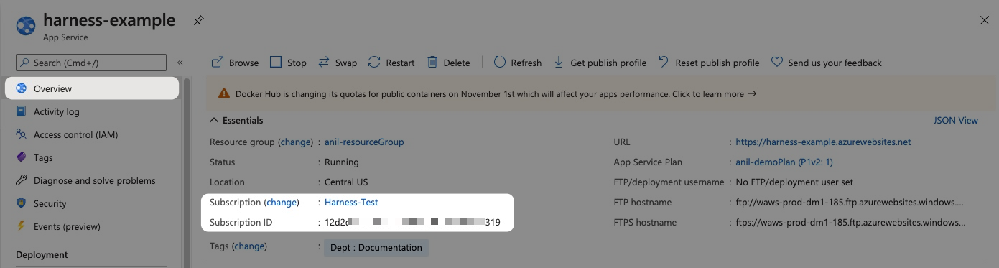

Currently, this feature is behind the Feature Flag `AZURE_WEBAPP`. Contact [Harness Support](https://mail.google.com/mail/?view=cm&fs=1&tf=1&to=support@harness.io) to enable the feature.The target Azure environment for your Harness Web App deployment is defined in a Harness Environment's Infrastructure Definition.

You simply select the Web App's Subscription and Resource Group.

You can also provision the infrastructure and Web App as part of your Workflow.

### Before You Begin

* [Azure Web App Deployments Overview](azure-web-app-deployments-overview.md)
* Make sure that you have connected Harness to your Azure subscription as described in [Connect to Azure and Artifact Repo for Your Web App Deployments](connect-to-azure-for-web-app-deployments.md).
* [Add Your Docker Image for Azure Web App Deployment](add-your-docker-image-for-azure-web-app-deployment.md)
* [Add Non-Containerized Artifacts for Azure Web App Deployment](add-a-non-containerized-artifacts-for-azure-web-app-deployment.md)

### Visual Summary

### Supported Platforms and Technologies

See [Supported Platforms and Technologies](https://docs.harness.io/article/220d0ojx5y-supported-platforms).

### Step 1: Create an Environment

In your Harness Application, click **Environments**.

Click **Add Environment**.

Enter a name and select an **Environment Type** for your Environment, and click **Submit**.

The Environment Type here doesn't relate to the production or non-production slots of your Web App.

A Harness Environment Type is simply a way to organize your work environments.

### Step 2: Create an Infrastructure Definition

In the new Environment, click **Add Infrastructure Definition**.

Enter the following settings:

#### Name

Provide a name for the Infrastructure Definition. You'll select this name when defining target infrastructures for Workflows and their Phases.

#### Cloud Provider Type

Select **Microsoft Azure**.

#### Deployment Type

Select **Azure Web Application**.

#### Cloud Provider

Select the Azure Cloud Provider you set up for your Azure Web App deployment. The Cloud Provider determines which subscriptions and resource groups appear in the other settings.

See [Connect to Azure and Artifact Repo for Your Web App Deployments](connect-to-azure-for-web-app-deployments.md).

#### Subscription

Select the Azure subscription used by your Web App.

The subscription is located in the Web App **Overview** section of the Azure portal.

#### Resource Group

Select the resource group used by your Web App.

The resource group is located in the Web App **Overview** section of the Azure portal.

Within the same resource group, you can't mix Windows and Linux apps in the same region. See [Limitations](https://docs.microsoft.com/en-us/azure/app-service/overview#limitations) from Azure.

### Option 1: Scope to Specific Services

The **Scope to specific Services** setting in the Infrastructure Definition enables you to scope this Infrastructure Definition to specific Harness Services.

See [Add an Infrastructure Definition](https://docs.harness.io/article/v3l3wqovbe-infrastructure-definitions).

### Option: Dynamically Provision Infrastructure

You can use Terraform scripts to provision the target Azure environment and Web App for your Harness Web App deployment.

See [Map an Azure Web App](../../terraform-category/mapgcp-kube-terraform-infra.md#option-7-map-an-azure-web-app).

### Next Steps

* [Create an Azure Web App Canary Deployment](create-an-azure-web-app-canary-deployment.md)
* [Create an Azure Web App Blue/Green Deployment](create-an-azure-web-app-blue-green-deployment.md)

### Configure As Code

To see how to configure the settings in this topic using YAML, configure the settings in the UI first, and then click the YAML editor button.

