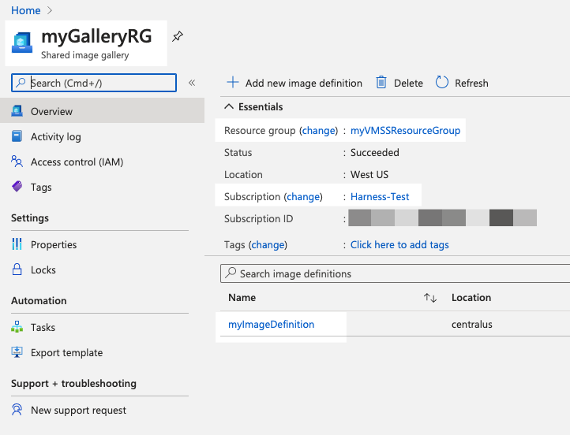

Currently, this feature is behind the Feature Flag `AZURE_VMSS`. Contact [Harness Support](https://mail.google.com/mail/?view=cm&fs=1&tf=1&to=support@harness.io) to enable the feature. During an Azure virtual machine scale set (VMSS) deployment, Harness creates a new VMSS using a VM image definition from your Shared Image Gallery.

In a Harness Service of the **Azure Virtual Machine Scale Set** deployment type, you select the image definition for Harness to use.

In this topic:

* [Before You Begin](#before_you_begin)
* [Visual Summary](#visual_summary)
* [Step 1: Title](#simple_slug)
* [Step 2: Title](#another_slug)
* [Limitations](#limitations)
* [Next Steps](#next_steps)

### Before You Begin

* [Azure Virtual Machine Scale Set Deployments Overview](azure-virtual-machine-scale-set-deployments.md)
* [Connect to Azure for VMSS Deployments](connect-to-your-azure-vmss.md)
* [Harness Delegate Overview](https://docs.harness.io/article/h9tkwmkrm7-delegate-installation)
* [Harness Key Concepts](https://docs.harness.io/article/4o7oqwih6h-harness-key-concepts)

Ensure you have connected Harness to your Azure subscription as described in [Connect to Azure for VMSS Deployments](connect-to-your-azure-vmss.md).

### Supported Platforms and Technologies

See [Supported Platforms and Technologies](https://docs.harness.io/article/220d0ojx5y-supported-platforms).

### Step 1: Ensure You Have an Image Definition

Azure image definitions are simple to create. For steps on setting one up for the first time, see [Create an Azure Shared Image Gallery using the portal](https://docs.microsoft.com/en-us/azure/virtual-machines/windows/shared-images-portal) or [Tutorial: Create a custom image of an Azure VM with the Azure CLI](https://docs.microsoft.com/en-us/azure/virtual-machines/linux/tutorial-custom-images) from Azure.

Open you Shared Image Gallery and note the following information:

* Subscription
* Resource group
* Image gallery name
* Image definition name

You can see this information in the Shared Image Gallery:

You can also see this information in the gallery **Properties**.

### Step 2: Create the Harness VMSS Service

1. In Harness, create or open an Application. See [Create an Application](https://docs.harness.io/article/bucothemly-application-configuration).
2. Select **Services**, and then click **Add Service**.
3. In the **Add Service** settings, name your Service.
4. In **Deployment Type**, select **Azure Virtual Machine Scale Set**.
5. Click **Submit**.

The new Service is created.

The Service only requires the image definition you want to use when creating your new VMSS.

### Step 3: Add the Image Definition Artifact Source

1. In the Harness Service, click **Add Artifact Source**.
2. In the Artifact Source settings, in **Cloud Provider**, select the Azure Cloud Provider you added in [Connect to Your Azure VMSS](connect-to-your-azure-vmss.md).
3. In **Subscription**, select the subscription used in your image definition.
4. In **Resource Group**, select resource group using in your image definition.
5. In **Image Gallery**, select the image gallery containing your image definition.
6. In **Image Definition**, select the image definition to use when creating your new MVSS.
7. Click **Submit**.

The image definition information is added.

At deployment runtime, Harness will use this image definition to create the VMs in the VMSS.

If Harness cannot obtain this information, verify that the Client ID used in the Azure Cloud Provider has permissions to read the image gallery.

If you delete an image it might still show up here until Harness cleans up deleted images. Harness cleans up deleted images every 2 hours.

### Next Steps

* [Define Your Azure VMSS Target Infrastructure](define-your-azure-vmss-target-infrastructure.md)

### See Also

See the following docs from Azure:

* [Troubleshooting shared image galleries in Azure](https://docs.microsoft.com/en-us/azure/virtual-machines/troubleshooting-shared-images)
* [Shared Image Gallery overview](https://docs.microsoft.com/en-us/azure/virtual-machines/windows/shared-image-galleries)
* [Azure virtual machine scale sets FAQs](https://docs.microsoft.com/en-us/azure/virtual-machine-scale-sets/virtual-machine-scale-sets-faq)

### Configure As Code

To see how to configure the settings in this topic using YAML, configure the settings in the UI first, and then click the **YAML** editor button.

