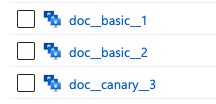
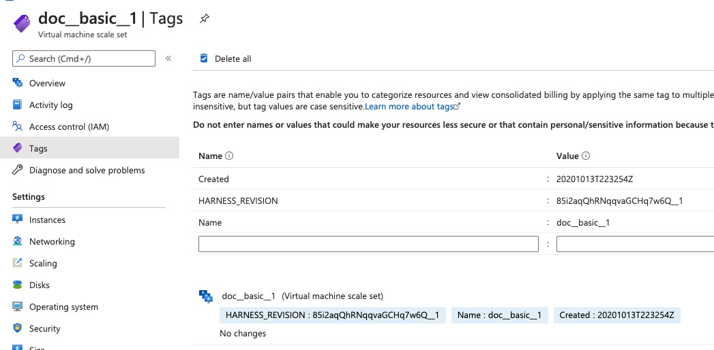

Currently, this feature is behind the Feature Flag `AZURE_VMSS`. Contact [Harness Support](https://mail.google.com/mail/?view=cm&fs=1&tf=1&to=support@harness.io) to enable the feature. In this topic, we cover how Harness names, tags, and versions the VMSS and instances you deploy.

In this topic:

* [Before You Begin](#before_you_begin)
* [VMSS and Instance Names](#vmss_and_instance_names)
* [Harness Revision Tags](#harness_revision_tags)

### Before You Begin

* [Create an Azure VMSS Basic Deployment](create-an-azure-vmss-basic-deployment.md)
* [Create an Azure VMSS Canary Deployment](create-an-azure-vmss-canary-deployment.md)
* [Create an Azure VMSS Blue/Green Deployment](create-an-azure-vmss-blue-green-deployment.md)
* [Azure Virtual Machine Scale Set Deployments Overview](azure-virtual-machine-scale-set-deployments.md)
* [Define Your Azure VMSS Target Infrastructure](define-your-azure-vmss-target-infrastructure.md)
* [Add Your Azure VM Image for Deployment](add-your-azure-vm-image-for-deployment.md)
* [Connect to Your Azure VMSS](connect-to-your-azure-vmss.md)
* [Harness Delegate Overview](https://docs.harness.io/article/h9tkwmkrm7-delegate-installation)
* [Harness Key Concepts](https://docs.harness.io/article/4o7oqwih6h-harness-key-concepts)

### VMSS and Instance Names

The VMSS and its new instances created by Harness are named using the VMSS name you entered in the **Azure Virtual Machine Scale Set Setup** Workflow step, and given an incremental suffix.

For example, if the VMSS is named `doc__basic`, the first instance is named `doc__basic__1`, and the second `doc__basic__2`.

Each subsequent deployment using the same Harness Infrastructure Definition will increment the suffix on the name of the deployed VMSS, regardless of the name of VMSS.

For example, here are three VMSS deployments:

The first two `doc__basic` deployments are Basic Workflows and the `doc__canary` VMSS is a Canary Workflow. The `doc__canary` VMSS has the suffix `__3` because it used the same Infrastructure Definition as the `doc__basic` Workflows.

### Harness Revision Tags

Harness adds three Azure tags to each VMSS it deploys. These tags are used for revision tracking.

Do not delete these tags.You can see the tags on the VMSS:

The tags are:

* `HARNESS_REVISION` — The unique revision number of the VMSS, with an incremental suffix.
* `Name` — The name of the VMSS, with an incremental suffix.
* `Created` — The timestamp of the VMSS creation.

With each deployment of a VMSS using the same Harness Infrastructure Definition, the suffixes of `HARNESS_REVISION` and `Name` tags are incremented:

