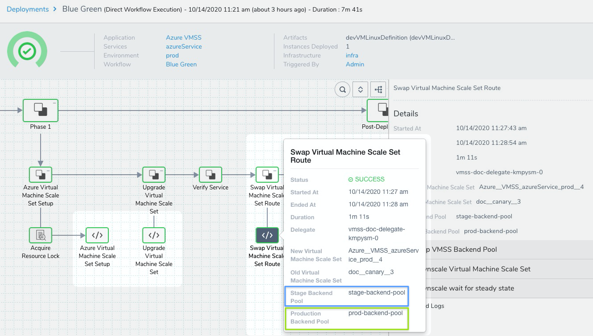
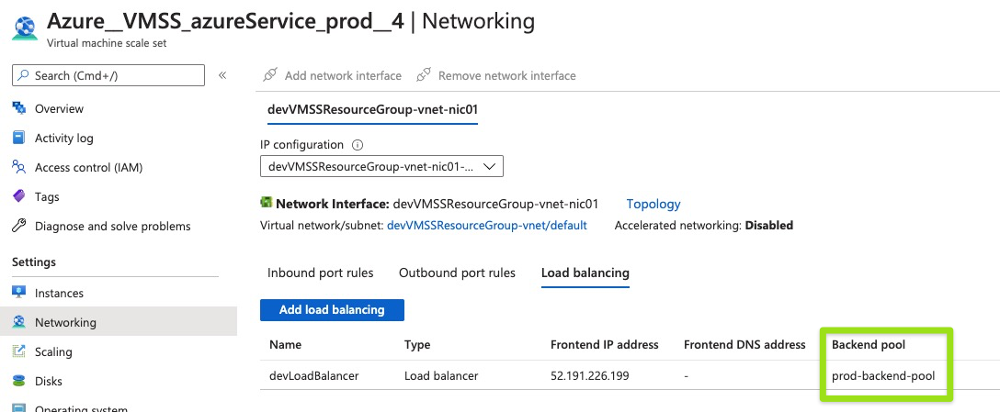
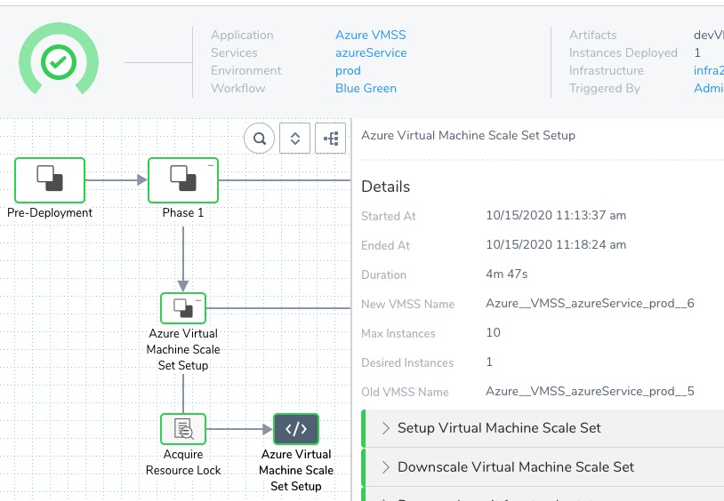
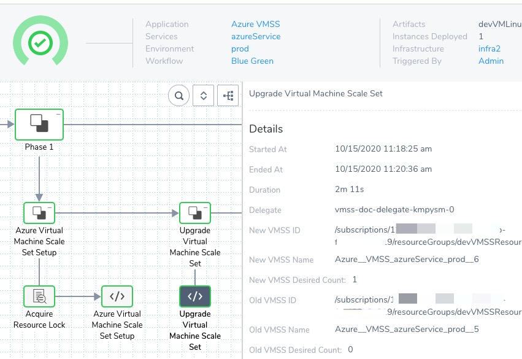
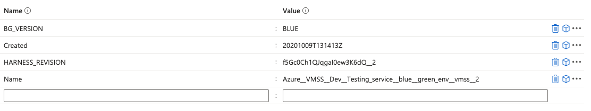

Currently, this feature is behind the Feature Flag `AZURE_VMSS`. Contact [Harness Support](https://mail.google.com/mail/?view=cm&fs=1&tf=1&to=support@harness.io) to enable the feature. A [Blue/Green](../../concepts-cd/deployment-types/deployment-concepts-and-strategies.md) virtual machine scale set (VMSS) deployment uses a load balancer with two backend pools: one production pool and one stage pool. You identify the pools during Workflow setup.

When you deploy the Blue/Green Workflow, it sets up a new VMSS using the image you supplied in [Add Your Azure VM Image for Deployment](add-your-azure-vm-image-for-deployment.md) and the base VMSS template you selected in [Define Your Azure VMSS Target Infrastructure](define-your-azure-vmss-target-infrastructure.md).

At first, the Workflow uses the stage pool. Once the deployment using the stage pool is successful, the Workflow detaches the stage pool and attaches (swaps) the production pool to the new VMSS.

For other deployment strategies, see [Create an Azure VMSS Basic Deployment](create-an-azure-vmss-basic-deployment.md), and [Create an Azure VMSS Canary Deployment](create-an-azure-vmss-canary-deployment.md).

### Before You Begin

* [Azure Virtual Machine Scale Set Deployments Overview](azure-virtual-machine-scale-set-deployments.md)
* [Define Your Azure VMSS Target Infrastructure](define-your-azure-vmss-target-infrastructure.md)
* [Add Your Azure VM Image for Deployment](add-your-azure-vm-image-for-deployment.md)
* [Connect to Azure for VMSS Deployments](connect-to-your-azure-vmss.md)
* [Harness Delegate Overview](https://docs.harness.io/article/h9tkwmkrm7-delegate-installation)
* [Harness Key Concepts](https://docs.harness.io/article/4o7oqwih6h-harness-key-concepts)

### Visual Summary

Here is the Azure load balancer with two pools set up:


Here is a successful Blue/Green VMSS deployment, showing the swap from the stage to prod pool:



Here is the final, deployed VMSS with its prod pool:



### Supported Platforms and Technologies

See [Supported Platforms and Technologies](https://docs.harness.io/article/220d0ojx5y-supported-platforms).

### Review: Load Balancer Requirements

A Harness Blue/Green VMSS deployment requires an Azure load balancer with two backend pools.


The load balancer distributes inbound flows that arrive at the load balancer's front end to the stage and production backend pool instances.

The backend pool instances are instances in the virtual machine scale set Harness creates in the deployment.

See [What is Azure Load Balancer?](https://docs.microsoft.com/en-us/azure/load-balancer/load-balancer-overview) from Azure.

### Step 1: Create the Blue/Green Workflow

In your Harness Application, click **Workflows**, and then click **Add Workflow**.

Enter the new Workflow's settings.

#### Name

Enter a name for the Workflow. You will use this name to locate the Workflow in Deployments and to add it to [Pipelines](https://docs.harness.io/article/zc1u96u6uj-pipeline-configuration).

#### Workflow Type

Select **Blue/Green**. See [Deployment Concepts and Strategies](../../concepts-cd/deployment-types/deployment-concepts-and-strategies.md).

For other deployment strategies, see [Create an Azure VMSS Basic Deployment](create-an-azure-vmss-basic-deployment.md), and [Create an Azure VMSS Canary Deployment](create-an-azure-vmss-canary-deployment.md).

#### Environment

Select the Environment you created in [Define Your Azure VMSS Target Infrastructure](define-your-azure-vmss-target-infrastructure.md).

#### Service

Select the Service you created in [Add Your Azure VM Image for Deployment](add-your-azure-vm-image-for-deployment.md).

#### Infrastructure Definition

Select the Infrastructure Definition you created in [Define Your Azure VMSS Target Infrastructure](define-your-azure-vmss-target-infrastructure.md).

#### Submit

When you are done, click **Submit**.

The steps for the Blue/Green Workflow VMSS deployment are generated automatically.

Next, we'll take a look at each step's settings and how you can change them.

### Step 2: Azure Virtual Machine Scale Set Setup

The Azure Virtual Machine Scale Set Setup step is where you specify the default settings for the new VMSS, the load balancer, and the stage and production backend pools.

You will define the new VMSS by specifying the min, max, and desired number of instances for the new VMSS.

These correspond to the **Instance limits** settings in **Auto created scale condition** in VMSS:


Later, in the **Upgrade Virtual Machine Scale Set** step, you will upgrade the number of instances by a percentage or count of the desired instances.

#### Name

Enter a name for the Workflow step.

#### Virtual Machine Scale Set Name

Enter a name for the new VMSS. This is the name that will appear in the **Virtual machine scale sets** blade in Azure.

Hyphens in the names are converted to double underscores in Azure. For example, if you enter `doc-basic` the name in Azure will be `doc__basic`.The first time you deploy, the name of the new VMSS is given the suffix `__1`. Each time you deploy a new VMSS using the same Harness Infrastructure Definition, the suffix is incremented, such as `__2`.

You can use the default name, which is a concatenation of the names of your Application, Service, and Environment: `${app.name}_${service.name}_${env.name}`.

For information on naming and versioning, see [Azure VMSS Versioning and Naming](azure-vmss-versioning-and-naming.md).

#### Instances

Select **Fixed** or **Same as already running Default Instances**.

For **Same as already running Default instances**, Harness determines if there is a previous VMSS deployment for the same Infrastructure Definition. If one is present, Harness takes the number of instances from there. If there is no previous deployment, Harness uses the default of 6.

If there is more than one scaling policy attached to the already running, previously deployed VMSS, Harness uses the policy named **Auto created scale condition** or **Profile1**.

**Fixed** allows you to set the min, max, and desired number of instances for the new VMSS.

#### Maximum Instances

Specify maximum instance count.

#### Minimum Instances

Specify minimum instance count.

#### Desired Instances

Specify the desired instance count. This is the same as default instance count in VMSS:


> In case there is a problem reading the resource metrics and the current capacity is below the default capacity, then to ensure the availability of the resource, Autoscale will scale out to the default.


> If the current capacity is already higher than the default capacity, Autoscale will not scale in.

#### Resize Strategy

Select whether you want Harness to resize the new VMSS instances first, or after it has downsized the old instances.

#### Auto Scaling Steady State Timeout

Enter how long you want Harness to wait for this step to finish. If the step's execution exceeds this timeout, Harness fails the deployment.

#### Azure Load Balancer

Select the Azure Load Balancer to use for your new VMSS. Ensure that this Azure Load Balancer has two backend pools.

Harness quires Azure for the list of Azure Load Balancers using the Harness Azure Cloud Provider you selected in the Infrastructure Definition for this Workflow.

#### Production Backend Pool

Select the backend pool to use for live, production traffic.

#### Stage Backend Pool

Select the backend pool to use for stage traffic.

### Option: Use Variable Expressions in Settings

You can use [Harness variable expressions](https://docs.harness.io/article/9dvxcegm90-variables), such as [Workflow variables](https://docs.harness.io/article/766iheu1bk-add-workflow-variables-new-template), in certain step settings.

When you deploy the Workflow, alone, in a Pipeline, or by a [Trigger](https://docs.harness.io/article/xerirloz9a-add-a-trigger-2), you will be prompted to provide values for the variables.

To see if a Workflow variable can be used in a setting, enter `$` or `${workflow.variables` and see the available expressions.

### Step 3: Upgrade Virtual Machine Scale Set

Use the Upgrade Virtual Machine Scale Set step to set the desired instances for the new VMSS.

The number of instances will be used for both stage and production traffic.

You can select a percentage or count.

This is the same as the **Scale mode** settings in **Auto created scale condition** in VMSS:


#### Name

Enter a name for the Workflow step.

#### Desired Instances

Set the number of instances that the VMSS will attempt to deploy and maintain.

* If you select **Count**, enter the actual number of instances.
* If you select **Percent**, enter a percentage of the available capacity.

Your setting cannot exceed your **Maximum Instances** setting in the Workflow's preceding **Azure Virtual Machine Scale Set Setup** step.

This setting corresponds to the **Maximum** setting in **Instance limits** in VMSS.

You can use [Harness variable expressions](https://docs.harness.io/article/9dvxcegm90-variables), such as [Workflow variables](https://docs.harness.io/article/766iheu1bk-add-workflow-variables-new-template), in this setting.

### Step 4: Swap Virtual Machine Scale Set Route

The Swap Virtual Machine Scale Set Route detaches the stage backend pool from the new VMSS, and then attached the production backend pool to it.

Select **Downsize Old VMSS** is you want Harness to downscale the previously deployed VMSS to 0.

If you still want to maintain the previous VMSS and its instances, do not select this option.

### Step 5: Deploy

Now that the Canary Workflow is complete, you can deploy it to Azure.

1. When you have set up your Workflow, click **Deploy**.
2. In **Artifacts**, select the image you supplied in [Add Your Azure VM Image for Deployment](add-your-azure-vm-image-for-deployment.md).
3. Click **Submit**.

#### Azure Virtual Machine Scale Set Setup

In **Azure Virtual Machine Scale Set Setup**, you can see Harness set up the new VMSS.



#### Upgrade Virtual Machine Scale Set

In **Upgrade Virtual Machine Scale Set**, you can see the new VMSS upscaled to its desired instances.



#### Swap Virtual Machine Scale Set Route

In **Swap Virtual Machine Scale Set Route**, you can see Harness detach the stage pool from the new VMSS and attached the production pool to it.


You can see the swap in the logs:


```
...  
Sending request to attach virtual machine scale set:[doc__blue__green__2] to prod backend pool:[prod-backend-pool]  
Updating virtual machine instance: [doc__blue__green__2_0] for the scale set: [doc__blue__green__2]  
All virtual machine instances updated for the scale set: [doc__blue__green__2]  
Tagging VMSS: [doc__blue__green__2] as [BLUE] deployment  
Tagged successfully VMSS: [doc__blue__green__2]  
Sending request to detach virtual machine scale set:[doc__blue__green__1] from prod backend pool:[prod-backend-pool]  
Updating virtual machine instance: [doc__blue__green__1_1] for the scale set: [doc__blue__green__1]  
All virtual machine instances updated for the scale set: [doc__blue__green__1]  
...
```
Congratulations. Your deployment was successful.

### Review: Blue/Green VMSS Tags

Azure tags are used for versioning by Harness, as described in [Azure VMSS Versioning and Naming](azure-vmss-versioning-and-naming.md).

For Blue/Green deployments, the an additional tag named is `BG_VERSION` added.



The value for the tag is either BLUE or GREEN. The value alternates with each deployment.

In the following example, the new deployment of `doc__blue__green` (`doc__blue__green__2`) is tagged with `BLUE` and the previous version `doc__blue__green__1` is tagged with `GREEN`.


```
Starting Swap Backend pool step during blue green deployment  
Sending request to detach virtual machine scale set:[doc__blue__green__2] from stage backend pool:[stage-backend-pool]  
Updating virtual machine instance: [doc__blue__green__2_0] for the scale set: [doc__blue__green__2]  
All virtual machine instances updated for the scale set: [doc__blue__green__2]  
Sending request to attach virtual machine scale set:[doc__blue__green__2] to prod backend pool:[prod-backend-pool]  
Updating virtual machine instance: [doc__blue__green__2_0] for the scale set: [doc__blue__green__2]  
All virtual machine instances updated for the scale set: [doc__blue__green__2]  
Tagging VMSS: [doc__blue__green__2] as [BLUE] deployment  
Tagged successfully VMSS: [doc__blue__green__2]  
Sending request to detach virtual machine scale set:[doc__blue__green__1] from prod backend pool:[prod-backend-pool]  
Updating virtual machine instance: [doc__blue__green__1_1] for the scale set: [doc__blue__green__1]  
All virtual machine instances updated for the scale set: [doc__blue__green__1]  
Tagging VMSS: [doc__blue__green__1] as [GREEN] deployment  
Tagged successfully VMSS: [doc__blue__green__1]  
Swap backend pool completed successfully
```
### Configure As Code

To see how to configure the settings in this topic using YAML, configure the settings in the UI first, and then click the **YAML** editor button.

