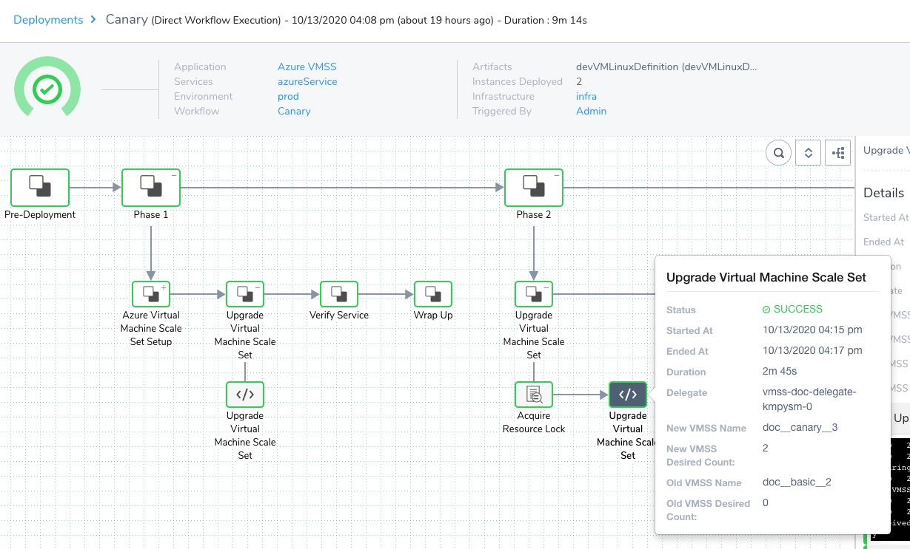

Currently, this feature is behind the Feature Flag `AZURE_VMSS`. Contact [Harness Support](https://mail.google.com/mail/?view=cm&fs=1&tf=1&to=support@harness.io) to enable the feature. A Canary virtual machine scale set (VMSS) deployment sets up a new VMSS using the image you supplied in [Add Your Azure VM Image for Deployment](add-your-azure-vm-image-for-deployment.md) and the base VMSS template you selected in [Define Your Azure VMSS Target Infrastructure](define-your-azure-vmss-target-infrastructure.md).

The Canary Workflow deploys in two phases. The first phase creates the new VMSS and deploys a number/percentage of the desired instances. Once deployment is successful, the second phase deploys 100% of the desired instances.

For other deployment strategies, see [Create an Azure VMSS Basic Deployment](create-an-azure-vmss-basic-deployment.md), and [Create an Azure VMSS Blue/Green Deployment](create-an-azure-vmss-blue-green-deployment.md).

### Before You Begin

* [Azure Virtual Machine Scale Set Deployments Overview](azure-virtual-machine-scale-set-deployments.md)
* [Define Your Azure VMSS Target Infrastructure](define-your-azure-vmss-target-infrastructure.md)
* [Add Your Azure VM Image for Deployment](add-your-azure-vm-image-for-deployment.md)
* [Connect to Azure for VMSS Deployments](connect-to-your-azure-vmss.md)
* [Harness Delegate Overview](https://docs.harness.io/article/h9tkwmkrm7-delegate-installation)
* [Harness Key Concepts](https://docs.harness.io/article/4o7oqwih6h-harness-key-concepts)

### Visual Summary

Here is a successful Canary VMSS deployment, showing both phases:



### Supported Platforms and Technologies

See [Supported Platforms and Technologies](https://docs.harness.io/article/220d0ojx5y-supported-platforms).

### Step 1: Create the Canary Workflow

In your Harness Application, click **Workflows**, and then click **Add Workflow**.

Enter the new Workflow's settings.

#### Name

Enter a name for the Workflow. You will use this name to locate the Workflow in Deployments and to add it to [Pipelines](https://docs.harness.io/article/zc1u96u6uj-pipeline-configuration).

#### Workflow Type

Select **Canary**. See [Deployment Concepts and Strategies](../../concepts-cd/deployment-types/deployment-concepts-and-strategies.md).

For other deployment strategies, see [Create an Azure VMSS Basic Deployment](create-an-azure-vmss-basic-deployment.md), and [Create an Azure VMSS Blue/Green Deployment](create-an-azure-vmss-blue-green-deployment.md).

#### Environment

Select the Environment you created in [Define Your Azure VMSS Target Infrastructure](define-your-azure-vmss-target-infrastructure.md).

Later, you will select the Harness Service and target Infrastructure Definition in each phase of the Workflow.

#### Submit

When you are done, click **Submit**.

When you add phases to the Canary Workflow, the deployment steps in the phases are generated automatically.

Next, we'll take a look at each step's settings and how you can change them.

### Step 2: Create Phase 1

The first phase of the Workflow will set up the new VMSS and scale it to a count/percentage of your desired instances.

1. In **Deployment Phases**, click **Add Phase**.
2. In Workflow Phase, in **Service**, select the Service you created in [Add Your Azure VM Image for Deployment](add-your-azure-vm-image-for-deployment.md).
3. In **Infrastructure Definition**, select the Infrastructure Definition you created in [Define Your Azure VMSS Target Infrastructure](define-your-azure-vmss-target-infrastructure.md).
4. Click **Submit**.

The new phase's VMSS steps are added automatically.

### Step 3: Azure Virtual Machine Scale Set Setup

The Azure Virtual Machine Scale Set Setup step is where you specify the default settings for the new VMSS.

In particular, you specify the min, max, and desired number of instances for the new VMSS.

These correspond to the **Instance limits** settings in **Auto created scale condition** in VMSS:


Later, in the **Upgrade Virtual Machine Scale Set** step, you will upgrade the number of instances by a percentage or count of the desired instances.

#### Name

Enter a name for the Workflow step.

#### Virtual Machine Scale Set Name

Enter a name for the new VMSS. This is the name that will appear in the **Virtual machine scale sets** blade in Azure.

Hyphens in the names are converted to double underscores in Azure. For example, if you enter `doc-basic` the name in Azure will be `doc__basic`.The first time you deploy, the name of the new VMSS is given the suffix `__1`. Each time you deploy a new VMSS using the same Harness Infrastructure Definition, the suffix is incremented, such as `__2`.

You can use the default name, which is a concatenation of the names of your Application, Service, and Environment: `${app.name}_${service.name}_${env.name}`.

For information on naming and versioning, see [Azure VMSS Versioning and Naming](azure-vmss-versioning-and-naming.md).

#### Instances

Select **Fixed** or **Same as already running Default Instances**.

For **Same as already running Default instances**, Harness determines if there is a previous VMSS deployment for the same Infrastructure Definition. If one is present, Harness takes the number of instances from there. If there is no previous deployment, Harness uses the default of 6.

If there is more than one scaling policy attached to the already running, previously deployed VMSS, Harness uses the policy named **Auto created scale condition** or **Profile1**.

**Fixed** allows you to set the min, max, and desired number of instances for the new VMSS.

#### Maximum Instances

Specify maximum instance count.

#### Minimum Instances

Specify minimum instance count.

#### Desired Instances

Specify the desired instance count. This is the same as default instance count in VMSS:


> In case there is a problem reading the resource metrics and the current capacity is below the default capacity, then to ensure the availability of the resource, Autoscale will scale out to the default.


> If the current capacity is already higher than the default capacity, Autoscale will not scale in.

#### Resize Strategy

Select whether you want Harness to resize the new VMSS instances first, or after it has downsized the old instances.

#### Auto Scaling Steady State Timeout

Enter how long you want Harness to wait for this step to finish. If the step's execution exceeds this timeout, Harness fails the deployment.

### Option: Use Variable Expressions in Settings

You can use [Harness variable expressions](https://docs.harness.io/article/9dvxcegm90-variables), such as [Workflow variables](https://docs.harness.io/article/766iheu1bk-add-workflow-variables-new-template), in certain step settings.

When you deploy the Workflow, alone, in a Pipeline, or using a [Trigger](https://docs.harness.io/article/xerirloz9a-add-a-trigger-2), you will be prompted to provide values for the variables.

To see if a Workflow variable can be used in a setting, enter `$` or `${workflow.variables` and see the available expressions.

### Step 4: Upgrade Virtual Machine Scale Set

Use the Upgrade Virtual Machine Scale Set step to set the desired instances for the new VMSS in **phase 1**.

For a Canary deployment phase 1, this is a subset of the available capacity.

You can select a percentage or count.

This is the same as the **Scale mode** settings in **Auto created scale condition** in VMSS:


#### Name

Enter a name for the Workflow step.

#### Desired Instances

Set the number of instances that the VMSS will attempt to deploy and maintain for **phase 1** of the Canary deployment. Typically, this is half or fewer of the available capacity.

* If you select **Count**, enter the actual number of instances.
* If you select **Percent**, enter a percentage of the available capacity.

Your setting cannot exceed your **Maximum Instances** setting in the Workflow's preceding **Azure Virtual Machine Scale Set Setup** step.

This setting corresponds to the **Maximum** setting in **Instance limits** in VMSS.

You can use [Harness variable expressions](https://docs.harness.io/article/9dvxcegm90-variables), such as [Workflow variables](https://docs.harness.io/article/766iheu1bk-add-workflow-variables-new-template), in this setting.

### Step 5: Create Phase 2

Phase 2 of the Canary Workflow runs after phase 1 is successful. Phase 2 will upgrade the VMSS to the available capacity.

1. In **Deployment Phases**, under **Phase 1**, click **Add Phase**.
2. In Workflow Phase, in **Service**, select the Service you created in [Add Your Azure VM Image for Deployment](add-your-azure-vm-image-for-deployment.md).
3. In **Infrastructure Definition**, select the Infrastructure Definition you created in [Define Your Azure VMSS Target Infrastructure](define-your-azure-vmss-target-infrastructure.md).
4. Click **Submit**.

The Upgrade Virtual Machine Scale Set step is added to the phase automatically.

### Step 6: Upgrade Virtual Machine Scale Set

The settings for the Upgrade Virtual Machine Scale Set step are the same as phase 1.

In phase 2, you increase the **Desired Instances** percentage/count to the full capacity: 100% or total count.

That's all you have to do.

### Step 7: Deploy

Now that the Canary Workflow is complete, you can deploy it to Azure.

1. When you have set up your Workflow, click **Deploy**.
2. In **Artifacts**, select the image you supplied in [Add Your Azure VM Image for Deployment](add-your-azure-vm-image-for-deployment.md).
3. Click **Submit**.

#### Phase 1: Azure Virtual Machine Scale Set Setup

In **Azure Virtual Machine Scale Set Setup**, you can see Harness set up the new VMSS.

#### Phase 1: Upgrade Virtual Machine Scale Set

In **Upgrade Virtual Machine Scale Set**, you can see the new VMSS upscaled to its desired instances.

#### Phase 2: Upgrade Virtual Machine Scale Set

In phase 2's **Upgrade Virtual Machine Scale Set** step, you can see the new VMSS upscaled to its full capacity.


```
Checking the status of VMSS: [doc__canary__3] VM instances  
Virtual machine instance: [doc__canary__3_1] provisioning state: [Provisioning succeeded]  
Virtual machine instance: [doc__canary__3_1] provisioning state: [Provisioning succeeded]  
Virtual machine instance: [doc__canary__3_2] provisioning state: [Creating]  
Virtual machine instance: [doc__canary__3_3] provisioning state: [Creating]  
...  
All the VM instances of VMSS: [doc__canary__3] are provisioned successfully  
Attaching scaling policy to VMSS: [doc__canary__3] as number of Virtual Machine instances has reached to desired capacity
```
Congratulations. Your deployment was successful.

For information on naming and versioning, see [Azure VMSS Versioning and Naming](azure-vmss-versioning-and-naming.md).

### Option: Templatize the Workflow

You can parameterize the Workflow's settings to turn it into a template. When it is deployed, values are provided for the parameters.

See [Templatize a Workflow](https://docs.harness.io/article/bov41f5b7o-templatize-a-workflow-new-template).

### Configure As Code

To see how to configure the settings in this topic using YAML, configure the settings in the UI first, and then click the **YAML** editor button.

