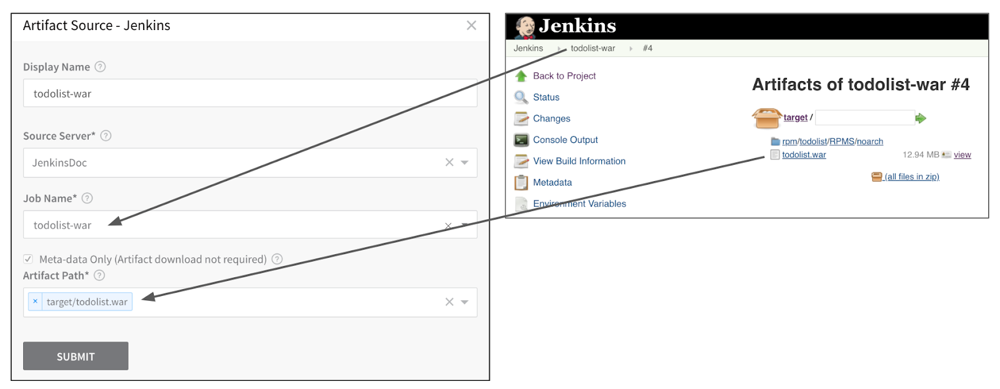
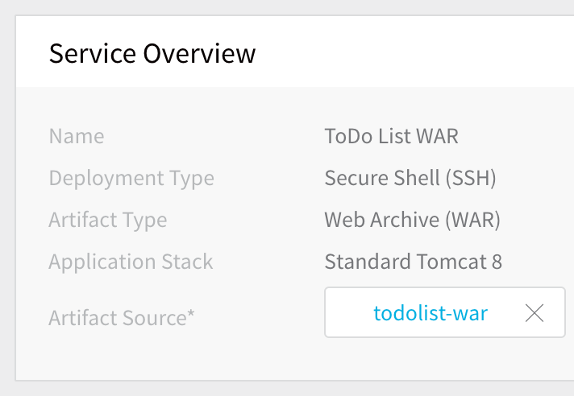
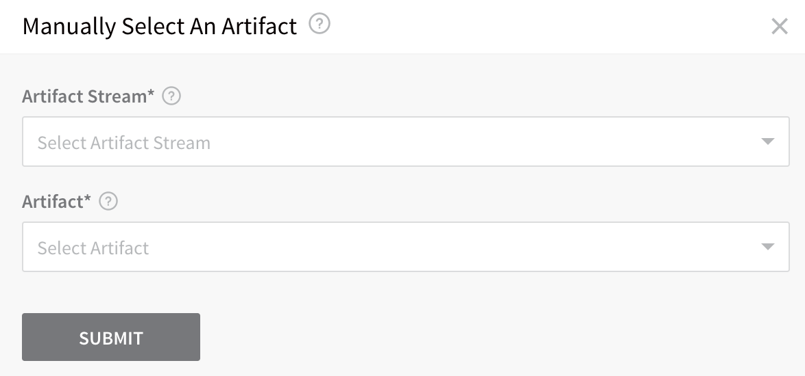
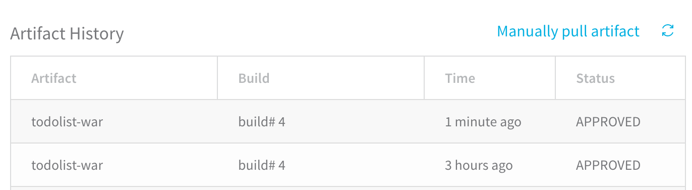

The first step in Artifact Build and Deploy pipeline is to create a Harness Service. Harness Service connects to the Artifact Server you added in [Harness Account Setup](1-harness-accountsetup.md) and identifies the artifact to deploy. The Service also contains the scripts used to install and run the build on the target nodes.

This Service is used by the **Artifact Collection** command in [Create the Deploy Workflow for Build and Deploy Pipelines](5-deploy-workflow.md), the Environment's [target infrastructure](4-environment.md), and in the set up of the [Deploy Workflow](5-deploy-workflow.md).

In this document, Shell Script Service and a Jenkins job artifact is used as an example but Harness supports all the common [artifact source](https://docs.harness.io/article/7dghbx1dbl-configuring-artifact-server) and [custom sources](https://docs.harness.io/article/jizsp5tsms-custom-artifact-source).

### Before You Begin

* [CI/CD with the Build Workflow](../concepts-cd/deployment-types/ci-cd-with-the-build-workflow.md)

### Step 1: Create a Service

Harness Services represent your microservices/apps. You define where the artifacts for those microservices/apps come from, the container specs, configuration variables, and files for those microservices.

To create the Service, perform the following steps:

1. In your Harness Application, click **Services**. To create a Harness Application, see [Application Components](https://docs.harness.io/article/bucothemly-application-configuration).
2. Click **Add Service**. The **Add Services** settings appear.
3. In **Name**, enter a name for your Service. In this example, **ToDo List WAR** is used because ToDo List app is built and packaged it in a WAR file.
4. In **Deployment Type**, select **Secure Shell (SSH)**.
5. In **Artifact Type**, select **Web Archive (WAR)**.
6. In **Application Stack**, select **Standard Tomcat 8**.
7. Click **Submit**.

The new Service is created. There are several installations and start scripts added by default. When your application is deployed, these scripts run on the target host(s).

For more information about the default scripts in a Secure Shell (SSH) Service, see [Traditional Deployments Overview](../traditional-deployments/traditional-deployments-overview.md).Next, Artifact Source is added.

### Step 2: Add an Artifact Source

The Artifact Source defines where the Artifact Collection step looks for the built artifact during the Build Workflow. Also, the Service is used in the Deploy Workflow to install the artifact on the target host(s).

To add an Artifact Source, perform the following steps:

1. In your Service, click **Add Artifact Source**, and select **Jenkins**. The **Jenkins** settings appear.
2. In **Source Server**, select the Jenkins Artifact Server you set up in [Harness Account Setup](1-harness-accountsetup.md). Once you select the Source Server, the **Job Name** field loads all of the Jenkins jobs from the Source Server.
3. In **Job Name**, select the job you want to run to build your artifact. Harness also supports [Jenkins Multibranch Pipelines](https://docs.harness.io/article/5fzq9w0pq7-using-the-jenkins-command#multibranch_pipeline_support).
4. Select the **Meta-data Only** setting. Typically, metadata is sufficient as it contains enough information for the target host(s) to obtain the artifact. Harness stores the metadata and, during runtime, the Harness Delegate passes the metadata to the target host(s) where it is used to obtain the artifact(s) from the source repo. Ensure that the target host has network connectivity to the Artifact Server.
5. In **Artifact Path**, select the path and name of the artifact. In this example, **target/todolist.war** is used.  
  
When you are done, the **Jenkins Artifact Source** will look something like this:
6. Click **Submit**.  
  
The Artifact Source is added to the Service.

#### Step: View Artifact History

Next, let's see the artifact history that Harness can pull from Jenkins.

1. Click **Artifact History**.
2. Click **Manually pull artifact**. The **Manually Select An Artifact** dialog appears.
3. In **Artifact Stream**, select the artifact source you just added.
4. In **Artifact**, select the build for which you want to view history.
5. Click **Submit**.
6. Click **Artifact History** again. The history for the build you specified is displayed.

 For more information on Service settings, see [Services](https://docs.harness.io/article/eb3kfl8uls-service-configuration).

Now, that the Service is complete, we can create the Build Workflow to build the next version of the artifact.

### Use the Same Artifact Build/Tag Across Multiple Workflows in a Pipeline

When using a Build Workflow followed by multiple Workflows in a Pipeline, you can now pass the same artifact from the first Build Workflow to rest of the Workflows in the Pipeline that deploy the same Harness Service.

Execution of each Workflow will use the artifact collected by the last run Build Workflow in the Pipeline that has collected the artifact from the same Service.

In the first Build Workflow's **Artifact Collection** step's **Build/Tag** setting (described in [Create the Deploy Workflow for Build and Deploy Pipelines](5-deploy-workflow.md)), you specify the artifact to collect. For subsequent **Artifact Collection** steps in the same and subsequent Workflows in the Pipeline deploying the same Service, you can leave the **Artifact Collection** step's **Build/Tag** setting empty and Harness will use the artifact collected by the last Build Workflow in the Pipeline.

This functionality requires the Feature Flag `SORT_ARTIFACTS_IN_UPDATED_ORDER`.

### Next Step

* [Create the Build Workflow for Build and Deploy Pipelines](3-build-workflow.md)

