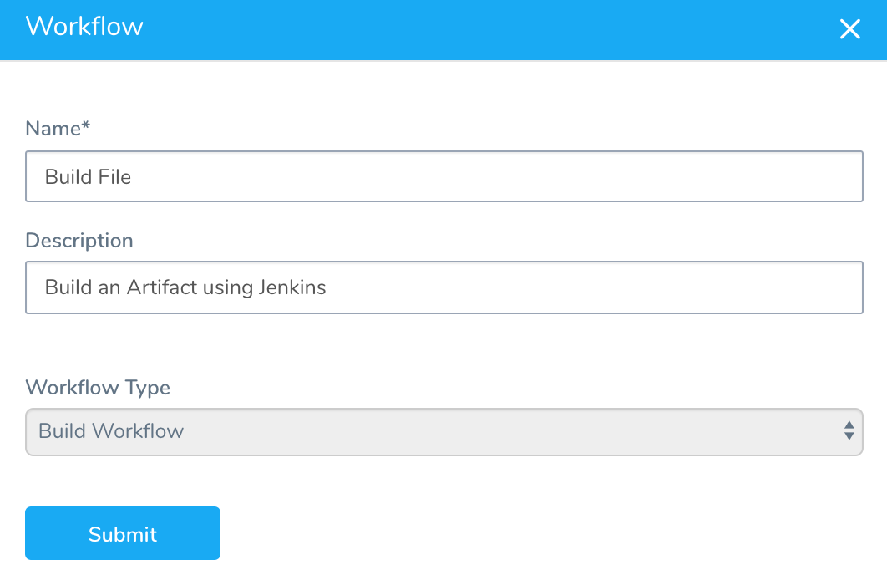
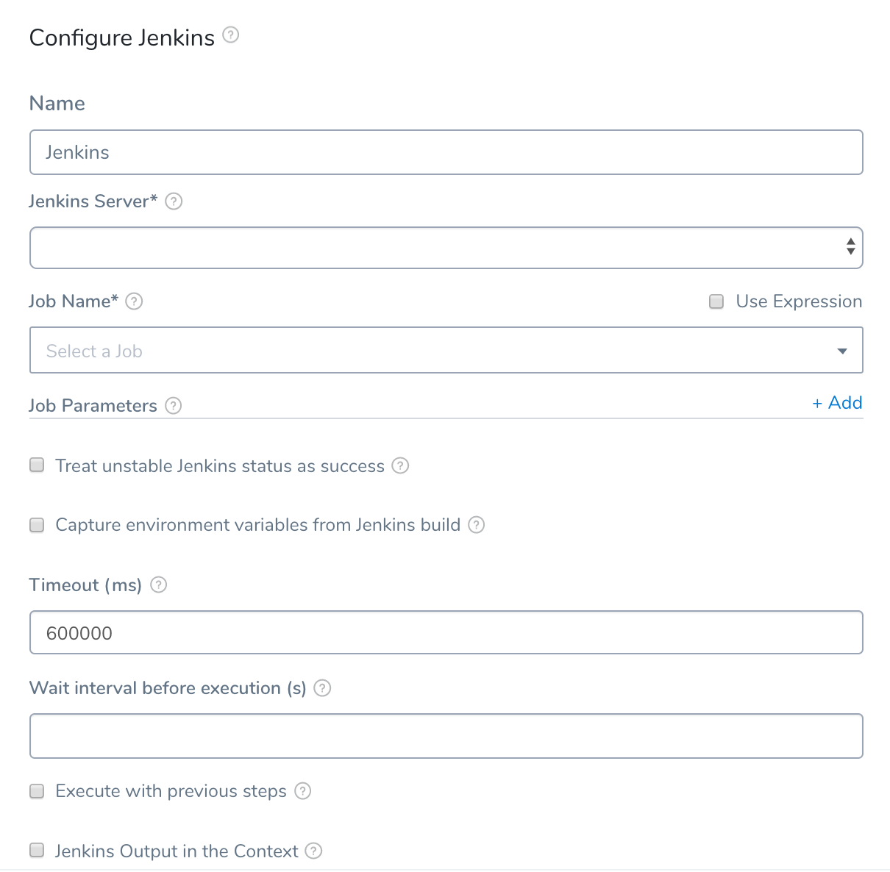
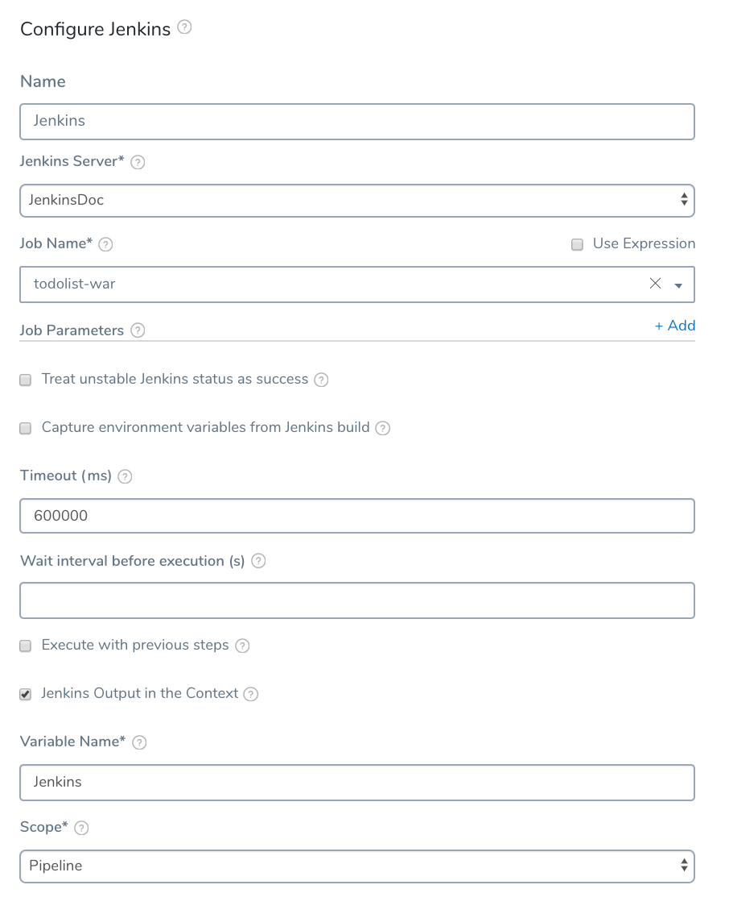
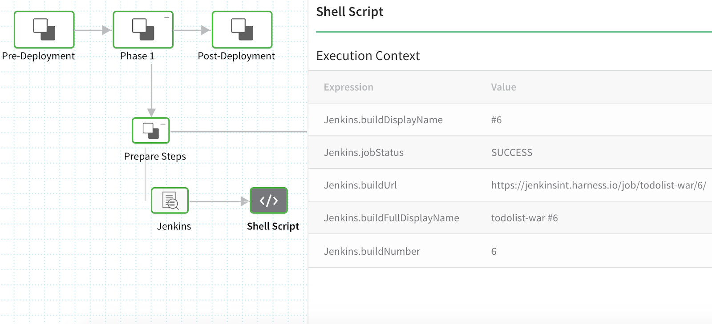
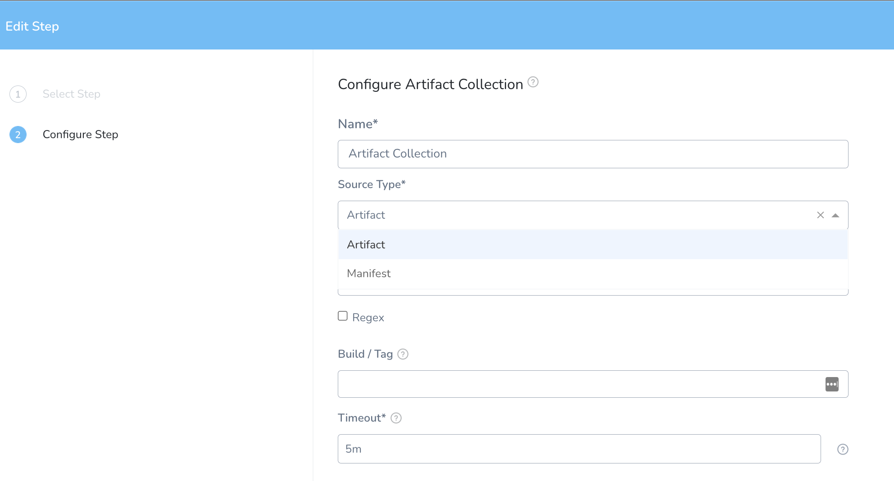
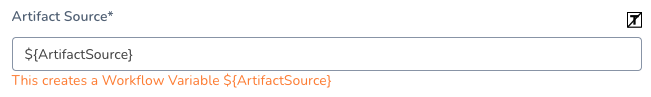
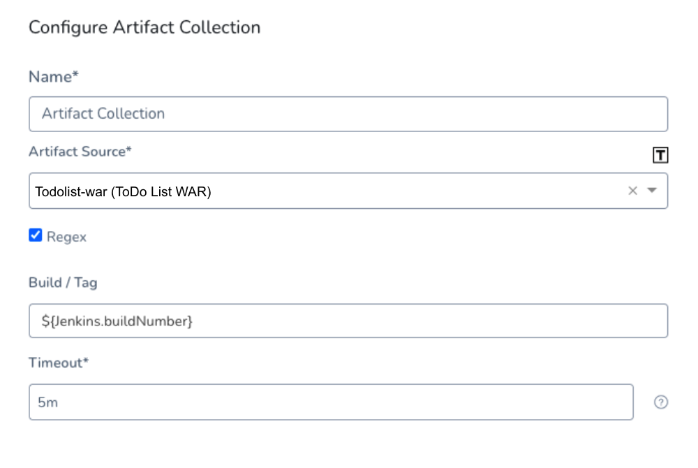
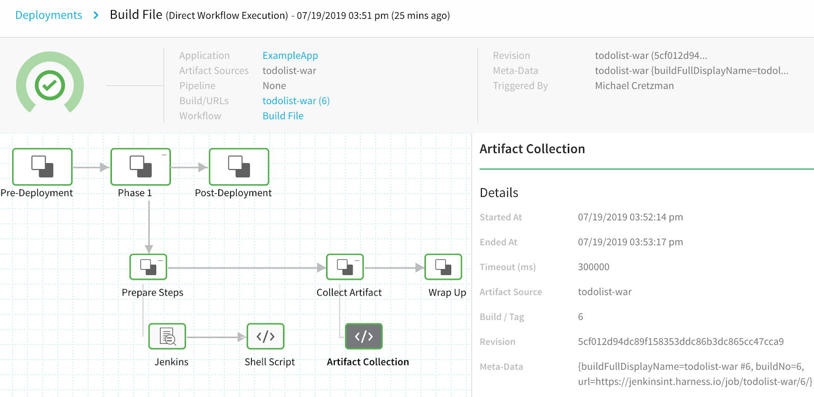

A Build Workflow doesn't require a deployment environment, unlike other Harness Workflows. It simply runs a build process via Jenkins, Bamboo, or Shell Script, and then saves the artifact to an explicit path.

In this document, Jenkins is used as an example, but Harness supports all the common [artifact sources](https://docs.harness.io/article/7dghbx1dbl-configuring-artifact-server) and [custom sources](https://docs.harness.io/article/jizsp5tsms-custom-artifact-source).

### Before You Begin

* [CI/CD with the Build Workflow](../concepts-cd/deployment-types/ci-cd-with-the-build-workflow.md)

### Step: Create a Build

To create a Build Workflow, do the following:

1. In your Harness Application, click **Workflows**, and then click **Add Workflow**. The **Workflow** settings appear.
2. In **Name**, enter a name for this Build Workflow, such as **Build File**.
3. In **Workflow Type**, select **Build**. When you are done, the dialog will look something like this.
4. Click **Submit**. The Workflow is created.

By default, only the **Artifact Collection** step is added. Next, we will add the Jenkins step to build the artifact.

### Step: Configure Jenkins

The **Jenkins** step runs the Jenkins job to build the artifact and then pass an output variable containing the build's environment variables. Use the output variable to configure the **Artifact Collection** step to obtain the newly build artifact (typically, just its metadata).

To learn more about the Jenkins command, see [Using the Jenkins Command](https://docs.harness.io/article/5fzq9w0pq7-using-the-jenkins-command).To add the Jenkins step, do the following:

1. In the **Prepare Steps** section of the Workflow, click **Add Step**.
2. Select **Jenkins**. The **Jenkins** settings appear.
3. In **Jenkins Server**, select the Jenkins server you added as a Harness Artifact Server in [Harness Account Setup](1-harness-accountsetup.md). This is the server that contains the Jenkins job to build the artifact.
4. In **Job Name**, select the Jenkins job to build the artifact. Next, we will create an output variable to pass build environment variables to the **Artifact Collection** step.
5. Click **Jenkins Output in the Context**.
6. In **Variable Name**, enter the name of the output variable. For example, **Jenkins**.
7. In **Scope**, select **Workflow**. Selecting **Workflow** ensures that there are no conflicts with any variables that share this name outside of the Workflow, such as another Workflow in the Pipeline.  
  
   When you are done, the dialog will look something like this.
   
   
   
8. Click **Submit**. The Jenkins step is added to the Workflow.

### Step: Configure Shell Script

To view the environment parameters contained in the output variable, you can add a Shell Script step and echo the parameters.

1. In the **Prepare Steps** section of the Workflow, click **Add Command**, and then click **Shell Script**. The **Shell Script** settings appear.
2. In **Script**, enter the following script:  
  

```
echo "buildDisplayName: " ${Jenkins.buildDisplayName}  
  
echo "jobStatus: " ${Jenkins.jobStatus}  
  
echo "buildUrl: " ${Jenkins.buildUrl}  
  
echo "buildFullDisplayName: " ${Jenkins.buildFullDisplayName}  
  
echo "buildNumber: " ${Jenkins.buildNumber}  
  
echo "description: " ${Jenkins.description}
```

The `${Jenkins.description}` parameter requires [Descriptor Setter](https://wiki.jenkins.io/display/JENKINS/Description+Setter+Plugin) plugin in Jenkins.When you deploy the Workflow, the Shell Script command will output all the parameters (`${Jenkins.description}` is not shown):



Next, we will add the **Artifact Collection** step and use the `${Jenkins.buildNumber}` parameter to obtain the latest build number.

To learn more about the Shell Script command, see [Using the Shell Script Command](https://docs.harness.io/article/1fjrjbau7x-capture-shell-script-step-output).

You can use these [artifact variable expressions](https://docs.harness.io/article/9dvxcegm90-variables#artifact) in a Shell Script to see the built artifact information (at the end of the Workflow).

### Step: Configure Artifact Collection

The Artifact Collection step uses the `${Jenkins.buildNumber}` parameter to obtain the latest build number, and then pull the build from the artifact repo. Typically, only the build metadata is pulled by Harness. It depends on the **Meta-data Only** setting in the Service's Artifact Source.

The Artifact Collection step was added automatically when you created the Build Workflow. You simply need to configure it.

#### Option: Build an Artifact

1. In your Build Workflow, click **Artifact Collection**. The **Artifact Collection** dialog appears.
2. Enter a name for your Artifact Collection.
3. Select **Artifact** as the **Source Type** for the Artifact collection.
   
   
   
   Pick the Artifact Source you created in your Service under **Artifact Source**.  
   
   You can template the **Artifact Source** setting by clicking the **[T]** button. This will create a [Workflow variable](https://docs.harness.io/article/766iheu1bk-add-workflow-variables-new-template). When you deploy the Workflow, you can provide a value for the variable.

   

4. In **Build / Tag**, enter the Jenkins step output variable `${Jenkins.buildNumber}` parameter to provide this step with the build number of the artifact built in the Jenkins step. 
 
  When you are done, the Artifact Collection dialog will look something like this.
  
  
  
5. Click **Submit**. The Artifact Collection step is configured.

#### Option: Build a Helm Chart

You can also build Helm Charts with Manifests. To do that, perform the following steps:

1. In your Build Workflow, click **Artifact Collection**. The **Artifact Collection** dialog appears.
2. Enter a name for your Artifact Collection.
3. Select **Manifest** as the **Source Type** for the Manifest collection.
4. Pick the Manifest Source you created in your Service under **Manifest Source.**
5. You can template the **Manifest Source** setting by clicking the **[T]** button. This will create a [Workflow variable](https://docs.harness.io/article/766iheu1bk-add-workflow-variables-new-template). When you deploy the Workflow, you can provide a value for the variable.
6. In **Build / Tag**, enter the Jenkins step output variable `${Jenkins.buildNumber}` parameter to provide this step with the build number of the artifact built in the Jenkins step.  
When you are done, the Artifact Collection dialog will look something like this.
7. Click **Submit**. The Artifact Collection step is configured.

You can run the Build Workflow to test its settings before setting up the rest of the Pipeline. In the following example, the Artifact Collection step displays the artifact metadata Harness obtained, including the Build/Tag. 



### Next Step

* [Define Your Build and Deploy Pipeline Target Infrastructure](4-environment.md)

