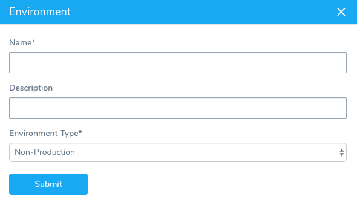
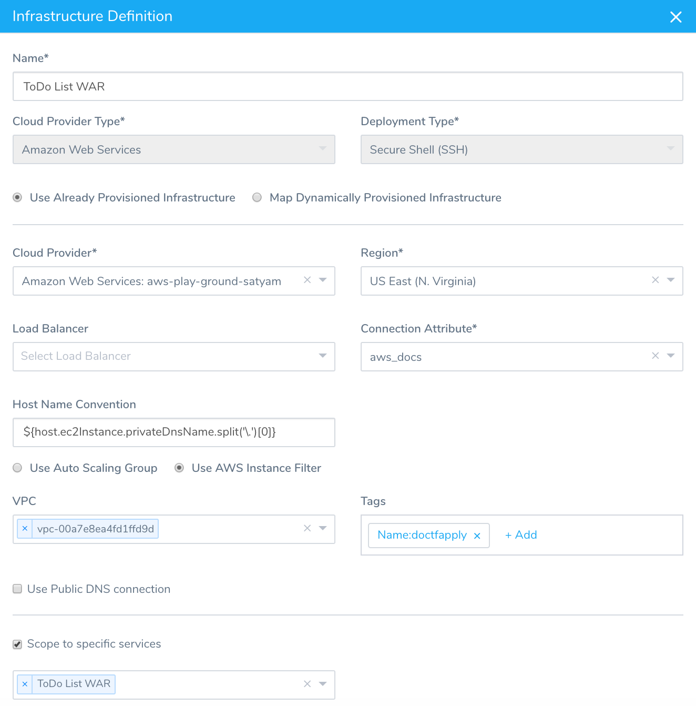

Environments represent one or more of your deployment infrastructures, such as Dev, QA, Stage, Production, etc. For Artifact Build and Deploy Pipelines, the Environment specifies the Service containing the new artifact for the Deploy Workflow to use and the target deployment infrastructure where the new build will be deployed.

In this topic:

* [Before You Begin](4-environment.md#before-you-begin)
* [Step: Set Up Environment](4-environment.md#step-set-up-environment)
* [Step: Set Up Infrastructure Definition](4-environment.md#step-set-up-infrastructure-definition)
* [Next Step](4-environment.md#next-step)

### Before You Begin

* [CI/CD with the Build Workflow](../concepts-cd/deployment-types/ci-cd-with-the-build-workflow.md)

### Step: Set Up Environment

To set up the Environment, do the following:

1. In your Harness Application, click **Environments**, and then click **Add Environment**. The **Environment** settings appear.
2. In **Name**, enter a name for the Environment that identifies it to your colleagues. In this example, File-Based is used as the name for the Environment.
3. In **Environment Type**, select **Production** or **Non-Production**, and click **Submit**. The new Environment is added.

Next, we will add an Infrastructure Definition to provide the Deploy Workflow with the target deployment environment.

### Step: Set Up Infrastructure Definition

Infrastructure Definitions specify the target deployment infrastructure for your Harness Services, and the specific infrastructure details for the deployment, like VPC settings. For Artifact Build and Deploy Pipelines, you will scope the ​Infrastructure Definition to the Service you added earlier where you identified the Artifact Source for your artifact. You will also use the Cloud Provider you set up in [Harness Account Setup](1-harness-accountsetup.md) to configure the ​Infrastructure Definition. Then you will specify the target infrastructure for the deployment. In this example, an AWS EC2 instance is used.

To set up the ​Infrastructure Definition, do the following:

1. In **Environment**, click **Add ​Infrastructure Definition**. The **​Infrastructure Definition** settings appear.
2. In **Display Name**, enter a name for the Infrastructure Definition. In this example, ToDo List WAR is used as a name for the Infrastructure Definition.
3. In **Cloud Provider Type**, select the type of Cloud Provider you used in [Harness Account Setup](1-harness-accountsetup.md).
4. In Deployment Type, select **Secure Shell (SSH)**.
5. Click **Use Already Provisioned Infrastructure**. If you were using a Harness [Infrastructure Provisioner](https://docs.harness.io/article/o22jx8amxb-add-an-infra-provisioner), you would select **Map Dynamically Provisioned Infrastructure**.
6. In **Cloud Provider**, select the Cloud Provider you set up in [Harness Account Setup](1-harness-accountsetup.md).
7. Fill out the remaining infrastructure settings for your target deployment infrastructure.
8. In **Scope to specific Services**, select the Service you created in [Service and Artifact Source](2-service-and-artifact-source.md).  
  
Here is an example that targets an AWS EC2 instance.
9. Click **Submit**.  
  
The Infrastructure Definition is added. You will select this Infrastructure Definition when you create the Deploy Workflow.

### Next Step

* [Create the Deploy Workflow for Build and Deploy Pipelines](5-deploy-workflow.md)

