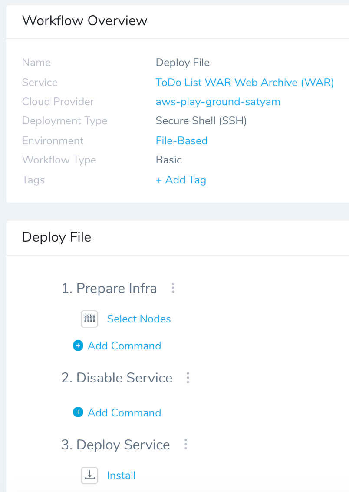
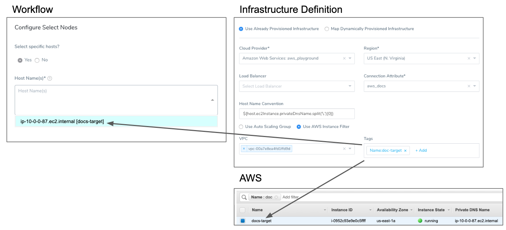
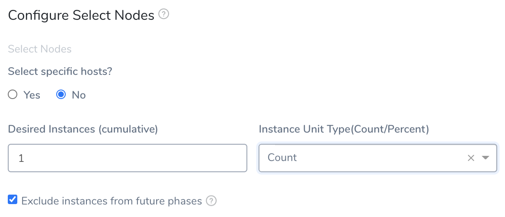
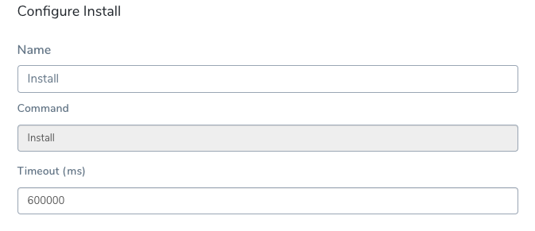

The Deploy Workflow takes the artifact build you built in [Create the Build Workflow for Build and Deploy Pipelines](3-build-workflow.md) by using the Service you created for the Artifact Source. Then the Deploy Workflow installs the build into the nodes in the Environment. See the supported [Workflow Types](https://docs.harness.io/article/m220i1tnia-workflow-configuration#workflow_types).

### Before You Begin

* [CI/CD with the Build Workflow](../concepts-cd/deployment-types/ci-cd-with-the-build-workflow.md)

### Step: Deploy Workflow

To set up the Deploy Workflow, do the following:

1. In your Application, click **Workflows**.
2. In **Workflows**, click **Add Workflow**. The **Workflow** dialog appears.
3. In **Name**, enter a name for the Deploy Workflow. For example, **Deploy File**.
4. In **Workflow Type**, select **Basic Deployment**.
5. In **Environment**, select the Environment you created earlier.
6. In **Service**, select the Service you created earlier.
7. In **Infrastructure Definition**, select the Infrastructure Definition you created earlier. If the Infrastructure Definition does not appear, ensure that you added the Service to the Infrastructure Definition **Scope to specific Services** setting.  
  
When you are done, the dialog will look something like this.
8. Click **Submit**. The Deploy Workflow is created.

Let's look at the two commands created automatically.

#### Configure Select Nodes

The **Select Nodes** command simply selects the nodes in your Infrastructure Definition.

1. Select **Yes** to specify specific hosts in the **Host Name(s)** field. Harness will add whatever hosts it can find using the criteria in your Infrastructure Definition. For example, the following image shows how the criteria in your Infrastructure Definition locates an EC2 instance, which is then displayed in the **Node Select**.
2. Select **No** to specify the number of **Desired Instances** and **Instance Unit Type** you want.
3. When the **Exclude instances from future phases** setting is selected (recommended), the instance(s) selected by this Node Select step will not be eligible for selection by any future Node Select step. In cases where you want to perform a one-time operation using a node and then deploy to all nodes in later phases, you might want to leave this setting unselected.

#### Configure Install

The Install step installs the artifact onto the nodes you selected.

The Install step uses the artifact build number obtained in the Artifact Collection step and the Artifact Source in the Harness Service. Basically, the Install step looks in the Artifact Source for the build number obtained by Artifact Collection by using artifact metadata. The logs for the step display the artifact copy to the target nodes.


```
Begin file transfer harness7cbd2fa8dc9e2d9f634205b288811b27 to ip-10-0-0-87.ec2.internal:/tmp/AC3HcFy1QByir0UGIR09Zg  
  
File successfully transferred  
  
Connecting to ip-10-0-0-87.ec2.internal ....  
  
Connection to ip-10-0-0-87.ec2.internal established
```
Next, the Install step runs the scripts in the Harness Service to install and run the artifact in its runtime environment. For details about common script steps, see [Traditional Deployments Overview](../traditional-deployments/traditional-deployments-overview.md).

Now that both Workflows are set up, you can create the Artifact Build and Deploy Pipeline.

### Use the Same Artifact Build/Tag Across Multiple Workflows in a Pipeline

When using a Build Workflow followed by multiple Workflows in a Pipeline, you can now pass the same artifact from the first Build Workflow to rest of the Workflows in the Pipeline that deploy the same Harness Service.

Execution of each Workflow will use the artifact collected by the last run Build Workflow in the Pipeline that has collected the artifact from the same Service.

In the first Build Workflow's **Artifact Collection** step's **Build/Tag** setting, you specify the artifact to collect. For subsequent **Artifact Collection** steps in the same and subsequent Workflows in the Pipeline deploying the same Service, you can leave the **Artifact Collection** step's **Build/Tag** setting empty and Harness will use the artifact collected by the last Build Workflow in the Pipeline.

This functionality requires the Feature Flag `SORT_ARTIFACTS_IN_UPDATED_ORDER`.

### Next Step

* [Create the Build and Deploy Pipeline](6-artifact-build-and-deploy-pipelines.md)

