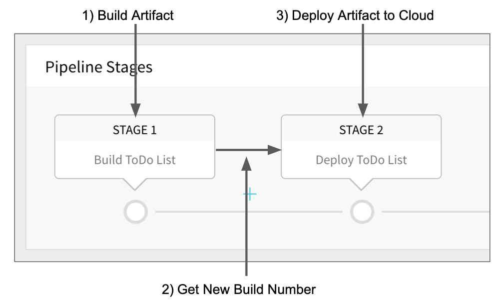

This topic describes the concept of a Harness Build and Deploy Pipeline deployment by describing the high-level steps involved.

For detailed instructions on using build and deploy pipelines in Harness, see

* [Artifact Build and Deploy Pipelines How-tos](https://docs.harness.io/category/cicd-artifact-build-and-deploy-pipelines)

### Before You Begin

Before learning about Build and Deploy Pipelines, you should have an understanding of [Harness Key Concepts](https://docs.harness.io/article/4o7oqwih6h-harness-key-concepts).

### Visual Summary

An Artifact Build and Deploy pipeline runs a build process, deposits the built artifact (or metadata) in Harness, and deploys the build to a deployment environment. It is a simple, but useful deployment commonly used for traditional file-based and AMI deployments.

### What Does Harness Need Before You Start?

A Harness Build and Deploy Pipeline deployment requires the following:

* Application artifact from an artifact server, such as Jenkins. This could be a Zip, WAR, or even an AWS AMI.
* Target nodes for the deployment.

### What Does Harness Deploy?

Artifact Build and Deploy Pipelines involve two Workflows, Artifact Build and Deploy, executed in succession by a Pipeline. 

1. **Build Workflow** - The Build Workflow connects to your Artifact Server and runs a build, such as a Jenkins job that creates a WAR file or an AMI and deposits it in a repo. Next, the Workflow connects to the repo and pulls the built artifact/metadata into Harness. Now the new artifact is awaiting deployment.
2. **Deploy Workflow** - The Deploy Workflow obtains the new artifact from Harness and deploys it to the target deployment environment.
3. **Pipeline** - The Pipeline runs the Build Workflow followed by the Deploy Workflow, and the latest artifact is deployed.

You could simply run each Workflow separately, but by putting them in a Pipeline you do not have to manually select the latest artifact build when you run the Deploy Workflow. The Pipeline builds the artifact in the Build Workflow and then picks it up in the Deploy Workflow automatically.### What Does a Harness Build and Deploy Pipeline Deployment Involve?

To understand what is involved in a Build and Deploy Pipeline, let's look at a file-based example.

#### File-based Example

A simple Artifact Build and Deploy Deployment for a file-based artifact like a WAR file consists of the following components:

1. **Service referencing the artifact repo** - Create a Harness Service for the WAR file, including the Artifact Source that points to the artifact repo. Later, in the Build Workflow, when you set up the Artifact Collection command, you will reference this Artifact Source as the location of the artifact repo.
2. **Build Workflow**
	1. **Jenkins command** - Runs the Jenkins job to build the WAR file and push it to the artifact repo (such as Artifactory, etc). You configure an output variable, such as Jenkins, so that the Artifact Collection step can get the new build number and collect the built artifact (typically, just the metadata). You can also use a Shell Script command to run a job and create an output variable. For more information on the Jenkins command, see [Using the Jenkins Command](https://docs.harness.io/article/5fzq9w0pq7-using-the-jenkins-command).
	2. **Artifact Collection command** - Grabs the artifact from the repo using the output variable and build environment variables and deposits it in Harness.
3. **Environment** - Define the target deployment infrastructure where the Deploy Workflow will deploy the built artifact, such as an AWS VPC.
4. **Deploy Workflow**
	1. **Select Nodes command** - Specifies how many instances in the Environment to deploy.
	2. **Install command** - Installs the new artifact into the nodes selected by Select Nodes.
5. **Artifact Build and Deploy Pipeline** - A Pipeline that runs the Build Workflow followed by the Deploy Workflow.
6. **Trigger** - A Harness Trigger that executes the Pipeline via a Git Webhook.

#### AMI Example

For an AMI Artifact Build and Deploy Pipeline, the only difference from the File-based Example is that the Harness Service is an AMI type and the Deploy Workflow deploys the AMI instances in an Auto Scaling Group.

### Next Steps

Read the following topics to build on what you've learned:

* [Artifact Build and Deploy Pipelines How-tos](https://docs.harness.io/category/cicd-artifact-build-and-deploy-pipelines)

