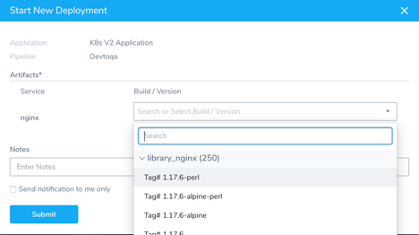
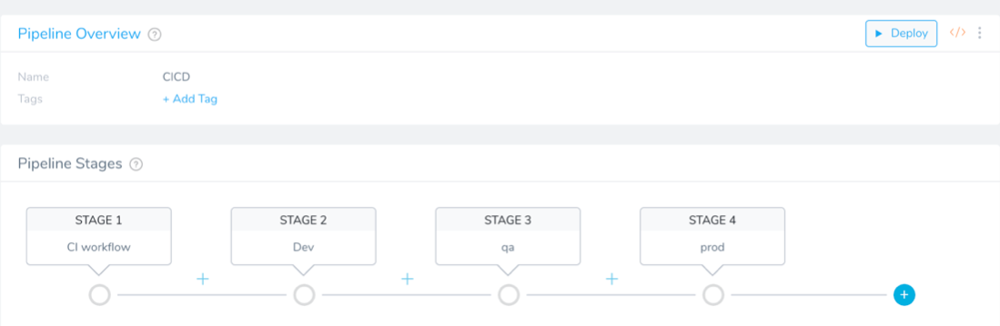
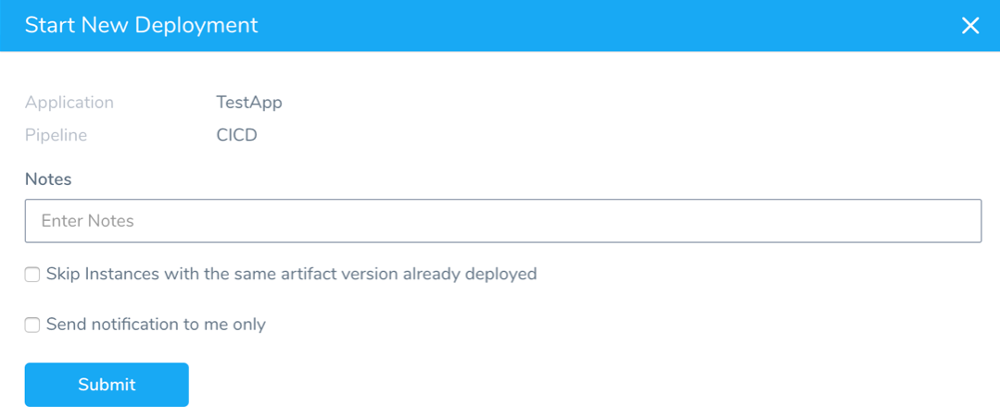
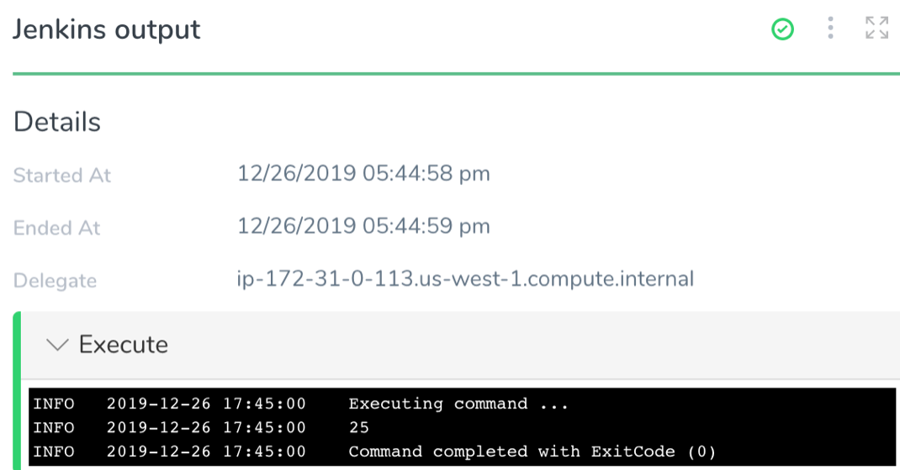
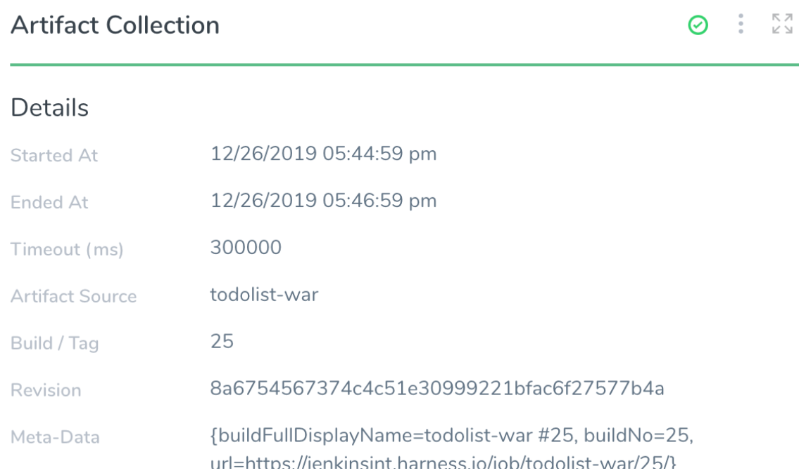
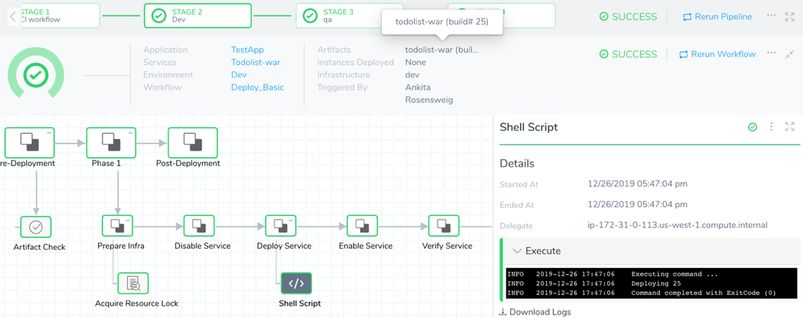
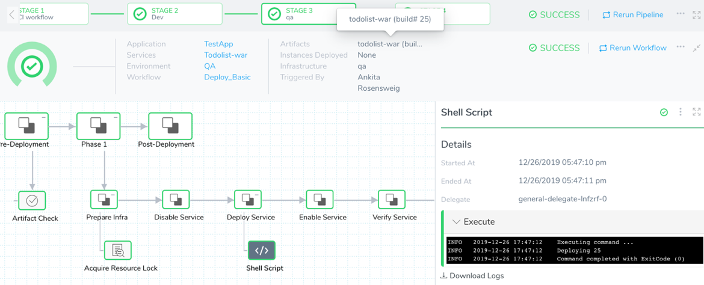

Unlike other Workflow types, Build Workflows do not perform deployments. Build Workflows build and collect a specific artifact version and pass it on to the subsequent Workflows in the Pipeline:

1. First it runs the build process and builds the artifact version via Jenkins, Bamboo, Shell Script, or any other CI tools. It receives the new version number from the build process.
2. Next it collects the artifact of that version number from the artifact repository.
3. Finally it passes the new build/version number to the subsequent deployment Workflow in the Pipeline.

Build Workflows enable you to model your entire CI/CD process in one place: Harness.

This topic discusses the concept of a Harness CI/CD process using the Build Workflow. Use the [CI/CD: Artifact Build and Deploy Pipelines](https://docs.harness.io/category/cicd-artifact-build-and-deploy-pipelines) guide for a step-by-step walkthrough of a CI/CD deployment.

### Without a Build Workflow

Without a Build Workflow, when you trigger a Harness Pipeline (manually or through an automated Trigger), you must provide the build/version number of the artifact to be deployed.

This flow works on the assumption that the artifact version already exists in the artifact repository attached to the Harness Service being deployed.

### Coupling CI and CD with the Build Workflow

In some deployment scenarios, the artifact version you want to deploy hasn't been built. To build it, a CI job has to run before the Harness Pipeline can deploy.

Rather than having a decoupled CI and CD process, Harness provides the Build Workflow that acts as a CI job/stage in the [CI/CD Pipeline](../../build-deploy/build-and-deploy-pipelines-overview.md) in Harness.

#### When Do I Use a Build Workflow?

When you want to view your entire CI/CD flow in the Harness dashboard, use the Build Workflow as a proxy for the CI stage of the CI/CD pipeline.

You can trigger a Pipeline in Harness in many ways, such as a code commit in your Git repository. The [Harness Trigger](https://docs.harness.io/article/xerirloz9a-add-a-trigger-2) will initiate a Pipeline in Harness with the Build Workflow as first stage in the Pipeline.

### Summary of CI/CD Pipeline

The [CI/CD: Artifact Build and Deploy Pipelines](https://docs.harness.io/category/cicd-artifact-build-and-deploy-pipelines) guide provides a lengthy walkthrough of a CI/CD deployment, but let's look at a quick summary.

Here is a simple Harness CI/CD Pipeline:

Let’s Deploy this Pipeline.

The first thing you will notice it that we are not prompted for a build/version number to deploy.

If you use a Build Workflow in a Pipeline, you cannot select an artifact when you deploy the Pipeline. A Build Workflow tells Harness you will be building the artifact for deployment as part of the Pipeline. Harness will use that artifact for the Pipeline deployment.

Here's the output of the Build Workflow **Jenkins** step. The Jenkins step triggered a Jenkins job and it was successful.

The deployment shows the new build number (**25**) and also a URL back to the Jenkins Job.

The **Jenkins output** step in the Workflow is echoing the value of the new build number:

The **Artifact Collection** step then collects that artifact and makes it available for deployment in Harness.

Now that the Build Workflow is done, the Pipeline moves onto the deployment Workflows: Dev, QA, and Prod.

You can see below that the deployment Workflows automatically pick up the new Build/Version number (**25**) for deployment:

* Dev:  

* QA:  

* Prod:  

### Summary

Harness Build Workflows build and collect a specific artifact version and pass it forward to the subsequent Workflows in the Pipeline. They enable you to model your entire CI/CD process in one place: Harness.

### Notes

Build Workflows do not use Harness Services. Consequently, Service variables and Service variable overrides cannot be used in a Build Workflow.

### Next Steps

Use the [CI/CD: Artifact Build and Deploy Pipelines](https://docs.harness.io/category/cicd-artifact-build-and-deploy-pipelines) guide to walk through a CI/CD deployment.

