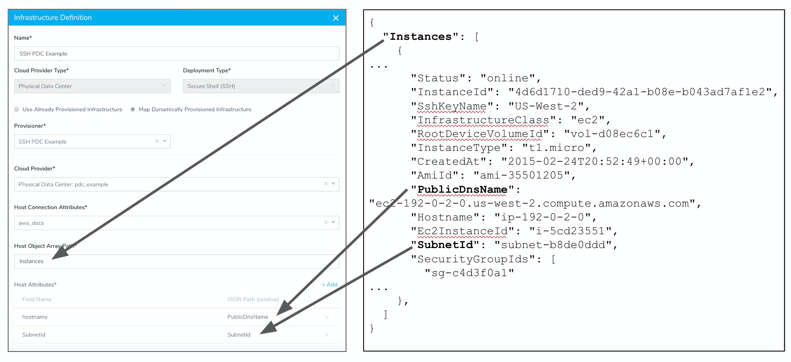

Harness has first-class support for Terraform and AWS CloudFormation provisioners, but to support different provisioners, or your existing shell script implementations, Harness includes the Shell Script Infrastructure Provisioner.

This is a conceptual overview. For steps on setting up the Shell Script Provisioner, see [Shell Script Provisioner](https://docs.harness.io/article/1m3p7phdqo-shell-script-provisioner).

In this topic:

* [Shell Script Provisioner Implementation Summary](#shell_script_provisioner_implementation_summary)
* [Limitations](#permissions)
* [Permissions](#permissions)
* [No Artifact Required](#no_artifact_required)
* [Service Instances (SIs) Consumption](#service_instances_s_is_consumption)

### Shell Script Provisioner Implementation Summary

When you set up a Shell Script Provisioner in Harness, you add a shell script that the Harness Delegate uses to query your provisioner for a JSON collection describing your infrastructure (VPCs, DNS names, subnets, etc).

Normally, the JSON will exist in your custom provisioner, such as a database, but for this topic, we'll use AWS as an example.

For example, here is a shell script that pulls EC2 instance information from AWS:


```
apt-get -y install awscli  
aws configure set aws_access_key_id $access_key  
aws configure set aws_secret_access_key $secret_key  
aws configure set region us-east-1  
aws ec2 describe-instances --filters Name=tag:Name,Values=harness-provisioner > "$PROVISIONER_OUTPUT_PATH"
```
The Harness environment variable `"$PROVISIONER_OUTPUT_PATH"` is initialized by Harness and stores the JSON collection returned by your script.

:::note 
Currently, Harness supports Bash shell scripts. PowerShell will be added soon.
:::

This script returns a JSON array describing the instances:


```
{  
  "Instances": [  
    {  
      ...  
      "Status": "online",  
      "InstanceId": "4d6d1710-ded9-42a1-b08e-b043ad7af1e2",  
      "SshKeyName": "US-West-2",  
      "InfrastructureClass": "ec2",  
      "RootDeviceVolumeId": "vol-d08ec6c1",  
      "InstanceType": "t1.micro",  
      "CreatedAt": "2015-02-24T20:52:49+00:00",  
      "AmiId": "ami-35501205",  
      "PublicDnsName": "ec2-192-0-2-0.us-west-2.compute.amazonaws.com",  
      "Hostname": "ip-192-0-2-0",  
      "Ec2InstanceId": "i-5cd23551",  
      "SubnetId": "subnet-b8de0ddd",  
      "SecurityGroupIds": [  
        "sg-c4d3f0a1"  
      ...  
    },  
  ]  
}
```
Next, in a Harness Infrastructure Definition, you map the keys from the JSON host objects to Shell Script Provisioner fields to tell Harness where to obtain the values for your infrastructure settings, such as hostname and subnet.



At runtime, Harness queries your provisioner using your script and stores the returned JSON collection on the Harness Delegate as a file. Harness then uses the JSON key values to define the instructure for your deployment environment as it creates that environment in your target platform.

Here is a high-level summary of the setup steps involved:

1. **Delegate and Cloud Provider** - Install a Harness Delegate where it can connect to your infrastructure provisioner and query it for the JSON infrastructure information. Add a Harness Cloud Provider that connects to the platform where the infrastructure will be deployed.
2. **Application and Service** - Create a Harness Application to manage your deployment. Add a Service to your Application. The type of Service you select determines how you map JSON keys in the Shell Script Provisioner **Service Mappings**. For example, an ECS Service will require different mapping settings than a Kubernetes Service.
3. **JSON and Script Prep** - Prepare the JSON file to be retrieved by Harness. Prepare the shell script to pull the JSON to Harness.
4. **Shell Script Provisioner** - Add a Shell Script provisioner to your Application.
	1. Add the shell script to the Shell Script provisioner to query your provisioner and retrieve the JSON infrastructure information.
	2. Add Service Mappings. The mapping method depends on the Service and Deployment Type you select.
5. **Environment** - Add an Environment to your Application that uses the Shell Script Provisioner in its Infrastructure Definition.
6. **Workflow** - Add a Workflow to your Application that applies the Shell Script Provisioner.

### Limitations

Shell Script Provisioners are only supported in Canary and Multi-Service deployment types. For AMI/ASG and ECS deployments, Shell Script Provisioners are also supported in Blue/Green deployments.

### Permissions

You need to give Harness permissions in your target environment so Harness can provision using you provisioner. These are the same permissions you would need to grant Harness for existing, static infrastructures.

The permissions required for Harness to use your provisioner and successfully deploy to the provisioned instances depends on the deployment platform you use.

As a summary, you will need to manage the following permissions:

* **Delegate** - The Harness Delegate will require permissions according to the deployment platform. It will use the access, secret, and SSH keys you configure in Harness  [Secrets Management](https://docs.harness.io/article/au38zpufhr-secret-management) to perform deployment operations. For ECS Delegates, you can add an IAM role to the ECS Delegate task definition. For more information, see  [Trust Relationships and Roles](https://docs.harness.io/article/h9tkwmkrm7-delegate-installation#trust_relationships_and_roles).
* **Cloud Provider** - The Harness Cloud Provider must have access permissions for the resources you are planning to create in the provisioner script. For some Harness Cloud Providers, you can use the installed Delegate and have the Cloud Provider assume the permissions used by the Delegate. For others, you can enter cloud platform account information.
  :::note 
  The account used for the Cloud Provider will require platform-specific permissions for creating infrastructure. For example, to create EC2 AMIs the account requires the **AmazonEC2FullAccess** policy.
  :::
* **Git Repo** - You will add the Git repo where the provisioner script is located to Harness as a Source Repo Provider. For more information, see  [Add Source Repo Providers](https://docs.harness.io/article/ay9hlwbgwa-add-source-repo-providers).
* **Access and Secret Keys** - These are set up in Harness  [Secrets Management](https://docs.harness.io/article/au38zpufhr-secret-management) and then used as variable values when you add a Provisioner step to a Workflow.
* **SSH Key** - In order for the Delegate to copy artifacts to the provisioned instances, it will need an SSH key. You set this up in Harness Secrets Management and then reference it in the Harness Environment Infrastructure Definition. See [Secrets Management](https://docs.harness.io/article/au38zpufhr-secret-management).
* **Platform Security Groups** - Security groups are associated with EC2 and other cloud platform instances and provide security at the protocol and port access level. You will need to define security groups in your provisioner scripts and ensure that they allow the Delegate to connect to the provisioned instances.

### No Artifact Required

You do not need to deploy artifacts via Harness Services to use provisioning in a Workflow. You can simply set up a Shell Script Provisioner and use it in a Workflow to provision infrastructure without deploying any artifact. In Harness documentation, we include artifact deployment as it is the ultimate goal of Continuous Delivery.

### Service Instances (SIs) Consumption

Harness Service Instances (SIs) are not consumed and no additional licensing is required when a Harness Workflow uses the provisioner to provision resources. When Harness deploys artifacts via Harness Services to the provisioned infrastructure in the same Workflow or Pipeline, SIs licensing is consumed.

### Next Step

[Shell Script Provisioner](https://docs.harness.io/article/1m3p7phdqo-shell-script-provisioner)

